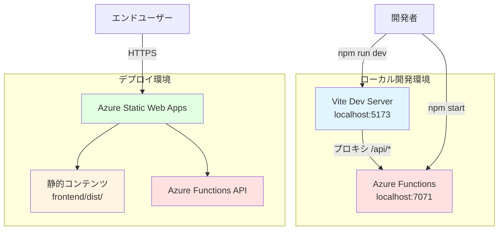
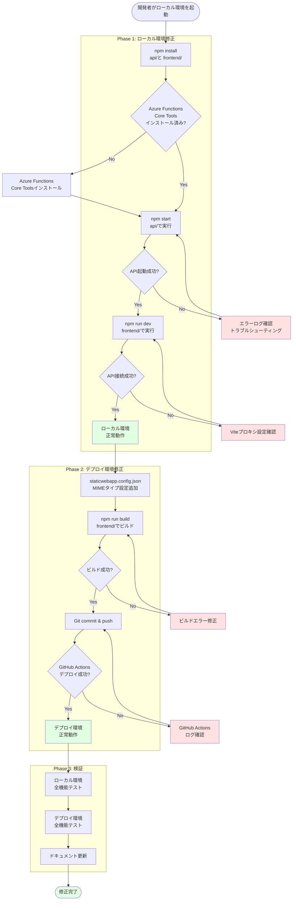
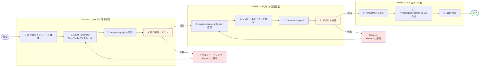

# Technical Design Document

## Overview

本設計は、デプロイ環境（Azure Static Web Apps）とローカル開発環境で発生している2つの重大なエラーを修正します。デプロイ環境ではJavaScriptモジュールのMIMEタイプエラーによりホワイトアウトが発生し、ローカル環境ではAzure Functions APIが起動していないためAPI接続が失敗しています。

**目的**: 両環境でアプリケーションが正常に動作する状態を回復し、開発者が安心して開発できる環境を提供します。

**ユーザー**: 開発者（ローカル環境修正）、エンドユーザー（デプロイ環境修正）

**影響**: 現在、デプロイ環境は完全に使用不可能（ホワイトアウト）、ローカル環境はフォールバックモードで制限された機能のみ動作しています。修正後は両環境で全機能が正常に動作します。

### Goals
- ローカル環境でAzure Functions APIを正常に起動し、フロントエンドとの接続を確立する
- デプロイ環境でJavaScriptモジュールが正しいMIMEタイプで配信され、アプリケーションが正常にロードされる
- 両環境で全機能（プレイヤー管理、タイマー計測、ターン切り替え）が動作する
- 開発者向けのセットアップ手順とトラブルシューティングガイドを提供する

### Non-Goals
- 新機能の追加や既存機能の変更
- アーキテクチャの大幅な変更やリファクタリング
- パフォーマンス最適化や新しいテスト追加（既存機能の修正のみ）

## Architecture

### Existing Architecture Analysis

本プロジェクトは以下の既存アーキテクチャを持ちます：

**フロントエンド**:
- React 19.1.1 + TypeScript 5.9 + Vite 7.1
- 開発サーバー: `http://localhost:5173`（Vite Dev Server）
- ビルド成果物: `frontend/dist/` ディレクトリ
- APIプロキシ設定: Vite設定で `/api` → `http://localhost:7071` にプロキシ

**バックエンド**:
- Azure Functions v4.8 + Node.js 20 + TypeScript 5.3
- ローカルAPI: `http://localhost:7071`（Azure Functions Core Tools）
- 9つのHTTP関数: getGame, getPlayerNames, health, pause, reset, resume, savePlayerNames, switchTurn, updateGame

**デプロイ環境**:
- Azure Static Web Apps（無料層）
- GitHub Actions CI/CD: `.github/workflows/azure-static-web-apps-orange-stone-066c2d600.yml`
- 設定ファイル: `staticwebapp.config.json`

**現在の問題**:
1. **ローカル環境**: Azure Functions APIが起動せず、APIエンドポイントが500エラーを返す
2. **デプロイ環境**: JavaScriptモジュールが`application/octet-stream`のMIMEタイプで配信され、ブラウザがモジュールとして実行できない

### High-Level Architecture



**既存パターン**:
- フロントエンドとバックエンドの完全な分離（モノレポ構造）
- Viteプロキシによるローカル開発時のCORS回避
- Azure Static Web Apps統合ビルドによるデプロイ

**統合戦略**: 既存のアーキテクチャパターンを維持し、設定ファイルとセットアップ手順のみを修正します。

### Technology Alignment

本修正は既存の技術スタックと完全に整合します：

**既存技術の活用**:
- Vite 7.1のビルドシステム（変更なし）
- Azure Functions v4.8のランタイム（変更なし）
- Azure Static Web Appsのホスティング（設定のみ修正）
- GitHub Actionsのデプロイパイプライン（変更なし）

**新規導入なし**: 本修正では新しいライブラリや依存関係を追加しません。

**設定修正のみ**:
- `staticwebapp.config.json`: MIMEタイプとルーティング設定の追加
- `api/package.json`: `start`スクリプトの修正（Azure Functions起動コマンドの明示化）
- ドキュメント: セットアップ手順とトラブルシューティングガイドの追加

### Key Design Decisions

#### Decision 1: Azure Functions起動方法の標準化

**Decision**: `func start`コマンドをnpmスクリプトで明示的に実行する

**Context**: 現在、APIディレクトリに`start`スクリプトが存在するが、Azure Functions Core Toolsが正しくインストールされていない、またはPATHが通っていない可能性があります。

**Alternatives**:
1. **グローバルインストール**: `npm install -g azure-functions-core-tools@4` でグローバルにインストール
2. **ローカル依存関係**: `@azure/functions-core-tools`をdevDependenciesに追加
3. **npxを使用**: `npx func start`で実行（推奨）

**Selected Approach**: `npx func start`を使用

**Rationale**:
- グローバルインストール不要（開発者の環境を汚染しない）
- バージョン管理が容易（プロジェクトごとに適切なバージョンを使用）
- CI/CD環境でも動作する（npmスクリプトで統一）

**Trade-offs**:
- 利点: 環境セットアップが簡単、バージョン管理が明確
- 欠点: 初回実行時にダウンロードが発生する（パフォーマンスへの影響は軽微）

#### Decision 2: Azure Static Web Apps MIMEタイプ設定の追加

**Decision**: `staticwebapp.config.json`に`.js`ファイルの明示的なMIMEタイプを設定

**Context**: デプロイ環境でJavaScriptモジュールが`application/octet-stream`として配信され、ブラウザがモジュールとして実行できません。

**Alternatives**:
1. **Azureポータルで設定**: Web UIから手動で設定
2. **GitHub Actionsで設定**: デプロイ時にAzure CLIで設定
3. **staticwebapp.config.jsonで設定**: 設定ファイルで宣言的に設定（推奨）

**Selected Approach**: `staticwebapp.config.json`で宣言的に設定

```json
{
  "mimeTypes": {
    ".json": "application/json",
    ".js": "application/javascript",
    ".mjs": "application/javascript"
  }
}
```

**Rationale**:
- インフラストラクチャ・アズ・コード（IaC）の原則に従う
- バージョン管理可能（Gitで追跡）
- 再現性が高い（環境ごとの手動設定不要）

**Trade-offs**:
- 利点: 設定の一元管理、環境間の一貫性
- 欠点: Azure Static Web Appsの設定仕様に依存（ベンダーロックイン）

#### Decision 3: 段階的修正アプローチ（ローカル → デプロイ）

**Decision**: ローカル環境を先に修正し、検証後にデプロイ環境を修正

**Context**: 両環境に問題があるが、デプロイ環境の修正が正しいか検証するにはローカル環境が動作する必要があります。

**Alternatives**:
1. **並行修正**: 両環境を同時に修正
2. **デプロイ優先**: デプロイ環境を先に修正
3. **ローカル優先**: ローカル環境を先に修正（推奨）

**Selected Approach**: ローカル環境を先に修正し、動作確認後にデプロイ環境を修正

**Rationale**:
- ローカル環境で修正内容を検証できる（デプロイ前に確認）
- デバッグが容易（ブラウザDevTools、ローカルログ）
- リスク軽減（本番環境への影響を最小化）

**Trade-offs**:
- 利点: 安全性、検証容易性
- 欠点: 修正に時間がかかる（並行修正より遅い）

## System Flows

### Error Recovery Flow



## Requirements Traceability

| Requirement | Requirement Summary | Components | Interfaces | Flows |
|-------------|---------------------|------------|------------|-------|
| 1.1 | Azure Functions API起動 | api/package.json | `npm start`スクリプト | Error Recovery Flow - Phase 1 |
| 1.2 | GET /api/game成功 | api/src/functions/getGame.ts | HTTP GET /api/game | Error Recovery Flow - Phase 1 |
| 1.3 | フォールバックモード回避 | フロントエンド（既存） | useServerGameState | Error Recovery Flow - Phase 1 |
| 1.4 | コンソールエラー解消 | フロントエンド（既存） | ポーリング機能 | Error Recovery Flow - Phase 1 |
| 1.5 | エラーメッセージ表示 | ドキュメント | README.md | - |
| 2.1 | アプリケーション正常ロード | staticwebapp.config.json | MIMEタイプ設定 | Error Recovery Flow - Phase 2 |
| 2.2 | 正しいMIMEタイプ | staticwebapp.config.json | `.js`, `.mjs`設定 | Error Recovery Flow - Phase 2 |
| 2.3 | ビルド済みバンドル配信 | frontend/dist/ | Viteビルド成果物 | Error Recovery Flow - Phase 2 |
| 2.4 | 静的アセット200 OK | staticwebapp.config.json | ルーティング設定 | Error Recovery Flow - Phase 2 |
| 2.5 | モジュールロードエラー解消 | staticwebapp.config.json | MIMEタイプ設定 | Error Recovery Flow - Phase 2 |
| 3.1-3.5 | Azure設定とビルド | staticwebapp.config.json, GitHub Actions | デプロイパイプライン | Error Recovery Flow - Phase 2 |
| 4.1-4.5 | ドキュメント化 | README.md, TROUBLESHOOTING.md | セットアップ手順 | - |
| 5.1-5.5 | フォールバック機能検証 | 既存フロントエンド | useFallbackMode | Error Recovery Flow - Phase 3 |

## Components and Interfaces

### ローカル開発環境

#### Azure Functions API (api/)

**Responsibility & Boundaries**:
- **Primary Responsibility**: ゲーム状態管理のバックエンドAPIを提供
- **Domain Boundary**: バックエンドロジック、Cosmos DBアクセス
- **Data Ownership**: ゲーム状態、プレイヤー名履歴

**Dependencies**:
- **Inbound**: フロントエンド（Vite Dev Serverプロキシ経由）
- **Outbound**: Azure Cosmos DB（Table API）
- **External**: Azure Functions Core Tools v4（ローカル実行環境）

**外部依存関係の調査**:
- **Azure Functions Core Tools**: 公式ドキュメント（https://learn.microsoft.com/azure/azure-functions/functions-run-local）
- **必要なバージョン**: v4.x（`@azure/functions` v4.8.0と互換）
- **インストール方法**:
  - npm: `npm install -g azure-functions-core-tools@4`
  - Homebrew (Mac): `brew tap azure/functions && brew install azure-functions-core-tools@4`
  - Chocolatey (Windows): `choco install azure-functions-core-tools`
- **起動コマンド**: `func start`（デフォルトポート7071）
- **前提条件**: Node.js 20.x以上、.NET 6 SDK（拡張機能バンドル用）

**Contract Definition**:

**Service Interface**:
```typescript
// api/src/functions/getGame.ts
interface GetGameHandler {
  // ゲーム状態を取得
  handle(request: HttpRequest, context: InvocationContext): Promise<HttpResponseInit>;
}

// レスポンススキーマ
interface GameStateResponse {
  id: string;
  players: Player[];
  currentPlayerIndex: number;
  isPaused: boolean;
  turnStartedAt?: number;
  etag?: string;
}
```

- **Preconditions**: Azure Functions APIが起動している、Cosmos DB接続文字列が設定されている
- **Postconditions**: 200ステータスコードでゲーム状態を返す、ETagヘッダーを含む
- **Invariants**: ゲーム状態の整合性を保つ

**API Contract**:
| Method | Endpoint | Request | Response | Errors |
|--------|----------|---------|----------|--------|
| GET | /api/game | - | GameStateResponse + ETag | 500 (DB接続失敗) |
| GET | /api/health | - | { status: "ok" } | - |
| POST | /api/switchTurn | { currentETag: string } | GameStateResponse | 409 (ETag不一致), 500 |
| POST | /api/pause | { currentETag: string } | GameStateResponse | 409, 500 |
| POST | /api/resume | { currentETag: string } | GameStateResponse | 409, 500 |
| POST | /api/reset | - | GameStateResponse | 500 |

**修正内容**:

`api/package.json`の`start`スクリプトを修正：

```json
{
  "scripts": {
    "start": "func start --verbose"
  }
}
```

**理由**: `func start`コマンドを明示的に指定し、`--verbose`フラグでデバッグログを出力します。

#### Vite Dev Server (frontend/)

**Responsibility & Boundaries**:
- **Primary Responsibility**: 開発用フロントエンドサーバーとAPIプロキシ
- **Domain Boundary**: 開発環境のみ、本番では使用しない
- **Data Ownership**: なし（プロキシのみ）

**Dependencies**:
- **Inbound**: ブラウザ（開発者）
- **Outbound**: Azure Functions API（localhost:7071）
- **External**: Vite 7.1

**Contract Definition**:

**Proxy Configuration**:
```typescript
// frontend/vite.config.ts
export default defineConfig({
  server: {
    proxy: {
      '/api': {
        target: 'http://localhost:7071',
        changeOrigin: true,
        secure: false
      }
    }
  }
})
```

- **Preconditions**: Azure Functions APIが起動している
- **Postconditions**: `/api/*`リクエストを`localhost:7071`にプロキシ
- **Invariants**: CORS設定を維持

**修正内容**: なし（既存設定は正しい）

### デプロイ環境

#### Azure Static Web Apps設定

**Responsibility & Boundaries**:
- **Primary Responsibility**: 静的コンテンツとAPIのホスティング設定
- **Domain Boundary**: デプロイ環境の設定とルーティング
- **Data Ownership**: 設定情報（MIMEタイプ、ルーティングルール）

**Dependencies**:
- **Inbound**: エンドユーザー（HTTPS）
- **Outbound**: Azure Functions API（統合ビルド）
- **External**: Azure Static Web Apps、GitHub Actions

**外部依存関係の調査**:
- **Azure Static Web Apps**: 公式ドキュメント（https://learn.microsoft.com/azure/static-web-apps/）
- **設定ファイル仕様**: `staticwebapp.config.json`（https://learn.microsoft.com/azure/static-web-apps/configuration）
- **MIMEタイプ設定**: `mimeTypes`オブジェクトで拡張子ごとにMIMEタイプを指定
- **ルーティング**: `routes`配列でパスごとのアクセス制御
- **フォールバック**: `navigationFallback`でSPAルーティングをサポート

**Contract Definition**:

**Configuration Schema**:
```json
{
  "platform": {
    "apiRuntime": "node:20"
  },
  "routes": [
    {
      "route": "/api/*",
      "allowedRoles": ["anonymous"]
    }
  ],
  "navigationFallback": {
    "rewrite": "/index.html",
    "exclude": ["/api/*", "/*.{css,scss,js,png,gif,ico,jpg,svg}"]
  },
  "globalHeaders": {
    "content-security-policy": "default-src https: 'unsafe-eval' 'unsafe-inline'; object-src 'none'"
  },
  "mimeTypes": {
    ".json": "application/json",
    ".js": "application/javascript",
    ".mjs": "application/javascript"
  }
}
```

- **Preconditions**: Viteビルドが成功している（`frontend/dist/`に成果物）
- **Postconditions**: JavaScriptファイルが正しいMIMEタイプで配信される
- **Invariants**: SPAルーティングが正常に機能する

**修正内容**:

`staticwebapp.config.json`にMIMEタイプ設定を追加：

```json
{
  "mimeTypes": {
    ".json": "application/json",
    ".js": "application/javascript",
    ".mjs": "application/javascript"
  }
}
```

**理由**: JavaScriptモジュールが`application/octet-stream`ではなく`application/javascript`で配信されるようにします。

#### GitHub Actions CI/CD

**Responsibility & Boundaries**:
- **Primary Responsibility**: フロントエンドとAPIの自動ビルドとデプロイ
- **Domain Boundary**: CI/CDパイプライン
- **Data Ownership**: デプロイメトリクス、ビルドログ

**Dependencies**:
- **Inbound**: Gitプッシュ（mainブランチ）
- **Outbound**: Azure Static Web Apps
- **External**: GitHub Actions、Azure Static Web Apps Deploy Action

**Contract Definition**:

**Workflow Configuration**:
```yaml
# .github/workflows/azure-static-web-apps-orange-stone-066c2d600.yml
jobs:
  build_and_deploy_job:
    steps:
      - uses: actions/checkout@v3
      - uses: Azure/static-web-apps-deploy@v1
        with:
          app_location: "./frontend"
          api_location: "./api"
          output_location: "dist"
```

- **Preconditions**: GitHub Secretsに`AZURE_STATIC_WEB_APPS_API_TOKEN_ORANGE_STONE_066C2D600`が設定されている
- **Postconditions**: フロントエンドとAPIがAzure Static Web Appsにデプロイされる
- **Invariants**: ビルドエラーが発生した場合はデプロイしない

**修正内容**: なし（既存設定は正しい）

## Error Handling

### Error Strategy

既存のエラーハンドリング機構を活用し、明確なエラーメッセージとトラブルシューティングガイドを提供します。

### Error Categories and Responses

**開発環境エラー（ローカル）**:
- **Azure Functions起動失敗**:
  - エラーメッセージ: `Cannot start Azure Functions. Please ensure Azure Functions Core Tools v4 is installed.`
  - 対応: README.mdにインストール手順を記載、トラブルシューティングガイドへのリンク
- **API接続失敗（500エラー）**:
  - エラーメッセージ: `Failed to fetch game state: 500 Internal Server Error`
  - 対応: APIログ確認手順を提供、`local.settings.json`の設定確認ガイド
- **フォールバックモード切り替え**:
  - エラーメッセージ: `[GameTimer] ポーリング3回連続失敗、フォールバックモードに切り替えます`
  - 対応: 正常な動作（既存機能）、APIが復旧すれば自動的に通常モードに戻る

**デプロイ環境エラー**:
- **JavaScriptモジュールロードエラー**:
  - エラーメッセージ: `Failed to load module script: Expected a JavaScript-or-Wasm module script but the server responded with a MIME type of "application/octet-stream"`
  - 対応: `staticwebapp.config.json`にMIMEタイプ設定を追加
- **静的アセット404エラー**:
  - エラーメッセージ: `Failed to load resource: the server responded with a status of 404 ()`
  - 対応: ビルド成果物の確認、`output_location`設定の確認

**ビルドエラー**:
- **TypeScriptコンパイルエラー**:
  - エラーメッセージ: `error TS2304: Cannot find name 'X'`
  - 対応: 型定義の確認、`npm install`の再実行
- **Viteビルドエラー**:
  - エラーメッセージ: `✘ [ERROR] Failed to load url`
  - 対応: 依存関係の確認、キャッシュクリア（`rm -rf node_modules .vite dist`）

### Monitoring

既存のモニタリング機構を活用します：

**ローカル環境**:
- **ブラウザコンソール**: フロントエンドエラーの確認
- **Azure Functions Core Toolsログ**: APIエラーの確認（`--verbose`フラグで詳細ログ）
- **Vite Dev Serverログ**: プロキシエラーの確認

**デプロイ環境**:
- **ブラウザコンソール**: JavaScriptエラーの確認
- **GitHub Actionsログ**: ビルドとデプロイエラーの確認
- **Azure Portalログ**: Azure Functions実行ログ（Application Insights）

## Testing Strategy

### Unit Tests
既存のユニットテストを実行し、修正による影響がないことを確認：
- `api/src/functions/__tests__/`: Azure Functions関数のユニットテスト
- `frontend/src/hooks/__tests__/`: カスタムフックのユニットテスト
- `frontend/src/components/__tests__/`: Reactコンポーネントのユニットテスト

### Integration Tests
- **ローカル環境統合テスト**:
  1. `npm start`（api/）を実行し、APIが起動することを確認
  2. `npm run dev`（frontend/）を実行し、フロントエンドが起動することを確認
  3. ブラウザで`http://localhost:5173/`にアクセスし、API接続が成功することを確認
  4. プレイヤー管理、タイマー計測、ターン切り替えなどの基本機能を手動テスト

- **デプロイ環境統合テスト**:
  1. GitHub ActionsでビルドとデプロイLOGが成功することを確認
  2. ブラウザで`https://orange-stone-066c2d600.3.azurestaticapps.net/`にアクセスし、ホワイトアウトが解消されていることを確認
  3. ブラウザコンソールでJavaScriptエラーが発生しないことを確認
  4. プレイヤー管理、タイマー計測、ターン切り替えなどの基本機能を手動テスト

### E2E Tests (既存)
既存のE2Eテスト（Playwright）を実行し、回帰がないことを確認：
- `e2e/specs/player-management.spec.ts`
- `e2e/specs/timer-operations.spec.ts`
- `e2e/specs/active-player.spec.ts`
- `e2e/specs/game-controls.spec.ts`

実行コマンド:
```bash
npx playwright test
```

### Performance/Load
パフォーマンステストは本修正では実施しません（既存機能の修正のみ、新機能追加なし）。

## Security Considerations

本修正ではセキュリティリスクの変更はありません：

**既存のセキュリティ設定を維持**:
- Azure Static Web AppsのContent Security Policy（CSP）設定はそのまま
- API認証はなし（既存と同じ、無料層のシンプル運用）
- HTTPS通信（Azure Static Web Appsのデフォルト）

**MIMEタイプ設定によるセキュリティへの影響**:
- `application/javascript`の明示的な設定は、ブラウザが正しくJavaScriptとして解釈するための設定
- セキュリティリスクは増加しない（むしろ、正しいMIMEタイプを設定することでブラウザのセキュリティ機構が正常に動作）

## Migration Strategy

修正は2フェーズで実施します：



### Phase 1: ローカル環境修正

**ステップ**:
1. 依存関係インストール確認: `npm install`（api/とfrontend/）
2. Azure Functions Core Toolsインストール: `npm install -g azure-functions-core-tools@4`
3. `api/package.json`の`start`スクリプト修正
4. 動作確認: `npm start`（api/）、`npm run dev`（frontend/）

**検証基準**:
- Azure Functions APIが`http://localhost:7071`で起動する
- フロントエンドが`http://localhost:5173`で起動する
- ブラウザコンソールで"Failed to fetch game state"エラーが発生しない
- プレイヤー管理、タイマー計測が正常に動作する

**ロールバック手順**:
- `api/package.json`の変更を元に戻す
- `npm install`を再実行

### Phase 2: デプロイ環境修正

**ステップ**:
1. `staticwebapp.config.json`にMIMEタイプ設定を追加
2. フロントエンドビルド検証: `npm run build`（frontend/）
3. Git commit & push: `git add . && git commit -m "修正: Azure Static Web Apps MIMEタイプ設定追加" && git push`
4. デプロイ検証: GitHub Actionsログ確認、ブラウザで動作確認

**検証基準**:
- GitHub Actionsのビルドとデプロイが成功する
- ブラウザで`https://orange-stone-066c2d600.3.azurestaticapps.net/`にアクセスし、ホワイトアウトが解消されている
- ブラウザコンソールでJavaScriptモジュールロードエラーが発生しない
- 全機能が正常に動作する

**ロールバック手順**:
- `git revert HEAD`で直前のコミットを取り消す
- `git push`で元の状態に戻す

### Phase 3: ドキュメント化

**ステップ**:
1. README.mdにセットアップ手順を追加
2. TROUBLESHOOTING.mdにトラブルシューティングガイドを作成
3. 最終検証: 両環境で全機能が正常に動作することを確認

**検証基準**:
- README.mdに必要な前提条件（Node.js、Azure Functions Core Tools）が明記されている
- TROUBLESHOOTING.mdに環境別のトラブルシューティング手順が記載されている
- 開発者が手順に従ってセットアップできることを確認

**ロールバック手順**:
- ドキュメント修正のみのため、ロールバック不要
