# 技術設計書

## 概要

APIモード（通常モード）における2つの重大なUI問題を解決する技術設計です。本設計は既存のGameTimerコンポーネントとGameTimer.cssファイルに対する最小限の変更により、フォールバックモードと同等のユーザー体験をAPIモードでも実現します。

**目的**: APIモードにおいて、視認性の高いUIとゲーム開始前のプレイヤー名編集機能を提供する。

**ユーザー**: ボードゲームプレイヤーがAPIモード（バックエンド連携モード）で快適にゲームタイマーを操作できるようになる。

**影響**: 既存のGameTimerコンポーネント（通常モードセクション: lines 384-399）およびGameTimer.cssファイルに対するCSS修正とプレイヤー名編集UIの追加を実施する。

### ゴール

- APIモードにおいてWCAG 2.1 AAレベル（4.5:1以上）のコントラスト比を実現
- APIモードでゲーム開始前のプレイヤー名編集を可能にする
- フォールバックモードとAPIモード間のUI一貫性を確保

### 非ゴール

- バックエンドAPI（Azure Functions）の変更は対象外（既存のプレイヤー名更新API `/api/updatePlayerName` を使用）
- フォールバックモード側のUIは既に視認性が確保されているため変更不要
- プレイヤー名編集機能の拡張（ゲーム中のプレイヤー名編集は要件外）

## アーキテクチャ

### 既存アーキテクチャ分析

本プロジェクトは**2モードアーキテクチャ**を採用しています：

**フォールバックモード（Phase 1）**:
- `useGameState` カスタムフック: インメモリー状態管理
- GameTimerコンポーネント内のフォールバックセクション（lines 337-382）
- プレイヤー名編集機能が実装済み（`.player-name-input`）

**APIモード（通常モード・Phase 2）**:
- `useServerGameState` カスタムフック: バックエンドAPI連携
- `usePollingSync` フック: 5秒ごとのポーリング同期
- `useGameApi` フック: API操作（switchTurn, pauseGame等）
- GameTimerコンポーネント内の通常モードセクション（lines 384-399）
- **問題**: プレイヤー名表示が `<span>` タグのみで編集不可

**既存の状態管理境界**:
```
isInFallbackMode = true → fallbackState (useGameState)
isInFallbackMode = false → serverGameState (useServerGameState)
```

### アーキテクチャ統合

本設計は既存の2モードアーキテクチャを維持し、APIモードセクションに対してのみ以下の変更を実施します：

**変更範囲**:
- GameTimer.tsx: APIモードのプレイヤーカードUI（lines 384-399）にプレイヤー名編集UIを追加
- GameTimer.css: `.settings-controls` セクションのテキストカラーを明示的に設定（WCAG 2.1 AA準拠）

**保持される既存パターン**:
- 2モードアーキテクチャ: フォールバックモードとAPIモードの分離を維持
- 状態管理の分離: `useGameState` と `useServerGameState` の境界を尊重
- コンポーネント構造: GameTimerルートコンポーネントの責務を変更しない

### 高レベルアーキテクチャ


**現状の問題箇所**:
1. **APIモードセクション（赤）**: プレイヤー名が `<span>` タグのみで編集不可
2. **GameTimer.css（赤）**: `.settings-controls` セクションが白背景に白文字で視認性不良

**本設計による変更**:
- APIモードセクションに `<input>` タグを追加し、プレイヤー名編集UIを実装
- GameTimer.cssの `.settings-controls` に `color: #212121` を明示的に設定
- 既存の `useGameApi` フックと `usePlayerNameHistory` フックを活用

## 技術スタックと設計決定

### 技術スタック整合性

本機能は既存の技術スタックに完全に整合します：

**フロントエンド**:
- React 19.1.1: 既存のGameTimerコンポーネントを変更
- TypeScript 5.9: 型安全性を維持
- カスタムフック: 既存の `useGameApi`, `usePlayerNameHistory` を使用

**スタイリング**:
- CSS（GameTimer.css）: 既存のCSSファイルに最小限の変更を追加

**テスト**:
- Vitest: ユニットテスト（プレイヤー名編集ロジック）
- Playwright: E2Eテスト（APIモードでの視認性とプレイヤー名編集）

### 主要設計決定

#### 決定1: CSS修正アプローチ - 明示的なテキストカラー設定

**決定**: `.settings-controls` セクションに `color: #212121` を明示的に設定し、すべての子要素にテキストカラーを継承させる。

**コンテキスト**: 現在、`.settings-controls` セクションは白背景（`background: rgba(255, 255, 255, 0.98)`）を持つが、テキストカラーが明示的に設定されていない。このため、親要素から白文字が継承され、視認性の問題が発生している。

**代替案**:
1. **各UI要素に個別にカラーを設定**: ラベル、ボタン、ドロップダウンそれぞれに `color` を設定
2. **グローバルCSSでリセット**: ルートレベルでテキストカラーをリセット
3. **セクションレベルで明示的設定**（採用）: `.settings-controls` に `color: #212121` を設定

**選択したアプローチ**: セクションレベルで明示的設定

**根拠**:
- **最小限の変更**: 1行のCSS追加で全子要素に適用される
- **保守性**: 今後追加される要素も自動的に正しいカラーを継承
- **一貫性**: フォールバックモードと同じテキストカラー（#212121）を使用
- **WCAG準拠**: 白背景（#FFFFFF）と黒文字（#212121）のコントラスト比は16.1:1（WCAG 2.1 AAレベルの4.5:1を大幅に上回る）

**トレードオフ**:
- 利点: シンプルで保守性が高く、既存のCSS構造を尊重
- 欠点: 特定のUI要素で別のカラーが必要な場合は個別に上書きが必要（現状は全て同一カラーで問題なし）

#### 決定2: プレイヤー名編集UI - フォールバックモードのUI構造を再利用

**決定**: フォールバックモードと同じ `<input>` タグ + `<datalist>` 構造をAPIモードセクションにも実装する。

**コンテキスト**: フォールバックモードでは既にプレイヤー名編集UIが実装されている（lines 345-358）。この実装は以下の要素で構成される：
- `<input className="player-name-input">`: プレイヤー名入力フィールド
- `<datalist>`: プレイヤー名履歴の候補表示
- `onFocus={handlePlayerNameFocus}`: 履歴取得のトリガー
- `onChange`: ローカル状態更新（フォールバック）/ API呼び出し（APIモード）

**代替案**:
1. **カスタム編集コンポーネントの作成**: 新規に `PlayerNameEditor` コンポーネントを作成し、両モードで共有
2. **インライン編集ライブラリの導入**: react-inline-edit等のサードパーティライブラリを使用
3. **既存UI構造の再利用**（採用）: フォールバックモードと同じHTMLマークアップをAPIモードにも適用

**選択したアプローチ**: 既存UI構造の再利用

**根拠**:
- **UI一貫性**: フォールバックモードとAPIモードで完全に同一の外観と操作感
- **既存CSS活用**: `.player-name-input` のスタイルがそのまま適用される
- **最小限の実装コスト**: 新規コンポーネント不要、既存マークアップのコピー&修正のみ
- **ゼロ依存関係追加**: サードパーティライブラリ不要

**トレードオフ**:
- 利点: 実装がシンプルで既存のスタイルとロジックを最大限活用
- 欠点: コードの重複（フォールバックモードとAPIモードで類似のマークアップ）が発生

#### 決定3: プレイヤー名更新API呼び出しタイミング - onChange + デバウンス

**決定**: プレイヤー名の `onChange` イベントごとにAPI呼び出しを実施し、過剰なAPI呼び出しを防ぐために300msのデバウンスを適用する。

**コンテキスト**: ユーザーがプレイヤー名を入力するたびにバックエンドAPIに更新リクエストを送信する必要がある。ただし、1文字入力ごとにAPIを呼ぶと過剰なリクエストが発生する。

**代替案**:
1. **onBlurで送信**: 入力フィールドからフォーカスが外れた時にのみAPI呼び出し
2. **明示的な保存ボタン**: ユーザーが「保存」ボタンをクリックした時に送信
3. **onChange + デバウンス**（採用）: 入力停止後300msでAPI呼び出し

**選択したアプローチ**: onChange + デバウンス

**根拠**:
- **リアルタイム同期**: 入力直後に他のデバイスに反映される（ポーリング同期により5秒以内）
- **過剰リクエスト防止**: デバウンスにより連続入力時のAPI呼び出しを抑制
- **UX最適化**: 明示的な保存操作不要、自動保存の体験を提供

**トレードオフ**:
- 利点: ユーザーが保存を意識せず自然にプレイヤー名を編集できる
- 欠点: デバウンス中の入力はまだ送信されていないため、ネットワーク切断時にロスト可能（ただし、ポーリング同期により最終的に整合性は保たれる）

## システムフロー

### プレイヤー名編集フロー（APIモード）


**フロー説明**:

1. **ユーザー入力**: ユーザーがプレイヤー名入力フィールドに文字を入力
2. **楽観的更新**: 即座にローカル状態を更新し、UIに反映（レスポンス向上）
3. **デバウンス**: 300ms間の連続入力を抑制し、最後の入力から300ms後にAPI呼び出しを実行
4. **API呼び出し**: `useGameApi.updatePlayerName()` を使用してバックエンドに更新リクエスト送信
5. **楽観的ロック**: 現在のETagをリクエストに含めて競合を検出
6. **成功時**: UIは既に更新済みのため、何もしない
7. **競合時（409）**: 最新状態を取得し、ユーザーに再試行を促す
8. **エラー時**: エラーメッセージを表示し、ローカル状態を元の値にロールバック
9. **ポーリング同期**: 5秒以内に他のクライアントにも変更が伝播

## 要件トレーサビリティ

| 要件 | 要件概要 | コンポーネント | インターフェース | フロー |
|------|---------|--------------|-----------------|--------|
| 1.1 | APIモードで全UIテキストを十分なコントラストで表示 | GameTimer.css | `.settings-controls { color: #212121; }` | なし（CSS変更のみ） |
| 1.2 | 設定コントロールの全テキスト要素が読みやすい | GameTimer.css | `.setting-label { color: #333; }` | なし（CSS変更のみ） |
| 1.3 | 白背景に対して暗色テキストで4.5:1以上のコントラスト | GameTimer.css | WCAG 2.1 AA準拠（16.1:1） | なし（CSS変更のみ） |
| 2.1 | APIモード・ゲーム開始前のプレイヤー名編集許可 | GameTimer.tsx（APIモードセクション） | `<input>` タグ + 条件付きレンダリング | プレイヤー名編集フロー |
| 2.2 | プレイヤー名フィールドクリック時に編集可能な入力フィールド表示 | GameTimer.tsx | `<input className="player-name-input">` | プレイヤー名編集フロー |
| 2.3 | プレイヤー名編集時にバックエンドAPIに更新リクエスト送信 | useGameApi | `updatePlayerName(index, name)` | プレイヤー名編集フロー（デバウンス） |
| 2.4 | ゲームアクティブ時にプレイヤー名編集を無効化 | GameTimer.tsx | `disabled={isGameActive}` 属性 | なし（条件付きレンダリング） |
| 2.5 | プレイヤー名入力フォーカス時に履歴をdatalistで表示 | GameTimer.tsx | `<datalist>` + `handlePlayerNameFocus` | なし（既存機能活用） |
| 2.6 | API更新成功時にUIに即座に反映 | GameTimer.tsx | 楽観的更新 + ポーリング同期 | プレイヤー名編集フロー |
| 3.1 | フォールバックモードとAPIモード間のUI一貫性 | GameTimer.tsx | 同一マークアップ構造 | なし（UI構造統一） |
| 4.1 | プレイヤー名更新APIエンドポイントに送信 | useGameApi | `PUT /api/updatePlayerName` | プレイヤー名編集フロー |
| 4.2 | ETagを含めて楽観的ロックを実装 | useGameApi | `etag` パラメータ | プレイヤー名編集フロー（競合検出） |
| 4.3 | 競合時に最新状態取得と再試行促進 | GameTimer.tsx | エラー表示 + ロールバック | プレイヤー名編集フロー（409処理） |
| 4.4 | API失敗時にエラー表示と変更ロールバック | GameTimer.tsx | エラー表示 + ロールバック | プレイヤー名編集フロー（エラー処理） |

## コンポーネントとインターフェース

### フロントエンド層

#### GameTimer コンポーネント（変更）

**責任と境界**:
- **主要責任**: ゲームタイマーUIのルートコンポーネント、フォールバックモードとAPIモードの切り替え管理
- **ドメイン境界**: UI層（プレゼンテーション）
- **データ所有権**: 表示状態のみ（永続化データは `useServerGameState` が管理）
- **トランザクション境界**: なし（状態更新はカスタムフックに委譲）

**依存関係**:
- **インバウンド**: なし（ルートコンポーネント）
- **アウトバウンド**:
  - `useServerGameState`: サーバー状態管理
  - `useGameApi`: API操作
  - `usePlayerNameHistory`: プレイヤー名履歴管理
- **外部**: なし

**契約定義**:

**プレイヤー名編集UI（APIモードセクション）**:

変更箇所: GameTimer.tsx lines 384-399

```typescript
// 変更前（現状）
<span className="player-name">{player.name}</span>

// 変更後（プレイヤー名編集UI追加）
{isGameActive ? (
  // ゲーム開始後: 編集不可（spanで表示）
  <span className="player-name">{player.name}</span>
) : (
  // ゲーム開始前: 編集可能（inputで表示）
  <input
    type="text"
    className="player-name-input"
    value={player.name}
    onChange={(e) => handlePlayerNameChange(index, e.target.value)}
    onFocus={handlePlayerNameFocus}
    list={`player-name-history-api-${index}`}
    aria-label="プレイヤー名"
    disabled={isGameActive}
  />
)}
<datalist id={`player-name-history-api-${index}`}>
  {playerNameHistory.names.map((name, idx) => (
    <option key={idx} value={name} />
  ))}
</datalist>
```

**前提条件**:
- `useServerGameState.serverState` が存在する（APIモード時のみ実行）
- `useGameApi` フックが初期化済み
- `usePlayerNameHistory` フックが初期化済み

**事後条件**:
- プレイヤー名変更後300ms以内にAPI呼び出しが実行される
- 楽観的更新によりUIは即座に更新される
- API成功時は何もしない（既に更新済み）
- API失敗時はエラー表示 + ロールバック

**不変条件**:
- ゲーム開始後（`activePlayerIndex !== -1`）は常にプレイヤー名編集が無効化される
- フォールバックモードとAPIモードで同じUI構造を維持

#### useGameApi カスタムフック（拡張）

**責任と境界**:
- **主要責任**: バックエンドAPI呼び出しのラッパー、エラー処理とリトライロジック
- **ドメイン境界**: API連携層
- **データ所有権**: なし（API呼び出しのみ）
- **トランザクション境界**: 単一API呼び出し

**依存関係**:
- **インバウンド**: GameTimerコンポーネント
- **アウトバウンド**: バックエンドAPI（Azure Functions）
- **外部**: なし

**契約定義**:

**新規メソッド: updatePlayerName**

```typescript
interface PlayerNameUpdateRequest {
  playerIndex: number;
  name: string;
  etag: string;
}

interface PlayerNameUpdateResponse {
  success: boolean;
  newEtag?: string;
  error?: string;
  latestState?: GameStateWithTime;
}

function updatePlayerName(
  playerIndex: number,
  name: string
): Promise<PlayerNameUpdateResponse>;
```

**前提条件**:
- `playerIndex` が有効範囲内（0 ≤ playerIndex < players.length）
- `name` が空文字列でない
- `etag` が現在のサーバー状態のETagと一致

**事後条件**:
- **成功時（200 OK）**: `{ success: true, newEtag }` を返す
- **競合時（409 Conflict）**: `{ success: false, error: "Conflict", latestState }` を返す
- **エラー時（5xx）**: `{ success: false, error: "Internal Server Error" }` を返す

**エラー型**:
- `ConflictError`: ETag不一致による競合
- `NetworkError`: ネットワーク接続エラー
- `ServerError`: バックエンド内部エラー

#### usePlayerNameHistory カスタムフック（既存活用）

**責任と境界**:
- **主要責任**: プレイヤー名履歴の取得と管理
- **ドメイン境界**: ローカルストレージ層
- **データ所有権**: プレイヤー名履歴（localStorage）
- **トランザクション境界**: なし（読み取り専用）

**依存関係**:
- **インバウンド**: GameTimerコンポーネント
- **アウトバウンド**: バックエンドAPI（`/api/playernames`）
- **外部**: なし

**契約定義**:

既存の `usePlayerNameHistory` フックをそのまま使用します。

```typescript
interface PlayerNameHistoryHook {
  names: string[];
  fetchNames: () => Promise<void>;
}
```

**統合戦略**:
- **変更なし**: フォールバックモードで既に使用されているフックをAPIモードでも再利用
- **後方互換性**: フォールバックモード側の動作に影響なし

### スタイル層

#### GameTimer.css（変更）

**責任と境界**:
- **主要責任**: GameTimerコンポーネントのビジュアルスタイル定義
- **ドメイン境界**: スタイル層（プレゼンテーション）

**変更箇所**:

**変更1: `.settings-controls` セクションのテキストカラー明示化**

```css
/* 変更前（現状: lines 769-776） */
.settings-controls {
  background: rgba(255, 255, 255, 0.98);
  padding: 1.5rem;
  border-radius: 8px;
  border: 2px solid #e0e0e0;
  box-shadow: 0 2px 8px rgba(0, 0, 0, 0.08);
  /* color プロパティなし */
}

/* 変更後 */
.settings-controls {
  background: rgba(255, 255, 255, 0.98);
  padding: 1.5rem;
  border-radius: 8px;
  border: 2px solid #e0e0e0;
  box-shadow: 0 2px 8px rgba(0, 0, 0, 0.08);
  color: #212121; /* 追加: WCAG 2.1 AA準拠（コントラスト比 16.1:1） */
}
```

**WCAG 2.1 AAレベル検証**:
- 背景色: `rgba(255, 255, 255, 0.98)` ≈ `#FFFFFF`（白）
- テキスト色: `#212121`（ほぼ黒）
- コントラスト比: 16.1:1（WCAG 2.1 AAレベルの4.5:1を大幅に上回る）

**影響範囲**:
- `.settings-controls` セクション内のすべてのテキスト要素（ラベル、ボタン、ドロップダウン等）

## データモデル

### 既存データモデルの再利用

本機能は新しいデータモデルを追加せず、既存の `GameStateWithTime` 型をそのまま使用します。

**既存型定義**（frontend/src/types/GameState.ts）:

```typescript
export interface Player {
  id: string;
  name: string;
  elapsedTimeSeconds: number;
  isActive: boolean;
  turnStartedAt: number | null;
}

export interface GameState {
  players: Player[];
  activePlayerId: string | null;
  isPaused: boolean;
  timerMode: 'countup' | 'countdown';
  countdownSeconds: number;
}

export interface GameStateWithTime extends GameState {
  etag: string;
  activePlayerIndex: number;
  turnStartedAt: number | null;
}
```

**変更なし**: プレイヤー名編集機能は既存の `Player.name` フィールドを更新するのみ。

### API契約とデータ転送

#### プレイヤー名更新APIリクエスト

```typescript
// PUT /api/updatePlayerName
interface UpdatePlayerNameRequest {
  playerIndex: number;  // プレイヤーのインデックス（0ベース）
  name: string;         // 新しいプレイヤー名
  etag: string;         // 楽観的ロック用のETag
}
```

**バリデーションルール**:
- `playerIndex`: 0 ≤ playerIndex < players.length
- `name`: 1文字以上、100文字以下
- `etag`: 現在のサーバー状態のETagと一致

#### プレイヤー名更新APIレスポンス

```typescript
// 200 OK
interface UpdatePlayerNameSuccessResponse {
  success: true;
  newEtag: string;
  updatedState: GameStateWithTime;
}

// 409 Conflict（ETag不一致）
interface UpdatePlayerNameConflictResponse {
  success: false;
  error: "Conflict";
  latestState: GameStateWithTime;
}

// 400 Bad Request（バリデーションエラー）
interface UpdatePlayerNameValidationErrorResponse {
  success: false;
  error: "Validation failed";
  details: string;
}

// 500 Internal Server Error
interface UpdatePlayerNameErrorResponse {
  success: false;
  error: "Internal Server Error";
}
```

**スキーマバージョニング戦略**: なし（既存APIエンドポイントを使用）

## エラーハンドリング

### エラー戦略

本機能では以下のエラーカテゴリに対して明確な処理を定義します：

**ユーザーエラー（4xx）**:
- **400 Bad Request**: バリデーション失敗 → エラーメッセージ表示、ローカル状態ロールバック
- **409 Conflict**: ETag不一致 → 「他のユーザーが更新しました。再読み込みしてください」表示、最新状態を取得

**システムエラー（5xx）**:
- **500 Internal Server Error**: バックエンドエラー → 「更新に失敗しました。しばらくしてから再試行してください」表示、ローカル状態ロールバック
- **503 Service Unavailable**: サービス一時停止 → フォールバックモードへ自動切り替え

**ネットワークエラー**:
- **Timeout**: ネットワークタイムアウト → 「ネットワーク接続を確認してください」表示、リトライボタン表示
- **Offline**: オフライン検出 → フォールバックモードへ自動切り替え

### エラーカテゴリと対応

#### ユーザーエラー（4xx）

**400 Bad Request - バリデーション失敗**:
- **トリガー**: プレイヤー名が空文字列、または100文字を超える
- **UI表示**: 入力フィールド下に赤文字で「プレイヤー名は1文字以上100文字以下で入力してください」
- **ローカル状態**: 元の値にロールバック
- **リトライ**: ユーザーが再入力するまで待機

**409 Conflict - ETag不一致**:
- **トリガー**: 他のクライアントが先に同じプレイヤー名を更新した
- **UI表示**: モーダルダイアログで「他のユーザーがプレイヤー名を更新しました。最新の状態に更新しますか？」
- **ローカル状態**: 最新状態（`latestState`）にロールバック
- **リトライ**: ユーザーが「更新」ボタンをクリックした時に再度編集可能

#### システムエラー（5xx）

**500 Internal Server Error - バックエンドエラー**:
- **トリガー**: バックエンドAPI内部でエラー発生
- **UI表示**: トーストメッセージで「更新に失敗しました。しばらくしてから再試行してください」（5秒間表示）
- **ローカル状態**: 元の値にロールバック
- **リトライ**: 30秒後に自動リトライ（最大3回）

**503 Service Unavailable - サービス一時停止**:
- **トリガー**: Azure Functionsがスケールダウン中またはメンテナンス中
- **UI表示**: バナーで「サーバーに接続できません。フォールバックモードで動作しています」
- **フォールバックモード**: 自動的に `activateFallbackMode()` を呼び出し
- **リトライ**: ポーリング同期が復旧したら自動的に通常モードに戻る

#### ネットワークエラー

**Timeout - ネットワークタイムアウト**:
- **トリガー**: API呼び出しが30秒以内に完了しない
- **UI表示**: トーストメッセージで「ネットワーク接続を確認してください」
- **ローカル状態**: 元の値にロールバック
- **リトライ**: 「再試行」ボタンをクリックで手動リトライ

**Offline - オフライン検出**:
- **トリガー**: `navigator.onLine === false`
- **UI表示**: バナーで「オフラインです。フォールバックモードで動作しています」
- **フォールバックモード**: 自動的に `activateFallbackMode()` を呼び出し
- **リトライ**: オンライン復帰時に自動的に通常モードに戻る

### エラーフロー可視化

```mermaid
flowchart TD
    Start["プレイヤー名編集<br/>onChange発火"]
    Debounce["デバウンス<br/>（300ms）"]
    APICall["API呼び出し<br/>PUT /api/updatePlayerName"]

    Success["200 OK<br/>成功"]
    Conflict["409 Conflict<br/>ETag不一致"]
    Validation["400 Bad Request<br/>バリデーション失敗"]
    ServerError["500 Internal Server Error<br/>バックエンドエラー"]
    Timeout["ネットワークタイムアウト"]
    Offline["オフライン検出"]

    SuccessAction["何もしない<br/>（楽観的更新済み）"]
    ConflictAction["最新状態にロールバック<br/>モーダル表示"]
    ValidationAction["元の値にロールバック<br/>エラーメッセージ表示"]
    ServerErrorAction["元の値にロールバック<br/>トーストメッセージ<br/>30秒後に自動リトライ"]
    TimeoutAction["元の値にロールバック<br/>リトライボタン表示"]
    OfflineAction["フォールバックモード切替<br/>バナー表示"]

    Start --> Debounce
    Debounce --> APICall

    APICall --> Success
    APICall --> Conflict
    APICall --> Validation
    APICall --> ServerError
    APICall --> Timeout
    APICall --> Offline

    Success --> SuccessAction
    Conflict --> ConflictAction
    Validation --> ValidationAction
    ServerError --> ServerErrorAction
    Timeout --> TimeoutAction
    Offline --> OfflineAction

    style Success fill:#c8e6c9
    style Conflict fill:#fff9c4
    style Validation fill:#ffcdd2
    style ServerError fill:#ffcdd2
    style Timeout fill:#ffcdd2
    style Offline fill:#ffcdd2
```



### モニタリング

本機能では以下のエラーログとメトリクスを記録します：

**エラーログ**:
- コンソールログ: `console.error('[PlayerNameUpdate] API failed:', error)`
- ログレベル: ERROR
- 記録内容: エラー種別、HTTPステータス、エラーメッセージ、プレイヤーインデックス、タイムスタンプ

**メトリクス**（将来的な実装候補）:
- プレイヤー名更新成功率: `updatePlayerName_success_count / updatePlayerName_total_count`
- 平均API応答時間: `avg(updatePlayerName_api_response_time)`
- 競合発生率: `conflict_count / updatePlayerName_total_count`

**ヘルスチェック**:
- ポーリング同期が3回連続失敗した場合、フォールバックモードに自動切り替え（既存機能）

## テスト戦略

### ユニットテスト

**テスト対象**: `useGameApi.updatePlayerName` 関数

**テストケース**:

1. **正常系: プレイヤー名更新成功（200 OK）**
   - Given: 有効なプレイヤーインデックスと名前、正しいETag
   - When: `updatePlayerName(0, "Alice")` を呼び出す
   - Then: `{ success: true, newEtag }` が返される

2. **異常系: ETag不一致（409 Conflict）**
   - Given: 他のクライアントが先に更新済み
   - When: `updatePlayerName(0, "Bob")` を呼び出す
   - Then: `{ success: false, error: "Conflict", latestState }` が返される

3. **異常系: バリデーションエラー（400 Bad Request）**
   - Given: 空文字列のプレイヤー名
   - When: `updatePlayerName(0, "")` を呼び出す
   - Then: `{ success: false, error: "Validation failed" }` が返される

4. **異常系: ネットワークタイムアウト**
   - Given: API呼び出しが30秒以内に完了しない
   - When: `updatePlayerName(0, "Charlie")` を呼び出す
   - Then: `TimeoutError` がスローされる

### 統合テスト

**テスト対象**: GameTimerコンポーネント + useGameApi + usePlayerNameHistory

**テストケース**:

1. **プレイヤー名編集UIの表示（ゲーム開始前）**
   - Given: APIモードでゲームが開始されていない（`activePlayerIndex === -1`）
   - When: プレイヤーカードを表示
   - Then: プレイヤー名が `<input>` タグで表示される

2. **プレイヤー名編集UIの非表示（ゲーム開始後）**
   - Given: APIモードでゲームが開始されている（`activePlayerIndex !== -1`）
   - When: プレイヤーカードを表示
   - Then: プレイヤー名が `<span>` タグで表示される

3. **プレイヤー名編集とAPI呼び出し**
   - Given: APIモードでゲーム開始前
   - When: プレイヤー名を「Alice」→「Bob」に変更
   - Then: 300ms後に `PUT /api/updatePlayerName` が呼ばれる
   - And: UIには即座に「Bob」が表示される

4. **プレイヤー名履歴の表示**
   - Given: プレイヤー名履歴に「Alice」「Bob」「Charlie」が存在
   - When: プレイヤー名入力フィールドにフォーカス
   - Then: `<datalist>` に3件の履歴が表示される

### E2Eテスト（Playwright）

**テストケース**:

1. **視認性テスト: APIモードで設定セクションのテキストが読める**
   - Given: APIモードで動作中
   - When: 設定セクション（`.settings-controls`）を表示
   - Then: 全てのラベル、ボタン、ドロップダウンのテキストが視認可能
   - And: コントラスト比が4.5:1以上

2. **プレイヤー名編集E2Eテスト: ゲーム開始前の編集**
   - Given: APIモードでゲーム開始前
   - When: プレイヤー名を「プレイヤー1」→「Alice」に変更
   - Then: 入力フィールドに「Alice」が表示される
   - And: 5秒以内に他のブラウザタブでも「Alice」に更新される

3. **プレイヤー名編集E2Eテスト: ゲーム開始後の編集不可**
   - Given: APIモードでゲーム開始後
   - When: プレイヤー名をクリック
   - Then: 編集不可の `<span>` タグのまま
   - And: 入力フィールドは表示されない

4. **エラーハンドリングE2Eテスト: 競合エラー**
   - Given: 2つのブラウザタブで同じゲームを開く
   - When: タブ1でプレイヤー名を「Alice」に変更
   - And: タブ2でも同時に「Bob」に変更
   - Then: タブ2で競合エラーモーダルが表示される
   - And: タブ2のプレイヤー名が最新状態「Alice」にロールバックされる

### パフォーマンステスト

**テストケース**:

1. **デバウンス機能の検証**
   - Given: プレイヤー名入力フィールド
   - When: 10文字を連続入力（例: "A"→"Al"→"Ali"→...→"AliceSmith"）
   - Then: API呼び出しは1回のみ（最後の入力から300ms後）

2. **楽観的更新のレスポンス時間**
   - Given: プレイヤー名入力フィールド
   - When: プレイヤー名を変更
   - Then: UIは即座に更新される（50ms以内）
   - And: API呼び出しは300ms後に実行される

## セキュリティ考慮事項

### 入力バリデーション

**クライアント側（フロントエンド）**:
- プレイヤー名の長さ制限: 1文字以上100文字以下
- XSS対策: Reactの自動エスケープに依存（手動でHTMLを生成しない）

**サーバー側（バックエンドAPI）**:
- プレイヤー名の長さ制限: 1文字以上100文字以下
- 特殊文字のサニタイゼーション: HTML特殊文字をエスケープ
- SQLインジェクション対策: Cosmos DB SDKのパラメータ化クエリを使用

### 楽観的ロックとデータ整合性

**ETagベースの楽観的ロック**:
- 各API呼び出し時に現在のETagを送信
- サーバー側でETagを検証し、不一致の場合は409 Conflictを返す
- クライアント側で競合を検出し、最新状態にロールバック

**データ整合性**:
- ポーリング同期により5秒以内に全クライアントが最新状態に同期
- 競合発生時はユーザーに明示的に通知し、再試行を促す

### 認証と認可

本プロジェクトは認証レイヤーを持たないため、以下のセキュリティ制約があります：

**制約**:
- 誰でもプレイヤー名を変更可能（認証不要）
- 悪意のあるユーザーによる不正な名前変更のリスク

**軽減策**（将来的な実装候補）**:
- レート制限: 同一IPアドレスからの連続更新を制限（例: 10回/分）
- 不適切な名前のフィルタリング: NGワードリストによるバリデーション

## パフォーマンスと拡張性

### パフォーマンス最適化

**デバウンス処理**:
- 連続入力時のAPI呼び出しを抑制（300msデバウンス）
- 目標: 10文字連続入力時、API呼び出しは1回のみ

**楽観的更新**:
- UIの即座更新によりレスポンス時間を50ms以内に維持
- API呼び出しは非同期でバックグラウンド実行

### スケーラビリティ

**クライアント側**:
- 最大同時接続数: 20クライアント（Azure SignalR Free Tierの制限）
- ポーリング同期による状態同期: 5秒間隔

**サーバー側**:
- Azure Functionsのスケーリング: 自動スケール（Consumption Plan）
- Cosmos DBスループット: 1000 RU/s（Free Tier）

### キャッシング戦略

**プレイヤー名履歴**:
- ブラウザのlocalStorageにキャッシュ
- キャッシュ有効期限: 30日

**ゲーム状態**:
- ポーリング同期により5秒ごとに更新
- ETagによるキャッシュバリデーション
