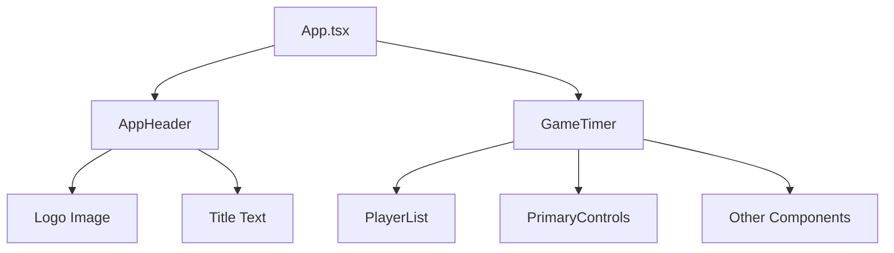

# Technical Design Document: ONEmore Turn ブランディング設定

## Overview

この機能は、ONEmore Turnアプリケーションのビジュアルアイデンティティを統一するために、ブラウザタブタイトル、ファビコン、アプリケーションヘッダーのブランディング要素を追加します。現在「frontend」というデフォルト名が表示されている箇所を「ONEmore Turn」ブランドに変更し、ユーザーがアプリケーションを明確に認識できるようにします。

**Purpose**: ユーザーがブラウザタブやアプリ画面でアプリケーション名「ONEmore Turn」を明確に認識し、ブランド認知度とプロフェッショナル性を向上させる

**Users**: マルチプレイヤーゲームタイマーを利用する全てのユーザー（プレイヤー、観戦者）が、タブ名、ファビコン、ヘッダーロゴを通じてアプリケーションを識別できる

**Impact**: 既存のGameTimerコンポーネントとゲーム機能には一切影響を与えず、視覚的なブランディング要素のみを追加する

### Goals

- ブラウザタブタイトルとファビコンを「ONEmore Turn」ブランドに変更
- アプリケーション画面上部にブランドロゴとタイトルを表示するヘッダーを追加
- HTMLメタタグ（Open Graph、Twitter Card）を設定し、ソーシャルメディア共有時の表示を最適化
- レスポンシブデザインで全デバイス（スマートフォン、タブレット、PC）に対応
- 既存のゲームタイマー機能に影響を与えない非侵襲的な実装

### Non-Goals

- バックエンドAPIやビジネスロジックの変更
- ゲームタイマーのコア機能（プレイヤー管理、タイマー計測、ターン管理）の修正
- 新しい認証機能やユーザーアカウント管理の追加
- アプリケーション全体のデザインリニューアル（ブランディング要素のみに焦点）

## Architecture

### Existing Architecture Analysis

**現在のアーキテクチャ**:
```
App.tsx
  └─ GameTimer (メインコンポーネント)
       ├─ PlayerList
       ├─ PrimaryControls
       ├─ SettingsControls
       ├─ TimerControls
       └─ TopTimePlayerIndicator
```

**既存パターンの保持**:
- GameTimerコンポーネントの構造と責任範囲は完全に保持
- Reactコンポーネント構成パターン（親から子へのProps伝播）を継続使用
- CSS Modulesは使用せず、既存の.cssファイルパターンを踏襲

**技術的制約**:
- GameTimer.tsxの内部構造を変更しない（Requirement 7: 既存機能への影響回避）
- 既存のE2Eテストが全て成功すること（回帰なし）

### High-Level Architecture

**変更後のアーキテクチャ**:



**アーキテクチャ統合**:
- **既存パターン保持**: App.tsxでの単純なコンポーネント構成パターンを維持
- **新規コンポーネント配置**: AppHeaderをApp.tsxレベルで追加し、GameTimerと並列配置
- **責任分離**: AppHeaderはブランディング表示のみを担当、GameTimerはゲームロジックのみを担当
- **Steering準拠**: structure.mdのコンポーネント設計原則（単一責任、Props駆動）に準拠

### Technology Alignment

**既存技術スタックとの整合**:
- **React 19.1.1**: AppHeaderコンポーネントの実装に使用（既存パターンと同様）
- **TypeScript 5.9**: 型安全なコンポーネント定義
- **Vite 7.1**: 静的アセット（ロゴ画像）の参照に`/`パスを使用（Viteの標準パターン）
- **CSS**: AppHeader.cssで独立したスタイル管理（既存の.cssファイルパターンを踏襲）

**新規依存関係**: なし（既存の技術スタックのみで実装可能）

**ステアリング準拠**:
- ファイル命名規則: PascalCase + `.tsx` (例: `AppHeader.tsx`)
- スタイルファイル: コンポーネント名 + `.css` (例: `AppHeader.css`)
- コンポーネント配置: `frontend/src/components/`

### Key Design Decisions

#### Decision 1: ヘッダーコンポーネントの配置場所

**Decision**: AppHeaderコンポーネントをApp.tsxレベルで追加し、GameTimerと並列配置する

**Context**: ブランドロゴとタイトルを表示するヘッダーをどこに配置するかの設計判断が必要

**Alternatives**:
1. **App.tsxレベル**: AppHeaderとGameTimerを並列配置
2. **GameTimer内部**: GameTimer.tsx内にヘッダーを追加
3. **Layoutラッパー**: 新しいLayoutコンポーネントでAppHeaderとGameTimerをラップ

**Selected Approach**: App.tsxレベルでの並列配置
```tsx
function App() {
  return (
    <>
      <AppHeader />
      <GameTimer />
    </>
  );
}
```

**Rationale**:
- **非侵襲性**: GameTimer.tsxを一切変更しない（Requirement 7準拠）
- **単一責任原則**: AppHeaderはブランディング表示のみ、GameTimerはゲームロジックのみ
- **シンプル性**: 新しいLayoutラッパーを導入せず、既存のReactコンポーネント構成パターンを維持
- **保守性**: 将来的にヘッダーを変更する際もGameTimerに影響しない

**Trade-offs**:
- **得られるもの**: GameTimerの完全な独立性、テストの安定性、明確な責任分離
- **犠牲にするもの**: なし（この選択にデメリットはない）

## Requirements Traceability

以下の表は、各要件がどのコンポーネントとインターフェースによって実現されるかを示します。

| 要件 | 要件概要 | 実装コンポーネント | 変更ファイル | 備考 |
|------|----------|-------------------|-------------|------|
| 1 | ブラウザタブタイトル変更 | - | `index.html` | `<title>` タグ修正 |
| 2 | ファビコン設定 | - | `index.html` | `<link rel="icon">` 修正 |
| 3 | アプリ内ヘッダー変更 | `AppHeader` | `AppHeader.tsx`, `AppHeader.css` | 新規コンポーネント作成 |
| 4 | タイトル統一 | - | `index.html` | meta og:title, twitter:title追加 |
| 5 | ロゴファイル利用 | `AppHeader` | `AppHeader.tsx` | `/ONEmore Turn LOGO with text.png`参照 |
| 6 | レスポンシブ対応 | `AppHeader` | `AppHeader.css` | メディアクエリで375px〜1440px+対応 |
| 7 | 既存機能影響回避 | - | `App.tsx` | GameTimer並列配置、変更なし |
| 8 | SEO・ソーシャル対応 | - | `index.html` | og:*, twitter:* メタタグ追加 |
| 9 | パフォーマンス影響最小化 | `AppHeader` | - | 画像サイズ検証、遅延読み込み検討 |
| 10 | アクセシビリティ対応 | `AppHeader` | `AppHeader.tsx` | alt属性、セマンティックHTML、コントラスト |

## Components and Interfaces

### Presentation Layer

#### AppHeader Component

**Responsibility & Boundaries**
- **Primary Responsibility**: ONEmore Turnのブランドロゴとタイトルをアプリケーション画面上部に表示する
- **Domain Boundary**: プレゼンテーション層のブランディング表示（ビジネスロジックなし）
- **Data Ownership**: なし（静的なロゴ画像とテキストのみ表示）

**Dependencies**
- **Inbound**: App.tsxから呼び出される（親コンポーネント）
- **Outbound**: なし（完全に独立したプレゼンテーショナルコンポーネント）
- **External**: `/ONEmore Turn LOGO with text.png` 画像ファイル（public/内）

**Contract Definition**

**Component Interface**:
```typescript
// AppHeader.tsx
export function AppHeader(): JSX.Element
```

**Props**: なし（プロパティレスコンポーネント）

**Component Structure**:
```tsx
<header className="app-header">
  
</header>
```

**Styling Contract** (AppHeader.css):
- `.app-header`: ヘッダーコンテナ、中央配置、適切なパディング
- `.app-header__logo`: ロゴ画像、レスポンシブサイズ調整
- メディアクエリ:
  - `@media (max-width: 767px)`: スマートフォン対応（小サイズ）
  - `@media (min-width: 768px) and (max-width: 1023px)`: タブレット対応（中サイズ）
  - `@media (min-width: 1024px)`: PC対応（大サイズ）

**State Management**: なし（ステートレスコンポーネント）

**Integration Strategy**:
- **Modification Approach**: 新規コンポーネント追加、既存コンポーネント変更なし
- **Backward Compatibility**: GameTimerコンポーネントは完全に独立、互換性維持
- **Migration Path**: App.tsxに`<AppHeader />`を追加するのみ

#### App.tsx Modification

**Responsibility & Boundaries**
- **Primary Responsibility**: アプリケーションのルートコンポーネント、AppHeaderとGameTimerの構成
- **Modification Scope**: AppHeaderコンポーネントのimportと配置のみ

**Modified Contract**:
```tsx
// App.tsx
import { AppHeader } from './components/AppHeader';
import { GameTimer } from './components/GameTimer';
import './App.css';

function App() {
  return (
    <>
      <AppHeader />
      <GameTimer />
    </>
  );
}

export default App;
```

**Integration Strategy**:
- **Backward Compatibility**: GameTimerの呼び出し方法は完全に同一
- **Non-Breaking Change**: 既存のGameTimer機能には一切影響なし

#### index.html Modifications

**Responsibility & Boundaries**
- **Primary Responsibility**: HTMLドキュメントのメタデータ設定（タイトル、ファビコン、SEOタグ）
- **Modification Scope**: `<head>`セクション内のみ

**Modified Elements**:

**1. ページタイトル**:
```html
<title>ONEmore Turn</title>
```

**2. ファビコン設定**:
```html
<link rel="icon" type="image/png" href="/ONEmore Turn LOGO.png" />
```

**3. Open Graph メタタグ** (ソーシャルメディア共有用):
```html
<meta property="og:title" content="ONEmore Turn" />
<meta property="og:description" content="マルチプレイヤーゲームタイマー - カタンなどのボードゲームで使える複数プレイヤー対応タイマー" />
<meta property="og:image" content="/ONEmore Turn LOGO with text.png" />
<meta property="og:type" content="website" />
```

**4. Twitter Card メタタグ**:
```html
<meta name="twitter:card" content="summary" />
<meta name="twitter:title" content="ONEmore Turn" />
<meta name="twitter:description" content="マルチプレイヤーゲームタイマー" />
<meta name="twitter:image" content="/ONEmore Turn LOGO with text.png" />
```

**5. Description メタタグ** (SEO用):
```html
<meta name="description" content="ONEmore Turn - マルチプレイヤーゲームタイマー。カタンなどのボードゲームで各プレイヤーの時間を個別に計測。" />
```

### Static Assets

#### Logo Files

**Existing Assets** (frontend/public/):
- `ONEmore Turn LOGO.png` - ファビコン用（ロゴのみ）
- `ONEmore Turn LOGO with text.png` - ヘッダー用（ロゴ + テキスト）

**Asset Reference Pattern** (Vite):
```tsx
// publicフォルダ内のファイルは /path で参照

```

**Performance Considerations**:
- ファイルサイズ検証が必要（Requirement 9）:
  - ヘッダーロゴ: 100KB以下推奨
  - ファビコン: 10KB以下推奨
- 実装時に`ls -lh frontend/public/`で確認し、必要に応じて最適化

## Testing Strategy

### Unit Tests

AppHeaderコンポーネントのユニットテスト（`frontend/src/components/__tests__/AppHeader.test.tsx`）:

1. **コンポーネントレンダリング**: AppHeaderが正しくレンダリングされることを確認
2. **ロゴ画像表示**: ``要素が存在し、正しいsrc属性（`/ONEmore Turn LOGO with text.png`）を持つことを確認
3. **alt属性設定**: 画像のalt属性が「ONEmore Turnロゴ」に設定されていることを確認
4. **CSSクラス適用**: `.app-header`と`.app-header__logo`クラスが適用されていることを確認

### Integration Tests

App.tsxとAppHeaderの統合テスト（`frontend/src/__tests__/App.test.tsx`）:

1. **コンポーネント構成**: App.tsxがAppHeaderとGameTimerの両方をレンダリングすることを確認
2. **レンダリング順序**: AppHeaderがGameTimerより先に表示されることを確認（DOM順序）
3. **独立性確認**: AppHeaderの存在がGameTimerの動作に影響しないことを確認

### E2E Tests

ブラウザベースのE2Eテスト（`e2e/specs/branding.spec.ts`）:

1. **タブタイトル検証**: ブラウザタブのタイトルが「ONEmore Turn」であることを確認
2. **ファビコン表示**: ファビコンが正しく読み込まれることを確認（`<link rel="icon">`要素の存在）
3. **ヘッダーロゴ表示**: アプリ画面上部にロゴ画像が表示されることを確認（`data-testid="app-header-logo"`使用）
4. **レスポンシブデザイン**: 異なる画面サイズ（375px、768px、1024px、1440px）でロゴサイズが適切に調整されることを確認
5. **既存機能回帰テスト**: 既存の全E2Eテスト（player-management, timer-operations等）が引き続き成功することを確認

### Accessibility Tests

アクセシビリティ検証（E2Eテスト内で実施）:

1. **alt属性検証**: ロゴ画像のalt属性が存在し、適切なテキストが設定されていることを確認
2. **セマンティックHTML**: `<header>`要素が使用されていることを確認
3. **コントラスト比**: ヘッダー背景とロゴのコントラスト比がWCAG AA基準（4.5:1以上）を満たすことを確認
4. **スクリーンリーダー**: axe-coreなどのツールで自動検証（Playwrightのアクセシビリティテスト機能使用）

## Implementation Notes

### File Creation Checklist

**新規作成ファイル**:
- `frontend/src/components/AppHeader.tsx` - AppHeaderコンポーネント
- `frontend/src/components/AppHeader.css` - AppHeaderスタイル
- `frontend/src/components/__tests__/AppHeader.test.tsx` - ユニットテスト
- `e2e/specs/branding.spec.ts` - E2Eテスト

**変更ファイル**:
- `frontend/src/App.tsx` - AppHeader importと配置追加
- `frontend/index.html` - タイトル、ファビコン、メタタグ修正

**既存ファイル（変更なし）**:
- `frontend/src/components/GameTimer.tsx` - 完全に変更なし
- その他全てのゲーム機能コンポーネント

### Performance Verification

実装時に以下を確認:
1. ロゴファイルサイズ確認: `ls -lh frontend/public/"ONEmore Turn"*.png`
2. ファイルサイズが推奨値を超える場合、画像最適化ツール使用を検討:
   - PNGの最適化: `pngquant` または `optipng`
   - WebP形式への変換検討（より小サイズ）
3. ブラウザDevToolsでFCP（First Contentful Paint）測定

### CSS Implementation Strategy

**AppHeader.css 構造**:
```css
/* ベーススタイル（モバイルファースト） */
.app-header {
  /* スマートフォン向けスタイル */
}

.app-header__logo {
  /* 小サイズロゴ */
}

/* タブレット対応 */
@media (min-width: 768px) and (max-width: 1023px) {
  .app-header__logo {
    /* 中サイズロゴ */
  }
}

/* PC対応 */
@media (min-width: 1024px) {
  .app-header__logo {
    /* 大サイズロゴ */
  }
}
```

### Accessibility Implementation

**必須実装項目**:
1. `` の `alt` 属性: 「ONEmore Turnロゴ」
2. セマンティックHTML: `<header>` 要素使用
3. ARIA属性（必要に応じて）: 装飾目的の場合 `role="presentation"`
4. コントラスト比確認: 背景とロゴの色の組み合わせ検証

### Regression Prevention

**既存機能保護**:
1. GameTimer.tsxは一切変更しない
2. App.cssの既存スタイルは保持
3. 全E2Eテスト実行前に`npm test`でユニットテスト確認
4. 実装完了後、`npx playwright test`で全E2Eテスト実行

**デプロイ前確認**:
- ローカル環境: `npm run dev` で動作確認
- ビルド確認: `npm run build` でエラーなし
- プレビュー確認: `npm run preview` で本番環境相当の表示確認
