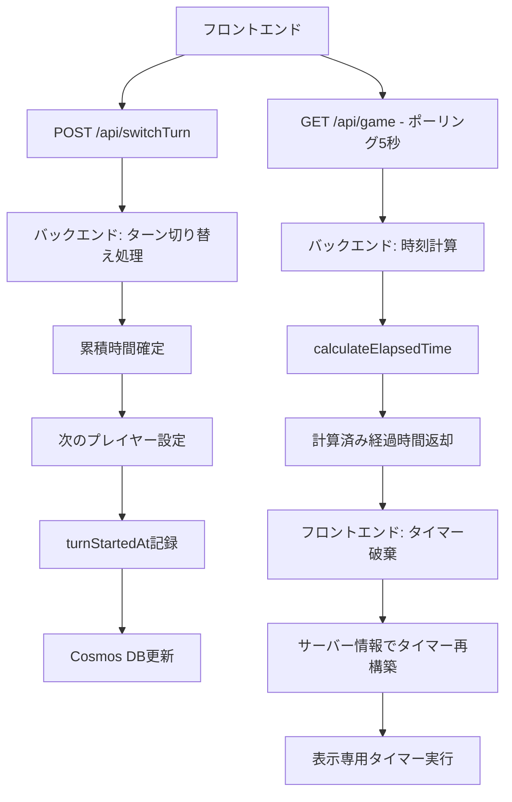
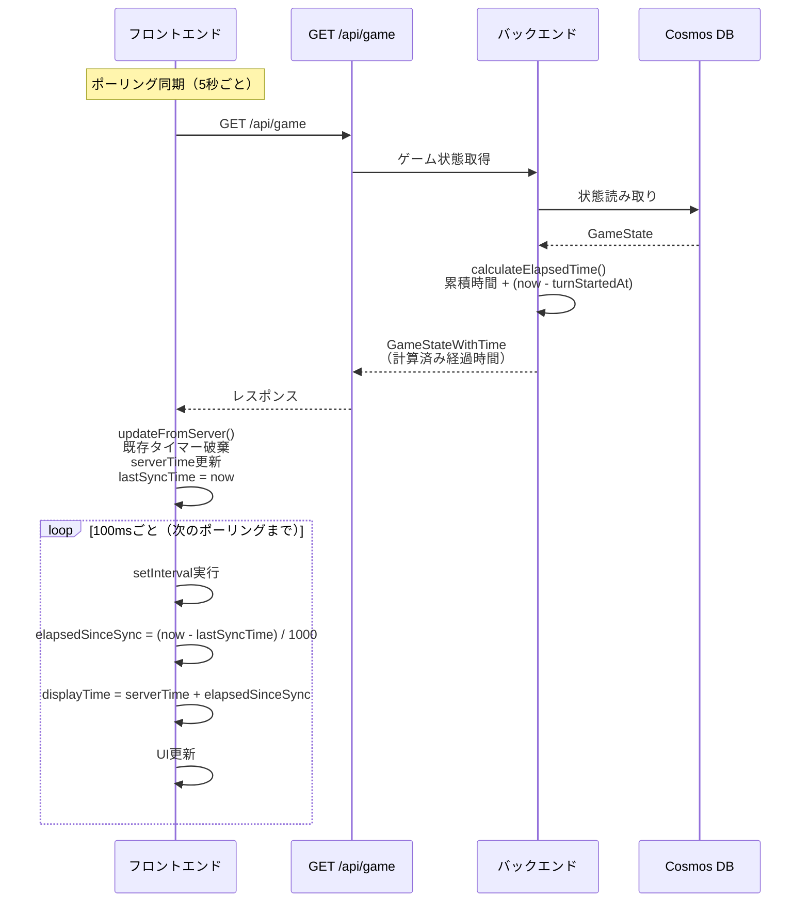
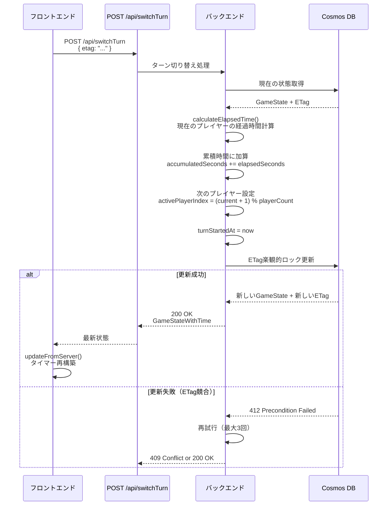
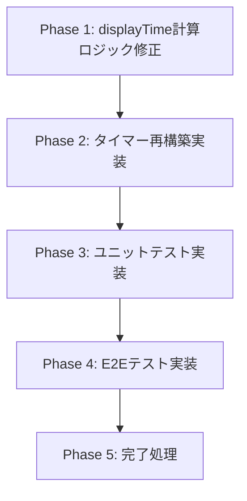

# Technical Design Document

## Overview

本機能は、現在のマルチプレイヤー・ゲームタイマーにおける「5秒ごとに5秒加算される」バグを根本的に解決するため、**バックエンド主導のアーキテクチャ**に移行します。フロントエンドのタイマーを**表示専用**に特化し、すべての時刻計算とゲーム状態管理をバックエンドで行うことで、時刻計算の信頼できる情報源（Single Source of Truth）をバックエンドに一元化します。

**Purpose**: フロントエンドとバックエンドの時刻計算の二重カウントを排除し、正確なタイマー表示を実現する

**Users**: マルチプレイヤー・ゲームタイマーのすべてのプレイヤー

**Impact**: 現在のフロントエンド主導の時刻計算から、バックエンド主導の時刻計算に移行することで、ポーリング同期時の時刻のずれを完全に解消する

### Goals

- フロントエンドとバックエンドの時刻計算の二重カウントを完全に排除する
- バックエンドを唯一の信頼できる情報源（Single Source of Truth）として確立する
- フロントエンドのタイマーを表示専用に特化し、GET同期ごとにタイマーを再構築する
- 既存のバックエンド実装を最大限活用し、最小限の変更で問題を解決する
- フォールバックモード（useGameState）との後方互換性を維持する

### Non-Goals

- バックエンドAPIの根本的な再設計（既存のAPI構造を維持）
- タイマー精度の向上（既存の1秒間隔を維持）
- SignalRリアルタイム同期の実装（既存のポーリング同期を維持）
- 新しい機能の追加（既存機能のバグ修正のみ）

## Architecture

### Existing Architecture Analysis

**現在の問題のある実装**:

```
フロントエンド（useServerGameState）:
  ↓ ポーリング同期（5秒ごと）
updateFromServer:
  serverTime = サーバーのelapsedSeconds  ← ここで累積時間を取得
  lastSyncTime = Date.now()
  ↓
setInterval（100msごと）:
  currentTurnElapsed = (now - turnStartedAt) / 1000  ← ここで二重カウント発生
  displayTime = serverTime + currentTurnElapsed
  ↓
結果: ポーリング時に5秒加算 + (now - turnStartedAt)で再度5秒加算 = 10秒
```

**根本原因**:
- `serverTime`にはサーバーの累積経過時間が含まれている
- フロントエンドが`(now - turnStartedAt)`を計算して加算することで、既に加算された時間を再度加算してしまう
- ポーリング間隔（5秒）と二重カウントが一致するため、「5秒ごとに5秒加算される」現象が発生

**既存のバックエンド実装（正しく動作している）**:
- `calculateElapsedTime()`: 累積時間とターン経過時間を正しく計算
- `switchTurn`: ターン切り替え時に累積時間を確定
- `getGame`: 計算済みの経過時間を返す

**既存のフロントエンド実装（修正が必要）**:
- `useServerGameState`: ポーリング同期とタイマー表示を管理
- `updateFromServer`: サーバー状態を取得して内部状態を更新
- `useEffect（setInterval）`: 100msごとにdisplayTimeとturnDisplayTimeを更新

### High-Level Architecture



**Architecture Integration**:
- **既存パターン維持**: バックエンドのAPI構造、Cosmos DB永続化、フロントエンドのフック構造を維持
- **新しい改善点**: フロントエンドのdisplayTime計算ロジックを修正、タイマー再構築パターンの導入
- **Technology Alignment**: React 19.1.1、TypeScript 5.9、Azure Functions 4.8の既存スタックを維持
- **Steering Compliance**: structure.mdの「単一責任」「Props駆動」「状態は上位で管理」原則に準拠

### Technology Alignment

本機能は既存の技術スタックを維持し、実装パターンのみを修正します。

**フロントエンド**:
- **React 19.1.1**: 既存のuseServerGameStateフックを修正
- **TypeScript 5.9**: 既存の型定義を維持
- **既存パターン**: ポーリング同期、Props駆動のコンポーネント設計を維持

**バックエンド**:
- **Azure Functions 4.8**: 既存のAPI実装を維持（変更なし）
- **Cosmos DB Table API**: 既存のデータ構造を維持（変更なし）
- **既存サービス**: `timeCalculation.ts`、`gameStateService.ts`を維持（変更なし）

**新しい導入**: なし（既存実装の修正のみ）

### Key Design Decisions

#### Decision 1: フロントエンドのdisplayTime計算ロジックの修正

**Context**: 現在のdisplayTime計算ロジックが`(now - turnStartedAt)`を使用しており、ポーリング時に取得した累積時間と二重にカウントされている

**Alternatives**:
1. **lastSyncTimeベースの相対時間計算**: `displayTime = serverTime + (now - lastSyncTime) / 1000`
2. **turnStartedAtベースを維持し、serverTimeの定義変更**: バックエンドのデータ構造を変更（前のターンまでの累積時間のみを保存）
3. **ポーリング間隔を調整**: 問題を軽減するが根本解決にならない

**Selected Approach**: lastSyncTimeベースの相対時間計算（オプション1）

**Rationale**:
- 最小限の変更で根本原因を解決（フロントエンドの1ファイルのみ修正）
- バックエンドのAPI仕様やデータ構造を変更しない
- ポーリング間の経過時間のみを加算することで、二重カウントを完全に排除
- 実装コスト: 0.5日（既存コードの部分修正のみ）

**Trade-offs**:
- **利点**: バックエンド変更不要、最小限の変更、即座にデプロイ可能
- **欠点**: `turnStartedAt`ベースの計算から`lastSyncTime`ベースに概念変更（ただし、表示結果は同じ）

#### Decision 2: GET同期ごとのタイマー破棄と再構築

**Context**: 現在のuseServerGameStateは100msのsetIntervalを維持し続けているため、サーバーの情報と徐々にずれていく可能性がある

**Alternatives**:
1. **GET同期ごとにタイマーを破棄・再構築**: `updateFromServer`呼び出し時にタイマー状態をリセット
2. **setIntervalを維持し、定期的に補正**: 一定間隔でサーバー情報に補正
3. **現状維持**: タイマーを破棄せず、serverTimeとlastSyncTimeのみ更新

**Selected Approach**: GET同期ごとにタイマーを破棄・再構築（オプション1）

**Rationale**:
- サーバーの情報が唯一の信頼できる情報源であることを保証
- ポーリング間隔（5秒）ごとに表示をサーバー情報に完全同期
- ユーザー要件「getをするたびにタイマーを破棄し、サーバの情報に合わせたタイマーを再度設定してください」に完全準拠
- 実装が単純で理解しやすい（状態リセット）

**Trade-offs**:
- **利点**: サーバー情報との完全同期、シンプルな実装、デバッグが容易
- **欠点**: タイマー再構築のオーバーヘッド（ただし、5秒間隔なので無視できる）

#### Decision 3: バックエンドAPI仕様の維持

**Context**: 現在のバックエンド実装は正しく動作しており、時刻計算も正確に行われている

**Alternatives**:
1. **バックエンドAPI仕様を維持**: フロントエンドのみ修正
2. **APIレスポンス形式を変更**: 新しいフィールドを追加（例: `lastSyncTime`）
3. **新しいAPIエンドポイントを追加**: 専用の同期エンドポイント

**Selected Approach**: バックエンドAPI仕様を維持（オプション1）

**Rationale**:
- 既存のバックエンド実装が正しく動作している
- 問題の根本原因はフロントエンドの計算ロジックにある
- バックエンド変更はデプロイとテストのコストが高い
- フロントエンドのみの修正で問題を解決できる

**Trade-offs**:
- **利点**: バックエンド変更不要、API仕様の後方互換性維持、デプロイリスク最小化
- **欠点**: フロントエンドの計算ロジックが`lastSyncTime`に依存する（ただし、これは表示専用なので問題ない）

## System Flows

### Timer Update Flow (修正後)



### Turn Switch Flow (既存のまま維持)



## Requirements Traceability

| Requirement | Requirement Summary | Components | Interfaces | Flows |
|-------------|-------------------|------------|------------|-------|
| 1.1 | バックエンドがプレイヤー経過時間を計算 | timeCalculation.ts | calculateElapsedTime() | Timer Update Flow |
| 1.2 | アクティブプレイヤー切り替え時にターン開始時刻記録 | switchTurn.ts | POST /api/switchTurn | Turn Switch Flow |
| 1.3 | ゲーム状態取得時に経過時間を計算 | getGame.ts | GET /api/game | Timer Update Flow |
| 1.4 | バックエンドが唯一の信頼できる情報源 | timeCalculation.ts, getGame.ts | calculateElapsedTime() | Timer Update Flow |
| 2.1-2.4 | フロントエンドが時刻情報を送信しない | switchTurn.ts, pause.ts, resume.ts | POST endpoints | Turn Switch Flow |
| 3.1-3.4 | バックエンド主導のターン切り替え | switchTurn.ts | POST /api/switchTurn | Turn Switch Flow |
| 4.1-4.4 | フロントエンドの表示専用タイマー | useServerGameState.ts | updateFromServer(), useEffect | Timer Update Flow |
| 5.1-5.4 | GET同期時のタイマー再構築 | useServerGameState.ts | updateFromServer() | Timer Update Flow |
| 6.1-6.4 | バックエンドのゲーム状態管理 | gameStateService.ts, Cosmos DB | getGameState(), updateGameState() | Timer Update Flow |
| 7.1-7.4 | 一時停止/再開処理の整合性 | pause.ts, resume.ts | POST /api/pause, POST /api/resume | (既存フロー) |
| 8.1-8.4 | エラーハンドリングとフォールバック | useServerGameState.ts, GameTimer.tsx | syncWithServer(), useGameState fallback | (既存フロー) |
| 9.1-9.4 | API仕様の明確化 | 全Functions | GET /api/game, POST endpoints | 全フロー |
| 10.1-10.4 | 後方互換性の保証 | useGameState.ts, GameTimer.tsx | フォールバックモード | (既存フロー) |

## Components and Interfaces

### Frontend Layer

#### useServerGameState (修正対象)

**Responsibility & Boundaries**
- **Primary Responsibility**: サーバー状態の取得と表示専用タイマーの管理
- **Domain Boundary**: フロントエンド状態管理層（UIとバックエンドの中間）
- **Data Ownership**: serverState、serverTime、lastSyncTime、displayTime、turnDisplayTime
- **Transaction Boundary**: なし（ステートレスな表示ロジック）

**Dependencies**
- **Inbound**: GameTimerコンポーネント（フックを呼び出す）
- **Outbound**: GET /api/game（ポーリング同期）
- **External**: なし

**Contract Definition**

**Service Interface**:
```typescript
interface UseServerGameStateReturn {
  serverState: GameStateWithTime | null;
  displayTime: number;  // 表示用経過時間（serverTime + ポーリング間経過時間）
  updateFromServer: (state: GameStateWithTime, editingPlayerIndex?: number | null) => void;
  formatTime: (seconds: number) => string;
  getLongestTimePlayer: () => PlayerWithTime | null;
  getTotalGameTime: () => number;
  formatGameTime: (seconds: number) => string;
  getCurrentTurnTime: () => number;
  syncWithServer: () => Promise<GameStateWithTime | null>;
  updatePlayerNameOptimistic: (playerIndex: number, newName: string) => void;
}

function useServerGameState(): UseServerGameStateReturn;
```

- **Preconditions**: なし（初期状態で呼び出し可能）
- **Postconditions**:
  - `updateFromServer`呼び出し時に既存タイマー状態をリセット
  - 100msごとに`displayTime`と`turnDisplayTime`を更新
  - ポーリング間の経過時間のみを`serverTime`に加算
- **Invariants**:
  - `serverTime`はポーリング時のサーバー累積時間
  - `lastSyncTime`はポーリング時のクライアント時刻
  - `displayTime = serverTime + (now - lastSyncTime) / 1000`

**State Management**:
- **State Model**:
  - serverState: サーバーから取得した最新状態（ポーリングごとに更新）
  - serverTime: ポーリング時のサーバー累積時間（基準点）
  - lastSyncTime: ポーリング時のクライアント時刻（基準点）
  - displayTime: 表示用経過時間（100msごとに計算）
  - turnDisplayTime: ターン経過時間（100msごとに計算）
- **Persistence**: なし（メモリ内のみ）
- **Concurrency**: なし（単一スレッド実行）

**Integration Strategy**:
- **Modification Approach**: 既存のuseServerGameState.ts（lines 85-156）を修正
- **Backward Compatibility**: APIシグネチャを維持、内部実装のみ変更
- **Migration Path**: 段階的な適用不要（単一フック内の改修のみ）

**修正箇所**:

**1. updateFromServer修正（lines 65-88）**:
```typescript
// 修正前:
const updateFromServer = useCallback((state: GameStateWithTime, editingPlayerIndex: number | null = null) => {
  // プレイヤー名の編集中保持ロジック...

  setServerState(state);

  // アクティブプレイヤーの経過時間を基準に設定
  if (state.activePlayerIndex !== -1) {
    const serverElapsed = state.players[state.activePlayerIndex]?.elapsedSeconds || 0;
    setServerTime(serverElapsed);  // ← ここで累積時間を設定
    setLastSyncTime(Date.now());
  }
}, [serverState]);

// 修正後:
const updateFromServer = useCallback((state: GameStateWithTime, editingPlayerIndex: number | null = null) => {
  // プレイヤー名の編集中保持ロジック...

  setServerState(state);

  // タイマー状態をリセット（GET同期ごとにタイマー再構築）
  if (state.activePlayerIndex !== -1) {
    const serverElapsed = state.players[state.activePlayerIndex]?.elapsedSeconds || 0;
    setServerTime(serverElapsed);  // サーバーの累積時間（基準点）
    setDisplayTime(serverElapsed);  // 表示時間もリセット
    setTurnDisplayTime(0);  // ターン時間もリセット
    setLastSyncTime(Date.now());  // 同期時刻記録（基準点）
  } else {
    // ゲーム開始前の状態
    setServerTime(0);
    setDisplayTime(0);
    setTurnDisplayTime(0);
    setLastSyncTime(Date.now());
  }
}, [serverState]);
```

**2. setInterval修正（lines 98-156）**:
```typescript
// 修正前:
useEffect(() => {
  if (!serverState) return;

  const syncedTimer = setInterval(() => {
    const now = Date.now();

    // displayTimeの更新（アクティブプレイヤーはturnStartedAtを基準に計算）
    if (serverState.activePlayerIndex === -1) {
      setDisplayTime(serverTime);
    } else if (!serverState.turnStartedAt) {
      setDisplayTime(serverTime);
    } else {
      const turnStart = new Date(serverState.turnStartedAt).getTime();
      // ... 複雑な計算ロジック
      const currentTurnElapsed = (now - turnStart) / 1000;  // ← 二重カウント発生
      const previousTurnsTime = serverTime;
      setDisplayTime(previousTurnsTime + currentTurnElapsed);
    }

    // turnDisplayTimeの更新も同様
  }, 100);

  return () => clearInterval(syncedTimer);
}, [serverState, serverTime, lastSyncTime]);

// 修正後:
useEffect(() => {
  if (!serverState) return;

  const syncedTimer = setInterval(() => {
    const now = Date.now();

    // displayTimeの更新（lastSyncTimeからの経過時間のみ加算）
    if (serverState.activePlayerIndex === -1) {
      // ゲーム開始前: serverTimeそのまま
      setDisplayTime(serverTime);
    } else {
      // ポーリング間の経過時間のみ加算
      const elapsedSinceSync = (now - lastSyncTime) / 1000;
      setDisplayTime(serverTime + elapsedSinceSync);
    }

    // turnDisplayTimeの更新（turnStartedAtからの経過時間）
    if (serverState.activePlayerIndex === -1) {
      setTurnDisplayTime(0);
    } else if (!serverState.turnStartedAt) {
      setTurnDisplayTime(0);
    } else {
      const turnStart = new Date(serverState.turnStartedAt).getTime();

      if (serverState.isPaused && serverState.pausedAt) {
        // 一時停止中: pausedAt時点での経過時間
        const pausedTime = new Date(serverState.pausedAt).getTime();
        const elapsedMs = pausedTime - turnStart;
        setTurnDisplayTime(Math.max(0, elapsedMs / 1000));
      } else {
        // 通常: 現在時刻での経過時間
        const elapsedMs = now - turnStart;
        setTurnDisplayTime(Math.max(0, elapsedMs / 1000));
      }
    }
  }, 100);

  return () => clearInterval(syncedTimer);
}, [serverState, serverTime, lastSyncTime]);
```

### Backend Layer (変更なし)

#### timeCalculation.ts

**Responsibility & Boundaries**
- **Primary Responsibility**: プレイヤーの経過時間を正確に計算
- **Domain Boundary**: バックエンドビジネスロジック層
- **Data Ownership**: 計算ロジックのみ（データは所有しない）
- **Transaction Boundary**: なし（純粋関数）

**Dependencies**
- **Inbound**: getGame.ts、switchTurn.ts、pause.ts、resume.ts
- **Outbound**: GameState型定義
- **External**: なし

**Contract Definition**

**Service Interface**:
```typescript
function calculateElapsedTime(state: GameState, playerIndex: number): number;
function calculateAllPlayerTimes(state: GameState): CalculatedTime[];
```

- **Preconditions**: 有効なGameState、0 ≤ playerIndex < playerCount
- **Postconditions**: 正確な経過時間を秒単位で返す
- **Invariants**: 累積時間 + ターン経過時間の合計

**計算ロジック（既存実装）**:
```typescript
// 一時停止中または非アクティブプレイヤー
if (state.isPaused || state.activePlayerIndex !== playerIndex) {
  return accumulatedSeconds;  // 累積時間のみ
}

// アクティブプレイヤー
if (!state.turnStartedAt) {
  return accumulatedSeconds;  // turnStartedAtが未設定
}

// 現在時刻とturnStartedAtの差分を計算
const elapsedMs = now.getTime() - turnStartedAt.getTime();
const elapsedSeconds = Math.floor(elapsedMs / 1000);

return accumulatedSeconds + elapsedSeconds;  // 累積時間 + ターン経過時間
```

#### switchTurn.ts

**Responsibility & Boundaries**
- **Primary Responsibility**: ターン切り替え処理をバックエンドで完結
- **Domain Boundary**: バックエンドAPI層
- **Data Ownership**: ターン切り替えトランザクション
- **Transaction Boundary**: 単一プレイヤーの累積時間更新

**Dependencies**
- **Inbound**: フロントエンドのPOSTリクエスト
- **Outbound**: gameStateService.ts、timeCalculation.ts、Cosmos DB
- **External**: なし

**API Contract**:

| Method | Endpoint | Request | Response | Errors |
|--------|----------|---------|----------|--------|
| POST | /api/switchTurn | `{ etag: string }` | GameStateWithTime | 400, 409, 500 |

**Request Schema**:
```typescript
interface SwitchTurnRequest {
  etag: string;  // 楽観的ロック用ETag（時刻情報は含まない）
}
```

**Response Schema**:
```typescript
interface GameStateWithTime {
  players: PlayerWithTime[];
  activePlayerIndex: number;
  timerMode: 'count-up' | 'count-down';
  countdownSeconds: number;
  isPaused: boolean;
  etag: string;
  turnStartedAt: string | null;
  pausedAt: string | null;
}
```

**処理フロー（既存実装）**:
1. ETagを検証
2. 現在のゲーム状態を取得
3. `calculateElapsedTime()`で現在のプレイヤーの経過時間を計算
4. 累積時間に加算: `accumulatedSeconds += elapsedSeconds`
5. 次のプレイヤーを設定: `activePlayerIndex = (current + 1) % playerCount`
6. ターン開始時刻を記録: `turnStartedAt = now`
7. ETag楽観的ロック更新（最大3回再試行）

#### getGame.ts

**Responsibility & Boundaries**
- **Primary Responsibility**: ゲーム状態を取得し、計算済み経過時間を返す
- **Domain Boundary**: バックエンドAPI層
- **Data Ownership**: なし（読み取り専用）
- **Transaction Boundary**: なし

**Dependencies**
- **Inbound**: フロントエンドのGETリクエスト（ポーリング同期）
- **Outbound**: gameStateService.ts、timeCalculation.ts、Cosmos DB
- **External**: なし

**API Contract**:

| Method | Endpoint | Request | Response | Errors |
|--------|----------|---------|----------|--------|
| GET | /api/game | なし | GameStateWithTime | 500 |

**Response Schema**: (switchTurnと同じ)

**処理フロー（既存実装）**:
1. Cosmos DBからゲーム状態を取得
2. `calculateAllPlayerTimes()`で全プレイヤーの経過時間を計算
3. 計算済み経過時間を含むGameStateWithTimeを返す

## Data Models

### Domain Model

**Core Concepts**:
- **GameState**: バックエンドで管理されるゲーム状態（Cosmos DB永続化）
- **GameStateWithTime**: APIレスポンス用の型（計算済み経過時間を含む）
- **CalculatedTime**: 計算済みプレイヤー経過時間

**Business Rules & Invariants**:
- アクティブプレイヤーの経過時間 = 累積時間 + (現在時刻 - turnStartedAt)
- 非アクティブプレイヤーの経過時間 = 累積時間のみ
- 一時停止中のプレイヤーの経過時間 = 累積時間のみ
- `turnStartedAt`が未設定の場合、経過時間 = 累積時間のみ

### Physical Data Model

**Cosmos DB Table API（既存のまま維持）**:

**GameState Entity**:
```typescript
interface GameState {
  partitionKey: string;           // "game"固定
  rowKey: string;                 // "state"固定
  playerCount: number;            // 4-6
  activePlayerIndex: number;      // -1（開始前）または 0-5
  timerMode: 'count-up' | 'count-down';
  countdownSeconds: number;       // カウントダウン初期値
  isPaused: boolean;              // 一時停止状態
  turnStartedAt?: string;         // アクティブプレイヤーのターン開始時刻（ISO 8601）
  pausedAt?: string;              // 一時停止時刻（ISO 8601）
  players: Player[];              // プレイヤー配列
}

interface Player {
  id: number;                     // 1-6
  name: string;                   // プレイヤー名
  accumulatedSeconds: number;     // 累積経過時間（秒）
}
```

### Data Contracts & Integration

**API Data Transfer（既存のまま維持）**:

**GameStateWithTime** (GET /api/game, POST /api/switchTurn レスポンス):
```typescript
interface GameStateWithTime {
  players: PlayerWithTime[];      // 計算済み経過時間を含む
  activePlayerIndex: number;
  timerMode: 'count-up' | 'count-down';
  countdownSeconds: number;
  isPaused: boolean;
  etag: string;                   // Cosmos DB ETag
  turnStartedAt: string | null;   // ISO 8601
  pausedAt: string | null;        // ISO 8601
}

interface PlayerWithTime {
  name: string;
  elapsedSeconds: number;         // 計算済み経過時間
}
```

**SwitchTurnRequest** (POST /api/switchTurn):
```typescript
interface SwitchTurnRequest {
  etag: string;  // 楽観的ロック用（時刻情報は含まない）
}
```

## Error Handling

### Error Strategy

本機能は既存のエラーハンドリングパターンを維持します。フロントエンドのタイマー計算ロジックの修正のみのため、新たなエラーカテゴリは導入されません。

### Error Categories and Responses

**User Errors** (4xx):
- **400 Bad Request**: ETag未指定（switchTurn）
- **409 Conflict**: ETag競合（他のユーザーによる更新）

**System Errors** (5xx):
- **500 Internal Server Error**: Cosmos DB接続エラー、予期しないエラー

**Frontend Errors**:
- **GET失敗**: 既存の表示を維持（フォールバック）
- **POST失敗**: エラーメッセージ表示
- **連続失敗**: フォールバックモード（useGameState）に切り替え

### Monitoring

既存のエラートラッキング、ログ、ヘルスモニタリングを維持します。新たな監視要件はありません。

## Testing Strategy

### Unit Tests

**Frontend (useServerGameState.ts)**:
1. **displayTime計算ロジックの検証**:
   - `updateFromServer`呼び出し後、`displayTime`が`serverTime`にリセットされることを検証
   - ポーリング間の経過時間が正しく加算されることを検証（`serverTime + (now - lastSyncTime)`）
   - 二重カウントが発生しないことを検証

2. **タイマー再構築の検証**:
   - `updateFromServer`呼び出し時に既存タイマー状態がリセットされることを検証
   - `serverTime`、`lastSyncTime`、`displayTime`が正しく更新されることを検証

3. **turnDisplayTime計算の検証**:
   - `turnStartedAt`ベースの計算が正しいことを検証
   - 一時停止中の計算が正しいことを検証

**Backend (変更なし)**:
- 既存のユニットテストを維持

### Integration Tests

1. **ポーリング同期とタイマー更新の統合**:
   - ポーリング同期（5秒）ごとにタイマーが再構築されることを検証
   - タイマー再構築後、displayTime計算が正しいことを検証

2. **ターン切り替えとタイマー再構築の統合**:
   - ターン切り替え後、タイマーが正しくリセットされることを検証
   - 新しいターンの経過時間が正しく表示されることを検証

### E2E Tests

1. **「5秒ごとに5秒加算される」バグの修正検証**:
   - ゲーム開始後、5秒ごとにポーリング同期が実行されることを確認
   - 各ポーリング後、displayTimeが正しく更新されることを確認（二重カウントなし）
   - 10秒経過後、displayTimeが約10秒であることを確認（20秒ではない）

2. **タイマー表示の正確性検証**:
   - プレイヤーカード経過時間、ターン時間、全体プレイ時間が正しく表示されることを検証
   - ポーリング間（5秒間）のタイマー表示が滑らかに増加することを検証

3. **ターン切り替え時の動作検証**:
   - ターン切り替え後、新しいプレイヤーのタイマーが0秒から開始されることを検証
   - 前のプレイヤーの累積時間が正しく保存されることを検証

4. **一時停止/再開時の動作検証**:
   - 一時停止中、タイマーが停止することを検証
   - 再開後、タイマーが正しく再開されることを検証
   - 一時停止中の時間が経過時間に含まれないことを検証

### Performance Tests

1. **タイマー再構築のオーバーヘッド測定**:
   - ポーリング同期時のタイマー再構築にかかる時間を測定
   - 100ms以内で完了することを確認

2. **メモリ使用量の監視**:
   - 長時間ゲーム実行時のメモリリークがないことを確認
   - setIntervalのクリーンアップが正しく動作することを確認

## Migration Strategy

### Implementation Phases



**Phase 1: displayTime計算ロジック修正** (0.5日):
- useServerGameState.ts lines 98-156のsetInterval修正
- `displayTime = serverTime + (now - lastSyncTime) / 1000`に変更
- ブラウザで動作確認

**Phase 2: タイマー再構築実装** (0.5日):
- useServerGameState.ts lines 65-88のupdateFromServer修正
- GET同期ごとに`displayTime`と`turnDisplayTime`をリセット
- ブラウザで動作確認

**Phase 3: ユニットテスト実装** (0.5日):
- useServerGameState.test.tsに新しいテストケース追加
- displayTime計算ロジックのテスト
- タイマー再構築のテスト

**Phase 4: E2Eテスト実装** (0.5-1日):
- backend-driven-timer-fix.spec.ts作成
- 「5秒ごとに5秒加算される」バグの修正検証
- タイマー表示の正確性検証

**Phase 5: 完了処理** (0.2日):
- spec.json更新（phase: "implementation-done"）
- tasks.md全タスク完了チェック
- 最終コミット作成

**総計**: 2-3日（16-24時間）

### Rollback Triggers

- Phase 1-2でブラウザ動作確認が失敗する場合
- Phase 3でユニットテストが80%以上パスしない場合
- Phase 4でE2Eテストが全て失敗する場合
- タイマー表示が正しく動作しない場合

### Validation Checkpoints

**Phase 1完了条件**:
- ✅ displayTime計算ロジック修正完了
- ✅ TypeScriptコンパイルエラーなし
- ✅ ブラウザで動作確認（二重カウント解消）

**Phase 2完了条件**:
- ✅ updateFromServer修正完了
- ✅ GET同期ごとにタイマーがリセットされることを確認
- ✅ ブラウザで動作確認（タイマー再構築）

**Phase 3完了条件**:
- ✅ 全ユニットテストがパス
- ✅ テストカバレッジ80%以上

**Phase 4完了条件**:
- ✅ 全E2Eテストがパス
- ✅ 「5秒ごとに5秒加算される」バグが解消

**Phase 5完了条件**:
- ✅ spec.jsonのphaseが"implementation-done"
- ✅ tasks.md全タスク完了[x]
- ✅ 最終コミット作成
