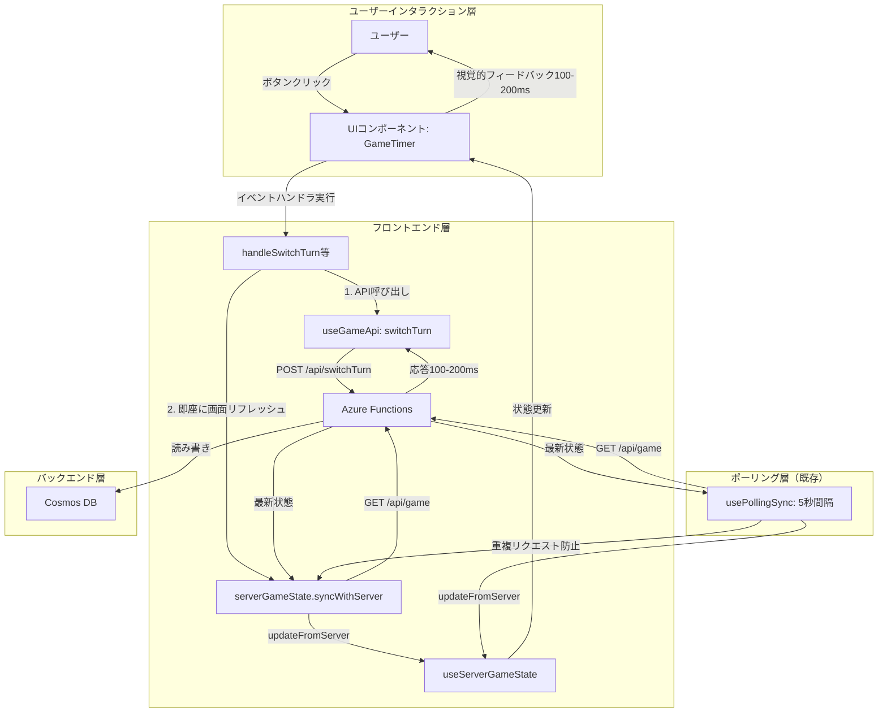
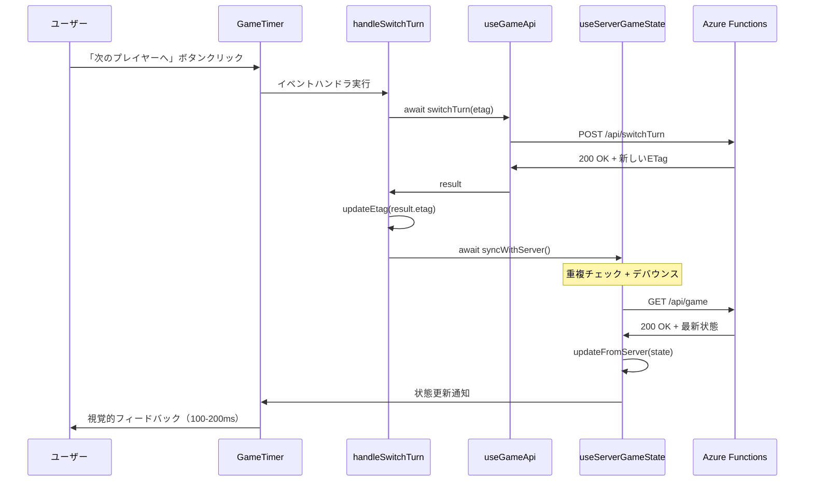
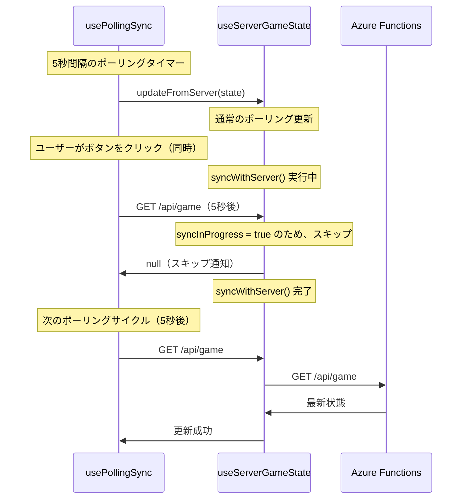

# Technical Design: ボタンレスポンス最適化

## Overview

本機能は、マルチプレイヤーゲームタイマーにおける**ボタン押下時のレスポンス遅延問題**を解決します。現在の実装では、ボタンクリック後にAPIレスポンスを待機し、さらに**ポーリング処理（5秒間隔）でのみ画面が更新される**ため、最悪5秒以上画面が反応しない問題が発生しています。

本設計では、**各ボタンクリック後に即座にサーバーから最新状態を取得して画面をリフレッシュ**することで、APIラウンドトリップ時間内（100-200ms程度）での視覚的フィードバックを実現します。

**対象ユーザー**: ゲームタイマーの全ユーザー（プレイヤー、観戦者）

**ビジネス価値**:
- **ユーザー体験の劇的改善**: 現在の「最悪5秒待ち」から「100-200ms応答」へ大幅改善
- **操作の確実性**: ボタンクリックが即座に画面に反映され、操作が受け付けられたことを認識可能
- **継続利用率の向上**: 快適な操作感により継続的な利用を促進

**システムへの影響**:
- 既存のuseServerGameStateフックを拡張し、`syncWithServer()`メソッドを追加
- GameTimer.tsxの各ボタンハンドラを修正し、API呼び出し後に即座に画面リフレッシュを実行
- フォールバックモード（Phase 1）は変更なし（既に即座の画面更新を実現）

---

## Goals

### 主要目標

**目標1: ポーリング依存の解消**
- 現状: ボタンクリック後、ポーリング処理（5秒間隔）でのみ画面更新
- 目標: ボタンクリック後、API呼び出し完了と同時に即座に/api/gameをfetchして画面更新
- 成功基準: E2Eテストで全ボタン操作のレスポンス時間が200ms以内であることを自動検証

**目標2: useServerGameStateの拡張**
- 現状: updateFromServer()メソッドのみ（ポーリングから呼ばれる）
- 目標: syncWithServer()メソッドを追加し、任意のタイミングでサーバー状態を強制取得
- 成功基準: ユニットテストでsyncWithServer()が/api/gameをfetchし、updateFromServer()を呼び出すことを検証

**目標3: 重複リクエスト防止**
- 現状: ポーリング処理とボタンクリック後のリクエストが重複する可能性
- 目標: 進行中のリクエストがある場合、新しいリクエストをキューイングまたはスキップ
- 成功基準: 同時に複数のsyncWithServer()が呼ばれた場合、最新のリクエストのみが実行されることを検証

---

## Non-Goals

以下の機能は意図的にスコープ外としています：

**除外機能1: 楽観的UI更新（Optimistic UI Update）**
- 理由: Question 2で「正確性重視（B）」を選択したため、まずはAPI応答後の画面更新を実装
- 将来検討事項: 実装後にユーザー体験を評価し、必要であれば楽観的UI更新を追加

**除外機能2: React最適化（React.memo、useCallback等）**
- 理由: 現在の問題の根本原因は「ポーリング依存」であり、React再レンダリングではない
- 将来検討事項: 画面更新速度が十分でない場合、React最適化を検討

**除外機能3: バックエンドアーキテクチャの大規模な変更**
- 理由: フロントエンド側の変更のみで問題を解決可能
- 将来検討事項: API応答時間が遅い場合、バックエンド最適化を検討

---

## Architecture

### 現在のアーキテクチャと問題点

**現在の実装フロー（通常モード）**:
```
ユーザーがボタンをクリック
  ↓
handleSwitchTurn() 実行
  ↓
await switchTurn(etag) ← API呼び出し（100-200ms）
  ↓
updateEtag(result.etag) ← ETag更新
  ↓
**ここで処理終了、画面は更新されない**
  ↓
（5秒後）usePollingSync がGET /api/gameを実行
  ↓
serverGameState.updateFromServer(state)
  ↓
UI更新（画面に反映）
```

**問題点**:
1. ボタンクリック後、**ポーリング処理（5秒間隔）でのみ画面が更新される**
2. 最悪5秒間、画面が全く反応しない
3. ユーザーは「ボタンが効いていない」と感じ、複数回クリックしてしまう

---

### 新しいアーキテクチャ（提案）

**新しい実装フロー（通常モード）**:
```
ユーザーがボタンをクリック
  ↓
handleSwitchTurn() 実行
  ↓
await switchTurn(etag) ← API呼び出し（100-200ms）
  ↓
updateEtag(result.etag) ← ETag更新
  ↓
**await serverGameState.syncWithServer() ← 即座に/api/gameをfetch**
  ↓
serverGameState.updateFromServer(state) ← 内部で自動実行
  ↓
UI更新（画面に反映、合計100-200ms）
  ↓
（5秒後）usePollingSync がGET /api/gameを実行（重複リクエスト防止機構で最適化）
```

**改善点**:
1. ボタンクリック後、**API呼び出し完了と同時に即座に画面更新**
2. ポーリング処理を待たずに、100-200ms以内で画面に反映
3. ユーザーは「ボタンが即座に効いた」と感じる

---

### High-Level Architecture



**アーキテクチャ統合説明**:
- **既存パターン維持**: 2モードアーキテクチャ（フォールバック/通常）を維持
- **最小限の変更**: useServerGameStateフックの拡張のみ、型定義は変更なし
- **ポーリング処理との共存**: 既存のusePollingSync（5秒間隔）は維持し、重複リクエストは防止
- **フォールバックモード**: 変更なし（既に即座の画面更新を実現）

---

## Technology Stack and Design Decisions

### Technology Alignment

本機能は既存のReact 19 + TypeScript技術スタックに完全に整合しており、新規技術の導入はありません。

**既存技術スタックの活用**:
- **React 19.1.1**: useState、useCallback、useEffectのみ使用（既存パターン維持）
- **TypeScript 5.9**: 型安全なsyncWithServer()メソッドの追加
- **Fetch API**: ブラウザ標準のfetch APIを使用し、外部依存なし
- **Vitest 3.2**: useServerGameStateのユニットテスト拡張
- **Playwright**: E2Eテストでのレスポンス時間自動検証

**新規導入ライブラリ**: なし

**既存パターンからの逸脱**: なし

---

### Key Design Decisions

#### Decision 1: useServerGameStateを拡張 vs 新しいhookを作成

**Context**: サーバー状態の強制取得機能（syncWithServer）をどこに実装するか

**Alternatives**:
1. **既存のuseServerGameStateを拡張**: syncWithServer()メソッドを追加
2. **新しいhook（useOptimisticGameState）を作成**: 楽観的UI更新機能を含む独立したhook

**Selected Approach**: **既存のuseServerGameStateを拡張**

**Rationale**:
- Question 2で「正確性重視（B）」を選択したため、楽観的UI更新は不要
- GameTimer.tsxは既にuseServerGameStateを使用しており、変更が最小限
- syncWithServer()はuseServerGameStateの責務（サーバー状態管理）の一部として自然

**Trade-offs**:
- **獲得**: 最小限の変更、実装期間の短縮、既存テストの継続性
- **犠牲**: hookの肥大化（ただし、責務は明確）

---

#### Decision 2: 重複リクエスト防止戦略

**Context**: ポーリング処理とボタンクリック後のsyncWithServer()が同時に発生した場合の対処

**Alternatives**:
1. **最新リクエストのみ実行**: 進行中のリクエストをキャンセルし、最新のリクエストを実行
2. **キューイング**: リクエストをキューに追加し、順次実行
3. **重複チェックのみ**: 進行中のリクエストがある場合、新しいリクエストをスキップ

**Selected Approach**: **重複チェック + デバウンス**

**Rationale**:
- ボタンクリックとポーリングの間隔は最大5秒あり、同時発生の可能性は低い
- キャンセル機構（AbortController）はコードの複雑性を増加させる
- デバウンス（100ms）で連続クリックを防止し、最新のリクエストのみ実行

**Implementation**:
```typescript
const syncInProgress = useRef(false);
const syncDebounceTimer = useRef<NodeJS.Timeout | null>(null);

const syncWithServer = useCallback(async () => {
  // デバウンス: 100ms以内の連続呼び出しをスキップ
  if (syncDebounceTimer.current) {
    clearTimeout(syncDebounceTimer.current);
  }

  return new Promise<GameStateWithTime | null>((resolve) => {
    syncDebounceTimer.current = setTimeout(async () => {
      // 既に進行中のリクエストがある場合はスキップ
      if (syncInProgress.current) {
        console.log('[syncWithServer] Skipped (already in progress)');
        resolve(null);
        return;
      }

      syncInProgress.current = true;
      try {
        const response = await fetch('/api/game');
        if (!response.ok) throw new Error(`HTTP ${response.status}`);
        const state: GameStateWithTime = await response.json();
        updateFromServer(state);
        resolve(state);
      } catch (error) {
        console.error('[syncWithServer] Failed:', error);
        resolve(null);
      } finally {
        syncInProgress.current = false;
      }
    }, 100); // 100ms デバウンス
  });
}, [updateFromServer]);
```

**Trade-offs**:
- **獲得**: シンプルな実装、低リスク、既存コードへの影響最小
- **犠牲**: 100ms以内の連続呼び出しは最後の1回のみ実行（通常は問題なし）

---

#### Decision 3: エラーハンドリング戦略

**Context**: syncWithServer()が失敗した場合の対処

**Alternatives**:
1. **サイレント失敗**: エラーをコンソールに記録し、画面は変更しない
2. **ユーザー通知**: エラーメッセージをUIに表示し、ユーザーに再試行を促す
3. **自動リトライ**: 失敗した場合、3回まで自動的に再試行

**Selected Approach**: **サイレント失敗 + コンソール記録**

**Rationale**:
- ポーリング処理（5秒間隔）が正常に動作している場合、画面は最終的に更新される
- エラーメッセージをUIに表示すると、ユーザー体験を妨げる可能性
- 開発者はコンソールログでエラーを確認可能

**Implementation**:
```typescript
try {
  await serverGameState.syncWithServer();
} catch (error) {
  console.error('[handleSwitchTurn] syncWithServer failed:', error);
  // サイレント失敗: UIには影響なし、ポーリングで最終的に更新される
}
```

**Trade-offs**:
- **獲得**: ユーザー体験を妨げない、シンプルな実装
- **犠牲**: エラーが発生した場合、ユーザーは気づかない（ただし、ポーリングで最終的に解決）

---

## System Flows

### ボタンクリック時のフロー（最適化後）



---

### ポーリング処理との共存フロー



---

## Requirements Traceability

| Requirement | Summary | Components | Interfaces | Flows |
|-------------|---------|------------|------------|-------|
| 1.1-1.7 | 200ms以内の視覚的フィードバック | useServerGameState, GameTimer | syncWithServer() | ボタンクリックフロー |
| 3.1-3.6 | サーバー状態同期の最適化 | useServerGameState | syncWithServer(), updateFromServer() | ポーリング共存フロー |
| 4.1-4.6 | パフォーマンス計測と検証 | E2Eテスト, ユニットテスト | Performance API | 計測フロー |

---

## Components and Interfaces

### useServerGameState Hook（拡張版）

**Responsibility & Boundaries**:
- **Primary Responsibility**: 通常モード（Phase 2）のサーバー状態管理、ポーリング更新と即座の強制取得の両方に対応
- **Domain Boundary**: ビジネスロジック層（状態管理）
- **Data Ownership**: サーバーから取得したゲーム状態の管理

**Dependencies**:
- **Inbound**: GameTimerコンポーネント、usePollingSync
- **Outbound**: Azure Functions API（GET /api/game）
- **External**: fetch API、React（useState、useCallback、useRef）

**Contract Definition**:

```typescript
interface UseServerGameStateReturn {
  // 既存プロパティ
  serverState: GameStateWithTime | null;
  displayTime: number;
  updateFromServer: (state: GameStateWithTime) => void;
  formatTime: (seconds: number) => string;
  getLongestTimePlayer: () => Player | null;
  getTotalGameTime: () => number;
  formatGameTime: (seconds: number) => string;
  getCurrentTurnTime: () => number;

  // **新規追加**: 即座のサーバー状態取得
  syncWithServer: () => Promise<GameStateWithTime | null>;
}

export function useServerGameState(): UseServerGameStateReturn {
  // 既存の実装...

  // **新規実装**: 即座にサーバーから最新状態を取得
  const syncInProgress = useRef(false);
  const syncDebounceTimer = useRef<NodeJS.Timeout | null>(null);

  const syncWithServer = useCallback(async (): Promise<GameStateWithTime | null> => {
    // デバウンス: 100ms以内の連続呼び出しをスキップ
    if (syncDebounceTimer.current) {
      clearTimeout(syncDebounceTimer.current);
    }

    return new Promise<GameStateWithTime | null>((resolve) => {
      syncDebounceTimer.current = setTimeout(async () => {
        // 既に進行中のリクエストがある場合はスキップ
        if (syncInProgress.current) {
          console.log('[syncWithServer] Skipped (already in progress)');
          resolve(null);
          return;
        }

        syncInProgress.current = true;
        try {
          const response = await fetch('/api/game');
          if (!response.ok) {
            throw new Error(`HTTP ${response.status}`);
          }
          const state: GameStateWithTime = await response.json();
          updateFromServer(state);
          resolve(state);
        } catch (error) {
          console.error('[syncWithServer] Failed:', error);
          resolve(null);
        } finally {
          syncInProgress.current = false;
        }
      }, 100); // 100ms デバウンス
    });
  }, [updateFromServer]);

  return {
    serverState,
    displayTime,
    updateFromServer,
    formatTime,
    getLongestTimePlayer,
    getTotalGameTime,
    formatGameTime,
    getCurrentTurnTime,
    syncWithServer, // **新規追加**
  };
}
```

**Preconditions**:
- `/api/game` エンドポイントがGETリクエストに応答すること
- GameStateWithTime型の最新状態を返すこと

**Postconditions**:
- syncWithServer()呼び出し後、100-200ms以内にserverStateが最新状態に更新される
- 重複リクエストが発生した場合、進行中のリクエストが完了するまで新しいリクエストはスキップされる

**Integration Strategy**:
- **Modification Approach**: 既存のuseServerGameStateフックにsyncWithServer()メソッドを追加
- **Backward Compatibility**: 既存のインターフェースは変更なし、新しいメソッドを追加のみ
- **Migration Path**: 段階的に各ボタンハンドラでsyncWithServer()を呼び出すように変更

---

### GameTimer Component（ハンドラ修正）

**Responsibility & Boundaries**:
- **Primary Responsibility**: 各ボタンクリック後に即座にサーバー状態を強制取得して画面をリフレッシュ
- **Domain Boundary**: UIプレゼンテーション層
- **Data Ownership**: なし（useServerGameStateから状態を受け取るのみ）

**Modified Handlers**:

```typescript
// 既存ハンドラの修正（handleSwitchTurnの例）
const handleSwitchTurn = React.useCallback(async () => {
  if (import.meta.env.MODE === 'test' || isInFallbackMode) {
    fallbackState.switchToNextPlayer();
    return;
  }
  if (!etag) {
    console.warn('ETag not available, cannot switch turn');
    return;
  }

  try {
    // 1. API呼び出し（既存）
    const result = await switchTurn(etag);
    if (result && 'etag' in result) {
      updateEtag(result.etag);
      clearConflictMessage();
    }

    // **2. 新規追加: 即座に画面リフレッシュ**
    await serverGameState.syncWithServer();

  } catch (error) {
    console.error('[handleSwitchTurn] Error:', error);
    // エラー処理: サイレント失敗、ポーリングで最終的に更新される
  }
}, [isInFallbackMode, etag, switchTurn, fallbackState, updateEtag, clearConflictMessage, serverGameState]);
```

**Integration Strategy**:
- **Modification Approach**: 各ボタンハンドラ（handleSwitchTurn、handlePauseResume、handleResetGame等）に`await serverGameState.syncWithServer()`を追加
- **Backward Compatibility**: 既存のAPI呼び出し処理は変更なし、syncWithServer()を追加のみ
- **Migration Path**: 段階的に各ハンドラを修正、テスト環境では無効化可能

---

## Data Models

本機能は既存のデータモデルを変更しません。GameStateWithTime型をそのまま使用します。

---

## Error Handling

### Error Strategy

1. **syncWithServer()の失敗**: サイレント失敗、コンソールログに記録、ポーリングで最終的に更新
2. **重複リクエスト**: 進行中のリクエストがある場合、新しいリクエストをスキップ
3. **ネットワークエラー**: fetch APIのエラーをキャッチし、nullを返す

### Monitoring

- **開発環境**: console.log/console.errorで詳細なログを出力
- **プロダクション環境**: エラーのみコンソールに記録
- **E2Eテスト**: Playwrightでレスポンス時間を自動計測、200msの閾値を超えた場合はテスト失敗

---

## Testing Strategy

### Unit Tests

#### 1. useServerGameStateのsyncWithServer()検証

```typescript
describe('useServerGameState - syncWithServer', () => {
  it('syncWithServer()が/api/gameをfetchし、updateFromServer()を呼び出すこと', async () => {
    // Mock fetch
    global.fetch = jest.fn(() =>
      Promise.resolve({
        ok: true,
        json: () => Promise.resolve(mockGameState),
      })
    );

    const { result } = renderHook(() => useServerGameState());

    await act(async () => {
      const state = await result.current.syncWithServer();
      expect(state).toEqual(mockGameState);
    });

    expect(global.fetch).toHaveBeenCalledWith('/api/game');
    expect(result.current.serverState).toEqual(mockGameState);
  });

  it('重複リクエストが発生した場合、進行中のリクエストのみ実行されること', async () => {
    // ... テスト実装
  });
});
```

---

### E2E Tests

#### 1. ボタンクリックレスポンス時間の自動検証

```typescript
describe('E2E - ボタンレスポンス時間検証', () => {
  test('次のプレイヤーへボタンが200ms以内に応答すること', async ({ page }) => {
    await page.goto('http://localhost:5173');

    const switchTurnButton = page.getByTestId('switch-turn-button');

    // Performance APIでレスポンス時間を計測
    const responseTime = await page.evaluate(async (button) => {
      const start = performance.now();
      button.click();

      // UI更新完了を待つ
      await new Promise((resolve) => setTimeout(resolve, 300));

      const end = performance.now();
      return end - start;
    }, switchTurnButton);

    // 200ms以内であることを検証
    expect(responseTime).toBeLessThan(200);
  });
});
```

---

## Performance & Scalability

### Target Metrics

| 操作 | 目標レスポンス時間 | 計測方法 |
|------|------------------|---------|
| 次のプレイヤーへ | 200ms以内 | E2Eテスト（Playwright） |
| 一時停止/再開 | 200ms以内 | E2Eテスト（Playwright） |
| リセット | 200ms以内 | E2Eテスト（Playwright） |

### Optimization Techniques

1. **デバウンス**: 100ms以内の連続呼び出しをスキップ
2. **重複リクエスト防止**: 進行中のリクエストがある場合、新しいリクエストをスキップ
3. **ポーリング処理との共存**: 既存のusePollingSync（5秒間隔）は維持

---

## Security Considerations

本機能は既存のセキュリティポリシーに従い、追加のセキュリティリスクを導入しません。

- **認証**: 既存のETagベースの楽観的ロックを維持
- **CSRF**: 既存のAzure Functionsの設定を維持

---

## Next Steps

design.md完成後、以下を実施：
1. `/kiro:spec-tasks button-response-optimization -y` でタスク生成
2. タスクに基づいて実装開始
3. 実装後、ユーザー体験を評価し、必要であれば楽観的UI更新を追加
