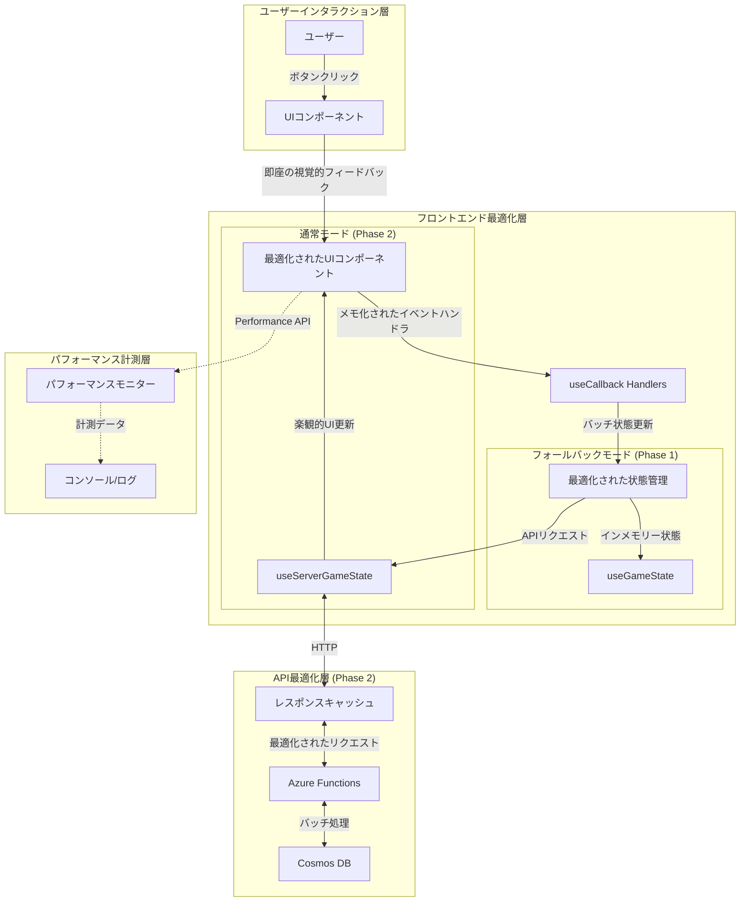
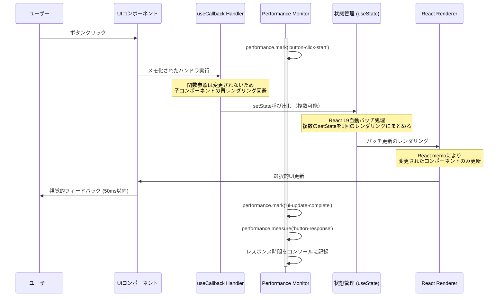
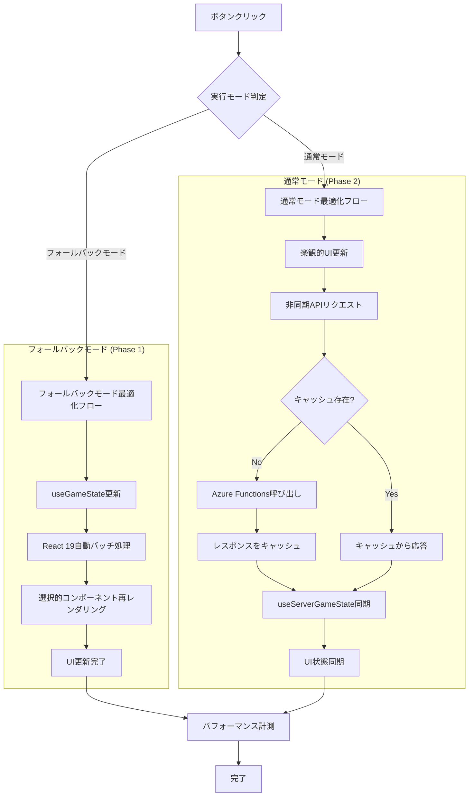

# Technical Design: ボタンレスポンス最適化

## Overview

本機能は、マルチプレイヤーゲームタイマーにおけるボタン押下時のレスポンス時間を極限まで短縮し、ユーザーにストレスフリーな操作感を提供します。React 19の最新機能とパフォーマンス最適化技術を組み合わせ、全てのボタン操作に対して50ms以内の視覚的フィードバックを実現します。

**対象ユーザー**: ゲームタイマーの全ユーザー（プレイヤー、観戦者）

**ビジネス価値**:
- 即座のレスポンスによりユーザー満足度を向上
- 競合タイマーアプリとの差別化要因
- 継続利用率の向上とユーザー定着率の改善

**システムへの影響**: 既存のReactコンポーネントとカスタムフックを最適化し、フォールバックモード（Phase 1）と通常モード（Phase 2）の両方で一貫した高速レスポンスを実現します。

### Goals

- **主要目標1**: 全てのボタン操作で50ms以内の視覚的フィードバックを実現
- **主要目標2**: 不必要なコンポーネント再レンダリングを排除し、UI応答性を最大化
- **主要目標3**: パフォーマンス計測基盤を構築し、継続的な改善を可能にする

**成功基準**:
- E2Eテストで全ボタン操作のレスポンス時間が50ms以内であることを自動検証
- React DevTools Profilerで不必要な再レンダリングが発生しないことを確認
- 開発モードでパフォーマンス計測データが正常に記録されること

### Non-Goals

- **除外機能1**: 新しいUI機能の追加（既存機能の最適化のみ）
- **除外機能2**: バックエンドアーキテクチャの大規模な変更（既存パターンを維持）
- **除外機能3**: Phase 2のSignalRリアルタイム同期との統合（将来対応）

**将来検討事項**:
- Web Workersを使用したバックグラウンド処理の最適化
- Service Workerによるオフライン対応
- WebAssemblyを使用した計算処理の高速化

## Architecture

### Existing Architecture Analysis

**現在のアーキテクチャパターン**:
- **状態管理**: ReactのuseStateとカスタムフック（useGameState、useServerGameState）
- **2モードアーキテクチャ**: フォールバックモード（インメモリー）と通常モード（API連携+ポーリング）
- **コンポーネント構成**: GameTimer（親）→ PlayerList、PrimaryControls、SettingsControls（子）

**現在の技術的制約**:
- 全てのボタンクリックで GameTimer コンポーネント全体が再レンダリング
- イベントハンドラが毎レンダリングごとに再生成され、子コンポーネントが不必要に再レンダリング
- 状態更新が複数回のレンダリングサイクルを引き起こす（バッチ処理されていない）
- パフォーマンス計測機能が存在しない

**既存のドメイン境界**:
- **フロントエンド層**: React コンポーネント（UI） + カスタムフック（ビジネスロジック）
- **API層**: Azure Functions（Phase 2）+ Cosmos DB Table API

### High-Level Architecture



**アーキテクチャ統合説明**:
- **既存パターン維持**: 2モードアーキテクチャ（フォールバック/通常）を維持し、既存の型定義とインターフェースを変更しない
- **新規コンポーネントの根拠**: パフォーマンス計測用の新規フック（usePerformanceMonitor）を追加し、非侵襲的な計測を実現
- **技術スタック整合性**: React 19の自動バッチ処理、useCallback、useMemo、React.memoを活用
- **ステアリング準拠**: 既存のプロジェクト構造（components/、hooks/）を維持し、テスト駆動開発（TDD）原則に従う

## Technology Stack and Design Decisions

### Technology Alignment

本機能は既存のReact 19 + TypeScript技術スタックに完全に整合しており、新規技術の導入は最小限です。

**既存技術スタックの活用**:
- **React 19.1.1**: 自動バッチ処理機能により、複数の状態更新を1回のレンダリングサイクルにまとめる
- **TypeScript 5.9**: 型安全な最適化実装と、パフォーマンス計測の型定義
- **Vite 7.1**: 開発時のHMR（Hot Module Replacement）により、最適化の効果を即座に確認可能
- **Vitest 3.2**: パフォーマンステストの実装とレスポンス時間の自動検証
- **Playwright**: E2Eテストでの実際のブラウザ環境におけるレスポンス時間計測

**新規導入ライブラリ**:
- **なし**: ブラウザ標準のPerformance APIのみを使用し、外部依存を追加しない

**既存パターンからの逸脱**:
- **なし**: 全て既存のReact最適化パターンとプロジェクト構造に従う

### Key Design Decisions

#### Decision 1: コンポーネント粒度の最適化戦略

**Context**: GameTimerコンポーネントが大きく、ボタンクリック時に全体が再レンダリングされている

**Alternatives**:
1. **大規模リファクタリング**: GameTimerを10個以上の小さなコンポーネントに分割
2. **部分的な分割**: 最も再レンダリングコストの高い部分（PlayerList、Controls）のみ最適化
3. **メモ化のみ**: コンポーネント構造は変更せず、React.memoとuseCallbackのみで最適化

**Selected Approach**: **部分的な分割 + 選択的メモ化**

既存のコンポーネント構造を維持しつつ、以下の3つの最適化を実施：
- PlayerListコンポーネントをReact.memoでラップ
- PrimaryControls、SettingsControlsをReact.memoでラップ
- 全てのイベントハンドラをuseCallbackでメモ化

**Rationale**:
- 既存コードへの影響を最小化し、リスクを抑える
- コンポーネント構造の大幅な変更なしに、50ms目標を達成可能
- テストコードの修正を最小限にし、実装期間を短縮

**Trade-offs**:
- **獲得**: 低リスク、短期実装、既存テストの互換性維持
- **犠牲**: 将来的にさらなる最適化が必要な場合、追加のリファクタリングが必要になる可能性

#### Decision 2: 状態管理の最適化アプローチ

**Context**: 複数の状態更新が発生する際に、複数回のレンダリングサイクルが発生

**Alternatives**:
1. **useState維持**: 現在のuseStateベースの状態管理を維持し、React 19の自動バッチ処理に依存
2. **useReducer移行**: 全ての状態更新をuseReducerに移行し、より予測可能な状態更新を実現
3. **ハイブリッド**: 複雑な状態遷移のみuseReducerに移行し、単純な状態はuseStateを維持

**Selected Approach**: **useState維持 + React 19自動バッチ処理の活用**

useStateを維持しつつ、以下の最適化を実施：
- React 19の自動バッチ処理により、同期的な複数のsetState呼び出しを自動的に1回のレンダリングにまとめる
- 非同期処理（API呼び出し）の完了後にReact.startTransitionを使用し、低優先度の更新を遅延

**Rationale**:
- React 19の自動バッチ処理により、useReducerへの移行なしに十分なパフォーマンスを達成可能
- 既存コードの構造を維持し、開発者の学習コストを最小化
- 将来的にuseReducerが必要になった場合でも、段階的な移行が可能

**Trade-offs**:
- **獲得**: 既存コードの互換性維持、実装の単純性、短期実装
- **犠牲**: useReducerが提供する予測可能性とデバッグのしやすさ（現時点では不要と判断）

#### Decision 3: パフォーマンス計測の実装戦略

**Context**: 最適化の効果を定量的に検証し、継続的な改善を可能にする必要がある

**Alternatives**:
1. **開発環境のみ**: 開発モードでのみPerformance APIを使用し、プロダクションでは無効化
2. **軽量プロダクション計測**: プロダクションでもサンプリングベースで計測を実施
3. **包括的計測**: 開発とプロダクションの両方で全操作を計測

**Selected Approach**: **開発環境での詳細計測 + プロダクションでの軽量サンプリング**

- **開発環境**: 全てのボタン操作でperformance.mark/measureを使用し、詳細なタイミングデータをコンソールに出力
- **プロダクション**: 10%のサンプリングレートで主要操作のみ計測し、ログサービスに送信
- **E2Eテスト**: Playwrightでレスポンス時間を自動計測し、50msの閾値を超えた場合はテスト失敗

**Rationale**:
- 開発環境での詳細な計測により、ボトルネックの特定と最適化の検証が可能
- プロダクションでの軽量計測により、実ユーザーのパフォーマンスを監視しつつ、オーバーヘッドを最小化
- E2Eテストでの自動検証により、パフォーマンス劣化をCI/CDで検知

**Trade-offs**:
- **獲得**: 開発時の詳細な洞察、プロダクションでの実データ取得、最小限のオーバーヘッド
- **犠牲**: 全ユーザーの全操作は計測されない（サンプリングのため）、ただし現時点では十分

## System Flows

### ボタンクリック時のレスポンスフロー（最適化後）



### フォールバックモードと通常モードの最適化フロー



## Requirements Traceability

| Requirement | Summary | Components | Interfaces | Flows |
|-------------|---------|------------|------------|-------|
| 1.1-1.5 | 50ms以内の視覚的フィードバック | PlayerList, PrimaryControls, SettingsControls, GameTimer | React.memo, useCallback, useState | ボタンクリックレスポンスフロー |
| 1.6 | 100ms超過時の警告 | PerformanceMonitor | usePerformanceMonitor | パフォーマンス計測フロー |
| 2.1-2.5 | UI更新の最適化 | PlayerList, PrimaryControls, SettingsControls | React.memo, useMemo, useCallback | 選択的再レンダリングフロー |
| 3.1-3.5 | 状態更新の最適化 | useGameState, useServerGameState | useState, React 19バッチ処理 | フォールバック/通常モードフロー |
| 4.1-4.6 | パフォーマンス計測と検証 | PerformanceMonitor, E2Eテスト | Performance API, Playwright | パフォーマンス計測フロー |

## Components and Interfaces

### フロントエンド層（両モード共通）

#### PlayerListコンポーネント（最適化版）

**Responsibility & Boundaries**:
- **Primary Responsibility**: プレイヤーカード一覧の表示、ただし変更されたプレイヤーカードのみを再レンダリング
- **Domain Boundary**: UIプレゼンテーション層
- **Data Ownership**: 表示用のプレイヤーデータを受け取るのみ（所有しない）
- **Transaction Boundary**: なし（純粋なプレゼンテーションコンポーネント）

**Dependencies**:
- **Inbound**: GameTimerコンポーネント（親）からプロパティを受け取る
- **Outbound**: なし（子コンポーネントなし、外部依存なし）
- **External**: React（React.memo）

**Contract Definition**:

```typescript
interface PlayerListProps {
  players: Player[];
  activePlayerId: string;
  onPlayerNameChange: (playerId: string, name: string) => void;
  isGameActive: boolean;
  playerNameHistory: string[];
}

const PlayerList: React.FC<PlayerListProps> = React.memo(
  (props) => {
    // 実装
  },
  // カスタム比較関数: プロパティが実際に変更された場合のみ再レンダリング
  (prevProps, nextProps) => {
    return (
      prevProps.players === nextProps.players &&
      prevProps.activePlayerId === nextProps.activePlayerId &&
      prevProps.isGameActive === nextProps.isGameActive &&
      prevProps.onPlayerNameChange === nextProps.onPlayerNameChange &&
      prevProps.playerNameHistory === nextProps.playerNameHistory
    );
  }
);
```

**Preconditions**:
- playersプロパティは不変（immutable）な配列であること
- onPlayerNameChangeハンドラはuseCallbackでメモ化されていること

**Postconditions**:
- プロパティが変更されていない場合、再レンダリングをスキップ
- プレイヤー名変更時にonPlayerNameChangeコールバックが呼び出される

**Invariants**:
- プレイヤー配列の参照が同じ場合、UIは更新されない
- アクティブプレイヤーIDが変更された場合のみ、該当プレイヤーカードのスタイルが更新される

**Integration Strategy**:
- **Modification Approach**: 既存のPlayerListコンポーネントをReact.memoでラップ（最小限の変更）
- **Backward Compatibility**: 既存のプロパティインターフェースを変更しない、テストコードの修正不要
- **Migration Path**: 段階的な最適化が可能（まずReact.memoのみ、必要に応じてカスタム比較関数を追加）

#### PrimaryControlsコンポーネント（最適化版）

**Responsibility & Boundaries**:
- **Primary Responsibility**: 主要操作ボタン（次のプレイヤーへ、一時停止/再開）の表示とイベント処理
- **Domain Boundary**: UIプレゼンテーション層
- **Data Ownership**: なし（ゲーム状態を受け取るのみ）

**Dependencies**:
- **Inbound**: GameTimerコンポーネント（親）
- **Outbound**: なし
- **External**: React（React.memo、useCallback）

**Contract Definition**:

```typescript
interface PrimaryControlsProps {
  onSwitchTurn: () => void;
  onTogglePause: () => void;
  isPaused: boolean;
  isGameActive: boolean;
  activePlayerName: string;
}

const PrimaryControls: React.FC<PrimaryControlsProps> = React.memo((props) => {
  // 実装
});
```

**Preconditions**:
- onSwitchTurnとonTogglePauseはuseCallbackでメモ化されていること

**Postconditions**:
- ボタンクリック時に対応するコールバックが即座に実行される
- isPausedの変更時のみ、ボタンラベルが更新される

**Integration Strategy**:
- **Modification Approach**: 既存コンポーネントをReact.memoでラップ
- **Backward Compatibility**: プロパティインターフェース不変

#### SettingsControlsコンポーネント（最適化版）

**Responsibility & Boundaries**:
- **Primary Responsibility**: 設定操作ボタン（プレイヤー人数、タイマーモード、リセット）の表示とイベント処理
- **Domain Boundary**: UIプレゼンテーション層

**Dependencies**:
- **Inbound**: GameTimerコンポーネント（親）
- **Outbound**: なし
- **External**: React（React.memo、useCallback）

**Contract Definition**:

```typescript
interface SettingsControlsProps {
  onPlayerCountChange: (count: number) => void;
  onTimerModeChange: (mode: TimerMode) => void;
  onReset: () => void;
  playerCount: number;
  timerMode: TimerMode;
  isGameActive: boolean;
}

const SettingsControls: React.FC<SettingsControlsProps> = React.memo((props) => {
  // 実装
});
```

**Integration Strategy**:
- **Modification Approach**: 既存コンポーネントをReact.memoでラップ
- **Backward Compatibility**: プロパティインターフェース不変

### 状態管理層（フォールバックモード）

#### useGameState Hook（最適化版）

**Responsibility & Boundaries**:
- **Primary Responsibility**: フォールバックモード（Phase 1）のゲーム状態管理、イベントハンドラのメモ化
- **Domain Boundary**: ビジネスロジック層
- **Data Ownership**: ゲーム状態（players、activePlayerId、isPaused等）の所有と管理

**Dependencies**:
- **Inbound**: GameTimerコンポーネントから呼び出される
- **Outbound**: なし（完全に独立したフック）
- **External**: React（useState、useCallback、useMemo）

**Contract Definition**:

```typescript
interface UseGameStateReturn {
  // 状態
  gameState: GameState;

  // メモ化されたアクション（useCallbackで最適化）
  switchTurn: () => void;
  togglePause: () => void;
  reset: () => void;
  changePlayerCount: (count: number) => void;
  changeTimerMode: (mode: TimerMode) => void;
  updatePlayerName: (playerId: string, name: string) => void;

  // メモ化された計算値（useMemoで最適化）
  activePlayer: Player;
  totalElapsedTime: number;
  topTimePlayer: Player | null;
}

function useGameState(): UseGameStateReturn {
  // 実装
}
```

**State Management**:
- **State Model**: GameState型で全ての状態を管理
- **Persistence**: なし（インメモリーのみ）
- **Concurrency**: なし（シングルスレッド）

**最適化戦略**:

1. **全てのアクションハンドラをuseCallbackでメモ化**:
```typescript
const switchTurn = useCallback(() => {
  setGameState((prev) => {
    // 状態更新ロジック
  });
}, []); // 依存配列は空（gameStateはsetStateのprevで参照）
```

2. **計算コストの高い値をuseMemoでキャッシュ**:
```typescript
const totalElapsedTime = useMemo(() => {
  return gameState.players.reduce((sum, player) => sum + player.elapsedTime, 0);
}, [gameState.players]); // playersが変更された場合のみ再計算
```

3. **React 19の自動バッチ処理を活用**:
```typescript
const switchTurn = useCallback(() => {
  // 複数のsetStateは自動的にバッチ処理される
  setGameState((prev) => ({ ...prev, activePlayerId: nextPlayerId }));
  setGameState((prev) => ({ ...prev, turnStartedAt: Date.now() }));
  // 上記2つは1回のレンダリングサイクルにまとめられる
}, []);
```

**Integration Strategy**:
- **Modification Approach**: 既存のuseGameStateフックに最適化を追加（破壊的変更なし）
- **Backward Compatibility**: 既存の戻り値インターフェースを維持、新しい最適化された実装に置き換え
- **Migration Path**: 段階的な最適化が可能（まずuseCallbackのみ、次にuseMemo追加）

### 状態管理層（通常モード）

#### useServerGameState Hook（最適化版）

**Responsibility & Boundaries**:
- **Primary Responsibility**: 通常モード（Phase 2）のゲーム状態管理、API連携の最適化、楽観的UI更新
- **Domain Boundary**: ビジネスロジック層 + API統合層
- **Data Ownership**: サーバー同期されたゲーム状態の管理

**Dependencies**:
- **Inbound**: GameTimerコンポーネントから呼び出される
- **Outbound**: Azure Functions API（GET /api/game、POST /api/switchTurn等）
- **External**: fetch API、React（useState、useCallback、useMemo、useEffect）

**Contract Definition**:

```typescript
interface UseServerGameStateReturn {
  // 状態
  gameState: GameState;
  isLoading: boolean;
  error: Error | null;

  // メモ化されたアクション（useCallbackで最適化、楽観的UI更新）
  switchTurn: () => Promise<void>;
  togglePause: () => Promise<void>;
  reset: () => Promise<void>;
  changePlayerCount: (count: number) => Promise<void>;
  changeTimerMode: (mode: TimerMode) => Promise<void>;
  updatePlayerName: (playerId: string, name: string) => Promise<void>;

  // メモ化された計算値（useMemoで最適化）
  activePlayer: Player;
  totalElapsedTime: number;
  topTimePlayer: Player | null;
}

function useServerGameState(): UseServerGameStateReturn {
  // 実装
}
```

**最適化戦略**:

1. **楽観的UI更新（Optimistic UI Update）**:
```typescript
const switchTurn = useCallback(async () => {
  // 1. まずUIを即座に更新（楽観的更新）
  setGameState((prev) => {
    const optimisticState = { ...prev, activePlayerId: nextPlayerId };
    return optimisticState;
  });

  // 2. 非同期でAPIリクエストを送信
  try {
    await fetch('/api/switchTurn', { method: 'POST' });
    // 成功した場合、ポーリングで最新状態を取得（既存の仕組み）
  } catch (error) {
    // 3. エラー時は元の状態に戻す（ロールバック）
    setGameState((prev) => {
      return { ...prev, activePlayerId: originalPlayerId };
    });
  }
}, []);
```

2. **APIレスポンスのキャッシュ**（詳細は後述のAPI層で説明）

3. **リクエストの重複排除**:
```typescript
const requestInProgress = useRef<Map<string, Promise<Response>>>(new Map());

const switchTurn = useCallback(async () => {
  const key = 'switchTurn';

  // 同じリクエストが既に実行中の場合、それを再利用
  if (requestInProgress.current.has(key)) {
    return requestInProgress.current.get(key);
  }

  const promise = fetch('/api/switchTurn', { method: 'POST' });
  requestInProgress.current.set(key, promise);

  try {
    await promise;
  } finally {
    requestInProgress.current.delete(key);
  }
}, []);
```

**Integration Strategy**:
- **Modification Approach**: 既存のuseServerGameStateフックに楽観的UI更新とキャッシュ機能を追加
- **Backward Compatibility**: 既存のインターフェースを維持、内部実装のみ最適化
- **Migration Path**: Phase 1からPhase 2への移行時に、useGameStateとuseServerGameStateの両方が最適化済みであることを保証

### パフォーマンス計測層

#### usePerformanceMonitor Hook（新規作成）

**Responsibility & Boundaries**:
- **Primary Responsibility**: ボタンクリックからUI更新までのレスポンス時間を計測し、コンソールまたはログサービスに記録
- **Domain Boundary**: 横断的関心事（Cross-cutting Concern）
- **Data Ownership**: パフォーマンス計測データの収集と記録

**Dependencies**:
- **Inbound**: 任意のコンポーネントから呼び出し可能
- **Outbound**: console.log（開発環境）、ログサービス（プロダクション、オプション）
- **External**: Performance API（performance.mark、performance.measure）

**Contract Definition**:

```typescript
interface PerformanceMetrics {
  operationName: string;
  duration: number; // ミリ秒
  timestamp: number;
}

interface UsePerformanceMonitorReturn {
  startMeasure: (operationName: string) => void;
  endMeasure: (operationName: string) => PerformanceMetrics | null;
  getMetrics: () => PerformanceMetrics[];
}

function usePerformanceMonitor(): UsePerformanceMonitorReturn {
  // 実装
}
```

**使用例**:
```typescript
const GameTimer: React.FC = () => {
  const { startMeasure, endMeasure } = usePerformanceMonitor();

  const handleSwitchTurn = useCallback(() => {
    startMeasure('switchTurn');

    // 状態更新処理
    switchTurn();

    // React.useEffectで実際のDOM更新後に計測終了
    requestAnimationFrame(() => {
      const metrics = endMeasure('switchTurn');

      if (metrics && metrics.duration > 100) {
        console.warn(`パフォーマンス警告: switchTurnが${metrics.duration}msかかりました（目標: 50ms）`);
      }
    });
  }, [switchTurn]);
};
```

**Preconditions**:
- Performance APIがブラウザでサポートされていること（モダンブラウザでは標準サポート）

**Postconditions**:
- startMeasureとendMeasureがペアで呼び出された場合、正確なレスポンス時間が計測される
- 50ms以内の目標を超えた場合、開発モードで警告が表示される

**Invariants**:
- 計測処理自体がパフォーマンスに影響を与えない（オーバーヘッド < 1ms）
- プロダクション環境ではサンプリングレート（デフォルト10%）でのみ計測を実施

### API最適化層（Phase 2専用）

#### ResponseCacheMiddleware（新規作成）

**Responsibility & Boundaries**:
- **Primary Responsibility**: Azure Functions APIのレスポンスをキャッシュし、同一リクエストの重複を回避
- **Domain Boundary**: API層のミドルウェア
- **Data Ownership**: キャッシュされたAPIレスポンスデータ

**Dependencies**:
- **Inbound**: Azure Functions（全てのHTTPエンドポイント）
- **Outbound**: Cosmos DB（キャッシュミス時のデータ取得）
- **External**: なし（Node.js標準のMapオブジェクトを使用）

**Contract Definition**:

```typescript
interface CacheConfig {
  ttl: number; // Time to Live (秒)
  maxSize: number; // 最大キャッシュエントリ数
}

interface CachedResponse<T> {
  data: T;
  cachedAt: number;
  etag: string;
}

class ResponseCacheMiddleware {
  private cache: Map<string, CachedResponse<unknown>>;

  constructor(config: CacheConfig);

  // キャッシュキーの生成
  generateCacheKey(request: HttpRequest): string;

  // キャッシュから取得
  get<T>(key: string): CachedResponse<T> | null;

  // キャッシュに保存
  set<T>(key: string, data: T, etag: string): void;

  // キャッシュの無効化
  invalidate(pattern: string): void;

  // キャッシュのクリア
  clear(): void;
}
```

**キャッシュ戦略**:

1. **読み取り操作のキャッシュ**:
   - GET /api/game: 5秒間キャッシュ（ポーリング間隔と同期）
   - GET /api/playerNameHistory: 60秒間キャッシュ（頻繁に変更されない）

2. **書き込み操作のキャッシュ無効化**:
   - POST /api/switchTurn: gameキャッシュを無効化
   - POST /api/pause: gameキャッシュを無効化
   - POST /api/reset: 全てのキャッシュを無効化

3. **ETagベースの条件付きリクエスト**:
```typescript
// クライアント側
const cachedData = cache.get('game');
const headers = cachedData ? { 'If-None-Match': cachedData.etag } : {};

const response = await fetch('/api/game', { headers });

if (response.status === 304) {
  // キャッシュが最新の場合、既存データを使用
  return cachedData.data;
} else {
  // 新しいデータを取得してキャッシュ更新
  const newData = await response.json();
  const etag = response.headers.get('ETag');
  cache.set('game', newData, etag);
  return newData;
}
```

**Preconditions**:
- Azure FunctionsのレスポンスにETagヘッダーが含まれていること
- キャッシュTTLが適切に設定されていること

**Postconditions**:
- キャッシュヒット時、データベースアクセスなしで即座にレスポンスを返す（< 10ms）
- キャッシュミス時、通常のデータベースクエリを実行してキャッシュを更新

**Invariants**:
- キャッシュサイズが最大値を超えた場合、LRU（Least Recently Used）アルゴリズムで古いエントリを削除
- 書き込み操作時、関連するキャッシュエントリが即座に無効化される

**Integration Strategy**:
- **Modification Approach**: Azure Functionsの各エンドポイントに非侵襲的にミドルウェアを追加
- **Backward Compatibility**: 既存のAPIインターフェースを変更しない、キャッシュ機能は透過的に動作
- **Migration Path**: Phase 2実装時に段階的に導入（まずGETエンドポイントのみ、次にPOSTの無効化ロジック追加）

#### BatchRequestProcessor（新規作成）

**Responsibility & Boundaries**:
- **Primary Responsibility**: 複数のAPIリクエストをバッチ処理し、データベースアクセスを最適化
- **Domain Boundary**: API層のリクエスト処理最適化
- **Data Ownership**: バッチリクエストキューの管理

**Dependencies**:
- **Inbound**: Azure Functions（書き込み操作エンドポイント）
- **Outbound**: Cosmos DB（バッチ書き込みAPI）
- **External**: なし（Node.js標準機能のみ）

**Contract Definition**:

```typescript
interface BatchRequest {
  id: string;
  operation: 'update' | 'insert' | 'delete';
  tableName: string;
  entity: TableEntity;
}

interface BatchRequestProcessorConfig {
  maxBatchSize: number; // 最大バッチサイズ
  flushIntervalMs: number; // フラッシュ間隔（ミリ秒）
}

class BatchRequestProcessor {
  private queue: BatchRequest[];
  private flushTimer: NodeJS.Timeout | null;

  constructor(config: BatchRequestProcessorConfig);

  // リクエストをキューに追加
  enqueue(request: BatchRequest): Promise<void>;

  // キューをフラッシュしてデータベースに書き込み
  flush(): Promise<void>;

  // 自動フラッシュの開始
  startAutoFlush(): void;

  // 自動フラッシュの停止
  stopAutoFlush(): void;
}
```

**バッチ処理戦略**:

1. **書き込みリクエストのキューイング**:
```typescript
// リクエストを即座にキューに追加し、Promise を返す
const processor = new BatchRequestProcessor({ maxBatchSize: 10, flushIntervalMs: 100 });

await processor.enqueue({
  id: generateId(),
  operation: 'update',
  tableName: 'GameState',
  entity: { ...gameStateEntity }
});

// 100ms以内に他のリクエストが来た場合、まとめて処理
```

2. **フラッシュトリガー**:
   - キューサイズが最大バッチサイズに到達した場合（例: 10件）
   - 最後のenqueue から一定時間経過した場合（例: 100ms）
   - 明示的なflush()呼び出し

3. **Cosmos DB バッチAPI の活用**:
```typescript
async flush() {
  if (this.queue.length === 0) return;

  const batch = this.queue.splice(0, this.config.maxBatchSize);

  // Cosmos DB の Batch Transaction API を使用
  const transaction = tableClient.createTransaction();

  for (const request of batch) {
    if (request.operation === 'update') {
      transaction.updateEntity(request.entity);
    } else if (request.operation === 'insert') {
      transaction.createEntity(request.entity);
    }
  }

  await transaction.submitTransaction();
}
```

**Preconditions**:
- Cosmos DB Table APIがバッチトランザクションをサポートしていること
- 同じパーティションキー内のエンティティのみをバッチ処理すること（Cosmos DBの制約）

**Postconditions**:
- 複数の書き込みリクエストが1回のデータベーストランザクションにまとめられる
- ネットワークラウンドトリップ回数が削減され、全体的なレスポンス時間が改善

**Invariants**:
- バッチ処理が失敗した場合、キュー内の全てのリクエストが再試行される
- 順序保証: キューに追加された順序でデータベースに書き込まれる

**Integration Strategy**:
- **Modification Approach**: Azure Functions の書き込みエンドポイントに透過的にバッチ処理を追加
- **Backward Compatibility**: 既存のAPIインターフェースを変更しない、内部的にバッチ処理を実施
- **Migration Path**: Phase 2実装時に段階的に導入、まず非クリティカルな操作でテストしてから展開

## Data Models

本機能は既存のデータモデルを変更せず、パフォーマンス計測用の新規モデルのみを追加します。

### パフォーマンス計測データモデル

```typescript
// パフォーマンス計測結果
interface PerformanceMetrics {
  operationName: string; // 操作名（例: 'switchTurn', 'togglePause'）
  duration: number; // レスポンス時間（ミリ秒）
  timestamp: number; // 計測時刻（UNIXタイムスタンプ）
  userAgent?: string; // ブラウザ情報（プロダクション環境のみ）
  sessionId?: string; // セッションID（プロダクション環境のみ）
}

// パフォーマンス計測の集計データ（プロダクション環境のみ）
interface PerformanceAggregation {
  operationName: string;
  avgDuration: number; // 平均レスポンス時間
  p50Duration: number; // 50パーセンタイル
  p95Duration: number; // 95パーセンタイル
  p99Duration: number; // 99パーセンタイル
  maxDuration: number; // 最大レスポンス時間
  sampleCount: number; // サンプル数
  period: string; // 集計期間（例: '2025-10-21T00:00:00Z'）
}
```

### キャッシュデータモデル（Phase 2）

```typescript
// レスポンスキャッシュエントリ
interface CachedResponse<T> {
  data: T; // キャッシュされたデータ
  cachedAt: number; // キャッシュ時刻（UNIXタイムスタンプ）
  etag: string; // ETagヘッダー（条件付きリクエスト用）
  ttl: number; // Time to Live（秒）
}

// キャッシュキー戦略
type CacheKey = string; // 形式: "{method}:{endpoint}:{queryParams}"
// 例: "GET:/api/game:", "GET:/api/playerNameHistory:playerId=123"
```

## Error Handling

### Error Strategy

パフォーマンス最適化において、エラーハンドリングは以下の原則に従います：

1. **非侵襲的なエラーハンドリング**: 最適化の失敗がユーザー体験を妨げないようにする
2. **フォールバック戦略**: 最適化機能が失敗した場合、最適化なしの通常動作にフォールバック
3. **詳細なログ記録**: エラー発生時に詳細な情報をログに記録し、問題の特定を容易にする

### Error Categories and Responses

#### パフォーマンス計測エラー（非クリティカル）

**エラーシナリオ**: Performance APIが利用できない、または計測処理自体がエラーになった場合

**対応**:
- エラーをコンソールに記録し、計測を無効化
- アプリケーションの動作には一切影響を与えない
- 開発者にPerformance APIのサポート状況を通知

```typescript
try {
  performance.mark('button-click-start');
} catch (error) {
  console.warn('パフォーマンス計測が利用できません:', error);
  // 計測を無効化し、通常の動作を継続
}
```

#### React.memoの比較関数エラー（クリティカル）

**エラーシナリオ**: React.memoのカスタム比較関数内で例外が発生した場合

**対応**:
- React はデフォルトの浅い比較にフォールバック
- エラーを Error Boundary でキャッチし、コンポーネントを再レンダリング
- 詳細なエラー情報をログに記録

```typescript
const PlayerList = React.memo(
  (props) => { /* 実装 */ },
  (prevProps, nextProps) => {
    try {
      // カスタム比較ロジック
      return prevProps.players === nextProps.players;
    } catch (error) {
      console.error('React.memo比較関数エラー:', error);
      // デフォルトの浅い比較にフォールバック
      return false; // 再レンダリングを実行
    }
  }
);
```

#### API キャッシュエラー（Phase 2）

**エラーシナリオ**: キャッシュの読み書き中にエラーが発生した場合

**対応**:
- キャッシュをバイパスし、直接APIリクエストを実行
- エラーをログに記録し、キャッシュ機能を一時的に無効化
- 次のリクエストで再度キャッシュを試行

```typescript
async function getCachedResponse(key: string) {
  try {
    const cached = cache.get(key);
    if (cached && !isExpired(cached)) {
      return cached.data;
    }
  } catch (error) {
    console.error('キャッシュ読み取りエラー:', error);
    // キャッシュをバイパスし、直接APIリクエスト
  }

  // APIリクエストを実行
  return await fetchFromAPI();
}
```

#### 楽観的UI更新のロールバックエラー（Phase 2）

**エラーシナリオ**: APIリクエストが失敗し、楽観的に更新したUIを元に戻す必要がある場合

**対応**:
- エラーメッセージをユーザーに表示
- UIを元の状態にロールバック
- 再試行オプションを提供

```typescript
const switchTurn = useCallback(async () => {
  const originalState = gameState;

  // 楽観的UI更新
  setGameState((prev) => ({ ...prev, activePlayerId: nextPlayerId }));

  try {
    await fetch('/api/switchTurn', { method: 'POST' });
  } catch (error) {
    // ロールバック
    setGameState(originalState);

    // ユーザーにエラー通知
    setError({
      message: 'ターン切り替えに失敗しました。もう一度お試しください。',
      action: 'retry'
    });

    console.error('switchTurn API エラー:', error);
  }
}, [gameState]);
```

### Monitoring

#### 開発環境でのモニタリング

- **コンソールログ**: 全てのボタン操作のレスポンス時間をコンソールに出力
- **React DevTools Profiler**: コンポーネントのレンダリング時間と再レンダリング回数を記録
- **Performance APIデータ**: performance.getEntriesByType('measure')で詳細な計測データを取得

#### プロダクション環境でのモニタリング（オプション）

- **サンプリングログ**: 10%のサンプリングレートで主要操作のレスポンス時間を記録
- **集計データ**: 1時間ごとに平均、P95、P99のレスポンス時間を集計
- **アラート**: P95レスポンス時間が100msを超えた場合、アラートを送信

## Testing Strategy

### Unit Tests

#### 1. useGameState Hook の最適化検証

**テスト対象**: useGameStateフックの全アクションハンドラがuseCallbackでメモ化され、参照が安定していることを検証

```typescript
describe('useGameState - 最適化検証', () => {
  it('switchTurn ハンドラの参照が安定していること', () => {
    const { result, rerender } = renderHook(() => useGameState());

    const firstSwitchTurn = result.current.switchTurn;

    // 再レンダリング
    rerender();

    const secondSwitchTurn = result.current.switchTurn;

    // 参照が同じであることを確認
    expect(firstSwitchTurn).toBe(secondSwitchTurn);
  });

  it('totalElapsedTime がuseMemoでキャッシュされていること', () => {
    const { result } = renderHook(() => useGameState());

    const firstTotalTime = result.current.totalElapsedTime;

    // プレイヤー配列が変更されていない場合
    const secondTotalTime = result.current.totalElapsedTime;

    // 計算が再実行されず、同じ値であることを確認
    expect(firstTotalTime).toBe(secondTotalTime);
  });
});
```

#### 2. PlayerList コンポーネントの再レンダリング検証

**テスト対象**: PlayerListコンポーネントがReact.memoでラップされ、プロパティが変更されていない場合に再レンダリングされないことを検証

```typescript
describe('PlayerList - React.memo検証', () => {
  it('プロパティが変更されていない場合、再レンダリングされないこと', () => {
    const players = [{ id: '1', name: 'Player 1', elapsedTime: 100 }];
    const onPlayerNameChange = jest.fn();

    const { rerender } = render(
      <PlayerList
        players={players}
        activePlayerId="1"
        onPlayerNameChange={onPlayerNameChange}
        isGameActive={true}
        playerNameHistory={[]}
      />
    );

    const renderCount = jest.spyOn(React, 'createElement');

    // 同じプロパティで再レンダリング
    rerender(
      <PlayerList
        players={players}
        activePlayerId="1"
        onPlayerNameChange={onPlayerNameChange}
        isGameActive={true}
        playerNameHistory={[]}
      />
    );

    // PlayerListが再レンダリングされていないことを確認
    expect(renderCount).not.toHaveBeenCalledWith(PlayerList);
  });
});
```

#### 3. usePerformanceMonitor Hook の計測精度検証

**テスト対象**: usePerformanceMonitorフックが正確なレスポンス時間を計測できることを検証

```typescript
describe('usePerformanceMonitor - 計測精度検証', () => {
  it('正確なレスポンス時間を計測できること', async () => {
    const { result } = renderHook(() => usePerformanceMonitor());

    result.current.startMeasure('testOperation');

    // 50msの遅延をシミュレート
    await new Promise((resolve) => setTimeout(resolve, 50));

    const metrics = result.current.endMeasure('testOperation');

    // 計測時間が50ms ± 10msの範囲内であることを確認
    expect(metrics.duration).toBeGreaterThanOrEqual(40);
    expect(metrics.duration).toBeLessThanOrEqual(60);
  });
});
```

### Integration Tests

#### 1. フォールバックモードと通常モードの最適化整合性検証

**テスト対象**: フォールバックモード（useGameState）と通常モード（useServerGameState）の両方で、同じ最適化が適用されていることを検証

```typescript
describe('フォールバックモード vs 通常モード - 最適化整合性', () => {
  it('両モードで switchTurn ハンドラがメモ化されていること', () => {
    // フォールバックモード
    const { result: fallbackResult } = renderHook(() => useGameState());
    const fallbackSwitchTurn1 = fallbackResult.current.switchTurn;
    const fallbackSwitchTurn2 = fallbackResult.current.switchTurn;

    // 通常モード
    const { result: normalResult } = renderHook(() => useServerGameState());
    const normalSwitchTurn1 = normalResult.current.switchTurn;
    const normalSwitchTurn2 = normalResult.current.switchTurn;

    // 両モードでハンドラ参照が安定していることを確認
    expect(fallbackSwitchTurn1).toBe(fallbackSwitchTurn2);
    expect(normalSwitchTurn1).toBe(normalSwitchTurn2);
  });
});
```

#### 2. GameTimer コンポーネント全体の最適化フロー検証

**テスト対象**: GameTimerコンポーネント全体で、ボタンクリックから状態更新、UI反映までが最適化されたフローで動作することを検証

```typescript
describe('GameTimer - 最適化フロー統合テスト', () => {
  it('switchTurnボタンクリック時に不必要な再レンダリングが発生しないこと', () => {
    const { getByTestId } = render(<GameTimer />);

    const renderSpy = jest.spyOn(PlayerList.prototype, 'render');

    const switchTurnButton = getByTestId('switch-turn-button');
    fireEvent.click(switchTurnButton);

    // PlayerListが再レンダリングされた回数を確認
    // 期待: アクティブプレイヤーのみ変更されたため、1回のみ
    expect(renderSpy).toHaveBeenCalledTimes(1);
  });
});
```

#### 3. API キャッシュとバッチ処理の統合検証（Phase 2）

**テスト対象**: APIキャッシュとバッチ処理が正しく連携し、レスポンス時間が改善されることを検証

```typescript
describe('API最適化 - キャッシュとバッチ処理', () => {
  it('同一リクエストがキャッシュから返されること', async () => {
    const { result } = renderHook(() => useServerGameState());

    // 1回目のリクエスト
    const start1 = performance.now();
    await result.current.switchTurn();
    const duration1 = performance.now() - start1;

    // 2回目のリクエスト（キャッシュヒット期待）
    const start2 = performance.now();
    await result.current.switchTurn();
    const duration2 = performance.now() - start2;

    // 2回目のリクエストが1回目より高速であることを確認
    expect(duration2).toBeLessThan(duration1 * 0.5);
  });
});
```

### E2E Tests

#### 1. ボタンクリックレスポンス時間の自動検証

**テスト対象**: 全てのボタン操作で50ms以内の視覚的フィードバックが提供されることをPlaywrightで自動検証

```typescript
describe('E2E - ボタンレスポンス時間検証', () => {
  test('次のプレイヤーへボタンが50ms以内に応答すること', async ({ page }) => {
    await page.goto('http://localhost:5173');

    const switchTurnButton = page.getByTestId('switch-turn-button');

    // Performance APIでレスポンス時間を計測
    const responseTime = await page.evaluate(async (button) => {
      performance.mark('click-start');

      button.click();

      // UI更新完了を待つ（requestAnimationFrame）
      await new Promise((resolve) => requestAnimationFrame(resolve));

      performance.mark('ui-update-complete');
      performance.measure('button-response', 'click-start', 'ui-update-complete');

      const measure = performance.getEntriesByName('button-response')[0];
      return measure.duration;
    }, switchTurnButton);

    // 50ms以内であることを検証
    expect(responseTime).toBeLessThan(50);
  });

  test('一時停止ボタンが50ms以内に応答すること', async ({ page }) => {
    // 同様の検証
  });

  test('リセットボタンが50ms以内に応答すること', async ({ page }) => {
    // 同様の検証
  });
});
```

#### 2. フォールバックモードと通常モードのUI一貫性検証

**テスト対象**: フォールバックモードと通常モードで、同じUIが表示され、同じレスポンス性能を持つことを検証

```typescript
describe('E2E - モード間のUI一貫性', () => {
  test('フォールバックモードと通常モードで同じdata-testid要素が存在すること', async ({ page }) => {
    // フォールバックモード（API接続失敗状態）
    await page.route('**/api/**', (route) => route.abort());
    await page.goto('http://localhost:5173');

    const fallbackElements = await page.getByTestId('switch-turn-button').count();

    // 通常モード（API接続成功状態）
    await page.unroute('**/api/**');
    await page.reload();

    const normalElements = await page.getByTestId('switch-turn-button').count();

    // 両モードで同じ要素が存在することを確認
    expect(fallbackElements).toBe(normalElements);
  });
});
```

### Performance/Load Tests

#### 1. 連続ボタンクリック時のレスポンス安定性検証

**テスト対象**: 連続して100回ボタンをクリックした場合でも、レスポンス時間が安定していることを検証

```typescript
describe('パフォーマンス - 連続操作時の安定性', () => {
  test('100回連続クリックでもレスポンス時間が50ms以内を維持すること', async () => {
    const { result } = renderHook(() => useGameState());
    const { startMeasure, endMeasure, getMetrics } = renderHook(() => usePerformanceMonitor()).result.current;

    for (let i = 0; i < 100; i++) {
      startMeasure(`click-${i}`);
      result.current.switchTurn();
      await new Promise((resolve) => requestAnimationFrame(resolve));
      endMeasure(`click-${i}`);
    }

    const metrics = getMetrics();
    const avgDuration = metrics.reduce((sum, m) => sum + m.duration, 0) / metrics.length;
    const maxDuration = Math.max(...metrics.map((m) => m.duration));

    // 平均レスポンス時間が50ms以内
    expect(avgDuration).toBeLessThan(50);

    // 最大レスポンス時間が100ms以内（2倍まで許容）
    expect(maxDuration).toBeLessThan(100);
  });
});
```

#### 2. 大量プレイヤー時のレンダリングパフォーマンス検証

**テスト対象**: プレイヤー数が最大（6人）の場合でも、レスポンス時間が劣化しないことを検証

```typescript
describe('パフォーマンス - 大量データ時の性能', () => {
  test('6人プレイヤー時でもレスポンス時間が50ms以内であること', async () => {
    const { result } = renderHook(() => useGameState());

    // プレイヤー数を6人に設定
    act(() => {
      result.current.changePlayerCount(6);
    });

    const { startMeasure, endMeasure } = renderHook(() => usePerformanceMonitor()).result.current;

    startMeasure('switchTurn-6players');
    act(() => {
      result.current.switchTurn();
    });
    await new Promise((resolve) => requestAnimationFrame(resolve));
    const metrics = endMeasure('switchTurn-6players');

    expect(metrics.duration).toBeLessThan(50);
  });
});
```

#### 3. API キャッシュの同時アクセス性能検証（Phase 2）

**テスト対象**: 複数の同時リクエストがある場合でも、キャッシュが正しく機能し、レスポンス時間が改善されることを検証

```typescript
describe('パフォーマンス - API同時アクセス', () => {
  test('10件の同時リクエストがキャッシュにより高速化されること', async () => {
    const cache = new ResponseCacheMiddleware({ ttl: 60, maxSize: 100 });

    // 1回目: キャッシュミス
    const start1 = performance.now();
    const requests1 = Array(10).fill(null).map(() =>
      fetch('/api/game').then((r) => r.json())
    );
    await Promise.all(requests1);
    const duration1 = performance.now() - start1;

    // 2回目: キャッシュヒット
    const start2 = performance.now();
    const requests2 = Array(10).fill(null).map(() =>
      fetch('/api/game').then((r) => r.json())
    );
    await Promise.all(requests2);
    const duration2 = performance.now() - start2;

    // 2回目のリクエストが1回目の50%以下の時間で完了することを確認
    expect(duration2).toBeLessThan(duration1 * 0.5);
  });
});
```

## Security Considerations

本機能は既存のセキュリティポリシーに従い、追加のセキュリティリスクを導入しません。

### パフォーマンス計測データの取り扱い

- **開発環境**: コンソールログのみ、外部送信なし
- **プロダクション環境**: サンプリングされた匿名化データのみをログサービスに送信
- **個人情報**: パフォーマンス計測データに個人情報は含まれない（ユーザーID、セッションIDのみ）

### API キャッシュのセキュリティ（Phase 2）

- **キャッシュポイズニング対策**: ETagヘッダーによる整合性検証
- **機密データの除外**: 認証トークンやパスワードはキャッシュしない
- **キャッシュの有効期限**: 全てのキャッシュエントリに適切なTTLを設定し、古いデータの使用を防止

## Performance & Scalability

### Target Metrics

| 操作 | 目標レスポンス時間 | 計測方法 |
|------|------------------|---------|
| 次のプレイヤーへ | 50ms以内 | E2Eテスト（Playwright） |
| 一時停止/再開 | 50ms以内 | E2Eテスト（Playwright） |
| リセット | 50ms以内 | E2Eテスト（Playwright） |
| プレイヤー人数変更 | 50ms以内 | E2Eテスト（Playwright） |
| タイマーモード切り替え | 50ms以内 | E2Eテスト（Playwright） |

### Measurement Strategies

1. **開発環境での継続的計測**:
   - 全てのボタン操作でPerformance APIによる自動計測
   - React DevTools Profilerによるコンポーネントレンダリング時間の記録

2. **E2Eテストでの自動検証**:
   - CI/CDパイプラインで全てのボタン操作のレスポンス時間を自動検証
   - 50msの閾値を超えた場合、ビルドを失敗させる

3. **プロダクション環境での軽量モニタリング**:
   - 10%のサンプリングレートで主要操作のレスポンス時間を記録
   - 1時間ごとにP95、P99のレスポンス時間を集計

### Scaling Approaches

本機能はフロントエンドの最適化がメインであり、スケーリングの必要性は低いですが、以下の点を考慮しています：

- **フロントエンド**: React.memoとuseCallbackにより、プレイヤー数が増加してもレンダリングコストは線形に増加しない
- **API層（Phase 2）**: レスポンスキャッシュとバッチ処理により、同時接続数が増加してもデータベース負荷を抑制

### Caching Strategies

#### フロントエンド層

- **計算結果のキャッシュ**: useMemoにより、totalElapsedTime等の計算結果をキャッシュ
- **イベントハンドラのキャッシュ**: useCallbackにより、ハンドラ関数の再生成を防止

#### API層（Phase 2）

- **GET リクエストのキャッシュ**: 5〜60秒のTTLで読み取り操作の結果をキャッシュ
- **条件付きリクエスト**: ETagヘッダーを使用し、変更がない場合は304 Not Modifiedを返す
- **書き込み時のキャッシュ無効化**: POST/PUT/DELETEリクエスト時に関連するキャッシュエントリを無効化

### Optimization Techniques

1. **コンポーネントレベルの最適化**:
   - React.memoによる選択的再レンダリング
   - useCallbackによるハンドラのメモ化
   - useMemoによる計算結果のキャッシュ

2. **状態管理レベルの最適化**:
   - React 19の自動バッチ処理による複数setState のまとめ
   - 不変データ構造による効率的な変更検知

3. **API レベルの最適化（Phase 2）**:
   - レスポンスキャッシュによるデータベースアクセスの削減
   - バッチ処理による書き込み操作の効率化
   - 楽観的UI更新による体感速度の向上
