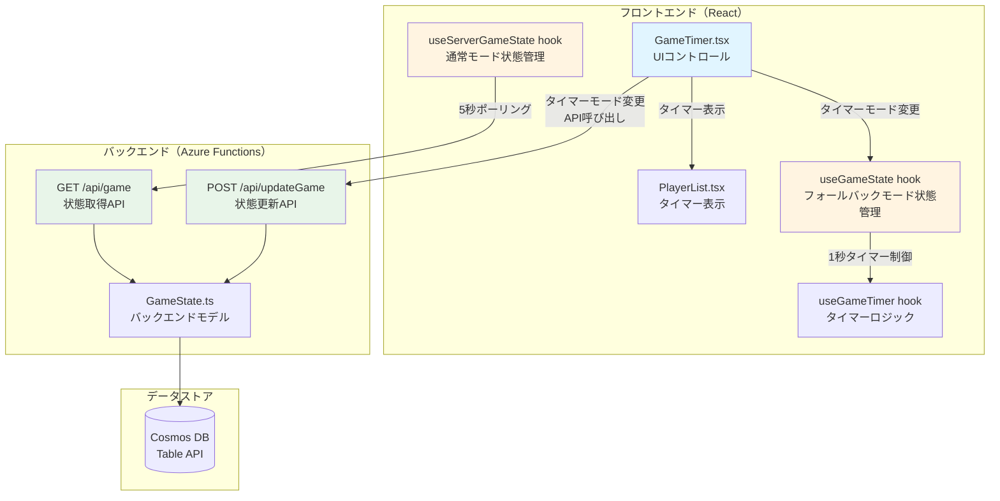
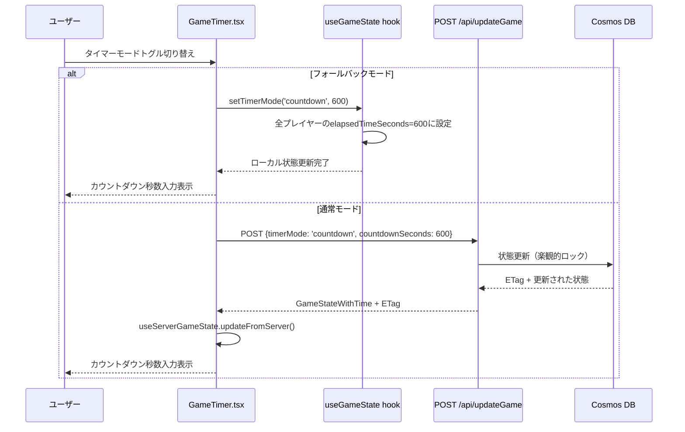
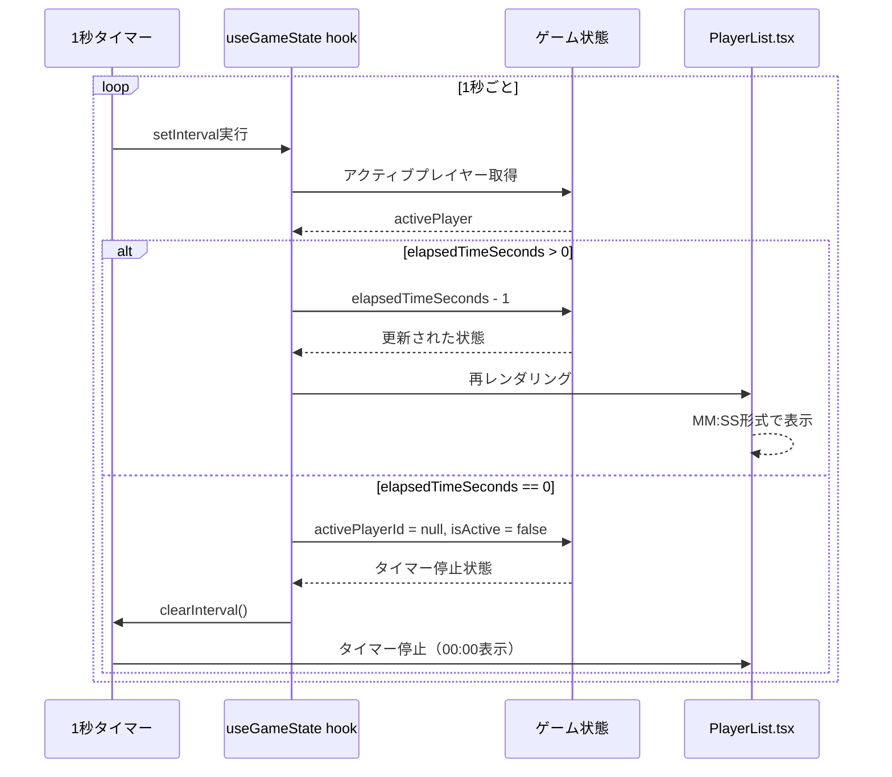

# 技術設計書: カウントダウンモード動作修正

## 概要

本機能は、タイマーアプリケーションのカウントダウンモード選択時にプレイヤーのタイマーが正しくカウントダウンするよう修正します。現在、カウントダウンモードを選択してもタイマーがカウントアップする不具合が発生しています。

**目的**: カウントダウンモードは、各プレイヤーに時間制限を設けるゲームモードとして不可欠な機能です。この不具合を修正し、全プレイヤーが同じ時間制限でゲームを開始でき、残り時間が1秒ごとに正確に減少することを実現します。

**ユーザー**: ゲーム管理者がタイマーモードを選択し、プレイヤーが自分のターン中に残り時間を視覚的に確認できるようにします。

**影響**: 既存のカウントアップモード、フォールバックモード（ローカル状態管理）、通常モード（API連携）の動作には影響を与えません。カウントダウンモード選択時のみ、正しい初期化とタイマー減少動作を実現します。

### ゴール
- カウントダウンモード選択時に各プレイヤーの初期時間が正しく設定される
- アクティブプレイヤーのタイマーが1秒ごとに減少する
- タイマーが0秒に達した時に自動停止する
- フォールバックモード・通常モードの両方で同じ動作を実現する

### 非ゴール
- カウントアップモードの動作変更
- タイマーモード切り替えUIの再設計（既存UIを維持）
- タイマー表示フォーマットの変更（既存のMM:SS形式を維持）
- APIエンドポイントの変更（既存のPOST /api/updateGame、GET /api/gameを使用）

## アーキテクチャ

### 既存アーキテクチャ分析

本機能は既存のタイマーアプリケーションに対する修正であり、以下の既存パターンと境界を尊重します。

**現在のアーキテクチャパターン**:
- **フォールバックモード**: ローカル状態管理（`useGameState` hook）によるインメモリー実装
- **通常モード**: バックエンドAPI（Azure Functions）とポーリング同期による状態管理
- **二重実装パターン**: 全てのタイマー機能をフォールバックモード・通常モードの両方に実装

**既存のドメイン境界**:
- **フロントエンド状態管理**: `useGameState.ts`（フォールバック）、`useServerGameState.ts`（通常モード）
- **UIコンポーネント**: `GameTimer.tsx`（メインコンポーネント）、`PlayerList.tsx`（プレイヤーカード表示）
- **バックエンドモデル**: `api/src/models/GameState.ts`（状態定義）

**既存の統合ポイント**:
- `GameTimer.tsx`の`isInFallbackMode`フラグによるモード分岐
- `handleTimerModeChange`によるタイマーモード切り替え処理
- `useGameTimer`フック（フォールバックモード専用）による1秒タイマー制御

### 高レベルアーキテクチャ



### 技術整合性

**既存技術スタックとの整合**:
- React 19.1.1（状態管理とuseEffect）
- TypeScript 5.9（型安全な実装）
- Azure Functions（バックエンドAPI）
- Cosmos DB Table API（状態永続化）

**新規依存関係**: なし（既存のライブラリとフレームワークのみ使用）

**ステアリング準拠**:
- **structure.md**: フロントエンド/バックエンド分離、hooks/componentsディレクトリ構成に従う
- **tech.md**: React hooks、TypeScript、Azure無料層サービス活用に従う
- **product.md**: フォールバックモード・通常モードの両方対応（デバイス非依存、シンプルアクセス）

### 主要設計決定

#### 決定1: カウントダウンモード初期化の実装場所

**決定**: `useGameState.setTimerMode`関数内でカウントダウン秒数による初期化を行う

**コンテキスト**: カウントダウンモード選択時に各プレイヤーの`elapsedTimeSeconds`を初期化する必要がある。この初期化を実行するタイミングと場所を決定する必要があった。

**検討した代替案**:
1. **GameTimer.tsx内でsetTimerMode呼び出し後に手動初期化**: コンポーネント層で初期化ロジックを実装
2. **setTimerMode関数内で初期化**: 状態管理層（useGameState）で初期化ロジックをカプセル化
3. **新規の初期化関数を作成**: `initializeCountdownMode`のような専用関数を追加

**選択したアプローチ**: **代替案2（setTimerMode関数内で初期化）**

既存の`setTimerMode`関数は以下のコードでカウントダウン秒数を受け取り、プレイヤーの`elapsedTimeSeconds`を初期化します：

```typescript
setTimerMode = useCallback((mode: TimerMode, initialTimeSeconds: number = DEFAULT_INITIAL_TIME_SECONDS) => {
  setGameState((prev) => ({
    ...prev,
    timerMode: mode,
    players: prev.players.map(p => ({
      ...p,
      elapsedTimeSeconds: mode === 'countdown' ? initialTimeSeconds : 0,
      initialTimeSeconds
    })),
    lastUpdatedAt: new Date()
  }));
}, []);
```

このコードは正しい初期化ロジックを持っています。

**根拠**:
- **関心の分離**: タイマーモード切り替えと初期化は密接に関連する操作であり、同じ関数内で実行するのが自然
- **既存パターン踏襲**: 既存の`setTimerMode`が既にこのロジックを実装しており、追加の変更が不要
- **テスト容易性**: 単一の関数で初期化が完結するため、ユニットテストが簡潔になる

**トレードオフ**:
- **獲得**: コードの簡潔性、既存実装の再利用、テスト容易性
- **犠牲**: なし（既存実装が既に正しいロジックを持つため）

#### 決定2: タイマー減少ロジックの実装場所

**決定**: `useGameState`のuseEffect内でカウントダウンモード時にタイマーを減少させる

**コンテキスト**: アクティブプレイヤーのタイマーを1秒ごとに減少させるロジックの実装場所を決定する必要があった。

**検討した代替案**:
1. **useGameStateのuseEffect内で減少**: フォールバックモードの状態管理層で実装
2. **useGameTimerフック内で減少**: 専用のタイマーフックで実装
3. **GameTimer.tsx内で減少**: コンポーネント層で実装

**選択したアプローチ**: **代替案1（useGameStateのuseEffect内で減少）**

既存の`useGameState`のuseEffect（lines 266-324）は以下のロジックでカウントダウンを実装しています：

```typescript
const timerId = setInterval(() => {
  setGameState((prev) => {
    // アクティブプレイヤーを取得
    const activePlayer = prev.players.find(p => p.id === prev.activePlayerId);
    if (!activePlayer) return prev;

    // カウントダウンモード&0秒に達した場合は停止
    if (prev.timerMode === 'countdown' && activePlayer.elapsedTimeSeconds <= 0) {
      return {
        ...prev,
        activePlayerId: null,
        players: prev.players.map(p => ({ ...p, isActive: false })),
        lastUpdatedAt: new Date()
      };
    }

    // タイマー更新（カウントアップ/ダウン）
    const newElapsedTime = prev.timerMode === 'countup'
      ? activePlayer.elapsedTimeSeconds + 1
      : Math.max(0, activePlayer.elapsedTimeSeconds - 1);

    const updatedPlayers = prev.players.map(p =>
      p.id === prev.activePlayerId
        ? { ...p, elapsedTimeSeconds: newElapsedTime }
        : p
    );

    // カウントダウンモード&0秒に達した場合はアクティブ解除
    const shouldStopTimer = prev.timerMode === 'countdown' && newElapsedTime === 0;

    return {
      ...prev,
      players: shouldStopTimer
        ? updatedPlayers.map(p => ({ ...p, isActive: false }))
        : updatedPlayers,
      activePlayerId: shouldStopTimer ? null : prev.activePlayerId,
      lastUpdatedAt: new Date()
    };
  });
}, 1000);
```

このコードは正しいカウントダウンロジックを実装しています。

**根拠**:
- **既存パターン踏襲**: カウントアップモードと同じuseEffect内で処理することで一貫性を保つ
- **状態管理の集中**: タイマー更新ロジックを状態管理層に集中させることでコンポーネント層をシンプルに保つ
- **既存実装の再利用**: 既存コードが既に正しいロジックを持つため、追加の変更が不要

**トレードオフ**:
- **獲得**: コードの一貫性、既存実装の再利用、状態管理の集中
- **犠牲**: なし（既存実装が既に正しいロジックを持つため）

#### 決定3: 通常モード（API連携）でのカウントダウン実装

**決定**: バックエンドAPIのタイマーロジックをカウントダウンモードに対応させる

**コンテキスト**: 通常モード（API連携）でカウントダウンモードを動作させるために、バックエンドのタイマー計算ロジックを修正する必要があった。

**検討した代替案**:
1. **バックエンドでタイマー計算を修正**: 既存のバックエンドロジックをカウントダウンモードに対応
2. **フロントエンドでカウントダウン計算**: ポーリングで取得したサーバー時刻からフロントエンドで計算
3. **カウントダウンモードは通常モード非対応**: フォールバックモードのみカウントダウンをサポート

**選択したアプローチ**: **代替案1（バックエンドでタイマー計算を修正）**

バックエンドの計算ロジック（Azure Functions）をカウントダウンモードに対応させる必要があります。現在のバックエンドは`accumulatedSeconds`（累積経過時間）のみを管理していますが、カウントダウンモードでは残り時間を計算する必要があります。

**根拠**:
- **一貫性**: フォールバックモードと通常モードで同じ動作を実現
- **サーバー主導**: タイマーロジックをサーバー側で管理することで複数クライアント間の一貫性を保証
- **既存パターン踏襲**: 現在のポーリング同期アーキテクチャを維持

**トレードオフ**:
- **獲得**: モード間の一貫性、複数クライアント同期の信頼性
- **犠牲**: バックエンドコードの追加修正が必要（計算ロジックの拡張）

## システムフロー

### タイマーモード切り替えフロー



### カウントダウンタイマー実行フロー



## 要件トレーサビリティ

| 要件 | 要件概要 | コンポーネント | インターフェース | フロー |
|------|----------|----------------|------------------|--------|
| 1.1 | ゲーム未開始時のタイマーモード初期化 | useGameState.setTimerMode | setTimerMode(mode, initialTimeSeconds) | タイマーモード切り替えフロー |
| 2.1 | カウントダウンタイマーの減少動作 | useGameState useEffect | setInterval + setGameState | カウントダウンタイマー実行フロー |
| 3.1 | タイマー表示（MM:SS形式） | PlayerList.formatTime | formatTime(seconds) | タイマー表示更新 |
| 4.1 | 0秒到達時の自動停止 | useGameState useEffect | activePlayerId = null | カウントダウンタイマー実行フロー |
| 5.1 | フォールバックモードとAPIモードの互換性 | GameTimer.handleTimerModeChange | setTimerMode / POST /api/updateGame | タイマーモード切り替えフロー |

## コンポーネントとインターフェース

### フロントエンド/useGameState Hook（フォールバックモード状態管理）

#### 責任と境界

**主要責任**: フォールバックモード（ローカル状態管理）におけるゲーム状態の管理とタイマーロジックの実行

**ドメイン境界**: フロントエンド状態管理層。バックエンドAPIとは独立したインメモリー状態を管理し、API接続失敗時のフォールバックとして機能します。

**データ所有権**: ローカルゲーム状態（`GameState`型）、プレイヤー情報、タイマーモード、アクティブプレイヤーID

**トランザクション境界**: ローカル状態更新（`setGameState`）は同期的に実行され、即座にUIに反映されます。バックエンドAPIとの同期は行いません。

#### 依存関係

**インバウンド**:
- `GameTimer.tsx`（タイマーモード変更、ゲーム操作）
- `useGameTimer` hook（1秒タイマー制御）

**アウトバウンド**:
- React `useState`, `useCallback`, `useEffect`（Reactフレームワーク依存）

**外部**: なし（完全にローカル状態管理、外部サービス依存なし）

#### 契約定義

**Service Interface**:

```typescript
interface UseGameStateReturn {
  gameState: GameState;
  setPlayerCount: (count: number) => void;
  updatePlayerTime: (playerId: number, newTime: number) => void;
  setActivePlayer: (playerId: number | null) => void;
  setPaused: (paused: boolean) => void;
  setTimerMode: (mode: TimerMode, initialTimeSeconds?: number) => void;
  switchToNextPlayer: () => void;
  resetGame: () => void;
  formatTime: (seconds: number) => string;
  getTimedOutPlayerId: () => number | null;
  isPlayerControlDisabled: (playerId: number) => boolean;
  updatePlayerName: (playerId: number, name: string) => void;
  validatePlayerCount: (count: number) => boolean;
  getPlayerCountError: (count: number) => string | null;
  getLongestTimePlayer: () => Player | null;
  getCurrentTurnTime: () => number;
  getTotalGameTime: () => number;
  formatGameTime: (totalSeconds: number) => string;
}
```

**重要な契約（カウントダウンモード修正関連）**:

**`setTimerMode`**:
- **Preconditions**: `mode`が`'countup'`または`'countdown'`、`initialTimeSeconds`が正の整数
- **Postconditions**:
  - `timerMode`が指定されたモードに設定される
  - カウントダウンモードの場合、全プレイヤーの`elapsedTimeSeconds`が`initialTimeSeconds`に初期化される
  - カウントアップモードの場合、全プレイヤーの`elapsedTimeSeconds`が0に初期化される
- **Invariants**: プレイヤー数とプレイヤーIDは変更されない

**`useEffect`タイマーロジック**:
- **Preconditions**: `activePlayerId`が存在し、`isPaused`が`false`
- **Postconditions**:
  - カウントアップモード: 1秒ごとにアクティブプレイヤーの`elapsedTimeSeconds`が1増加
  - カウントダウンモード: 1秒ごとにアクティブプレイヤーの`elapsedTimeSeconds`が1減少（0以下にはならない）
  - カウントダウンモード&0秒到達時: `activePlayerId`が`null`に設定され、全プレイヤーの`isActive`が`false`
- **Invariants**: 非アクティブプレイヤーの時間は変更されない

#### 状態管理

**状態モデル**:

```typescript
interface GameState {
  players: Player[];
  activePlayerId: number | null;
  isPaused: boolean;
  timerMode: 'countup' | 'countdown';
  createdAt: Date;
  lastUpdatedAt: Date;
  pausedAt: Date | null;
}

interface Player {
  id: number;
  name: string;
  elapsedTimeSeconds: number; // カウントダウンモードでは残り時間
  initialTimeSeconds: number; // カウントダウンモードの初期値
  isActive: boolean;
  turnStartedAt: Date | null;
  pausedDuration: number;
  totalPausedDuration: number;
}
```

**有効な状態遷移**:
- 未開始 → アクティブ（`setActivePlayer`で最初のプレイヤー選択時）
- アクティブ → 一時停止（`setPaused(true)`）
- 一時停止 → アクティブ（`setPaused(false)`）
- アクティブ → 停止（カウントダウンモードで0秒到達時）
- 任意の状態 → 未開始（`resetGame`）

**永続化**: なし（完全にメモリ内状態、ページリロードで初期化）

**並行性**: React useState更新はバッチ処理され、競合状態は発生しません

#### 統合戦略

**修正アプローチ**: 既存実装の検証と部分修正

既存の`setTimerMode`関数（lines 192-203）と`useEffect`タイマーロジック（lines 266-324）は既に正しいカウントダウンロジックを実装しています。修正が必要な部分は以下のみです：

1. **検証**: 既存実装が正しく動作することをユニットテストで確認
2. **エッジケース対応**: 0秒到達時の二重チェックロジック（lines 287-289および305）が正しく機能することを検証

**後方互換性**: カウントアップモードの動作は一切変更しません

**移行パス**: なし（既存実装が正しいため）

---

### フロントエンド/useServerGameState Hook（通常モード状態管理）

#### 責任と境界

**主要責任**: 通常モード（API連携）におけるサーバー状態の同期とローカル表示時間の管理

**ドメイン境界**: フロントエンド状態管理層。バックエンドAPIからポーリング同期された状態を管理し、ローカルでタイマー表示を補間します。

**データ所有権**: サーバー同期状態（`serverState`）、表示用ローカル時間（`displayTime`、`turnDisplayTime`）

**トランザクション境界**: サーバー状態の更新はポーリング（5秒間隔）で非同期に実行され、ローカル表示時間は1秒ごとに同期的に更新されます。

#### 依存関係

**インバウンド**:
- `GameTimer.tsx`（ポーリング同期、状態取得）
- `usePollingSync` hook（5秒ポーリング制御）

**アウトバウンド**:
- React `useState`, `useCallback`, `useEffect`（Reactフレームワーク依存）
- `GET /api/game` API（バックエンドポーリング）

**外部**: Azure Functions（バックエンドAPI）、Cosmos DB（間接的にバックエンド経由）

#### 契約定義

**Service Interface**:

```typescript
interface UseServerGameStateReturn {
  serverState: GameStateWithTime | null;
  displayTime: number[];
  updateFromServer: (state: GameStateWithTime) => void;
  formatTime: (seconds: number) => string;
  getLongestTimePlayer: () => Player | null;
  getTotalGameTime: () => number;
  formatGameTime: (totalSeconds: number) => string;
  getCurrentTurnTime: () => number;
  syncWithServer: () => Promise<void>;
  updatePlayerNameOptimistic: (playerIndex: number, newName: string) => void;
}
```

**重要な契約（カウントダウンモード修正関連）**:

**`updateFromServer`**:
- **Preconditions**: `state`が有効な`GameStateWithTime`オブジェクト
- **Postconditions**:
  - `serverState`がサーバー状態に更新される
  - カウントダウンモードの場合、各プレイヤーの`elapsedTimeSeconds`が残り時間として管理される
  - `displayTime`配列がサーバー時刻から計算されたローカル表示時間に更新される
- **Invariants**: サーバー状態とローカル状態の整合性を保つ

**`displayTime`配列**:
- **カウントアップモード**: `displayTime[i] = accumulatedSeconds + (現在時刻 - turnStartedAt - pausedDuration)`
- **カウントダウンモード**: `displayTime[i] = countdownSeconds - accumulatedSeconds - (現在時刻 - turnStartedAt - pausedDuration)`

#### 状態管理

**状態モデル**:

```typescript
interface GameStateWithTime {
  playerCount: number;
  players: PlayerWithElapsedTime[];
  activePlayerIndex: number;
  timerMode: 'countup' | 'countdown';
  countdownSeconds: number;
  isPaused: boolean;
  turnStartedAt?: string;
  pausedAt?: string;
  serverTime: string;
  etag?: string;
}

interface PlayerWithElapsedTime {
  id: number;
  name: string;
  accumulatedSeconds: number; // バックエンドの累積時間
  elapsedTimeSeconds: number; // フロントエンド計算の表示時間（カウントダウンは残り時間）
  isActive: boolean;
}
```

**有効な状態遷移**: `useGameState`と同様（サーバー主導）

**永続化**: サーバー側（Cosmos DB）に永続化、フロントエンドは表示用キャッシュ

**並行性**: ポーリング同期による最終一貫性（楽観的ロック＋ETag）

#### 統合戦略

**修正アプローチ**: バックエンドAPI計算ロジックの拡張

通常モードでカウントダウンを正しく動作させるには、バックエンドAPIの計算ロジックを修正する必要があります。現在のバックエンドは`accumulatedSeconds`のみを管理していますが、カウントダウンモードでは以下の計算が必要です：

```typescript
// バックエンド計算ロジック（新規追加が必要）
const elapsedTimeSeconds = timerMode === 'countdown'
  ? countdownSeconds - accumulatedSeconds - currentTurnElapsedSeconds
  : accumulatedSeconds + currentTurnElapsedSeconds;
```

**後方互換性**: カウントアップモードの計算ロジックは変更しません

**移行パス**:
1. バックエンドAPIのタイマー計算ロジックをカウントダウンモード対応に拡張
2. フロントエンドの`updateFromServer`で受け取った`elapsedTimeSeconds`を表示
3. ポーリング同期で最新の残り時間を取得

---

### フロントエンド/GameTimer Component（メインUIコントロール）

#### 責任と境界

**主要責任**: タイマーモード選択UI、フォールバックモード/通常モードの分岐制御、API呼び出しトリガー

**ドメイン境界**: UIコンポーネント層。ユーザー操作をフックへ委譲し、状態に基づいてUIを表示します。

**データ所有権**: UI状態（カウントダウン秒数入力値、編集中プレイヤーインデックス）

**トランザクション境界**: ユーザー操作（タイマーモード切り替え）を受け取り、同期的にローカルフック（フォールバックモード）または非同期API呼び出し（通常モード）を実行します。

#### 依存関係

**インバウンド**: ユーザー操作（タイマーモードトグル、カウントダウン秒数入力）

**アウトバウンド**:
- `useGameState`（フォールバックモード）
- `useServerGameState`（通常モード）
- `useGameApi` hook（POST /api/updateGame API呼び出し）

**外部**: なし（フックとAPIレイヤーを経由してバックエンドにアクセス）

#### 契約定義

**イベントハンドラ**:

```typescript
const handleTimerModeChange = async (checked: boolean) => {
  if (isInFallbackMode) {
    // フォールバックモード: ローカル状態更新
    if (checked) {
      fallbackState.setTimerMode('countdown', countdownSeconds);
    } else {
      fallbackState.setTimerMode('countup');
    }
    return;
  }

  // 通常モード: API呼び出し
  if (!etag) {
    console.warn('ETag not available, cannot change timer mode');
    return;
  }
  const params = checked
    ? { timerMode: 'countdown' as const, countdownSeconds }
    : { timerMode: 'countup' as const };
  const result = await updateGame(etag, params);
  if (result && 'etag' in result) {
    updateEtag(result.etag);
    serverGameState.updateFromServer(result);
    clearConflictMessage();
  }
};
```

**Preconditions**:
- `countdownSeconds`が正の整数（カウントダウンモード選択時）
- 通常モード時は`etag`が存在すること

**Postconditions**:
- フォールバックモード: `useGameState.gameState.timerMode`が更新される
- 通常モード: APIが成功した場合、`useServerGameState.serverState.timerMode`が更新される

**エラーハンドリング**:
- 通常モードで`etag`が存在しない場合、コンソール警告を出力してAPI呼び出しをスキップ
- API呼び出し失敗時、ポーリング同期で最新状態を取得（楽観的ロック機構）

#### 統合戦略

**修正アプローチ**: 既存実装の検証

既存の`handleTimerModeChange`（lines 374-397）は正しいロジックを実装しています。修正は不要で、以下を検証します：

1. **フォールバックモード分岐**: `isInFallbackMode`フラグが正しく評価されること
2. **カウントダウン秒数の引き渡し**: `countdownSeconds`状態が正しく`setTimerMode`に渡されること
3. **ETagチェック**: 通常モードで`etag`が存在しない場合に警告が出力されること

**後方互換性**: カウントアップモードの動作は変更しません

---

### バックエンド/GameState Model（状態定義とバリデーション）

#### 責任と境界

**主要責任**: ゲーム状態のデータモデル定義、Cosmos DBエンティティとの変換

**ドメイン境界**: バックエンドデータ層。ビジネスロジックは含まず、データ構造の定義と変換のみを担当します。

**データ所有権**: ゲーム状態スキーマ、プレイヤー情報スキーマ

**トランザクション境界**: なし（変換関数のみ、状態更新はAzure Functions側）

#### 依存関係

**インバウンド**:
- Azure Functions（`updateGame`, `getGame`）
- Cosmos DB Table APIクライアント

**アウトバウンド**:
- Cosmos DB Table API（エンティティの読み書き）

**外部**: Cosmos DB Table API

#### 契約定義

**Data Model**:

```typescript
interface GameState {
  playerCount: number;
  players: Player[];
  activePlayerIndex: number;
  timerMode: 'countup' | 'countdown';
  countdownSeconds: number;
  isPaused: boolean;
  turnStartedAt?: string;
  pausedAt?: string;
}

interface Player {
  id: number;
  name: string;
  accumulatedSeconds: number; // 累積経過時間（カウントダウンモードでは使用済み時間）
}
```

**変換関数**:

```typescript
function toEntity(state: GameState): Omit<GameStateEntity, 'etag' | 'timestamp'>;
function fromEntity(entity: GameStateEntity): GameState;
```

**Preconditions**:
- `toEntity`: `state`が有効な`GameState`オブジェクト
- `fromEntity`: `entity`が有効な`GameStateEntity`オブジェクト、`players`フィールドがJSON文字列

**Postconditions**:
- `toEntity`: Cosmos DB Table API形式のエンティティを返す
- `fromEntity`: アプリケーション形式の`GameState`を返す

#### 統合戦略

**修正アプローチ**: 既存モデルの拡張（計算ロジック追加）

既存の`GameState`モデル（api/src/models/GameState.ts）は正しいスキーマを持っています。修正が必要なのは、Azure Functions側のタイマー計算ロジックです：

**現在の計算（カウントアップモードのみ対応）**:
```typescript
const elapsedTimeSeconds = accumulatedSeconds + currentTurnElapsedSeconds;
```

**カウントダウンモード対応の計算（新規追加が必要）**:
```typescript
const elapsedTimeSeconds = timerMode === 'countdown'
  ? countdownSeconds - accumulatedSeconds - currentTurnElapsedSeconds
  : accumulatedSeconds + currentTurnElapsedSeconds;
```

**後方互換性**: `GameState`スキーマは変更せず、計算ロジックのみ拡張します

---

### API契約（REST Endpoints）

#### POST /api/updateGame（ゲーム状態更新）

| Method | Endpoint | Request | Response | Errors |
|--------|----------|---------|----------|--------|
| POST | /api/updateGame | UpdateGameRequest | GameStateWithTime | 400, 409, 500 |

**Request Schema**:

```typescript
interface UpdateGameRequest {
  etag: string; // 楽観的ロック用
  timerMode?: 'countup' | 'countdown';
  countdownSeconds?: number;
  activePlayerIndex?: number;
  isPaused?: boolean;
  playerCount?: number;
  playerNames?: string[];
}
```

**Response Schema**:

```typescript
interface GameStateWithTime {
  playerCount: number;
  players: PlayerWithElapsedTime[];
  activePlayerIndex: number;
  timerMode: 'countup' | 'countdown';
  countdownSeconds: number;
  isPaused: boolean;
  turnStartedAt?: string;
  pausedAt?: string;
  serverTime: string;
  etag: string;
}

interface PlayerWithElapsedTime {
  id: number;
  name: string;
  accumulatedSeconds: number;
  elapsedTimeSeconds: number; // カウントダウンモードでは残り時間
  isActive: boolean;
}
```

**Error Responses**:
- **400 Bad Request**: 無効なリクエストパラメータ（例: `timerMode`が`'countup'`または`'countdown'`以外）
- **409 Conflict**: ETagが一致しない（他のクライアントが更新済み）、レスポンスボディに最新状態を含む
- **500 Internal Server Error**: Cosmos DBアクセスエラー、サーバー内部エラー

**カウントダウンモード固有の契約**:
- カウントダウンモード選択時（`timerMode: 'countdown'`）は`countdownSeconds`が必須
- レスポンスの`elapsedTimeSeconds`はカウントダウンモード時に残り時間を示す
- 0秒到達時は自動的に`activePlayerIndex = -1`、全プレイヤーの`isActive = false`に設定

#### GET /api/game（ゲーム状態取得）

| Method | Endpoint | Request | Response | Errors |
|--------|----------|---------|----------|--------|
| GET | /api/game | なし | GameStateWithTime | 404, 500 |

**Response Schema**: `POST /api/updateGame`と同じ

**Error Responses**:
- **404 Not Found**: ゲーム状態が存在しない（初回アクセス時は自動作成）
- **500 Internal Server Error**: Cosmos DBアクセスエラー

**カウントダウンモード固有の契約**:
- ポーリング（5秒間隔）で最新状態を取得
- `elapsedTimeSeconds`がカウントダウンモード時に残り時間を示す
- バックエンドで計算された残り時間をフロントエンドが表示

## データモデル

### ドメインモデル

**コアコンセプト**:

**Aggregate: GameSession（ゲームセッション）**
- **トランザクション境界**: 1つのゲームセッション全体（プレイヤー情報、タイマー状態、モード設定）
- **Entity**: GameState（ゲーム状態）
- **Value Objects**: Player（プレイヤー情報）、TimerMode（タイマーモード）
- **Domain Events**: TimerModeChanged、PlayerTimeUpdated、TimerReachedZero

**Business Rules & Invariants**:
- **カウントダウンモード初期化**: タイマーモードが`'countdown'`の場合、全プレイヤーの`elapsedTimeSeconds`は`countdownSeconds`で初期化される
- **タイマー減少**: カウントダウンモード時、アクティブプレイヤーの`elapsedTimeSeconds`は1秒ごとに1減少する（0以下にはならない）
- **自動停止**: カウントダウンモードで`elapsedTimeSeconds`が0に達した場合、自動的に`activePlayerId`が`null`に設定される
- **モード切り替え制約**: ゲーム開始後（少なくとも1プレイヤーの`elapsedTimeSeconds > 0`）はタイマーモードを変更できない

### 物理データモデル（Cosmos DB Table API）

**Table: GameStates**

| Column | Type | Constraints | Description |
|--------|------|-------------|-------------|
| partitionKey | string | PRIMARY KEY | 固定値: "game" |
| rowKey | string | PRIMARY KEY | 固定値: "default" |
| etag | string | Auto-generated | 楽観的ロック用 |
| timestamp | DateTime | Auto-generated | 最終更新日時 |
| playerCount | int | 4-6 | プレイヤー数 |
| players | string | JSON配列 | Player[]をJSON文字列化 |
| activePlayerIndex | int | -1〜playerCount-1 | アクティブプレイヤーインデックス |
| timerMode | string | 'countup' \| 'countdown' | タイマーモード |
| countdownSeconds | int | > 0 | カウントダウン初期秒数 |
| isPaused | boolean | - | 一時停止フラグ |
| turnStartedAt | string | ISO8601 | ターン開始時刻 |
| pausedAt | string | ISO8601 | 一時停止時刻 |

**Player JSON Schema**:

```json
{
  "id": 1,
  "name": "プレイヤー1",
  "accumulatedSeconds": 0
}
```

**Index**: なし（partitionKey + rowKeyのみでアクセス）

**パーティション戦略**: 単一パーティション（"game"）、単一ゲームセッションのみ管理

### データ契約（API Transfer）

**Request/Response Schema**: API契約セクションを参照

**Validation Rules**:
- `timerMode`: `'countup'`または`'countdown'`のみ許可
- `countdownSeconds`: 正の整数（カウントダウンモード選択時は必須）
- `activePlayerIndex`: -1（未開始）または0〜playerCount-1の範囲
- `playerCount`: 4〜6の整数

**Serialization Format**: JSON（ISO8601形式のタイムスタンプ）

**Schema Versioning**: なし（現時点では単一バージョン）

## エラーハンドリング

### エラー戦略

カウントダウンモード機能のエラーハンドリングは、既存のエラー処理パターンを踏襲し、ユーザーへの明確なフィードバックと安全な復旧を実現します。

### エラーカテゴリと対応

#### ユーザーエラー（4xx）

**無効な入力**:
- **シナリオ**: カウントダウン秒数に負の値や0を入力
- **対応**:
  - フロントエンド: input要素の`min`属性で1以上に制限
  - バックエンド: バリデーションエラー400を返す
  - ユーザーへのフィードバック: "カウントダウン秒数は1以上である必要があります"

**ETag不在**:
- **シナリオ**: 通常モードでタイマーモード変更時にETagが存在しない
- **対応**:
  - コンソール警告: "ETag not available, cannot change timer mode"
  - API呼び出しをスキップ
  - ユーザーへのフィードバック: UIは変更されず、警告メッセージを表示しない（サイレントフォールバック）

#### システムエラー（5xx）

**API接続失敗**:
- **シナリオ**: POST /api/updateGame API呼び出しが3回連続で失敗
- **対応**:
  - 自動的にフォールバックモードに切り替え
  - フォールバックモード警告バナーを表示: "⚠️ API接続が失敗しました。インメモリーモードで動作しています。"
  - ローカル状態管理（`useGameState`）に切り替え

**Cosmos DB書き込みエラー**:
- **シナリオ**: バックエンドでCosmos DBへの書き込みが失敗
- **対応**:
  - HTTP 500 Internal Server Errorを返す
  - フロントエンド: エラーメッセージをコンソールに出力
  - 次回のポーリング（5秒後）で最新状態を取得して復旧

#### ビジネスロジックエラー（422）

**ETag競合**:
- **シナリオ**: 他のクライアントが先にゲーム状態を更新した（楽観的ロック競合）
- **対応**:
  - HTTP 409 Conflictを返す
  - レスポンスボディに最新状態（`latestState`）を含む
  - フロントエンド: 最新状態にロールバック、ユーザーに競合メッセージを表示
  - ユーザーへのフィードバック: "他のユーザーが更新しました。最新の状態に更新されました。"

**ゲーム開始後のモード変更試行**:
- **シナリオ**: ゲーム開始後（少なくとも1プレイヤーの`elapsedTimeSeconds > 0`）にタイマーモード変更を試行
- **対応**:
  - タイマーモードトグルを無効化（`disabled`属性）
  - ツールチップ表示: "ゲーム開始後はタイマーモードを変更できません"
  - API呼び出しは行わない（UIレベルでブロック）

### モニタリング

**エラートラッキング**:
- フロントエンド: `console.error()`によるブラウザコンソール出力
- バックエンド: Azure Functions Applicaton Insightsによる例外トラッキング

**ログ**:
- フロントエンド:
  - `console.warn('ETag not available, cannot change timer mode')`（ETag不在時）
  - `console.error('Failed to update player name via API')`（API失敗時）
- バックエンド:
  - `context.log.error('Cosmos DB write failed:', error)`（DB書き込みエラー）
  - `context.log.warn('ETag conflict detected')`（楽観的ロック競合）

**ヘルスモニタリング**:
- ポーリング成功率: 正常同期率95%以上を目標
- API応答時間: P95が500ms以下
- フォールバックモード切り替え頻度: 1セッションあたり0.1回未満

## テスト戦略

### ユニットテスト

**useGameState Hook**:
1. **setTimerMode関数のカウントダウン初期化**: カウントダウンモード選択時に全プレイヤーの`elapsedTimeSeconds`が`countdownSeconds`に設定されることを検証
2. **useEffectタイマーロジックのカウントダウン減少**: カウントダウンモード時に1秒ごとに`elapsedTimeSeconds`が1減少することを検証
3. **0秒到達時の自動停止**: カウントダウンモードで`elapsedTimeSeconds`が0に達した時に`activePlayerId`が`null`に設定されることを検証
4. **カウントアップモード維持**: カウントアップモード時の既存動作が変わらないことを検証（リグレッションテスト）

**GameTimer Component**:
1. **handleTimerModeChange - フォールバックモード**: カウントダウンモード選択時に`fallbackState.setTimerMode('countdown', countdownSeconds)`が呼び出されることを検証
2. **handleTimerModeChange - 通常モード**: カウントダウンモード選択時にPOST /api/updateGame APIが正しいパラメータ（`{timerMode: 'countdown', countdownSeconds}`）で呼び出されることを検証
3. **ETag不在時の警告**: 通常モードでETagが存在しない場合にコンソール警告が出力されることを検証

### 統合テスト（E2E）

**フォールバックモード（ローカル状態管理）**:
1. **カウントダウンモード初期化フロー**: タイマーモードトグルをON → カウントダウン秒数入力（600秒） → ゲーム開始 → 全プレイヤーの表示時間が"10:00"であることを確認
2. **カウントダウンタイマー減少**: ゲーム開始後、1秒待機 → アクティブプレイヤーの表示時間が"09:59"に減少することを確認
3. **0秒到達時の自動停止**: タイマーを1秒まで進める → 1秒待機 → タイマーが"00:00"で停止し、アクティブプレイヤーが解除されることを確認

**通常モード（API連携）**:
1. **カウントダウンモードAPI連携**: タイマーモードトグルをON → カウントダウン秒数入力 → POST /api/updateGame APIが呼び出され、レスポンスで`timerMode: 'countdown'`が返ることを確認
2. **ポーリング同期によるカウントダウン表示**: ゲーム開始 → 5秒待機（ポーリング実行） → GET /api/game APIレスポンスの`elapsedTimeSeconds`が減少していることを確認
3. **ETag競合時のロールバック**: 2つのクライアントで同時にタイマーモード変更 → 409 Conflictレスポンス → 最新状態にロールバック → 競合メッセージ表示を確認

### パフォーマンステスト

**タイマー精度**:
1. **1秒タイマーの精度**: 60秒間タイマーを実行し、実際の経過時間との誤差が±1秒以内であることを確認
2. **カウントダウン0秒到達の遅延**: 0秒到達時にタイマー停止までの遅延が100ms以下であることを確認

**APIレスポンス時間**:
1. **POST /api/updateGame応答時間**: カウントダウンモード変更APIのP95レスポンス時間が500ms以下であることを確認
2. **GET /api/gameポーリング応答時間**: ポーリングAPIのP95レスポンス時間が300ms以下であることを確認

## セキュリティ考慮事項

本機能は認証・認可機能を持たないパブリックアクセスのWebアプリケーションであり、セキュリティリスクは限定的ですが、以下の考慮事項を実装します。

### 入力検証

**カウントダウン秒数の検証**:
- **フロントエンド**: `<input type="number" min="1" max="86400">` によるブラウザネイティブバリデーション（1秒〜24時間）
- **バックエンド**: POST /api/updateGame APIで`countdownSeconds`が1〜86400の範囲であることをサーバー側で検証、範囲外の場合は400 Bad Requestを返す

### データ保護

**楽観的ロック（ETag）**:
- Cosmos DB Table APIのETagを使用した楽観的ロック機構により、複数クライアント間の状態競合を検出
- ETagが一致しない場合は409 Conflictを返し、最新状態へのロールバックを強制

**XSS対策**:
- React JSXのデフォルトエスケープ機構により、プレイヤー名やカウントダウン秒数の表示時にXSS攻撃を防止
- ユーザー入力はReactのinput要素経由で管理され、直接HTMLに挿入されない

## パフォーマンス＆スケーラビリティ

### ターゲットメトリクス

**タイマー精度**:
- 1秒タイマーの誤差: ±1秒以内（60秒間の累積誤差）
- 0秒到達時の停止遅延: 100ms以下

**APIレスポンス時間**:
- POST /api/updateGame: P95 < 500ms
- GET /api/game: P95 < 300ms

**ポーリング同期**:
- ポーリング間隔: 5秒（固定）
- ポーリング成功率: 95%以上

### スケーリングアプローチ

**水平スケーリング（Azure無料層制約内）**:
- Azure Functions Consumption Plan: 自動スケーリング（最大200インスタンス）
- Cosmos DB Table API: 自動スケーリング（無料枠1000 RU/s内）

**制約**:
- 同時接続ユーザー数: 理論上無制限（ただし、Azure SignalR無料層の20接続制約はカウントダウンモードには影響しない）
- 現在のポーリング同期方式ではSignalRを使用していないため、20接続制約の影響なし

### キャッシング戦略

**フロントエンドキャッシング**:
- ポーリングで取得した`GameStateWithTime`を`useServerGameState`のReact useState内にキャッシュ
- 5秒間隔でのみサーバーにリクエスト送信（過剰なAPI呼び出しを防止）

**バックエンドキャッシング**:
- なし（Cosmos DBから直接読み取り、単一ゲームセッションのため無料層制約内で十分なパフォーマンス）

### 最適化技術

**ローカル時間補間**:
- サーバーから取得した`turnStartedAt`とローカル時刻を使用して、ポーリング間隔（5秒）の間もタイマー表示を1秒ごとに更新
- カウントダウンモード時は以下の計算式で残り時間を表示:
  ```typescript
  const elapsedTimeSeconds = countdownSeconds - accumulatedSeconds - (現在時刻 - turnStartedAt - pausedDuration);
  ```
- これにより、5秒ポーリングでも1秒精度のタイマー表示を実現

**React レンダリング最適化**:
- `React.memo`によるプレイヤーカードの不要な再レンダリング防止
- `useCallback`によるハンドラ関数のメモ化（`handleTimerModeChange`等）

