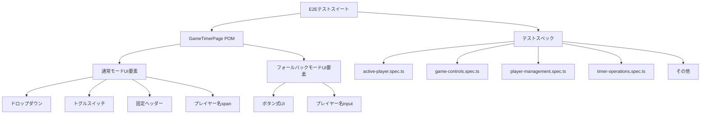
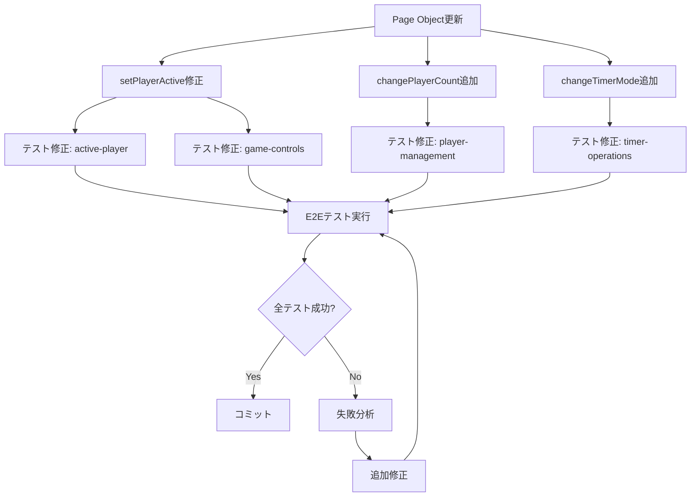
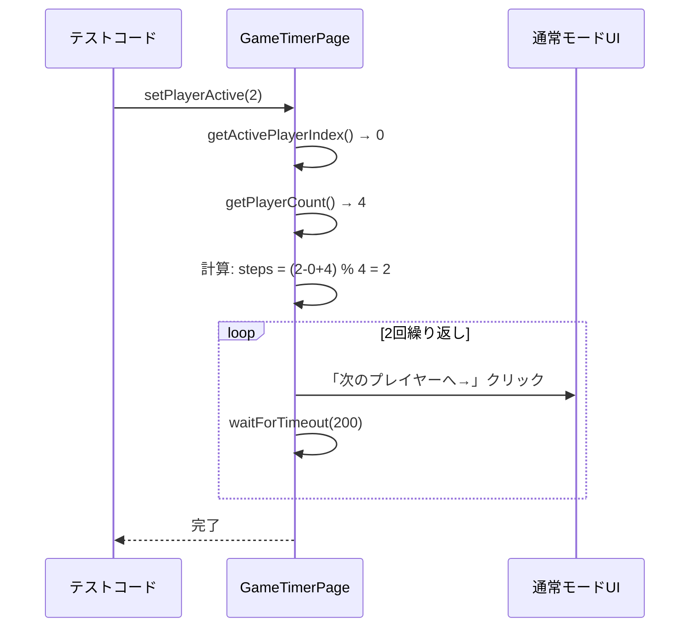
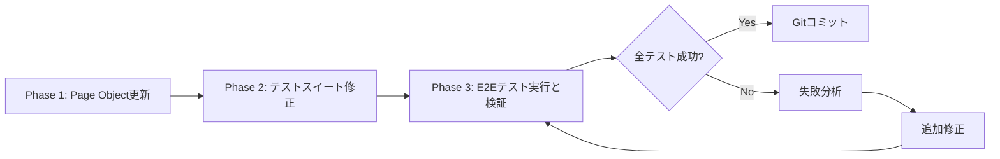

# Technical Design Document

## Overview

この仕様は、2025年10月8日に完了した`ui-controls-enhancement`仕様によるUI刷新後に失敗している57件のE2Eテストを修正します。テストは旧UI（フォールバックモード）を前提に作成されており、新UI（通常モード）には対応していません。

**Purpose**: E2Eテストスイートを通常モードの新UIに対応させ、UI刷新後の機能品質を自動検証可能にします。

**Users**: テスト開発者、QAエンジニア、プロジェクトチームがE2Eテストの実行と結果検証を行います。

**Impact**:
- 現在の57件の失敗テストを修正し、50件を成功、7件をスキップ（プレイヤー名編集テスト）に変更
- Page Object Modelを新UI要素（ドロップダウン、トグルスイッチ、固定ヘッダー）に対応
- テスト実行時間とメンテナンス性を維持しながら、網羅的な自動テストを確保

### Goals

- **E2Eテストの成功率向上**: 57件の失敗テストを修正し、68件の成功テスト（50修正 + 18既存成功）を達成
- **Page Object Modelの更新**: 新UI要素（ドロップダウン、トグルスイッチ、固定ヘッダー）に対応した再利用可能なPage Objectメソッドを提供
- **テスト保守性の維持**: 通常モードとフォールバックモードの違いを明示的に分離し、将来的なUI変更に柔軟に対応

### Non-Goals

- プレイヤー名編集機能のバグ修正（別の仕様で対応）
- 新しいE2Eテストの追加（既存テストの修正のみ）
- フォールバックモード専用テストの実装（プレイヤー名編集テストのスキップ対応のみ）
- E2Eテストフレームワークの変更（Playwright継続使用）

---

## Architecture

### Existing Architecture Analysis

**現在のE2Eテストアーキテクチャ**:
- **Page Object Model（POM）パターン**: `e2e/pages/GameTimerPage.ts`に全てのUI要素とロケーターを集約
- **テストスイート**: `e2e/specs/`ディレクトリに機能別テストファイル（active-player.spec.ts、game-controls.spec.ts等）
- **Phase 1/2統合**: 同じテストファイルでフォールバックモード（Phase 1）と通常モード（Phase 2）の両方に対応
- **data-testid**: 安定した要素選択のため`data-testid`属性を使用

**主要な課題**:
1. **Page Objectメソッドの陳腐化**: `setPlayerActive()`、`setTimerModeCountDown()`等が旧UI（ボタン式）を前提としている
2. **テストコードの旧UI依存**: テストが`setPlayerActive()`を使用してプレイヤーを切り替えているが、通常モードでは「次のプレイヤーへ→」ボタンしか存在しない
3. **プレイヤー名編集の実装差異**: フォールバックモードでは`<input>`、通常モードでは`<span>`（読み取り専用）

### High-Level Architecture

この修正は既存のE2EテストアーキテクチャとPage Object Modelパターンを維持し、以下の変更を加えます：



**Architecture Integration**:
- **既存パターン保持**: Page Object Modelパターンを継続使用し、UIロジックとテストロジックの分離を維持
- **新コンポーネント追加**: 新UI要素対応メソッド（`changePlayerCount()`、`changeTimerMode()`）をPage Objectに追加
- **Technology Alignment**: Playwright継続使用、既存のdata-testid戦略を維持
- **Steering Compliance**: 構造化されたテストコード、明確な責任分離、保守性重視の原則を維持

---

## Technology Alignment

この修正は既存のE2Eテスト技術スタックに完全に整合します：

### Existing Stack Preserved

- **Test Framework**: Playwright（変更なし）
- **Page Object Pattern**: GameTimerPage.ts（更新）
- **Locator Strategy**: data-testid属性（継続使用）
- **Test Organization**: specs/ディレクトリ構造（維持）

### New Dependencies

なし。既存のPlaywright依存関係のみを使用します。

---

## Key Design Decisions

### Decision 1: Page ObjectメソッドのAdapterパターン実装

**Decision**: `setPlayerActive()`等の既存メソッドを、通常モードでは`switchToNextPlayer()`を複数回呼び出すAdapterパターンとして実装

**Context**:
- 既存テストコードは`setPlayerActive(index)`で特定プレイヤーをアクティブ化しているが、通常モードでは「次のプレイヤーへ→」ボタンしか存在しない
- テストコード全体を書き換えずに、Page Objectメソッド内で差異を吸収する必要がある

**Alternatives**:
1. **全テストコードを書き換え**: `setPlayerActive()`を`switchToNextPlayer()`に置き換える
2. **フォールバックモード専用テストに分離**: 通常モード用テストを新規作成
3. **Adapterパターン**: `setPlayerActive()`内部で`switchToNextPlayer()`を複数回呼び出す

**Selected Approach**: Adapterパターン（代替案3）

`setPlayerActive(index)`を以下のように実装：
```typescript
async setPlayerActive(index: number): Promise<void> {
  // 現在のアクティブプレイヤーのインデックスを取得
  const currentIndex = await this.getActivePlayerIndex();

  // 目標プレイヤーまで順次切り替え
  const totalPlayers = await this.getPlayerCount();
  let steps = (index - currentIndex + totalPlayers) % totalPlayers;

  for (let i = 0; i < steps; i++) {
    await this.switchToNextPlayer();
    await this.page.waitForTimeout(200); // UI更新を待機
  }
}
```

**Rationale**:
- **テストコード変更最小化**: 既存テスト57件のうち、`setPlayerActive()`使用箇所を変更不要
- **可読性維持**: テストの意図（「プレイヤーXをアクティブに設定」）が明確
- **保守性**: UI変更時にPage Objectメソッドのみ修正すれば良い

**Trade-offs**:
- **利点**: テストコードの変更が最小、既存テストの意図が明確、保守性が高い
- **欠点**: 実際のユーザー操作（順次切り替え）と異なる動作をエミュレート、若干のパフォーマンスオーバーヘッド（複数回クリック）

---

### Decision 2: プレイヤー名編集テストのスキップ戦略

**Decision**: プレイヤー名編集テスト（7件）をフォールバックモード専用としてスキップし、通常モード対応は別仕様で実装

**Context**:
- 通常モードではプレイヤー名が`<span>`（読み取り専用）として実装されている
- フォールバックモードでは`<input>`（編集可能）として実装されている
- プレイヤー名編集機能のバグ修正は別の仕様で対応する方針

**Alternatives**:
1. **テストをスキップ**: `.skip()`を使用してテストを無効化
2. **テストを削除**: プレイヤー名編集テストを完全に削除
3. **通常モード対応を含める**: この仕様でバグ修正と通常モード対応を実装

**Selected Approach**: テストをスキップ（代替案1）

プレイヤー名編集テストに以下のスキップロジックを追加：
```typescript
test('プレイヤー名を編集できる', async () => {
  // TODO: 通常モードでプレイヤー名編集機能が実装されるまでスキップ
  test.skip();

  // ... テストコード
});
```

**Rationale**:
- **スコープ明確化**: この仕様はE2Eテスト修正のみを対象とし、機能実装は別仕様で対応
- **テストコード保持**: 将来的にバグ修正後にテストを有効化できる
- **失敗テスト削減**: 7件のプレイヤー名編集テストをスキップし、失敗テストを57件から50件に削減

**Trade-offs**:
- **利点**: スコープが明確、将来的なテスト有効化が容易、テストコードの意図が保持される
- **欠点**: プレイヤー名編集機能のバグが自動テストでカバーされない（ただし、別仕様で対応予定）

---

### Decision 3: タイミング戦略の見直し（wait/polling）

**Decision**: ボタンクリック後に状態が更新されるまで適切な待機戦略（`waitForTimeout` + ポーリング）を使用

**Context**:
- ターン時間トラッキングテスト（10件）でボタン押下タイミングと状態同期の問題が発生
- 通常モードではポーリング同期（5秒間隔）が実装されており、ボタンクリック直後に状態が反映されない場合がある

**Alternatives**:
1. **固定待機時間**: `waitForTimeout(5000)`で固定的に待機
2. **ポーリング戦略**: `waitFor()`を使用して状態が更新されるまで待機
3. **リトライロジック**: テスト失敗時に自動リトライ

**Selected Approach**: ポーリング戦略（代替案2）

状態検証前に以下のポーリングロジックを使用：
```typescript
// ターン切り替え後の時間検証
await gameTimerPage.switchToNextPlayer();

// 状態が更新されるまでポーリング（最大10秒）
await expect.poll(
  async () => await gameTimerPage.isPlayerActive(1),
  { timeout: 10000 }
).toBe(true);
```

**Rationale**:
- **安定性向上**: 状態が確実に更新されるまで待機するため、タイミング依存の不安定性を解消
- **パフォーマンス最適化**: 状態が早期に更新された場合は即座に次のステップへ進む
- **可読性**: テストの意図（「状態が更新されるまで待機」）が明確

**Trade-offs**:
- **利点**: テストの安定性が向上、タイミング依存のフレーキーテストを削減、パフォーマンスが最適化
- **欠点**: テストコードが若干複雑化、ポーリングロジックの理解が必要

---

## System Flows

### E2Eテスト修正フロー



### Page Object Adapterパターンフロー



---

## Requirements Traceability

| Requirement | 要件概要 | 対応コンポーネント | 主要メソッド | 関連フロー |
|-------------|---------|-------------------|-------------|-----------|
| 1.1-1.4 | Page Object更新（通常モード対応） | GameTimerPage.ts | setPlayerActive(), changePlayerCount(), changeTimerMode(), switchToNextPlayer() | Page Object Adapterパターンフロー |
| 2.1-2.5 | アクティブプレイヤー操作テスト修正 | active-player.spec.ts | setPlayerActive() → Adapter実装使用 | E2Eテスト修正フロー |
| 3.1-3.4 | ゲームコントロールテスト修正 | game-controls.spec.ts | switchToNextPlayer()使用 | - |
| 4.1-4.5 | プレイヤー数管理テスト修正 | player-management.spec.ts | changePlayerCount()使用 | - |
| 5.1-5.4 | タイマーモード変更テスト修正 | timer-operations.spec.ts | changeTimerMode()使用 | - |
| 6.1-6.3 | プレイヤー名編集テストスキップ | player-management.spec.ts | test.skip()追加 | - |
| 7.1-7.4 | ターン時間トラッキングテスト修正 | turn-time-tracking.spec.ts | expect.poll()でポーリング待機 | - |
| 8.1-8.5 | UIコントロール強化テスト修正 | ui-controls-enhancement.spec.ts | 更新されたPage Objectメソッド使用 | - |
| 9.1-9.3 | レスポンシブUIテスト修正 | responsive-ui.spec.ts | 新UI構造対応 | - |
| 10.1-10.7 | E2Eテスト実行と結果検証 | 全テストスイート | npx playwright test | E2Eテスト修正フロー |

---

## Components and Interfaces

### Test Infrastructure / Page Object Model

#### GameTimerPage (Updated)

**Responsibility & Boundaries**
- **Primary Responsibility**: E2Eテストで使用するGameTimerコンポーネントのUI要素とインタラクションメソッドを提供
- **Domain Boundary**: E2Eテスト層（フロントエンドUIとテストコードの仲介）
- **Data Ownership**: UIロケーター、要素選択ロジック、UI操作メソッド
- **Transaction Boundary**: なし（UIインタラクションのみ）

**Dependencies**
- **Inbound**: 全E2Eテストスイート（active-player.spec.ts、game-controls.spec.ts等）
- **Outbound**: Playwrightブラウザオートメーション、GameTimerコンポーネント（フロントエンド）
- **External**: Playwright Test Framework

**Contract Definition**

**Service Interface**:

```typescript
/**
 * GameTimerページのPage Object Model
 * 通常モード（API接続成功）とフォールバックモード（API接続失敗）の両方に対応
 */
class GameTimerPage {
  // ===== 主要UI要素ロケーター =====

  /** 固定ヘッダー（通常モード） */
  stickyHeader: Locator;

  /** 固定ヘッダー内の現在のプレイヤー情報 */
  stickyHeaderInfo: Locator;

  /** プレイヤー数ドロップダウン（通常モード） */
  playerCountDropdown: Locator;

  /** タイマーモードトグルスイッチ（通常モード） */
  timerModeToggle: Locator;

  /** 次のプレイヤーへボタン（固定ヘッダー内） */
  nextPlayerButton: Locator;

  // ===== 新規追加メソッド =====

  /**
   * プレイヤー数をドロップダウンで変更（通常モード）
   * @param count 変更後のプレイヤー数（4, 5, 6）
   *
   * Preconditions: ページがロード済み、ドロップダウンが有効
   * Postconditions: プレイヤー数が指定された数に変更される
   */
  async changePlayerCount(count: 4 | 5 | 6): Promise<void>;

  /**
   * タイマーモードをトグルスイッチで変更（通常モード）
   * @param mode 変更後のタイマーモード（'カウントアップ' | 'カウントダウン'）
   *
   * Preconditions: ページがロード済み、トグルスイッチが有効
   * Postconditions: タイマーモードが指定されたモードに変更される
   */
  async changeTimerMode(mode: 'カウントアップ' | 'カウントダウン'): Promise<void>;

  // ===== 更新されたメソッド =====

  /**
   * 特定プレイヤーをアクティブに設定（Adapterパターン）
   *
   * 通常モード: 「次のプレイヤーへ→」ボタンを複数回クリックして目標プレイヤーまで順次切り替え
   * フォールバックモード: プレイヤーカード内の「アクティブに設定」ボタンをクリック
   *
   * @param index アクティブに設定するプレイヤーのインデックス（0-based）
   *
   * Preconditions: ページがロード済み、プレイヤーが存在
   * Postconditions: 指定されたプレイヤーがアクティブ状態になる
   * Invariants: 常に1人のプレイヤーのみがアクティブ
   */
  async setPlayerActive(index: number): Promise<void>;

  /**
   * タイマーモードをカウントアップに設定（トグルスイッチ対応）
   *
   * Preconditions: ページがロード済み
   * Postconditions: タイマーモードがカウントアップになる
   */
  async setTimerModeCountUp(): Promise<void>;

  /**
   * タイマーモードをカウントダウンに設定（トグルスイッチ対応）
   * @param seconds カウントダウン秒数（省略時はデフォルト600秒）
   *
   * Preconditions: ページがロード済み
   * Postconditions: タイマーモードがカウントダウンになり、指定秒数で初期化される
   */
  async setTimerModeCountDown(seconds?: number): Promise<void>;

  // ===== 既存メソッド（変更なし） =====

  /**
   * 次のプレイヤーへ切り替え（固定ヘッダーボタン）
   *
   * Preconditions: ページがロード済み
   * Postconditions: 次のプレイヤーがアクティブになる
   */
  async switchToNextPlayer(): Promise<void>;

  /**
   * アクティブプレイヤーのインデックスを取得
   * @returns アクティブプレイヤーのインデックス（0-based）
   *
   * Preconditions: ページがロード済み、少なくとも1人のプレイヤーが存在
   */
  async getActivePlayerIndex(): Promise<number>;

  /**
   * プレイヤー数を取得
   * @returns 現在のプレイヤー数
   *
   * Preconditions: ページがロード済み
   */
  async getPlayerCount(): Promise<number>;

  /**
   * プレイヤーがアクティブかどうか判定
   * @param index プレイヤーのインデックス
   * @returns アクティブの場合true
   *
   * Preconditions: ページがロード済み、プレイヤーが存在
   */
  async isPlayerActive(index: number): Promise<boolean>;

  /**
   * 一時停止・再開ボタンをクリック
   *
   * Preconditions: ページがロード済み
   * Postconditions: ゲームの一時停止状態が切り替わる
   */
  async togglePause(): Promise<void>;

  /**
   * リセットボタンをクリック
   *
   * Preconditions: ページがロード済み
   * Postconditions: ゲーム状態が初期化される
   */
  async resetGame(): Promise<void>;
}
```

**State Management**: なし（ステートレスなPage Object）

**Integration Strategy**:
- **Modification Approach**: 既存GameTimerPage.tsクラスを拡張（新メソッド追加、既存メソッド更新）
- **Backward Compatibility**: 既存のメソッドシグネチャは維持し、内部実装のみ変更
- **Migration Path**: 段階的な修正（Page Object更新 → テスト修正 → 検証）

---

### Test Suites / Test Specification Files

#### active-player.spec.ts (Updated)

**Responsibility & Boundaries**
- **Primary Responsibility**: アクティブプレイヤー操作機能の自動テスト（7件のテストケース）
- **Domain Boundary**: E2Eテスト層（アクティブプレイヤー切り替え機能のテスト）
- **Data Ownership**: テストシナリオ、期待値、アサーション

**Dependencies**
- **Inbound**: なし（テストランナーから実行）
- **Outbound**: GameTimerPage POM
- **External**: Playwright Test Framework

**Contract Definition**

**Test Contract**:
- **Test Count**: 7件
- **Test Scenarios**:
  1. プレイヤーをアクティブに設定できる
  2. 次のプレイヤーへ順番に切り替えられる
  3. 最後のプレイヤーから最初のプレイヤーへ循環する
  4. +10秒ボタンで経過時間が10秒増加する（スキップ: フォールバックモード専用）
  5. アクティブプレイヤーの時間が計測される
  6. 非アクティブプレイヤーの時間は停止する
  7. タイムアウトプレイヤーは自動的に次のプレイヤーに切り替わる

**Modification Approach**:
- `setPlayerActive()`呼び出しは維持（Page Object内でAdapterパターンで吸収）
- `+10秒ボタン`関連テスト1件をスキップ（フォールバックモード専用）

---

#### player-management.spec.ts (Updated)

**Responsibility & Boundaries**
- **Primary Responsibility**: プレイヤー数管理とプレイヤー名編集機能の自動テスト（8件のテストケース）
- **Domain Boundary**: E2Eテスト層（プレイヤー数変更とプレイヤー名編集のテスト）

**Dependencies**
- **Inbound**: なし（テストランナーから実行）
- **Outbound**: GameTimerPage POM

**Contract Definition**

**Test Contract**:
- **Test Count**: 8件（1件成功継続、7件スキップ追加）
- **Test Scenarios**:
  1. プレイヤー数を4人から5人に変更できる（ドロップダウン対応）
  2. プレイヤー数を5人から6人に変更できる（ドロップダウン対応）
  3-8. プレイヤー名編集テスト（7件）→ **全てスキップ**

**Modification Approach**:
- `setPlayerCount()`を`changePlayerCount()`に置き換え（ドロップダウン操作）
- プレイヤー名編集テスト7件に`test.skip()`追加

---

#### timer-operations.spec.ts (Updated)

**Responsibility & Boundaries**
- **Primary Responsibility**: タイマーモード変更機能の自動テスト（6件のテストケース）
- **Domain Boundary**: E2Eテスト層（タイマーモード切り替えのテスト）

**Dependencies**
- **Inbound**: なし（テストランナーから実行）
- **Outbound**: GameTimerPage POM

**Contract Definition**

**Test Contract**:
- **Test Count**: 6件
- **Test Scenarios**:
  1. カウントアップからカウントダウンに変更できる（トグルスイッチ対応）
  2. カウントダウンからカウントアップに変更できる（トグルスイッチ対応）
  3-6. タイマーモード変更時の時間リセット、カウントダウン秒数設定等

**Modification Approach**:
- `setTimerModeCountDown()`、`setTimerModeCountUp()`を`changeTimerMode()`に置き換え（トグルスイッチ操作）

---

#### turn-time-tracking.spec.ts (Updated)

**Responsibility & Boundaries**
- **Primary Responsibility**: ターン時間トラッキング機能の自動テスト（10件のテストケース）
- **Domain Boundary**: E2Eテスト層（ターン時間表示と計測のテスト）

**Dependencies**
- **Inbound**: なし（テストランナーから実行）
- **Outbound**: GameTimerPage POM

**Contract Definition**

**Test Contract**:
- **Test Count**: 10件
- **Test Scenarios**: ターン切り替え時の時間計測、リセット時の時間初期化等

**Modification Approach**:
- 状態検証前に`expect.poll()`を使用してポーリング待機を追加
- `waitForTimeout()`の適切な配置でボタンクリック後のUI更新を待機

---

## Data Models

この仕様ではデータモデルの変更はありません。既存のE2EテストとPage Objectのインターフェースのみを更新します。

---

## Error Handling

### Error Strategy

E2Eテスト修正におけるエラーハンドリング戦略：

1. **テスト失敗時のエラーメッセージ改善**: Playwrightのデフォルトエラーメッセージに加えて、カスタムエラーメッセージで期待値と実際の値を明示
2. **リトライメカニズム**: Playwrightのデフォルトリトライ機能（3回）を使用
3. **タイムアウト設定**: テストタイムアウトを30秒に設定（デフォルト）、ポーリング待機は10秒

### Error Categories and Responses

**User Errors (テスト作成者のミス)**:
- **Invalid input**: 存在しないプレイヤーインデックスを指定 → `getPlayerCardByIndex()`で範囲チェック、エラーメッセージ出力
- **Incorrect assertions**: 期待値が誤っている → Playwrightのアサーションエラーで詳細表示

**System Errors (環境問題)**:
- **Element not found**: UI要素が見つからない → Playwrightのタイムアウトエラー、スクリーンショット自動保存
- **Timeout**: 操作がタイムアウト → エラーログとスクリーンショットで原因特定を支援

**Business Logic Errors (UI実装の不整合)**:
- **State inconsistency**: UI状態とゲーム状態の不一致 → `expect.poll()`でポーリング待機、それでも失敗時はエラーレポート

### Monitoring

- **Test Results Report**: Playwright HTML Reportで全テスト結果を可視化（成功数、失敗数、スキップ数）
- **Screenshot on Failure**: テスト失敗時に自動スクリーンショット保存（`test-results/`ディレクトリ）
- **Video Recording**: 必要に応じてテスト実行のビデオ録画（Playwright設定で有効化可能）

---

## Testing Strategy

### Unit Tests

E2Eテスト修正自体のユニットテストは不要。修正されたE2Eテストがユニットテストの役割を果たします。

### Integration Tests

以下のE2Eテストスイートが統合テストとして機能します：

1. **active-player.spec.ts**: アクティブプレイヤー操作機能（7件、うち1件スキップ）
2. **game-controls.spec.ts**: ゲームコントロール機能（6件）
3. **player-management.spec.ts**: プレイヤー数管理（1件成功継続、7件スキップ追加）
4. **timer-operations.spec.ts**: タイマーモード変更（6件）
5. **turn-time-tracking.spec.ts**: ターン時間トラッキング（10件）
6. **ui-controls-enhancement.spec.ts**: UIコントロール強化（11件）
7. **responsive-ui.spec.ts**: レスポンシブUI（2件）

### E2E Tests

**Critical User Paths**:
1. **プレイヤー切り替えフロー**: ページロード → プレイヤーアクティブ化 → 次のプレイヤーへ切り替え → 時間計測確認
2. **ゲームコントロールフロー**: ページロード → 一時停止 → 時間停止確認 → 再開 → 時間再開確認 → リセット → 初期化確認
3. **プレイヤー数変更フロー**: ページロード → ドロップダウンでプレイヤー数変更 → プレイヤーカード数確認
4. **タイマーモード変更フロー**: ページロード → トグルスイッチでタイマーモード変更 → モード切り替え確認
5. **レスポンシブUIフロー**: ビューポートサイズ変更 → 固定ヘッダー表示確認 → 主要操作セクション表示確認

**Expected Results**:
- **成功テスト**: 68件（50修正成功 + 18既存成功）
- **スキップテスト**: 18件（11 Phase 2専用 + 7プレイヤー名編集）
- **失敗テスト**: 0件

### Performance Tests

E2Eテスト実行時間の目標：
- **全テストスイート**: 5分以内
- **個別テストファイル**: 1分以内
- **個別テストケース**: 10秒以内（平均）

パフォーマンス最適化策：
- 並列実行: Playwrightのデフォルト並列実行（ワーカー数: CPU数）を使用
- 待機時間最適化: `expect.poll()`でポーリング待機を使用し、不要な固定待機時間を削減

---

## Migration Strategy

### Phase 1: Page Object更新（Requirement 1）

**タスク**:
1. `GameTimerPage.ts`に新メソッドを追加
   - `changePlayerCount(count: 4 | 5 | 6)`
   - `changeTimerMode(mode: 'カウントアップ' | 'カウントダウン')`

2. 既存メソッドをAdapterパターンに更新
   - `setPlayerActive(index)`: `switchToNextPlayer()`を複数回呼び出し
   - `setTimerModeCountUp()`: トグルスイッチ操作に対応
   - `setTimerModeCountDown(seconds?)`: トグルスイッチ操作に対応

**検証**:
- Page Objectメソッドのユニットテスト（不要、E2Eテストで検証）
- TypeScript型チェック（`npx tsc --noEmit`）

---

### Phase 2: テストスイート修正（Requirements 2-9）

**タスク**:
1. **active-player.spec.ts**: `setPlayerActive()`使用箇所は変更不要（Page Objectで吸収）、`+10秒ボタン`テスト1件をスキップ
2. **game-controls.spec.ts**: `setPlayerActive()`使用箇所は変更不要
3. **player-management.spec.ts**:
   - `setPlayerCount()`を`changePlayerCount()`に置き換え
   - プレイヤー名編集テスト7件に`test.skip()`追加
4. **timer-operations.spec.ts**: `setTimerModeCountDown()`等を`changeTimerMode()`に置き換え
5. **turn-time-tracking.spec.ts**: `expect.poll()`でポーリング待機を追加
6. **ui-controls-enhancement.spec.ts**: 更新されたPage Objectメソッドを使用
7. **responsive-ui.spec.ts**: 新UI構造に対応した要素検証

**検証**:
- 各テストファイル修正後に個別実行（`npx playwright test [test-file]`）
- 全テストスイート実行（`npx playwright test`）

---

### Phase 3: E2Eテスト実行と結果検証（Requirement 10）

**タスク**:
1. 全E2Eテストスイートを実行（`npx playwright test`）
2. テスト結果レポートを確認
   - 成功テスト: 68件（50修正成功 + 18既存成功）
   - スキップテスト: 18件（11 Phase 2専用 + 7プレイヤー名編集）
   - 失敗テスト: 0件
3. 失敗テストがある場合は原因を分析し、追加修正を実施
4. Gitコミット作成（テスト成功数とスキップ数を含む）

**検証**:
- Playwright HTML Reportで全テスト結果を可視化
- スクリーンショットとビデオで失敗テストの原因を特定（必要に応じて）

---

### Migration Phases Diagram



**Rollback Triggers**:
- Phase 1で型エラーが発生 → Page Object更新をロールバック
- Phase 2でテスト失敗率が50%以上 → テストスイート修正をロールバック、Phase 1を再検証
- Phase 3で失敗テストが10件以上 → 全修正をロールバック、根本原因を再調査

**Validation Checkpoints**:
- Phase 1完了時: TypeScript型チェック成功
- Phase 2完了時: 各テストファイル個別実行で失敗テスト5件以下
- Phase 3完了時: 全テストスイート実行で失敗テスト0件
