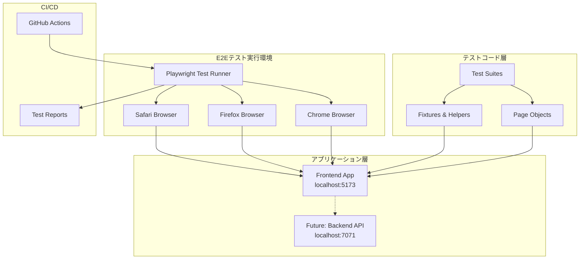
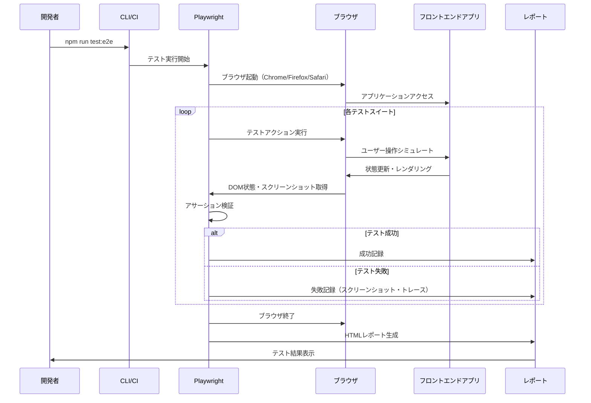
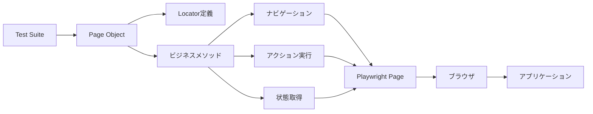

# 技術設計書: E2Eテスト環境構築

## 概要

本設計は、マルチプレイヤー・ゲームタイマーアプリケーションに対するE2Eテスト環境を構築します。Playwrightを使用したブラウザ自動化テストにより、現在のフロントエンド実装（Phase 1: インメモリー版）の完全な動作検証を自動化し、CI/CDパイプラインに統合します。将来的なバックエンド統合（Azure Functions + Cosmos DB + SignalR）を考慮した拡張可能なテストアーキテクチャを採用します。

**目的**: ユーザー視点での完全な動作検証により、本番環境での不具合を最小化し、新機能追加時のリグレッションを防止します。

**対象ユーザー**: テストエンジニア、QAエンジニア、開発者がE2Eテストを作成・実行・保守します。

**影響範囲**: 新規E2Eテストインフラストラクチャの追加であり、既存のユニットテスト（Vitest）や実装コードへの影響はありません。

### 目標

- Playwrightベースのマルチブラウザ（Chrome、Firefox、Safari）E2Eテスト環境の構築
- Page Object Modelパターンを使用した保守性の高いテストコード実装
- CI/CDパイプライン（GitHub Actions）への統合による自動品質ゲート確立
- 主要ユーザーフロー（プレイヤー管理、タイマー操作、ゲーム制御、レスポンシブUI）の100%カバレッジ達成
- 将来のバックエンド統合時にスムーズに移行できるテストアーキテクチャの確立

### 非目標

- ユニットテストやコンポーネントテストの置き換え（既存Vitestテストは継続使用）
- パフォーマンステストやロードテスト（E2Eテストの範囲外）
- アクセシビリティ専用テスト（基本的なアクセシビリティは検証するが、専門ツールは使用しない）
- ビジュアルリグレッションテスト（Phase 2で検討）
- 実際のバックエンドAPI・SignalR統合の実装（テストアーキテクチャのみ準備）

## アーキテクチャ

### 全体アーキテクチャ



### テストディレクトリ構造

```
tickTackFour/
├── e2e/                                    # E2Eテストルート（プロジェクトルート直下）
│   ├── specs/                              # Phase 1/2共通テストスイート
│   │   ├── player-management.spec.ts       # プレイヤー管理テスト
│   │   ├── timer-operations.spec.ts        # タイマー動作テスト
│   │   ├── active-player.spec.ts           # アクティブプレイヤー管理テスト
│   │   ├── game-controls.spec.ts           # ゲーム制御テスト
│   │   ├── responsive-ui.spec.ts           # レスポンシブUIテスト
│   │   ├── persistence.spec.ts             # 永続化検証（Phase 2のみ実行）
│   │   └── realtime-sync.spec.ts           # リアルタイム同期検証（Phase 2のみ実行）
│   ├── pages/                              # Page Object Model
│   │   ├── GameTimerPage.ts                # ゲームタイマーページオブジェクト
│   │   └── components/                     # コンポーネント別ページオブジェクト
│   │       ├── PlayerCard.ts               # プレイヤーカードコンポーネント
│   │       ├── GameControls.ts             # ゲーム制御コンポーネント
│   │       └── GameStatus.ts               # ゲーム状態コンポーネント
│   ├── fixtures/                           # テストフィクスチャ
│   │   ├── gameState.ts                    # ゲーム状態フィクスチャ
│   │   ├── playerData.ts                   # プレイヤーデータフィクスチャ
│   │   └── multi-context.ts                # 複数ブラウザコンテキスト用fixture
│   ├── helpers/                            # ヘルパー関数
│   │   ├── assertions.ts                   # カスタムアサーション
│   │   ├── navigation.ts                   # ナビゲーションヘルパー
│   │   └── waiting.ts                      # 待機ヘルパー
│   ├── tsconfig.json                       # E2Eテスト用TypeScript設定
│   └── playwright.config.ts                # Playwright設定ファイル
├── playwright-report/                      # テストレポート（gitignore）
├── test-results/                           # テスト結果（gitignore）
├── frontend/
└── .github/
    └── workflows/
        └── azure-static-web-apps-*.yml     # CI/CDにE2Eテスト追加
```

### アーキテクチャパターン

**Page Object Modelパターン**: テストロジックとUI要素セレクターを分離し、保守性を向上させます。各ページオブジェクトは単一のページまたはコンポーネントを表現し、再利用可能なメソッドを提供します。

**Fixture Pattern**: テストデータとセットアップロジックを集約し、テストケース間で再利用可能にします。

**Helper Pattern**: 共通操作（待機、アサーション、ナビゲーション）を抽象化し、テストコードの可読性を向上させます。

**Unified Test Architecture**: Phase 1/2で同じテストファイルを使用する統合アーキテクチャ。フロントエンド操作を起点に全機能（DB、SignalR含む）を検証します。Phase 2専用の永続化・リアルタイム同期テストは`test.skip()`で制御します。

## 技術スタックと設計決定

### 技術スタック

**テストフレームワーク**:
- **選定**: Playwright v1.48以上
- **根拠**:
  - TypeScript完全サポート、自動待機機能による安定したテスト実行
  - マルチブラウザ対応（Chrome、Firefox、Safari）のクロスブラウザテスト
  - 強力なデバッグツール（Trace Viewer、UI Mode）による開発効率向上
  - 並列実行とシャーディング対応による高速テスト実行
- **代替案**:
  - Cypress: シングルブラウザ制限（有料版でマルチブラウザ）、iframeサポート制限
  - Selenium: 低レベルAPI、手動待機処理が必要、デバッグツール不足

**言語**:
- **選定**: TypeScript 5.9（既存プロジェクトと同一）
- **根拠**: 既存プロジェクトとの一貫性、型安全性によるエラー早期発見、IDE補完による開発効率向上
- **設定**: Strict mode有効、E2Eテスト専用tsconfig.json使用

**レポーティング**:
- **選定**: Playwright HTML Reporter（標準）、JUnit XML Reporter（CI連携）
- **根拠**: Playwrightネイティブサポート、追加設定不要、GitHub Actions連携対応

**CI/CD統合**:
- **選定**: GitHub Actions（既存CI/CDと同一）
- **根拠**: 既存ワークフロー活用、無料枠での実行可能、Playwright公式アクション利用

### 主要設計決定

#### 決定1: Page Object Modelパターンの採用

**決定**: 全E2EテストでPage Object Model（POM）パターンを採用し、UI要素セレクターとテストロジックを完全に分離する。

**コンテキスト**: E2Eテストは UI変更の影響を受けやすく、セレクターの変更が多数のテストに波及する問題がある。保守コストを最小化し、テストコードの可読性を向上させる必要がある。

**代替案**:
1. **直接セレクター使用**: テストファイル内で直接 `page.locator()` を使用
2. **ヘルパー関数パターン**: セレクターをヘルパー関数に集約
3. **Page Object Modelパターン**: 完全なPOMクラス実装

**選択したアプローチ**: Page Object Modelパターン

各ページ/コンポーネントに対応するクラスを作成し、以下の構造を持つ:
```typescript
export class GameTimerPage {
  readonly page: Page;
  readonly playerCards: Locator;
  readonly nextPlayerButton: Locator;

  constructor(page: Page) {
    this.page = page;
    this.playerCards = page.locator('[data-testid="player-card"]');
    this.nextPlayerButton = page.locator('text=次のプレイヤーへ');
  }

  async setPlayerCount(count: 4 | 5 | 6): Promise<void> {
    await this.page.locator(`text=${count}人`).click();
  }

  async getPlayerCount(): Promise<number> {
    return await this.playerCards.count();
  }
}
```

**根拠**:
- **保守性**: UI変更時の修正箇所が1つのページオブジェクトに限定される
- **再利用性**: 複数のテストで同じページオブジェクトメソッドを再利用可能
- **可読性**: テストコードがビジネスロジックに集中でき、セレクター詳細が隠蔽される
- **型安全性**: TypeScriptの型チェックによりメソッド呼び出しエラーをコンパイル時に検出

**トレードオフ**:
- 獲得: 長期的な保守コスト削減、テストコード品質向上、チーム間の一貫性確保
- 犠牲: 初期実装コストの増加（ページオブジェクトクラス作成）、小規模テストでのオーバーヘッド

#### 決定2: Phase 1/2統合テストアーキテクチャ

**決定**: Phase 1（インメモリ）とPhase 2（バックエンド統合）で同じテストファイルを使用する統合アーキテクチャを採用する。フロントエンド操作を起点に全機能（DB永続化、SignalRリアルタイム同期含む）を検証する。

**コンテキスト**: 現在はフロントエンドのみの実装だが、将来的にAzure Functions + Cosmos DB + SignalRのバックエンド統合が予定されている。**重要な洞察**: バックエンド実装後はインメモリ機能がなくなるため、ユーザー操作は変わらない。したがって、同じテストファイルで両フェーズに対応可能である。

**代替案**:
1. **ディレクトリ分離**: `frontend-only/`と`full-stack/`で別々のテストファイル
2. **環境検出 + 適応的検証**: テスト内でバックエンドの有無を検出し、検証方法を切り替え
3. **統合テストスイート**: 同じテストファイルでPhase 1/2に対応、Playwrightの標準機能で検証

**選択したアプローチ**: 統合テストスイート（選択肢3）

```typescript
// specs/player-management.spec.ts
test('プレイヤー名を変更できる', async ({ page }) => {
  await page.goto('http://localhost:5173');

  // フロントエンド操作（Phase 1/2共通）
  await page.locator('[data-testid="player-1-name-input"]').fill('Alice');

  // Phase 1: DOM検証のみ
  // Phase 2: DOM検証 + 自動的にネットワークリクエスト（API、SignalR）が検証される
  await expect(page.locator('[data-testid="player-1-name"]')).toHaveText('Alice');

  // Phase 2: リロード後の永続化を検証
  await page.reload();
  await expect(page.locator('[data-testid="player-1-name"]')).toHaveText('Alice');
});
```

Phase 2専用テスト（persistence.spec.ts、realtime-sync.spec.ts）は`test.skip()`で制御:
```typescript
// specs/persistence.spec.ts
test('ゲーム状態がリロード後も復元される', async ({ page }) => {
  // Phase 1では実行されない
  test.skip(process.env.PHASE !== '2', 'Phase 2のみ実行');

  // Phase 2でのみ実行されるテストロジック
});
```

**根拠**:
- **ユーザー操作の不変性**: バックエンド統合後もUI操作は変わらない
- **Playwrightの検証機能**: ネットワークリクエスト、リロード、複数ブラウザコンテキストで全機能を検証可能
- **保守性**: 同じテストファイルで両フェーズに対応するため、重複コードなし
- **シンプルさ**: 環境検出や適応的検証の複雑なメカニズム不要

**トレードオフ**:
- 獲得: テストコードの重複排除、保守コスト削減、シンプルなアーキテクチャ
- 犠牲: Phase 2専用テストの明示的なskip制御が必要

#### 決定3: data-testid属性の優先使用

**決定**: UI要素の選択には`data-testid`属性を優先的に使用し、実装詳細に依存しないセレクター戦略を採用する。

**コンテキスト**: E2Eテストの脆弱性の主要因は、CSSクラスやテキストベースのセレクターがUI変更で壊れることである。テストの安定性を最大化しつつ、開発者の負担を最小化する必要がある。

**代替案**:
1. **CSSクラスセレクター**: `.player-card`のようなクラスベース選択
2. **テキストコンテンツセレクター**: `text=次のプレイヤーへ`のようなテキストベース選択
3. **data-testid属性**: `[data-testid="next-player-button"]`のようなテスト専用属性
4. **ARIA属性**: `role=button`や`aria-label`を使用

**選択したアプローチ**: data-testid優先、フォールバックとしてARIA属性とテキストコンテンツ

優先順位:
1. `data-testid`属性（テスト専用、実装詳細から独立）
2. ARIA属性（アクセシビリティと両立、セマンティック）
3. テキストコンテンツ（ユーザー視点、i18n考慮必要）
4. CSSクラス（最後の手段、脆弱性高い）

**根拠**:
- **安定性**: `data-testid`はテスト目的専用のため、UI実装変更の影響を受けない
- **明示性**: 開発者がテスト対象要素を明確に認識できる
- **パフォーマンス**: 属性セレクターは高速で確実
- **Playwright推奨**: Playwrightベストプラクティスで推奨されている手法

**トレードオフ**:
- 獲得: テスト安定性の大幅向上、長期的な保守コスト削減、テストの意図明確化
- 犠牲: 実装コードへの`data-testid`属性追加コスト、本番HTMLサイズのわずかな増加（無視できるレベル）

## システムフロー

### テスト実行フロー



### Page Object Modelインタラクションフロー



## コンポーネントとインターフェース

### テスト実行層

#### Playwright設定（playwright.config.ts）

**主要責任**: テスト実行環境の設定、ブラウザ設定、レポーティング設定、タイムアウト管理

**依存関係**:
- **アウトバウンド**: Node.js、Playwrightランタイム、各種ブラウザエンジン

**設定インターフェース**:

```typescript
interface PlaywrightConfig {
  testDir: string;              // テストディレクトリ（環境変数で切替）
  fullyParallel: boolean;       // 並列実行有効化
  retries: number;              // 失敗時のリトライ回数
  workers: number;              // 並列実行ワーカー数
  timeout: number;              // テストタイムアウト（30秒）
  expect: {
    timeout: number;            // アサーションタイムアウト（5秒）
  };
  use: {
    baseURL: string;            // ベースURL（http://localhost:5173）
    trace: 'on-first-retry';    // トレース記録（初回リトライ時）
    screenshot: 'only-on-failure'; // スクリーンショット（失敗時のみ）
  };
  projects: BrowserProject[];   // ブラウザプロジェクト設定
  reporter: Reporter[];         // レポーター設定
}

interface BrowserProject {
  name: 'chromium' | 'firefox' | 'webkit';
  use: {
    ...devices['Desktop Chrome'] | devices['Desktop Firefox'] | devices['Desktop Safari'];
  };
}

interface Reporter {
  type: 'html' | 'junit' | 'list';
  outputFolder?: string;        // 出力先ディレクトリ
}
```

**主要設定値**:
- **testDir**: `./e2e/specs`（Phase 1/2共通テストスイート）
- **baseURL**: `http://localhost:5173`（Vite開発サーバー）
- **timeout**: 30000ms（タイマーテストで時間経過を検証するため）
- **retries**: CI環境で2回、ローカル環境で0回
- **workers**: CI環境で1、ローカル環境で並列実行
- **trace**: `on-first-retry`（トレースオーバーヘッド最小化）
- **screenshot**: `only-on-failure`（ストレージ使用量最小化）

### Page Object層

#### GameTimerPage

**主要責任**: ゲームタイマーページ全体の操作と状態取得を提供する

**ドメイン境界**: ゲームタイマーアプリケーションのメインページ全体

**データ所有権**: UI要素のLocatorとページナビゲーション状態

**依存関係**:
- **アウトバウンド**: Playwright Page API、コンポーネントページオブジェクト（PlayerCard、GameControls、GameStatus）

**契約定義**:

```typescript
export class GameTimerPage {
  readonly page: Page;

  // コンポーネントページオブジェクト
  readonly playerCard: PlayerCard;
  readonly gameControls: GameControls;
  readonly gameStatus: GameStatus;

  // ルート要素Locator
  readonly gameTimer: Locator;
  readonly gameHeader: Locator;
  readonly playersSection: Locator;
  readonly controlsSection: Locator;

  constructor(page: Page);

  /**
   * ページにナビゲートし、ロード完了を待機
   *
   * @preconditions: 開発サーバーが起動している
   * @postconditions: ページが完全にロードされ、操作可能な状態
   */
  async navigate(): Promise<void>;

  /**
   * ページが正しくロードされたことを検証
   *
   * @postconditions: ヘッダーとメインコンテンツが表示されている
   */
  async verifyPageLoaded(): Promise<void>;

  /**
   * プレイヤー数を変更
   *
   * @param count - 設定するプレイヤー数（4, 5, 6）
   * @preconditions: ページがロードされている
   * @postconditions: 指定された数のプレイヤーカードが表示される
   */
  async setPlayerCount(count: 4 | 5 | 6): Promise<void>;

  /**
   * 現在のプレイヤー数を取得
   *
   * @returns 表示されているプレイヤーカードの数
   */
  async getPlayerCount(): Promise<number>;

  /**
   * 指定インデックスのプレイヤーカードを取得
   *
   * @param index - プレイヤーインデックス（0始まり）
   * @returns PlayerCardインスタンス
   */
  getPlayerCardByIndex(index: number): PlayerCard;

  /**
   * アクティブなプレイヤーカードを取得
   *
   * @returns アクティブなPlayerCardインスタンス、存在しない場合はnull
   */
  async getActivePlayerCard(): Promise<PlayerCard | null>;
}
```

**状態管理**: ステートレス（Page APIを通じてDOM状態を取得）

#### PlayerCard（コンポーネントページオブジェクト）

**主要責任**: 個別プレイヤーカードの操作と状態取得

**ドメイン境界**: 単一プレイヤーカードコンポーネント

**依存関係**:
- **アウトバウンド**: Playwright Locator API

**契約定義**:

```typescript
export class PlayerCard {
  readonly locator: Locator;
  readonly page: Page;

  // 子要素Locator
  readonly nameInput: Locator;
  readonly playerId: Locator;
  readonly elapsedTime: Locator;
  readonly addTimeButton: Locator;
  readonly setActiveButton: Locator;

  constructor(page: Page, cardLocator: Locator);

  /**
   * プレイヤー名を取得
   */
  async getPlayerName(): Promise<string>;

  /**
   * プレイヤー名を設定
   *
   * @param name - 設定するプレイヤー名
   */
  async setPlayerName(name: string): Promise<void>;

  /**
   * プレイヤーIDを取得
   *
   * @returns プレイヤーID（先頭8文字）
   */
  async getPlayerId(): Promise<string>;

  /**
   * 経過時間を取得
   *
   * @returns 経過時間（秒）
   */
  async getElapsedTimeSeconds(): Promise<number>;

  /**
   * 経過時間のフォーマット文字列を取得
   *
   * @returns 経過時間文字列（例: "05:23"）
   */
  async getElapsedTimeText(): Promise<string>;

  /**
   * アクティブ状態かどうかを確認
   *
   * @returns アクティブな場合true
   */
  async isActive(): Promise<boolean>;

  /**
   * タイムアウト状態かどうかを確認
   *
   * @returns タイムアウトの場合true
   */
  async isTimedOut(): Promise<boolean>;

  /**
   * 「+10秒」ボタンをクリック
   *
   * @preconditions: ボタンが有効化されている
   */
  async addTenSeconds(): Promise<void>;

  /**
   * 「アクティブに設定」ボタンをクリック
   *
   * @preconditions: ボタンが有効化されている
   * @postconditions: このプレイヤーがアクティブになる
   */
  async setActive(): Promise<void>;

  /**
   * ボタンが無効化されているかを確認
   *
   * @param buttonType - ボタンタイプ（'addTime' | 'setActive'）
   * @returns 無効化されている場合true
   */
  async isButtonDisabled(buttonType: 'addTime' | 'setActive'): Promise<boolean>;
}
```

#### GameControls（コンポーネントページオブジェクト）

**主要責任**: ゲーム制御ボタンの操作

**契約定義**:

```typescript
export class GameControls {
  readonly page: Page;
  readonly locator: Locator;

  // ボタンLocator
  readonly setPlayerCountButton: (count: 4 | 5 | 6) => Locator;
  readonly countUpButton: Locator;
  readonly countDownButton: Locator;
  readonly countdownSecondsInput: Locator;
  readonly nextPlayerButton: Locator;
  readonly pauseResumeButton: Locator;
  readonly deactivateButton: Locator;
  readonly resetButton: Locator;

  constructor(page: Page, controlsLocator: Locator);

  async setPlayerCount(count: 4 | 5 | 6): Promise<void>;
  async setTimerModeCountUp(): Promise<void>;
  async setTimerModeCountDown(seconds?: number): Promise<void>;
  async setCountdownSeconds(seconds: number): Promise<void>;
  async switchToNextPlayer(): Promise<void>;
  async togglePause(): Promise<void>;
  async deactivatePlayer(): Promise<void>;
  async resetGame(): Promise<void>;

  async getPauseResumeButtonText(): Promise<string>;
  async getCountdownSeconds(): Promise<number>;
}
```

#### GameStatus（コンポーネントページオブジェクト）

**主要責任**: ゲーム状態情報の取得

**契約定義**:

```typescript
export class GameStatus {
  readonly page: Page;
  readonly locator: Locator;

  readonly playerCountText: Locator;
  readonly timerModeText: Locator;
  readonly isPausedText: Locator;
  readonly activePlayerText: Locator;

  constructor(page: Page, statusLocator: Locator);

  async getPlayerCount(): Promise<number>;
  async getTimerMode(): Promise<'count-up' | 'count-down'>;
  async isPaused(): Promise<boolean>;
  async getActivePlayerId(): Promise<string | null>;
}
```

### Fixtures層

#### gameState Fixture

**主要責任**: 再利用可能なゲーム状態テストデータを提供

**契約定義**:

```typescript
export interface GameStateFixture {
  /** デフォルトゲーム状態（4人、カウントアップ、未開始） */
  default: () => GameStateData;

  /** カウントダウンモードの状態（600秒設定） */
  countdownMode: (seconds: number) => GameStateData;

  /** アクティブプレイヤー設定済み状態 */
  withActivePlayer: (playerId: string) => GameStateData;

  /** タイムアウトプレイヤー含む状態 */
  withTimedOutPlayer: (playerId: string) => GameStateData;
}

interface GameStateData {
  playerCount: number;
  timerMode: 'count-up' | 'count-down';
  isPaused: boolean;
  activePlayerId: string | null;
  players: PlayerData[];
}

interface PlayerData {
  id: string;
  name: string;
  elapsedTimeSeconds: number;
  isActive: boolean;
}
```

### Helpers層

#### assertions Helper

**主要責任**: カスタムアサーション関数を提供し、テストコードの可読性を向上

**契約定義**:

```typescript
/**
 * プレイヤーカード数をアサート
 */
export async function assertPlayerCount(
  page: GameTimerPage,
  expectedCount: number
): Promise<void>;

/**
 * タイマーモードをアサート
 */
export async function assertTimerMode(
  page: GameTimerPage,
  expectedMode: 'count-up' | 'count-down'
): Promise<void>;

/**
 * アクティブプレイヤーをアサート
 */
export async function assertActivePlayer(
  page: GameTimerPage,
  expectedPlayerId: string | null
): Promise<void>;

/**
 * 経過時間がレンジ内であることをアサート（タイマーテスト用）
 *
 * @param actualSeconds - 実際の経過時間
 * @param expectedSeconds - 期待される経過時間
 * @param tolerance - 許容誤差（秒）
 */
export async function assertTimeInRange(
  actualSeconds: number,
  expectedSeconds: number,
  tolerance: number = 1
): Promise<void>;

/**
 * レスポンシブレイアウトをアサート
 *
 * @param page - Playwright Page
 * @param viewportWidth - ビューポート幅
 * @param expectedColumns - 期待されるカラム数
 */
export async function assertResponsiveLayout(
  page: Page,
  viewportWidth: number,
  expectedColumns: number
): Promise<void>;
```

#### waiting Helper

**主要責任**: 時間ベースの待機処理を提供（タイマー動作テスト用）

**契約定義**:

```typescript
/**
 * 指定秒数待機し、タイマー進行を確認
 *
 * @param page - GameTimerPage
 * @param seconds - 待機秒数
 * @returns 待機前後の経過時間の差
 */
export async function waitForTimerProgress(
  page: GameTimerPage,
  seconds: number
): Promise<number>;

/**
 * プレイヤーカード数の変化を待機
 *
 * @param page - GameTimerPage
 * @param expectedCount - 期待されるプレイヤー数
 * @param timeout - タイムアウト（ミリ秒）
 */
export async function waitForPlayerCountChange(
  page: GameTimerPage,
  expectedCount: number,
  timeout: number = 5000
): Promise<void>;

/**
 * アクティブプレイヤーの変化を待機
 *
 * @param page - GameTimerPage
 * @param expectedPlayerId - 期待されるアクティブプレイヤーID
 * @param timeout - タイムアウト（ミリ秒）
 */
export async function waitForActivePlayerChange(
  page: GameTimerPage,
  expectedPlayerId: string | null,
  timeout: number = 5000
): Promise<void>;
```

## データモデル

### テスト実行データモデル

E2Eテストではアプリケーションのデータモデル（`GameState`, `Player`）を直接使用しますが、テスト固有のデータ構造として以下を定義します。

#### TestContext型

```typescript
/**
 * テスト実行コンテキスト
 * 各テストケースで共有される状態情報
 */
interface TestContext {
  /** ゲームタイマーページオブジェクト */
  gameTimerPage: GameTimerPage;

  /** テスト開始時のタイムスタンプ */
  startTime: number;

  /** テストモード（frontend-only | full-stack） */
  testMode: 'frontend-only' | 'full-stack';

  /** ベースURL */
  baseURL: string;
}
```

#### TestFixture型

```typescript
/**
 * テストフィクスチャデータ
 */
interface TestFixture {
  /** フィクスチャ名 */
  name: string;

  /** ゲーム状態データ */
  gameState: GameStateData;

  /** セットアップ関数（ページにフィクスチャを適用） */
  setup: (page: GameTimerPage) => Promise<void>;

  /** ティアダウン関数（状態クリーンアップ） */
  teardown: (page: GameTimerPage) => Promise<void>;
}
```

## エラーハンドリング

### エラー戦略

E2Eテストでは、アプリケーションエラーとテスト実行エラーを明確に区別し、適切にハンドリングします。

### エラーカテゴリと対応

**テスト実行エラー（Playwright起因）**:
- **タイムアウトエラー**: 要素が見つからない、ページロードが完了しない → リトライ戦略（最大2回）、より長いタイムアウト設定
- **セレクターエラー**: 要素セレクターが無効 → Page Objectのセレクター修正、`data-testid`追加
- **ブラウザクラッシュ**: ブラウザプロセス異常終了 → テストスキップ、CI環境での再実行

**アプリケーションエラー（フロントエンド起因）**:
- **コンソールエラー**: JavaScriptエラー発生 → `page.on('pageerror')`でキャプチャ、テスト失敗としてレポート
- **ネットワークエラー**: リソース読み込み失敗 → `page.on('requestfailed')`でキャプチャ、ログ記録
- **アサーション失敗**: 期待値と実際値の不一致 → スクリーンショット・トレース自動保存、詳細エラーメッセージ

**環境エラー（セットアップ起因）**:
- **開発サーバー未起動**: `baseURL`に接続できない → エラーメッセージで開発サーバー起動を促す
- **ポート競合**: 指定ポートが使用中 → 代替ポート提案、手動対応要求

### モニタリング

**エラー追跡**:
```typescript
// playwright.config.ts
use: {
  trace: 'on-first-retry',           // 初回リトライ時にトレース記録
  screenshot: 'only-on-failure',     // 失敗時にスクリーンショット
  video: 'retain-on-failure',        // 失敗時にビデオ保存
}
```

**ログ記録**:
- Playwrightネイティブログ（`DEBUG=pw:api`環境変数）
- コンソールログキャプチャ（`page.on('console')`）
- ネットワークリクエストログ（`page.on('request')`, `page.on('response')`）

**ヘルスモニタリング**:
- CI/CD環境でのテスト成功率トラッキング
- 平均実行時間の監視とパフォーマンス劣化検知
- フレイキーテスト（不安定なテスト）の特定と隔離

## テスト戦略

### ユニットテスト（E2Eテスト内のコンポーネント単位テスト）

**Page Objectメソッドのテスト**（必要に応じて）:
- `GameTimerPage.setPlayerCount()`: 4/5/6人設定が正しく機能
- `PlayerCard.getElapsedTimeSeconds()`: 経過時間の正しいパース
- `GameControls.setTimerModeCountDown()`: カウントダウン秒数の正しい設定

### 統合テスト（E2Eメインテストスイート）

**プレイヤー管理テスト**（`player-management.spec.ts`）:
- 初期ロード時のデフォルトプレイヤー数（4人）検証
- プレイヤー数変更（4人→5人→6人→4人）の動作確認
- プレイヤーカード表示内容（名前、ID、経過時間）の検証
- プレイヤー数変更時の状態リセット確認

**タイマー動作テスト**（`timer-operations.spec.ts`）:
- カウントアップモードでのタイマー進行（1秒待機→1秒増加確認）
- カウントダウンモードでのタイマー減少（600秒設定→1秒待機→599秒確認）
- タイムアウト検出（残り時間0秒でtimeoutクラス付与確認）
- カウントダウン秒数カスタマイズ（300秒設定→反映確認）

**プレイヤー操作テスト**（`player-controls.spec.ts`）:
- アクティブプレイヤー設定（ボタンクリック→activeクラス付与確認）
- 次のプレイヤーへ切り替え（順序通り切り替え→最後から最初への循環確認）
- +10秒ボタン機能（クリック→経過時間+10秒確認）
- タイムアウト時のボタン無効化（残り時間0秒→ボタンdisabled確認）

**ゲーム制御テスト**（`game-controls.spec.ts`）:
- 一時停止/再開機能（一時停止→タイマー停止確認→再開→タイマー再開確認）
- リセット機能（状態変更後→リセット→初期状態確認）
- アクティブ解除機能（アクティブプレイヤー設定→解除→null確認）

**レスポンシブUIテスト**（`responsive-ui.spec.ts`）:
- 375px幅でのレイアウト（単列グリッド確認）
- 768px幅でのレイアウト（2列グリッド確認）
- 1024px幅でのレイアウト（3列グリッド確認）
- 1440px幅でのレイアウト（4列グリッド確認）

### E2Eテスト（完全なユーザーフロー）

**ゲームプレイシナリオ**:
1. アプリケーション起動→デフォルト状態確認
2. プレイヤー数を6人に変更
3. カウントダウンモード（300秒）に設定
4. 最初のプレイヤーをアクティブに設定
5. 5秒待機→経過時間確認（約5秒減少）
6. 次のプレイヤーへ切り替え
7. +10秒ボタンで時間調整
8. 一時停止→再開
9. リセットして初期状態に戻る

### パフォーマンステスト

**テスト実行速度**:
- 全テストスイート実行時間: < 5分（並列実行時）
- 単一テストケース実行時間: < 30秒

**ブラウザ起動オーバーヘッド**:
- ブラウザコンテキスト再利用による高速化
- 不要なネットワークリクエストのブロック（画像、フォント）

## テスト実装戦略

### Phase 1/2での同じテストファイルの動作

**基本方針**: ユーザー操作は Phase 1（インメモリ）と Phase 2（バックエンド統合）で変わらない。Playwrightの標準機能（DOM検証、ネットワークリクエスト検証、リロード、複数ブラウザコンテキスト）を使用して全機能を検証する。

**Phase 1（インメモリモード）での実行例**:
```typescript
// specs/player-management.spec.ts
test('プレイヤー名を変更できる', async ({ page }) => {
  await page.goto('http://localhost:5173');

  // フロントエンド操作（Phase 1/2共通）
  await page.locator('[data-testid="player-1-name-input"]').fill('Alice');

  // Phase 1: DOM検証のみ
  await expect(page.locator('[data-testid="player-1-name"]')).toHaveText('Alice');
});
```

**Phase 2（バックエンド統合）での実行例**:
```typescript
// 同じテストファイル specs/player-management.spec.ts
test('プレイヤー名を変更できる', async ({ page }) => {
  await page.goto('http://localhost:5173');

  // フロントエンド操作（Phase 1/2共通）
  await page.locator('[data-testid="player-1-name-input"]').fill('Alice');

  // Phase 2: DOM検証 + バックエンド検証
  await expect(page.locator('[data-testid="player-1-name"]')).toHaveText('Alice');

  // Playwrightが自動的にネットワークリクエストを監視:
  // - PUT /api/players/{id} が呼ばれる
  // - SignalR接続経由でbroadcastされる

  // リロード後も永続化されていることを確認（Cosmos DB復元）
  await page.reload();
  await expect(page.locator('[data-testid="player-1-name"]')).toHaveText('Alice');
});
```

### Phase 2専用テストの実装パターン

**永続化検証テスト**（`specs/persistence.spec.ts`）:
```typescript
import { test, expect } from '@playwright/test';
import { GameTimerPage } from '../pages/GameTimerPage';

test.describe('DB永続化検証', () => {
  // Phase 1では全テストをスキップ
  test.skip(process.env.PHASE !== '2', 'Phase 2のみ実行');

  test('ゲーム状態がリロード後も復元される', async ({ page }) => {
    const gameTimerPage = new GameTimerPage(page);
    await gameTimerPage.navigate();

    // ゲーム状態を設定
    await gameTimerPage.gameControls.setPlayerCount(5);
    await gameTimerPage.gameControls.setTimerModeCountDown(300);
    const player1 = gameTimerPage.getPlayerCardByIndex(0);
    await player1.setActive();

    // 経過時間を取得
    await page.waitForTimeout(5000);
    const timeBeforeReload = await player1.getElapsedTimeSeconds();

    // ページリロード
    await page.reload();
    await gameTimerPage.verifyPageLoaded();

    // Cosmos DBから状態が復元されることを確認
    const playerCount = await gameTimerPage.getPlayerCount();
    expect(playerCount).toBe(5);

    const activeCard = await gameTimerPage.getActivePlayerCard();
    expect(activeCard).not.toBeNull();

    const timeAfterReload = await player1.getElapsedTimeSeconds();
    expect(timeAfterReload).toBeGreaterThanOrEqual(timeBeforeReload);
  });
});
```

**リアルタイム同期検証テスト**（`specs/realtime-sync.spec.ts`）:
```typescript
import { test, expect } from '@playwright/test';
import { GameTimerPage } from '../pages/GameTimerPage';

test.describe('SignalRリアルタイム同期検証', () => {
  // Phase 1では全テストをスキップ
  test.skip(process.env.PHASE !== '2', 'Phase 2のみ実行');

  test('複数クライアント間でゲーム状態が同期される', async ({ browser }) => {
    // 2つの独立したブラウザコンテキストを作成
    const context1 = await browser.newContext();
    const context2 = await browser.newContext();
    const page1 = await context1.newPage();
    const page2 = await context2.newPage();

    const gameTimerPage1 = new GameTimerPage(page1);
    const gameTimerPage2 = new GameTimerPage(page2);

    await gameTimerPage1.navigate();
    await gameTimerPage2.navigate();

    // クライアント1でプレイヤーをアクティブ化
    await gameTimerPage1.gameControls.setPlayerCount(4);
    const player1_client1 = gameTimerPage1.getPlayerCardByIndex(0);
    await player1_client1.setActive();

    // クライアント2でSignalR経由で即座に反映されることを確認
    const player1_client2 = gameTimerPage2.getPlayerCardByIndex(0);
    await expect(async () => {
      const isActive = await player1_client2.isActive();
      expect(isActive).toBe(true);
    }).toPass({ timeout: 3000 }); // SignalR同期待機

    // タイマー進行が両クライアントで同期されることを確認
    await page1.waitForTimeout(2000);
    const time1 = await player1_client1.getElapsedTimeSeconds();
    const time2 = await player1_client2.getElapsedTimeSeconds();
    expect(Math.abs(time1 - time2)).toBeLessThanOrEqual(1); // 1秒以内の誤差
  });

  test('次のプレイヤーへの切り替えが全クライアントで同期される', async ({ browser }) => {
    const context1 = await browser.newContext();
    const context2 = await browser.newContext();
    const page1 = await context1.newPage();
    const page2 = await context2.newPage();

    const gameTimerPage1 = new GameTimerPage(page1);
    const gameTimerPage2 = new GameTimerPage(page2);

    await gameTimerPage1.navigate();
    await gameTimerPage2.navigate();

    // クライアント1で「次のプレイヤーへ」をクリック
    await gameTimerPage1.gameControls.switchToNextPlayer();

    // クライアント2でSignalR経由で即座に反映されることを確認
    await expect(async () => {
      const activeCard = await gameTimerPage2.getActivePlayerCard();
      expect(activeCard).not.toBeNull();
    }).toPass({ timeout: 3000 });
  });
});
```

### テスト実行制御

**package.json scripts**:
```json
{
  "scripts": {
    "test:e2e": "playwright test",
    "test:e2e:phase1": "PHASE=1 playwright test",
    "test:e2e:phase2": "PHASE=2 playwright test",
    "test:e2e:headed": "playwright test --headed",
    "test:e2e:debug": "playwright test --debug"
  }
}
```

**CI/CD環境変数制御**:
- Phase 1（現在）: `PHASE=1` → persistence.spec.ts と realtime-sync.spec.ts をスキップ
- Phase 2（バックエンド統合後）: `PHASE=2` → 全テストを実行

### CI/CD統合設計

**GitHub Actionsワークフロー**（`.github/workflows/e2e-tests.yml`）:

```yaml
name: E2E Tests

on:
  pull_request:
    branches: [main]
  push:
    branches: [main]

jobs:
  e2e-tests-phase1:
    runs-on: ubuntu-latest
    steps:
      - uses: actions/checkout@v4
      - uses: actions/setup-node@v4
        with:
          node-version: 20

      - name: Install dependencies
        run: npm install

      - name: Install frontend dependencies
        run: |
          cd frontend
          npm install

      - name: Install Playwright browsers
        run: npx playwright install --with-deps
        working-directory: ./

      - name: Start dev server
        run: |
          cd frontend
          npm run dev &
          npx wait-on http://localhost:5173

      - name: Run E2E tests (Phase 1)
        run: npm run test:e2e:phase1
        env:
          PHASE: '1'

      - name: Upload test results
        if: always()
        uses: actions/upload-artifact@v4
        with:
          name: playwright-report-phase1
          path: playwright-report/

      - name: Upload test artifacts
        if: failure()
        uses: actions/upload-artifact@v4
        with:
          name: test-results-phase1
          path: test-results/

  # Phase 2で有効化: フルスタックテスト
  # e2e-tests-phase2:
  #   runs-on: ubuntu-latest
  #   steps:
  #     - uses: actions/checkout@v4
  #     - uses: actions/setup-node@v4
  #       with:
  #         node-version: 20
  #
  #     - name: Install dependencies
  #       run: npm install
  #
  #     - name: Install frontend dependencies
  #       run: |
  #         cd frontend
  #         npm install
  #
  #     - name: Install Playwright browsers
  #       run: npx playwright install --with-deps
  #       working-directory: ./
  #
  #     - name: Start backend services
  #       run: |
  #         # Cosmos DB Emulator起動
  #         # Azure Functions起動
  #         # SignalR起動
  #
  #     - name: Start dev server
  #       run: |
  #         cd frontend
  #         npm run dev &
  #         npx wait-on http://localhost:5173
  #
  #     - name: Run E2E tests (Phase 2)
  #       run: npm run test:e2e:phase2
  #       env:
  #         PHASE: '2'
  #
  #     - name: Upload test results
  #       if: always()
  #       uses: actions/upload-artifact@v4
  #       with:
  #         name: playwright-report-phase2
  #         path: playwright-report/
```

## フロントエンド実装の検証プロセス（必須）

E2Eテスト実装完了後、**必ず**以下の検証プロセスを実施すること。

### 1. TDD Implementation（テスト駆動開発）
- 実装前にテストケースを作成（RED phase）
- 最小限の実装でテストをパス（GREEN phase）
- 必要に応じてリファクタリング（REFACTOR phase）
- `npm run test:e2e`で全テストが成功することを確認

### 2. Chrome DevTools Verification（実機検証）

実装完了後、**必ず**Chrome DevTools MCP（`mcp__chrome-devtools__*`ツール）を使用した実機検証を実施：

**検証手順**:
1. `npm run dev`で開発サーバー起動
2. `mcp__chrome-devtools__navigate_page`でアプリケーションにアクセス
3. `mcp__chrome-devtools__take_snapshot`で初期状態確認
4. 実装したE2Eテストシナリオを手動実行（`click`, `fill`, `evaluate_script`等）
5. 各操作後に`take_snapshot`で状態変化を確認
6. タイマー動作は`Bash(sleep N)`後にスナップショットで時間経過を確認

**検証完了の基準**:
- 全てのE2Eテストが成功
- Chrome DevToolsで実装した全テストシナリオが想定通り動作
- エラーや予期しない動作が発生しない

### 3. Task Completion and Commit（タスク完了とコミット）

検証完了後、**必ず**以下を実施：

1. **tasks.mdを更新**: 該当タスクをチェック済み`[x]`に変更
2. **Gitコミット作成**: 以下の情報を含む詳細なコミットメッセージで記録

**コミットメッセージテンプレート**:
```
Task [番号]完了: [タスク名]

## 実装内容
- [実装した機能の詳細]
- [変更したファイルと主要な変更点]

## テスト結果
- 全[N]テストパス（[新規テスト名]含む）
- 全[総数]テスト（既存含む）パス、リグレッションなし

## Chrome DevTools検証完了
1. ✅ [検証項目1]
2. ✅ [検証項目2]
...

## ドキュメント更新（該当する場合）
- [更新したドキュメントと変更内容]

## 次のタスク
- Task [次のタスク番号]: [次のタスク名]

🤖 Generated with [Claude Code](https://claude.com/claude-code)

Co-Authored-By: Claude <noreply@anthropic.com>
```

3. **即座にコミット**: タスク完了ごとに細かくコミットを作成（複数タスクをまとめない）

### ワークフロー全体の流れ

```
タスク開始
  ↓
TDD: テスト作成 (RED)
  ↓
TDD: 実装 (GREEN)
  ↓
TDD: npm run test:e2e → 全テストパス確認
  ↓
Chrome DevTools検証: 実機で動作確認
  ↓
検証結果記録: スクリーンショット・ログ保存
  ↓
tasks.md更新: [x] チェック
  ↓
Gitコミット: 詳細なコミットメッセージで記録
  ↓
次のタスクへ
```

**重要**: 各タスク完了後に必ずコミットを作成すること。これにより：
- 実装の進捗が明確に記録される
- 問題発生時に容易にロールバック可能
- レビュー時に変更内容が理解しやすい
- 実装履歴が詳細に残る
