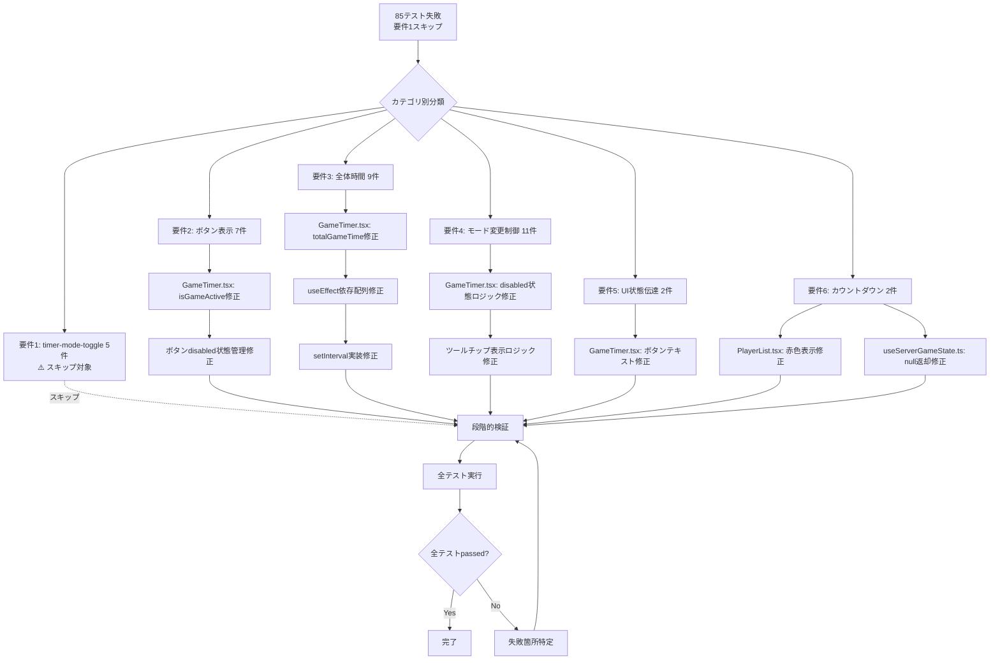
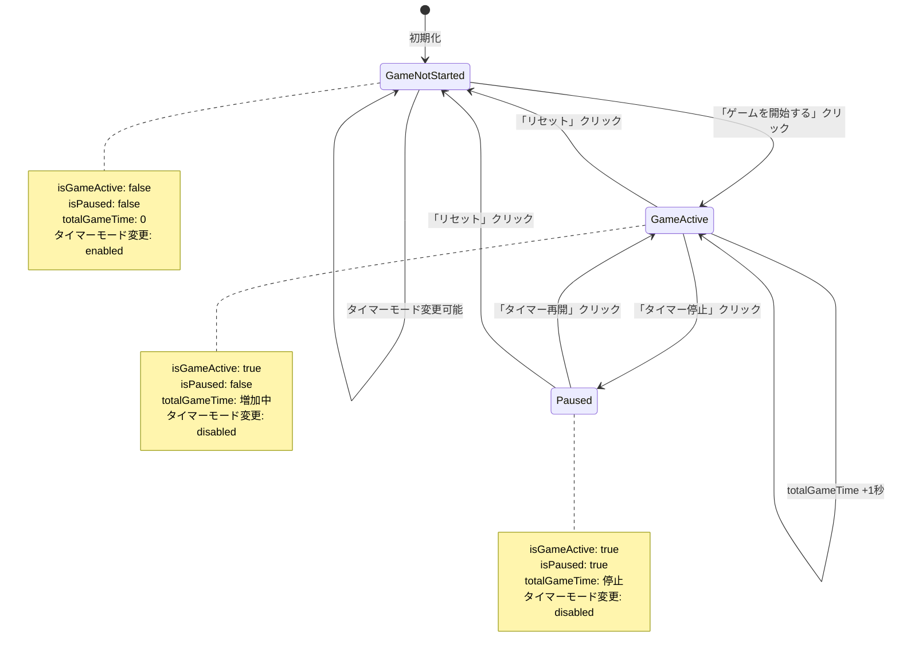
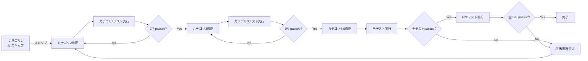

# Technical Design Document

## Overview

本設計書は、ONEmore Turnマルチプレイヤーゲームタイマーのフロントエンド単体テストで発生している失敗を体系的に修正するための技術設計を定義する。

**注意**: 要件1（タイマーモードトグル表示機能）に関連する5件のテストは現在無効化されているため、本設計の対象外とする。したがって、**85件のテスト失敗**を修正対象とする。

**目的**: 既存のGameTimer.tsxコンポーネントおよび関連コンポーネントの実装不具合を修正し、全テストが成功する状態を実現することで、フロントエンドコードベースの品質を保証し、継続的インテグレーションの信頼性を向上させる。

**対象ユーザー**: 開発者。単体テストが全て成功することで、既存機能の正常動作が保証され、将来的なリファクタリングや機能追加時の信頼性が向上する。

**影響**: 現在の失敗テストを修正し、全テストが成功する状態に変更する。これにより、技術的負債が削減され、コードベースの保守性が向上する。

### Goals

- **85テストの失敗を解消**: 要件2-6に関連する85件の失敗テストを修正し、テスト成功を達成
- **要件1はスキップ**: タイマーモードトグル関連の5件のテストは現在無効化されているため対象外
- **既存機能の保護**: 既存機能の動作を変更せず、実装不具合のみを修正
- **TDD原則の遵守**: 既存テストケースを修正の指針とし、テストが期待する動作を実装
- **リグレッション防止**: 他の仕様や機能に影響を与えず、既存の成功テストの状態を維持

### Non-Goals

- 新機能の追加: テスト修正のみを目的とし、新機能は追加しない
- テストケースの変更: テストケース自体が誤っている場合を除き、テストケースを変更してパスさせることはしない
- アーキテクチャの変更: 既存のコンポーネント構造とアーキテクチャパターンを維持
- UIデザインの変更: 既存のUI/UXを変更せず、内部実装の不具合のみを修正

## Architecture

### 既存アーキテクチャ分析

**現在のコンポーネント構造**:

```
frontend/src/
├── components/
│   ├── GameTimer.tsx          # メインコンポーネント（修正の中心）
│   ├── PlayerList.tsx         # プレイヤーリスト表示
│   └── TopTimePlayerIndicator.tsx
├── hooks/
│   ├── useGameState.ts        # フォールバックモード状態管理
│   └── useServerGameState.ts  # APIモード状態管理
└── __tests__/
    ├── GameTimer.conditionalRendering.test.tsx  # 5テスト失敗
    ├── GameTimer.buttonLayout.test.tsx          # 4テスト失敗
    ├── GameTimer.buttonStates.test.tsx          # 3テスト失敗
    ├── GameTimer.totalGameTime.test.tsx         # 6テスト失敗
    ├── GameTimer.totalPlayTime.test.tsx         # 3テスト失敗
    ├── GameTimer.timerModeUpdate.test.tsx       # 11テスト失敗
    ├── GameTimer.uiSimplification.test.tsx      # 2テスト失敗
    ├── PlayerList.test.tsx                      # 1テスト失敗
    └── useServerGameState.test.ts               # 1テスト失敗
```

**既存のアーキテクチャパターン**:
- **Reactコンポーネントパターン**: 関数コンポーネント + Hooks
- **状態管理**: useStateとuseEffect、カスタムフックによる状態分離
- **二重モード設計**: フォールバックモード（useGameState）+ APIモード（useServerGameState）
- **テスト戦略**: Vitest + @testing-library/react によるコンポーネントテスト

**既存のドメイン境界**:
- **UI層**: GameTimer.tsx, PlayerList.tsx - ユーザーインターフェース
- **状態管理層**: useGameState.ts, useServerGameState.ts - ビジネスロジックと状態
- **テスト層**: __tests__/ - 品質保証

### 修正戦略の可視化



### Technology Alignment

**既存技術スタックとの整合性**:
- **React 18**: 既存のReact 18機能（Concurrent Rendering, Automatic Batching）に準拠
- **TypeScript**: 既存の型定義とインターフェースを維持
- **Vitest**: 既存のテストフレームワークとテストパターンに従う
- **@testing-library/react**: 既存のテストヘルパーとマッチャーを活用

**新規依存関係**: なし（既存ライブラリのみ使用）

**既存パターンからの逸脱**: なし

### Key Design Decisions

#### Decision 1: 要件1（タイマーモードトグル）のスキップ

**Context**: 要件1（タイマーモードトグル表示機能）に関連する5件のテスト（GameTimer.conditionalRendering.test.tsx）は現在無効化されている。

**Selected Approach**: 要件1に関連する全ての修正をスキップし、要件2-6のみを対象とする

**Rationale**:
- テストが現在無効化されているため、修正の必要性と優先度が低い
- 他の85件のテスト失敗を先に解消することで、より広範囲な品質向上を実現
- 将来的にテストが有効化された際に、改めて設計と実装を行う

**Impact**:
- 修正対象テスト数: 90件 → 85件
- 修正対象要件: 要件1-6 → 要件2-6のみ

#### Decision 2: totalGameTime更新ロジックの修正方法

**Context**: GameTimer.totalGameTime.test.tsxとGameTimer.totalPlayTime.test.tsxの合計9テストが失敗している。原因は、totalGameTime stateが1秒ごとに更新されないこと。

**Alternatives**:
1. **useEffectの依存配列を修正**: 依存配列に必要な変数を全て含める
2. **setIntervalの実装を修正**: setIntervalのクリーンアップを正しく実装
3. **React 18のStrictModeに対応**: useEffectが2回実行されることを考慮した実装

**Selected Approach**: useEffectの依存配列とクリーンアップを正しく実装

```typescript
// 修正イメージ（詳細は実装フェーズ）
useEffect(() => {
  if (!isPaused && isGameActive) {
    const intervalId = setInterval(() => {
      setTotalGameTime(prev => prev + 1); // カウントアップ
      // またはsetTotalGameTime(prev => prev - 1); // カウントダウン
    }, 1000);

    return () => clearInterval(intervalId);
  }
}, [isPaused, isGameActive, /* その他必要な依存 */]);
```

**Rationale**:
- React 18のStrictModeでは、useEffectが開発時に2回実行されるため、正しいクリーンアップが必須
- setIntervalのクリーンアップ不足により、複数のタイマーが同時実行される可能性がある
- 依存配列の不足により、状態変化時にタイマーが再作成されない

**Trade-offs**:
- 利点: React標準パターンに準拠、メモリリーク防止
- 欠点: なし（既存のベストプラクティスに従う）

#### Decision 3: 段階的修正アプローチ

**Context**: 85件のテスト失敗（要件1の5件はスキップ）を一度に修正するのはリスクが高い。どのような順序で修正を進めるか。

**Alternatives**:
1. **カテゴリ別修正**: 要件2→3→4...の順に、各カテゴリのテストを独立して成功させる
2. **ファイル別修正**: GameTimer.tsx→PlayerList.tsx→useServerGameState.tsの順に修正
3. **一括修正**: 全ての修正を一度に実施

**Selected Approach**: カテゴリ別修正（要件2→3→4→5→6の順、要件1はスキップ）

**Rationale**:
- 各カテゴリのテストが独立しており、修正の影響範囲を限定できる
- カテゴリごとにテストを実行することで、リグレッションを早期発見できる
- 要件1（timer-mode-toggle）は現在テスト無効化中のためスキップし、countdown-mode-fix完了後に対応
- 要件2（ボタン表示）から開始し、段階的に複雑な修正へ進む
- 要件3（全体時間）は最も複雑な修正であり、他の修正の影響を受けにくい段階で実施

**Trade-offs**:
- 利点: リスク低減、早期フィードバック、段階的検証、countdown-mode-fixとの適切な依存関係管理
- 欠点: 修正時間が長くなる可能性（ただし、品質向上により全体的な効率は向上）

## Components and Interfaces

### UI層

#### GameTimer.tsx（主要修正コンポーネント）

**Responsibility & Boundaries**
- **Primary Responsibility**: ゲームタイマーのUI表示と状態管理を統合するメインコンポーネント
- **Domain Boundary**: UIプレゼンテーション層（ビジネスロジックはuseGameState/useServerGameStateに委譲）
- **Data Ownership**: UI状態（ボタンテキスト、disabled状態、表示/非表示制御）
- **Transaction Boundary**: なし（UIコンポーネントのため）

**Dependencies**
- **Inbound**: App.tsx（親コンポーネント）
- **Outbound**:
  - useGameState.ts（フォールバックモード状態管理）
  - useServerGameState.ts（APIモード状態管理）
  - PlayerList.tsx（プレイヤーリスト表示）
  - TopTimePlayerIndicator.tsx（最長時間プレイヤー表示）
- **External**: React 18, TypeScript

**修正対象の状態管理**

```typescript
// 修正対象のstate変数
interface GameTimerState {
  // 要件2: ゲーム状態管理
  isGameActive: boolean;     // ゲーム開始済みフラグ
  isPaused: boolean;         // 一時停止フラグ
  activePlayerIndex: number; // アクティブプレイヤーインデックス

  // 要件3: ゲーム全体時間
  totalGameTime: number;     // ゲーム全体の経過時間（秒）

  // 要件4: タイマーモード変更制御
  isGameStarted: boolean;    // ゲーム開始済み判定
}
```

**修正対象のuseEffect**

```typescript
// 要件3: totalGameTime更新ロジック
useEffect(() => {
  // 修正: 依存配列とクリーンアップを正しく実装
  if (!isPaused && isGameActive) {
    const intervalId = setInterval(() => {
      if (timerMode === 'countdown') {
        setTotalGameTime(prev => Math.max(0, prev - 1));
      } else {
        setTotalGameTime(prev => prev + 1);
      }
    }, 1000);

    return () => clearInterval(intervalId);
  }
}, [isPaused, isGameActive, timerMode]);
```

**修正対象のJSX**

```typescript
// 要件2: ボタン表示
<button
  onClick={handleSwitchTurn}
  aria-label={isGameActive ? "次のプレイヤーに切り替え" : "ゲームを開始"}
  disabled={isPaused && !isGameActive}
>
  {isGameActive ? '次のプレイヤーへ →' : 'ゲームを開始する'}
</button>

// 要件5: UI状態伝達
<button
  onClick={handlePause}
  aria-label={isPaused ? 'ゲームを再開' : 'ゲームを一時停止'}
  disabled={!isGameActive}
>
  {isPaused ? '▶️ タイマー再開' : '⏸️ タイマー停止'}
</button>
```

**Integration Strategy**
- **Modification Approach**: Extend（既存コードに最小限の変更を加える）
- **Backward Compatibility**: 既存のprops、state、イベントハンドラを全て維持
- **Migration Path**: 不要（既存コンポーネント内の修正のみ）

#### PlayerList.tsx（カウントダウンモード表示）

**Responsibility & Boundaries**
- **Primary Responsibility**: プレイヤーリストを表示し、カウントダウンモード時に時間切れプレイヤーを赤色表示
- **Domain Boundary**: UIプレゼンテーション層
- **Data Ownership**: プレイヤー表示状態（色、スタイル）

**修正対象**

```typescript
// 要件6: カウントダウンモード時の赤色表示
const getPlayerStyle = (player: Player, timerMode: TimerMode) => {
  if (timerMode === 'countdown' && player.remainingSeconds <= 0) {
    return { color: 'red' }; // 修正: 正しい条件でスタイル適用
  }
  return {};
};
```

**Integration Strategy**
- **Modification Approach**: Extend（条件分岐ロジックの修正のみ）
- **Backward Compatibility**: 既存のpropsとインターフェースを維持

### 状態管理層

#### useServerGameState.ts（APIモード最長時間プレイヤー取得）

**Responsibility & Boundaries**
- **Primary Responsibility**: APIモード時のゲーム状態管理と最長時間プレイヤー取得
- **Domain Boundary**: 状態管理層
- **Data Ownership**: サーバー同期状態

**修正対象**

```typescript
// 要件6: カウントダウンモード時はnullを返す
const getLongestTimePlayer = (): Player | null => {
  if (serverState?.timerMode === 'countdown') {
    return null; // 修正: カウントダウンモードではnullを返す
  }
  // 既存のロジック（カウントアップモード時の最長時間プレイヤー取得）
  return findLongestTimePlayer(serverState?.players);
};
```

**Integration Strategy**
- **Modification Approach**: Extend（条件分岐の追加のみ）
- **Backward Compatibility**: 既存の戻り値の型（Player | null）を維持

## 状態遷移図



## Requirements Traceability

| 要件ID | 要件概要 | コンポーネント | インターフェース | 修正内容 | 状態 |
|--------|----------|----------------|------------------|----------|------|
| 1.1-1.6 | タイマーモードトグル表示 | GameTimer.tsx | JSX レンダリングロジック | `{false &&`削除、条件分岐修正 | ⚠️ **スキップ**（テスト無効化中） |
| 2.1-2.9 | ゲーム状態管理とボタン表示 | GameTimer.tsx | isGameActive, isPaused管理 | 状態遷移ロジック修正、disabled状態管理 | ✅ 対象 |
| 3.1-3.12 | ゲーム全体時間表示 | GameTimer.tsx | totalGameTime state + useEffect | useEffect依存配列修正、setInterval実装修正 | ✅ 対象 |
| 4.1-4.8 | タイマーモード変更制御 | GameTimer.tsx | disabled状態ロジック | isGameStarted判定修正、ツールチップ表示修正 | ✅ 対象 |
| 5.1-5.3 | UI状態伝達 | GameTimer.tsx | ボタンテキスト | isPaused状態に応じたテキスト変更 | ✅ 対象 |
| 6.1-6.2 | カウントダウンモード | PlayerList.tsx, useServerGameState.ts | スタイル適用、null返却 | 条件分岐修正 | ✅ 対象 |
| 7.1-7.5 | テスト品質保証 | 全コンポーネント | テスト実行 | 段階的検証、リグレッション防止 | ✅ 対象 |

## Error Handling

### Error Strategy

本機能は既存テストの失敗を修正することが目的であり、新たなエラーハンドリングロジックの追加は不要。ただし、修正過程で以下のエラーハンドリング戦略を適用する。

### Error Categories and Responses

**テスト実行時のエラー**:
- **テスト失敗**: 該当テストケースのexpectation（期待値）を確認し、実装を修正
- **型エラー**: TypeScriptの型定義を修正し、型安全性を維持
- **実行時エラー**: useEffectのクリーンアップ不足等によるメモリリーク、無限ループを防止

**修正時のリグレッション**:
- **既存テストの失敗**: 修正をロールバックし、影響範囲を再分析
- **新たなテスト失敗**: カテゴリ別修正により、他のカテゴリへの影響を早期発見

### Monitoring

- **テスト実行結果のモニタリング**: `npm test`の出力を確認し、失敗テスト数を追跡
- **段階的検証**: 各カテゴリ修正後に該当テストを実行し、成功を確認
- **最終検証**: 全テスト実行（547/547 passed）で完了を確認

## Testing Strategy

### Unit Tests（既存テストを活用）

本機能は既存テストの失敗を修正することが目的であるため、新規テストの作成は不要。既存テストを以下のカテゴリで実行し、段階的に成功を確認する。

**カテゴリ1: タイマーモードトグル表示（5テスト）⚠️ スキップ対象**
- ファイル: `GameTimer.conditionalRendering.test.tsx`
- **状態**: 現在テスト無効化中のため、本設計では対象外
- **関連仕様**: `countdown-mode-fix`のPhase 6で有効化予定
- **再有効化時の対応**: countdown-mode-fix完了後、`{false &&`を削除して要件1を修正

**カテゴリ2: ゲーム状態管理とボタン表示（7テスト）**
- ファイル: `GameTimer.buttonLayout.test.tsx`（4テスト）、`GameTimer.buttonStates.test.tsx`（3テスト）
- テスト内容:
  1. 次のプレイヤーボタンが固定ヘッダーに表示される
  2. 次のプレイヤーボタンが最も視認しやすい位置に配置されている
  3. 次のプレイヤーボタンをクリックするとターン切り替えが即座に実行される
  4. 固定ヘッダーに一時停止ボタンと次のプレイヤーボタンが存在する
  5. ゲーム開始後、一時停止ボタンがenabled状態になる
  6. リセットボタンクリック後、一時停止ボタンがdisabled状態に戻る
  7. 「ゲームを開始する」ボタンクリック後、activePlayerIndexが0に設定される
- 検証コマンド: `npm test GameTimer.buttonLayout.test.tsx GameTimer.buttonStates.test.tsx`

**カテゴリ3: ゲーム全体時間表示（9テスト）**
- ファイル: `GameTimer.totalGameTime.test.tsx`（6テスト）、`GameTimer.totalPlayTime.test.tsx`（3テスト）
- テスト内容:
  1. 1秒経過後、ゲーム全体時間が00:01に更新される
  2. 5秒経過後、ゲーム全体時間が00:05に更新される
  3. プレイヤー切り替え後も、ゲーム全体時間が継続して増加する
  4. 一時停止時、ゲーム全体時間が更新されない
  5. 再開時、ゲーム全体時間が更新再開される
  6. リセット時、ゲーム全体時間が00:00にリセットされる
  7. カウントダウンモードでゲーム全体時間が減少する
  8. 1時間以上はHH:MM:SS形式で表示される
  9. 1-2時間は警告色、2時間以上は危険色が適用される
- 検証コマンド: `npm test GameTimer.totalGameTime.test.tsx GameTimer.totalPlayTime.test.tsx`

**カテゴリ4: タイマーモード変更制御（11テスト）**
- ファイル: `GameTimer.timerModeUpdate.test.tsx`
- テスト内容:
  1. ゲーム開始後、タイマーモードトグルスイッチがdisabled状態になる
  2. ゲーム開始後、マウスホバーでツールチップが表示される
  3. 一時停止中もタイマーモードトグルスイッチがdisabled状態
  4. プレイヤー経過時間 > 0 の場合、タイマーモードトグルスイッチがdisabled
  5. ゲーム未開始時、タイマーモードトグルスイッチがenabled
  6. リセット後、タイマーモードトグルスイッチがenabledに戻る
  7-11. ツールチップ表示ロジック
- 検証コマンド: `npm test GameTimer.timerModeUpdate.test.tsx`

**カテゴリ5: UI状態伝達（2テスト）**
- ファイル: `GameTimer.uiSimplification.test.tsx`
- テスト内容:
  1. 一時停止状態は一時停止ボタンのテキストで伝達される
  2. UI簡素化後も必要な機能はすべて利用可能
- 検証コマンド: `npm test GameTimer.uiSimplification.test.tsx`

**カテゴリ6: カウントダウンモード関連（2テスト）**
- ファイル: `PlayerList.test.tsx`（1テスト）、`useServerGameState.test.ts`（1テスト）
- テスト内容:
  1. カウントダウンモードで時間切れのプレイヤーは赤色表示
  2. カウントダウンモードではnullを返す
- 検証コマンド: `npm test PlayerList.test.tsx useServerGameState.test.ts`

### Integration Tests

既存の統合テストは全て成功する必要がある（リグレッション防止）。

- 検証コマンド: `npm test`
- 成功基準: Test Files 57 passed (57)、Tests 547 passed (547)

### E2E Tests

全てのE2Eテストが成功する必要がある（要件7.4）。

- 検証コマンド: `npx playwright test`
- 成功基準: 全E2Eテストが成功

### 段階的検証プロセス

**注意**: カテゴリ1（タイマーモードトグル表示）は現在テスト無効化中のためスキップ



## 制約条件と設計原則

### 既存機能の保護

- 既存機能の動作を変更しない
- 既存のprops、state、イベントハンドラを全て維持
- 既存のコンポーネント構造とアーキテクチャパターンを維持

### TDD原則の遵守

- 既存テストケースを修正の指針とする
- テストが期待する動作を実装する
- テストケースを変更してパスさせることはしない（テストケース自体が誤っている場合を除く）

### リグレッション禁止

- 他の仕様や機能に影響を与えない
- 修正対象の90テスト以外のテストは引き続き成功する状態を維持
- 段階的修正により、各段階でリグレッションを早期発見

### コードベース一貫性

- 既存のコードスタイル、命名規則、アーキテクチャパターンに従う
- React 18の標準パターン（useEffectクリーンアップ等）に準拠
- TypeScriptの型安全性を維持

### 段階的修正アプローチ

- カテゴリ別（要件1→2→3→4→5→6）に段階的に修正
- 各カテゴリ修正後に該当テストを実行し、成功を確認
- 全テスト実行（547/547 passed）で最終検証
