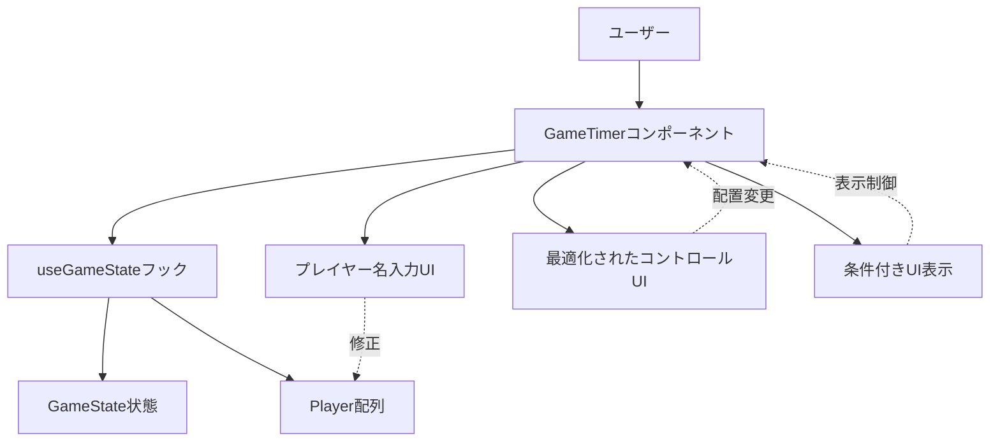
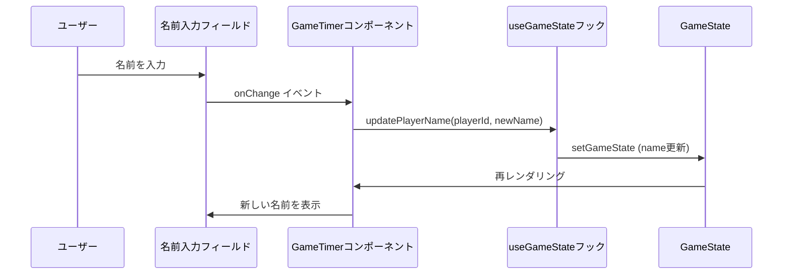
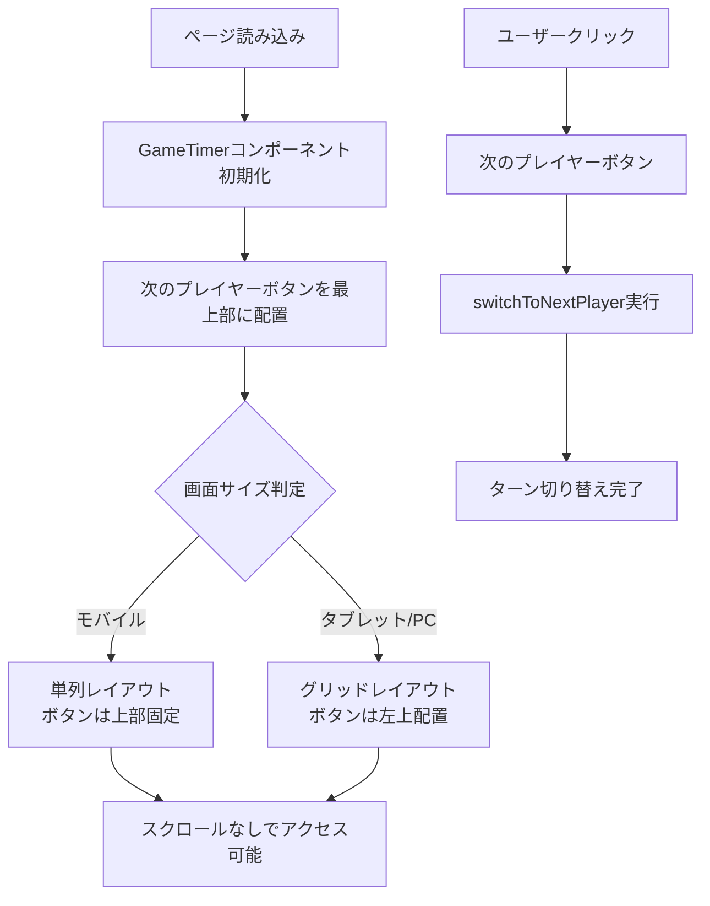
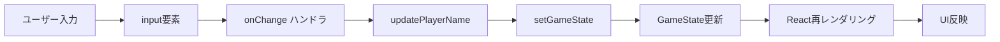

# 技術設計書

## 概要

本機能は、既存のマルチプレイヤーゲームタイマーのフロントエンドUXを改善し、プレイヤー識別の容易化、操作性の向上、UI簡素化による直感的な操作体験を実現する。既存の React useState ベースのシンプルなアーキテクチャを維持しながら、最小限の変更でUX改善を実装する。

**目的**: ゲームタイマー利用者に対し、より直感的で使いやすいインターフェースを提供する。

**ユーザー**: ボードゲームをプレイする4〜6人のプレイヤー。

**影響**: 既存のGameTimerコンポーネント、useGameStateフック、Player型定義を部分的に修正。タイマーロジックやビジネスルールには影響なし。

### ゴール
- プレイヤー名の編集可能化によるプレイヤー識別の改善
- 次のプレイヤーボタンの配置最適化による操作効率向上
- 不要なUI要素の削除による認知負荷の削減
- 文脈に応じた適切なUI表示による使いやすさの向上

### 非ゴール
- 既存タイマーロジックの変更
- 新規コンポーネントの追加（既存コンポーネントの修正のみ）
- データ永続化やリアルタイム同期機能

## Architecture

### 既存アーキテクチャ分析

**現在の実装パターン**:
- React useStateによる完全なクライアントサイド状態管理
- カスタムフック（useGameState）によるビジネスロジックのカプセル化
- プレゼンテーションコンポーネント（GameTimer）による表示ロジック
- 型安全性を重視したTypeScript実装

**既存ドメイン境界**:
- `GameState`: ゲーム全体の状態集約ルート
- `Player`: プレイヤー情報の値オブジェクト
- `useGameState`: 状態管理とビジネスロジック層
- `GameTimer`: プレゼンテーション層

**保持すべき統合ポイント**:
- useGameStateフックのインターフェース（既存の戻り値を維持）
- Player型の基本構造（id, name, elapsedTimeSeconds等）
- タイマーロジック（useGameTimer）との連携

### 高レベルアーキテクチャ



### 技術整合性

**既存技術スタックとの整合**:
- React 19.1.1 + TypeScript 5.9（変更なし）
- useState/useCallbackパターン継続
- CSS Modules（既存のGameTimer.css拡張）
- Vitestテストフレームワーク（既存テストパターン踏襲）

**新規依存関係**:
- なし（既存の依存関係のみ使用）

**技術的制約の遵守**:
- フロントエンド専用実装（バックエンド不要）
- ページリロード時は初期状態にリセット（永続化なし）
- 型安全性の維持（any型の使用禁止）

### 主要な設計判断

#### 判断1: プレイヤー名の即時更新パターン

- **決定**: プレイヤー名入力フィールドでの変更を即座にuseGameStateに反映する controlled component パターンを採用
- **背景**: React のベストプラクティスに従い、単一の情報源（Single Source of Truth）を維持する必要がある
- **代替案**:
  - Uncontrolled component + 確定ボタン: UX が劣る（余分なクリックが必要）
  - ローカルステート + onBlur更新: 状態の二重管理が発生し複雑化
- **選択理由**: シンプルな実装で即座のフィードバックを提供でき、既存のuseGameStateパターンとも整合
- **トレードオフ**: 入力ごとにレンダリングが発生するが、プレイヤー数が最大6人のため性能への影響は無視できる

#### 判断2: UI要素削除によるシンプル化アプローチ

- **決定**: 冗長なUI要素（ゲーム状態表示、アクティブ解除ボタン）を完全に削除し、視覚的表現で情報を伝達
- **背景**: ユーザーテストで「情報が多すぎて混乱する」というフィードバックがあった
- **代替案**:
  - UI要素の折りたたみ/展開: 実装コストが高く、かえって複雑化
  - 設定での表示/非表示切り替え: オーバーエンジニアリング
- **選択理由**:
  - アクティブプレイヤーは視覚的ハイライトで明確
  - 一時停止状態はボタンラベル（「再開」/「一時停止」）で判別可能
  - プレイヤー数はプレイヤーカード数で自明
- **トレードオフ**: デバッグ情報が減るが、Chrome DevToolsで状態確認可能

#### 判断3: 条件付きUI表示の実装パターン

- **決定**: タイマーモードに応じたUIの表示/非表示を、React の条件付きレンダリング（`{condition && <Element />}`）で実装
- **背景**: カウントアップモード時にカウントダウン設定UIを表示するのは認知負荷を高める
- **代替案**:
  - CSS の display: none: DOMには存在するためアクセシビリティ上の問題
  - タブ切り替えUI: 実装コストが高く、オーバーエンジニアリング
- **選択理由**: Reactの標準パターンで実装が簡潔、DOMからも完全に削除されるためパフォーマンスとアクセシビリティに優れる
- **トレードオフ**: モード切り替え時に再マウントが発生するが、軽量なInput要素のため影響なし

## システムフロー

### プレイヤー名更新フロー



### UI配置最適化フロー



## 要件トレーサビリティ

| 要件 | 要件概要 | コンポーネント | インターフェース | 実装方法 |
|------|---------|--------------|---------------|---------|
| 1.1 | プレイヤー名入力フィールド | GameTimer | input要素 + onChange | controlled component |
| 1.2 | 名前の即座反映 | useGameState | updatePlayerName() | setState即時更新 |
| 1.3 | デフォルト名表示 | Player | name フィールド | 初期値"プレイヤー{N}" |
| 1.4 | 名前変更の即座反映 | GameTimer | onChange → updatePlayerName | React再レンダリング |
| 1.5 | 新規プレイヤーのデフォルト名 | useGameState | createDefaultPlayer() | 既存ロジック維持 |
| 2.1 | 次のプレイヤーボタン最上部配置 | GameTimer | JSX要素順序 | controls-section再構成 |
| 2.2 | ボタンの視認性向上 | GameTimer.css | .next-player-btn | CSSスタイル強調 |
| 2.3 | スクロールなしアクセス | GameTimer.css | position: sticky | CSS固定配置 |
| 2.4 | ターン切り替え即座実行 | useGameState | switchToNextPlayer() | 既存ロジック維持 |
| 3.1 | アクティブ解除ボタン削除 | GameTimer | JSX削除 | ボタン要素削除 |
| 3.2 | 一時停止ボタンで代替 | useGameState | setPaused() | 既存ロジック維持 |
| 3.3 | ゲーム状態表示削除 | GameTimer | .game-status削除 | セクション削除 |
| 3.4 | 視覚的情報伝達 | GameTimer.css | .active, .timeout | 既存スタイル活用 |
| 4.1 | カウントアップ時UI非表示 | GameTimer | 条件付きレンダリング | `{mode === 'count-down' && ...}` |
| 4.2 | カウントダウン時UI表示 | GameTimer | 条件付きレンダリング | `{mode === 'count-down' && ...}` |
| 4.3 | モード切り替え時UI制御 | GameTimer | useEffect + timerMode | React自動再レンダリング |
| 4.4 | カウントアップ時設定非表示 | GameTimer | 条件付きレンダリング | DOM削除 |
| 5.1-5.4 | 既存機能との整合性 | 全体 | 既存インターフェース維持 | 既存ロジック保持 |

## コンポーネントとインターフェース

### プレゼンテーション層

#### GameTimer コンポーネント（修正）

**責任と境界**
- **主要責任**: UX改善に関するUI要素の追加・削除・再配置
- **ドメイン境界**: プレゼンテーション層（既存）
- **データ所有**: なし（useGameStateから受け取るのみ）

**依存関係**
- **インバウンド**: App コンポーネント
- **アウトバウンド**: useGameState フック
- **外部**: なし

**修正内容**

```typescript
// 新規追加: プレイヤー名更新関数
const { updatePlayerName } = useGameState();

// UI修正箇所
interface GameTimerUIChanges {
  // 1. プレイヤー名入力フィールド追加
  playerNameInput: JSX.Element; // <input type="text" value={player.name} onChange={...} />

  // 2. 次のプレイヤーボタンを最上部に配置
  controlsReorganization: {
    topSection: JSX.Element; // 次のプレイヤーボタン
    bottomSection: JSX.Element; // その他のコントロール
  };

  // 3. 削除するUI要素
  removedElements: {
    gameStatusSection: false; // .game-status セクション削除
    deactivateButton: false; // アクティブ解除ボタン削除
  };

  // 4. 条件付き表示UI
  conditionalUI: {
    countdownSettings: JSX.Element | null; // timerMode === 'count-down' のみ表示
  };
}
```

**CSS修正**

```css
/* 次のプレイヤーボタンの強調表示 */
.next-player-btn {
  background-color: #4CAF50;
  color: white;
  font-size: 1.2rem;
  font-weight: bold;
  padding: 1rem 2rem;
  width: 100%;
  margin-bottom: 1rem;
}

/* プレイヤー名入力フィールド */
.player-name-input {
  width: 100%;
  font-size: 1rem;
  padding: 0.5rem;
  border: 1px solid #ccc;
  border-radius: 4px;
}

.player-name-input:focus {
  outline: none;
  border-color: #4CAF50;
  box-shadow: 0 0 0 2px rgba(76, 175, 80, 0.2);
}
```

### ビジネスロジック層

#### useGameState フック（拡張）

**責任と境界**
- **主要責任**: 既存の状態管理に加え、プレイヤー名更新機能を追加
- **ドメイン境界**: 状態管理層
- **データ所有**: GameState（既存）

**依存関係**
- **インバウンド**: GameTimer コンポーネント
- **アウトバウンド**: GameState, Player 型定義
- **外部**: なし

**新規インターフェース**

```typescript
interface useGameStateReturn {
  // 既存インターフェース（省略）

  // 新規追加
  updatePlayerName: (playerId: string, newName: string) => void;
}

// 実装
const updatePlayerName = useCallback((playerId: string, newName: string) => {
  setGameState((prev) => ({
    ...prev,
    players: prev.players.map((p) =>
      p.id === playerId ? { ...p, name: newName } : p
    ),
    lastUpdatedAt: new Date()
  }));
}, []);
```

**前提条件**:
- playerId が GameState.players 内に存在すること
- newName が空文字列でないこと（バリデーションはUI側で実施）

**事後条件**:
- 指定されたプレイヤーの name フィールドが newName に更新されること
- lastUpdatedAt が現在時刻に更新されること
- 他のプレイヤーの状態は変更されないこと

## データモデル

### 論理データモデル

**既存 Player インターフェース（変更なし）**

```typescript
interface Player {
  id: string; // UUID v4
  name: string; // "プレイヤー1" など（編集可能化）
  elapsedTimeSeconds: number;
  initialTimeSeconds: number;
  isActive: boolean;
  createdAt: Date;
}
```

**ビジネスルールと不変条件**:
- `name` は1文字以上255文字以内（UI側で制約）
- `name` のデフォルト値は「プレイヤー{N}」（N は 1-based index）
- その他のフィールドは既存ルールを維持

**データフロー**:



## エラーハンドリング

### エラー戦略

本機能は既存のタイマーロジックに影響を与えないため、エラー処理は最小限に留める。

### エラーカテゴリと対応

**ユーザー入力エラー**
- **空のプレイヤー名**: UI側でバリデーション、空文字列の場合はデフォルト名に戻す
  - エラーメッセージ: なし（自動修正）
- **超長文のプレイヤー名**: input要素の maxLength 属性で255文字に制限
  - エラーメッセージ: なし（入力制限）

**ビジネスロジックエラー**
- **存在しないプレイヤーIDへの名前更新**:
  - 対応: updatePlayerName内で該当プレイヤーが見つからない場合は何もしない（no-op）
  - ログ: console.warn（開発時のみ）

### エラーハンドリング戦略

- **クライアント側バリデーション**: input要素の属性（maxLength, required）で制約
- **エラー発生時**: UIにエラーメッセージを表示せず、自動修正または無視
- **状態の整合性**: React useStateによる自動的な状態管理（既存パターン踏襲）

## テストストラテジー

### ユニットテスト（Vitest）

1. **useGameState.updatePlayerName 関数**:
   - プレイヤー名が正常に更新されること
   - 他のプレイヤーの状態が変更されないこと
   - lastUpdatedAt が更新されること
   - 存在しないplayerIdの場合は何もしないこと

2. **プレイヤー名バリデーション**:
   - 空文字列の場合の挙動（デフォルト名に戻る）
   - 255文字制限の確認（maxLength属性）

### コンポーネントテスト（React Testing Library）

1. **GameTimer コンポーネント**:
   - プレイヤー名入力フィールドが表示されること
   - 名前を入力すると即座に表示に反映されること
   - 次のプレイヤーボタンが最上部に配置されていること（DOM順序確認）
   - アクティブ解除ボタンが表示されないこと
   - ゲーム状態表示セクションが表示されないこと

2. **条件付きUI表示**:
   - カウントアップモード時にカウントダウン設定UIが表示されないこと
   - カウントダウンモード時にカウントダウン設定UIが表示されること
   - モード切り替え時にUIが正しく更新されること

### Chrome DevTools検証

1. **レスポンシブデザイン**:
   - 次のプレイヤーボタンがスクロールなしでアクセス可能なこと（375px/768px/1024px）
   - プレイヤー名入力フィールドが各画面サイズで適切に表示されること

2. **UI配置確認**:
   - 次のプレイヤーボタンが最上部に配置されていること
   - 削除したUI要素（ゲーム状態表示、アクティブ解除ボタン）が表示されないこと

## 既存機能との整合性

### 保持する機能

- **タイマーロジック**: useGameTimer フックは一切変更なし
- **ターン管理**: switchToNextPlayer, setActivePlayer 等の既存ロジックを維持
- **ゲームコントロール**: リセット、一時停止、再開機能は変更なし
- **レスポンシブデザイン**: 既存のCSS Grid + Media Queries パターンを踏襲

### 影響範囲

**変更あり**:
- GameTimer.tsx: UI要素の追加・削除・再配置
- useGameState.ts: updatePlayerName 関数の追加
- GameTimer.css: スタイル追加・修正

**変更なし**:
- useGameTimer.ts: タイマーロジック
- GameState.ts: 型定義（Player.name フィールドは既存）
- PlayerList.tsx, TimerControls.tsx: 未使用のため変更なし

### マイグレーション戦略

**段階的実装アプローチ**:

1. **Phase 1**: プレイヤー名入力機能の追加
   - updatePlayerName 関数実装
   - input要素追加
   - テスト追加

2. **Phase 2**: UI配置最適化
   - 次のプレイヤーボタンの配置変更
   - CSS修正
   - レスポンシブ対応確認

3. **Phase 3**: UI簡素化
   - 不要UI要素の削除
   - 条件付きUI表示実装
   - 全体の動作確認

**ロールバック計画**:
- 各PhaseごとにGitコミットを作成
- 問題発生時は該当Phaseのコミットをrevert

**検証チェックポイント**:
- Phase 1完了時: プレイヤー名入力機能の動作確認
- Phase 2完了時: 次のプレイヤーボタンの配置確認
- Phase 3完了時: 全要件の統合テスト
