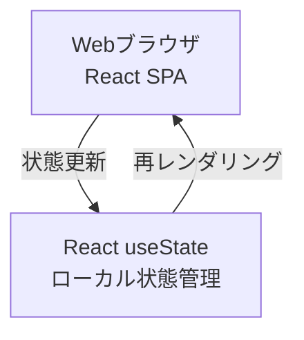
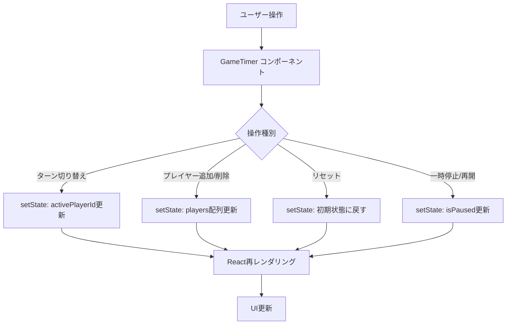

# 技術設計書

## 概要

本機能は、4〜6人のプレイヤーの経過時間を個別に計測する、ボードゲーム用タイマーアプリケーションを提供する。React useStateによるシンプルな状態管理で、直感的で使いやすいタイマー機能を実現する。

**目的**: ボードゲームのプレイヤーに対し、公平な時間管理を実現する。

**ユーザー**: ボードゲームをプレイする4〜6人のプレイヤー。

**影響**: 新規アプリケーションとしてゼロから構築。既存システムへの影響なし。

### ゴール
- 4〜6人のプレイヤーの時間を正確に計測（カウントアップ/カウントダウン両対応、デフォルトはカウントアップ）
- Azure Static Web Apps Free Tierでの運用（コスト0円）
- レスポンシブデザインによる全デバイス対応
- シンプルで直感的な操作性

### 非ゴール
- ユーザーアカウント管理や認証機能
- 複数デバイス間でのリアルタイム同期
- データの永続化や履歴保存
- ゲームルールの実装（タイマー機能のみ）
- モバイルネイティブアプリの提供

## 実装戦略

### インメモリータイマー実装

**目的**: React useStateを活用したシンプルで直感的なタイマーアプリケーションの実現

**アーキテクチャ**:


**実装対象**:
- React コンポーネント全体（GameTimer、PlayerList、TimerControls）
- タイマーロジック（カウントアップ/カウントダウン、1秒更新）
- プレイヤー管理（4〜6人の追加/削除）
- ターン管理（アクティブプレイヤー切り替え、循環ロジック）
- ゲームコントロール（リセット、一時停止、再開）
- タイマーモード切り替え（カウントアップ/カウントダウン）

**状態管理**:
- React `useState` のみ使用
- `GameTimerState` をルートコンポーネントで管理
- ページリロード時は初期状態（4人プレイヤー、カウントアップモード）にリセット

**検証基準**:
- ✅ タイマーが1秒ごとに正確に更新される
- ✅ プレイヤー追加/削除が正常に動作する
- ✅ ターン切り替えが循環ロジックで機能する
- ✅ リセット、一時停止、再開が正常に動作する
- ✅ カウントアップ/カウントダウンモードが正しく切り替わる
- ✅ すべての基本要件（要件1〜6）が正常に動作する

**完了条件**:
- ローカル環境で `npm run dev` を実行し、ブラウザで全機能が動作すること
- タイマーロジックの単体テストが全て成功すること

**フロントエンド実装の検証プロセス（必須）**:

フロントエンド機能の実装完了後は、**必ず**Chrome DevTools MCP（`mcp__chrome-devtools__*`ツール）を使用した実機検証を実施すること。

**検証手順**:
1. **テスト実装と実行**:
   - TDD（Test-Driven Development）に従い、実装前にテストを作成
   - 全テストが成功することを確認（`npm test`）

2. **Chrome DevTools検証**:
   - `npm run dev`で開発サーバー起動
   - `mcp__chrome-devtools__navigate_page`でアプリケーションにアクセス
   - `mcp__chrome-devtools__take_snapshot`で初期状態確認
   - 実装した機能の操作（`click`, `fill`, `evaluate_script`等）
   - 各操作後に`take_snapshot`で状態変化を確認
   - タイマー動作は`sleep`後にスナップショットで時間経過を確認

3. **検証項目（Task 10.2の例）**:
   ```
   ✅ カウントアップモード自動インクリメント
      - プレイヤーをアクティブに設定
      - 数秒待機後、タイマーが増加していることを確認

   ✅ 一時停止機能
      - 一時停止ボタンクリック
      - タイマーが停止していることを確認（数秒待機して変化なし）

   ✅ 再開機能
      - 再開ボタンクリック
      - タイマーが再び動作することを確認

   ✅ カウントダウンモード
      - カウントダウンボタンクリック
      - 全プレイヤーが初期時間にリセットされることを確認
      - タイマーが減少していることを確認

   ✅ 0:00停止（テストコードで検証済みの場合は省略可）
      - カウントダウンモードで0秒到達時の動作確認
   ```

4. **検証完了の基準**:
   - 全ての単体テストが成功
   - Chrome DevToolsで実装した全機能が想定通り動作
   - エラーや予期しない動作が発生しない
   - tasks.mdの該当タスクをチェック済み`[x]`に更新

**検証ツール**:
- `mcp__chrome-devtools__navigate_page`: ページ遷移
- `mcp__chrome-devtools__take_snapshot`: ページ状態のテキストスナップショット取得
- `mcp__chrome-devtools__click`: 要素クリック
- `mcp__chrome-devtools__fill`: フォーム入力
- `mcp__chrome-devtools__evaluate_script`: JavaScript実行
- `Bash(sleep N)`: タイマー動作確認のための待機

**注意事項**:
- テストだけでなく、**必ず**Chrome DevToolsでの実機検証を実施すること
- 検証結果はタスク完了時のコメントとして記録すること
- 想定外の動作が見つかった場合は、実装を修正して再検証すること

---

## アーキテクチャ

### Phase 1アーキテクチャ（インメモリータイマー）


### アーキテクチャの特徴

**シンプルなクライアントサイド実装**:
- React useStateによる完全なクライアントサイド状態管理
- バックエンドサーバー不要（サーバーレス）
- ページリロード時は初期状態にリセット

**デプロイ先**:
- Azure Static Web Apps Free Tier: 静的コンテンツ配信（250MB）
- GitHub Actionsによる自動デプロイ

## 技術スタック

### フロントエンド
- **選択**: React 18 + TypeScript + Vite
- **根拠**:
  - React: コンポーネントベースの開発効率とエコシステム
  - TypeScript: 型安全性によるバグ削減
  - Vite: 高速ビルドと開発体験
- **代替案検討**:
  - Vue.js: 学習コストは低いがエコシステムがやや小さい
  - Vanilla JS: 開発速度が遅く保守性が低い

### ホスティング
- **選択**: Azure Static Web Apps
- **根拠**:
  - 静的コンテンツ配信 + CDN + カスタムドメイン対応
  - GitHub Actionsとの自動CI/CD統合
  - 無料枠で十分（250MB、月100GBトラフィック）
- **代替案検討**:
  - Azure Blob Storage + CDN: 設定が複雑
  - Azure App Service: 静的サイトには過剰

### 主要な設計判断

#### 判断1: フロントエンド専用アプリケーションとしての実装

- **決定**: React useStateによるシンプルなフロントエンド専用タイマーアプリケーションとして実装
- **背景**: タイマー機能の迅速な提供と、シンプルな実装による保守性の向上
- **代替案**:
  - データベース統合: 複雑性が高く、無料枠の制約もある
  - リアルタイム同期: 実装コストが高く、基本機能には不要
- **選択理由**: タイマーロジックに集中することで、高品質な基本機能を迅速に提供できる
- **将来の拡張性**: データ永続化やリアルタイム同期が必要になった場合は、別仕様として検討可能

#### 判断2: ハイブリッドタイマー方式（カウントアップ/カウントダウン切り替え）

- **決定**: カウントアップモードとカウントダウンモードの両方を実装し、ゲーム開始時にモードを選択可能にする
- **背景**:
  - カウントアップ: 「誰が一番早く考えたか」を測定（カタンなどのゲームでのターン時間計測）
  - カウントダウン: 時間制限のあるゲームに対応（持ち時間制）
  - プレイスタイルに応じてモードを切り替えられる柔軟性が重要
- **代替案**:
  - カウントアップのみ: 実装はシンプルだが時間制限ゲームに非対応
  - カウントダウンのみ: 初期時間設定が必須で柔軟性が低い
- **選択理由**:
  - 実装複雑度の増加は限定的（タイマーロジックの条件分岐のみ）
  - 幅広いゲームタイプに対応できる汎用性
  - デフォルトはカウントアップモードで、学習曲線を緩やか
- **トレードオフ**:
  - UI要素が増える（モード切り替えボタン、カウントダウン時の初期値設定）
  - テストケースが2倍になる
  - ただし、ユーザー価値が明確に向上するため許容範囲

## システムフロー

### インメモリータイマーフロー



## 要件トレーサビリティ

| 要件 | 要件概要 | Phase 1実装 |
|------|---------|-------------|
| 1.1 | 4人デフォルト表示 | ✅ useState初期値 |
| 1.2 | 4〜6人で変更可能 | ✅ PlayerManager |
| 1.3 | 即座にUI反映 | ✅ setState |
| 1.4 | プレイヤー名表示 | ✅ PlayerList Component |
| 2.1 | MM:SS形式表示 | ✅ formatTime関数 |
| 2.2 | カウントアップ/ダウン | ✅ TimerController |
| 2.3 | 1秒ごとに更新 | ✅ setInterval |
| 2.4 | 停止時に保持 | ✅ setState保持 |
| 2.5 | リセット機能 | ✅ setState初期化 |
| 2.7 | 時間切れ通知 | ✅ CSS赤色表示 |
| 2.8 | 全タイマーリセット | ✅ setState初期化 |
| 3.1 | 他タイマー停止 | ✅ ビジネスロジック |
| 3.2 | ハイライト表示 | ✅ CSS active class |
| 3.3 | ターン切り替え | ✅ TurnManager |
| 3.4 | 循環ロジック | ✅ (index + 1) % players.length |
| 4.1-4.4 | ゲーム制御 | ✅ setState操作 |
| 5.1-5.4 | レスポンシブUI | ✅ CSS Grid + Media Queries |
| 6.1-6.2 | Azure無料ホスティング | ✅ Azure Static Web Apps |

## コンポーネントとインターフェース

### フロントエンド層

#### GameTimer コンポーネント（ルートコンポーネント）

**責任と境界**
- **主要責任**: アプリケーション全体の状態管理（React useState）
- **ドメイン境界**: UIレイヤー全体の統括
- **データ所有**: グローバルゲーム状態（プレイヤー情報、タイマー値、アクティブプレイヤー）
- **トランザクション境界**: クライアント側状態更新の原子性

**依存関係**
- **インバウンド**: なし（ルートコンポーネント）
- **アウトバウンド**: PlayerList, TimerControls
- **外部**: なし

**契約定義**

```typescript
interface GameTimerState {
  players: Player[];
  activePlayerId: string | null;
  isPaused: boolean;
  timerMode: 'count-up' | 'count-down';
  lastUpdated: Date;
}

interface Player {
  id: string;
  name: string;
  elapsedTimeSeconds: number; // カウントアップ: 経過時間、カウントダウン: 残り時間
  initialTimeSeconds: number; // カウントダウンモード時の初期時間（デフォルト: 600秒）
  isActive: boolean;
}
```

**状態管理**
- **状態モデル**: Idle → Active → Paused → Active → Idle
- **永続化**: なし（ページリロード時に初期化）
- **並行制御**: React useState による状態更新

#### PlayerList コンポーネント

**責任と境界**
- **主要責任**: プレイヤー一覧の表示とアクティブプレイヤーのビジュアル強調
- **ドメイン境界**: プレイヤー表示UI
- **データ所有**: なし（親から受け取るprops）

**依存関係**
- **インバウンド**: GameTimer
- **アウトバウンド**: PlayerCard（個別プレイヤー表示）
- **外部**: なし

**契約定義**

```typescript
interface PlayerListProps {
  players: Player[];
  activePlayerId: string | null;
  onPlayerSelect?: (playerId: string) => void;
}
```

**Phase別実装差分**: 全Phase共通（変更なし）

#### TimerControls コンポーネント

**責任と境界**
- **主要責任**: ゲーム操作（開始、停止、リセット、ターン切り替え、モード切り替え）のUIインターフェース
- **ドメイン境界**: 操作UI
- **データ所有**: なし（イベントハンドラのみ）

**依存関係**
- **インバウンド**: GameTimer
- **アウトバウンド**: なし（イベントハンドラのみ）
- **外部**: なし

**実装**:
- 親コンポーネントのsetStateコールバックを呼び出し、状態を更新

## データモデル

### 論理データモデル

**GameState エンティティ**

ゲーム全体の状態を表現する集約ルート。

```typescript
interface GameState {
  players: Player[];
  activePlayerId: string | null;
  isPaused: boolean;
  timerMode: 'count-up' | 'count-down';
  createdAt: Date;
  lastUpdatedAt: Date;
}

interface Player {
  id: string; // UUID v4
  name: string; // "プレイヤー1" など
  elapsedTimeSeconds: number; // カウントアップ: 経過時間、カウントダウン: 残り時間（秒）
  initialTimeSeconds: number; // カウントダウンモード時の初期時間（秒）
  isActive: boolean;
  createdAt: Date;
}
```

**ビジネスルールと不変条件**:
- `players.length` は4〜6の範囲
- `activePlayerId` がnullでない場合、対応するPlayerが存在し、`isActive = true`
- アクティブなプレイヤーは最大1人
- `elapsedTimeSeconds` は非負整数
- `timerMode` のデフォルト値は `'count-up'`（ゲーム初期化時）
- カウントアップモード時: `elapsedTimeSeconds` は0から開始
- カウントダウンモード時: `elapsedTimeSeconds` は `initialTimeSeconds` から開始し、0以下で時間切れ
- `initialTimeSeconds` は正の整数（デフォルト: 600秒）

**整合性境界**:
- GameState全体がReact useStateで管理される
- プレイヤー追加/削除時に既存タイマー値はリセット

## エラーハンドリング

### エラー戦略

本アプリケーションでは、ユーザーエラー、システムエラー、ビジネスロジックエラーの3層に分類し、それぞれ明確な回復戦略を定義する。

### エラーカテゴリと対応

**ユーザー入力エラー**
- **無効な入力**: プレイヤー数が範囲外（4未満、6超過）
  - フロントエンドでバリデーション、エラーメッセージ表示
  - 例: 「プレイヤー数は4〜6人の範囲で指定してください」
- **不正な操作**: 存在しないプレイヤーIDでターン切り替え
  - エラーメッセージ「指定されたプレイヤーが見つかりません」

**ビジネスロジックエラー**
- **ルール違反**: 既にアクティブなプレイヤーがいる状態で別プレイヤーを開始
  - エラーメッセージ「他のプレイヤーのターンが進行中です」

### エラーハンドリング戦略

- クライアント側バリデーションのみ
- エラー発生時: UIにエラーメッセージ表示
- リトライ: ユーザーの手動操作のみ
- 状態の整合性: React useStateによる自動的な状態管理

## テストストラテジー

### テスト戦略

**ユニットテスト（Vitest）**:
1. タイマーロジック:
   - `formatElapsedTime(seconds)` 関数（MM:SS変換）
   - カウントアップ/カウントダウンロジック
   - 時間切れ検出（カウントダウンモード）
2. プレイヤー管理:
   - プレイヤー追加/削除ロジック
   - プレイヤー数バリデーション（4〜6人）
3. ターン管理:
   - アクティブプレイヤー切り替えロジック
   - 循環ロジック（最後のプレイヤー → 最初のプレイヤー）

**コンポーネントテスト（React Testing Library）**:
1. GameTimer コンポーネント:
   - 初期レンダリング（4人プレイヤー、カウントアップモード）
   - ターン切り替えボタンクリック → アクティブプレイヤー変更
   - リセットボタンクリック → 初期状態に戻る
2. PlayerList コンポーネント:
   - アクティブプレイヤーのハイライト表示
   - プレイヤー数変更時のレンダリング

**Chrome DevTools検証**:
1. 基本操作フロー:
   - アプリ起動 → ターン開始 → タイマー動作確認 → ターン切り替え
2. リセット機能:
   - ゲーム進行中 → リセット → 全タイマー0:00確認
3. レスポンシブデザイン:
   - モバイル、タブレット、PCサイズでのレイアウト確認

## セキュリティ考慮事項

### セキュリティ制御

**入力バリデーション**:
- フロントエンドでのバリデーション実装
- プレイヤー数: 4〜6の範囲チェック
- プレイヤーID: UUID形式検証

**データ保護**:
- HTTPS強制（Azure Static Web Apps標準）
- ブラウザメモリのみでのデータ保持（localStorage/sessionStorage不使用）

**コンプライアンス**:
- 個人情報非収集（GDPR対象外）
- クッキー非使用

## パフォーマンスとスケーラビリティ

### 目標メトリクス

| メトリクス | 目標値 | 測定方法 |
|----------|-------|---------|
| ページ初回表示時間 | < 2秒 | Lighthouse CI |
| タイマー更新レスポンス | < 100ms | React Profiler |
| メモリ使用量 | < 50MB | Chrome DevTools Memory Profiler |

### 最適化戦略

- React.memoによるコンポーネントメモ化
- useCallbackによるハンドラ最適化
- 静的アセットのCDNキャッシュ（Azure Static Web Apps）: max-age=31536000
- ゲーム状態はuseStateのみ（localStorage/sessionStorage不使用）