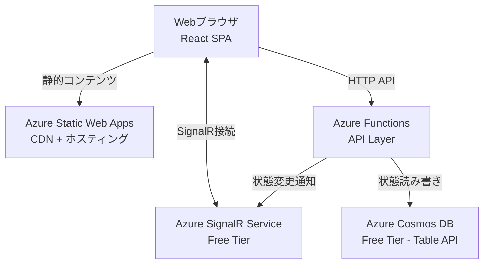
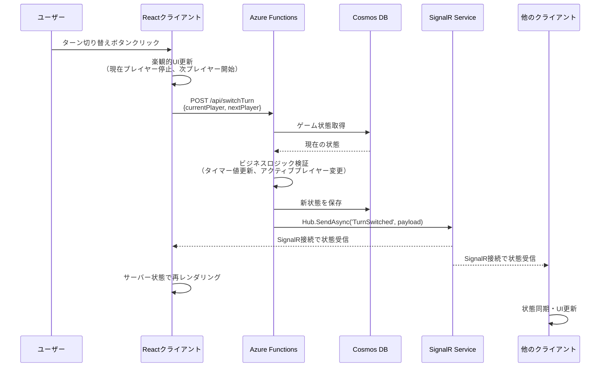
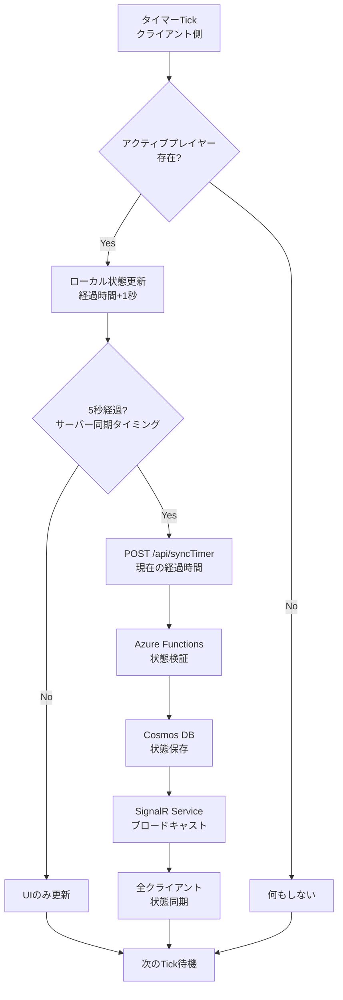
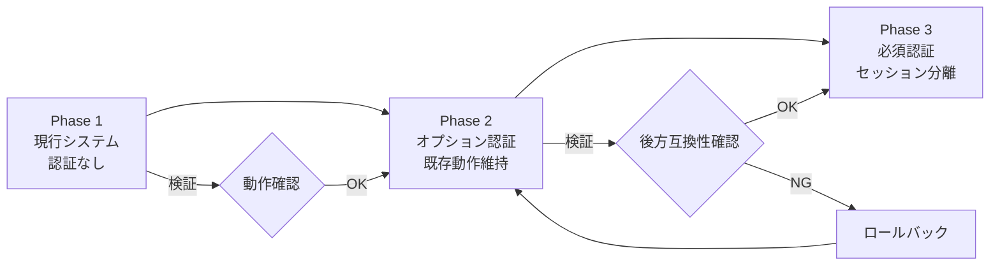

# 技術設計書

## 概要

本機能は、4〜6人のプレイヤーの経過時間を個別に計測する、ボードゲーム用のマルチプレイヤー対応タイマーアプリケーションを提供する。Azure無料層サービスを活用し、認証不要でブラウザから誰でもアクセス可能な共有タイマーとして動作する。

**目的**: ボードゲームのプレイヤーに対し、公平な時間管理と複数デバイス間でのリアルタイム同期を実現する。

**ユーザー**: ボードゲームをプレイする4〜6人のプレイヤーおよび観戦者。ローカル対戦およびリモート対戦の両方に対応。

**影響**: 新規アプリケーションとしてゼロから構築。既存システムへの影響なし。

### ゴール
- 4〜6人のプレイヤーの時間を正確に計測（カウントアップ/カウントダウン両対応、デフォルトはカウントアップ）
- 複数デバイス間でのリアルタイムな状態同期（1秒以内の遅延）
- Azure無料層での完全な運用（コスト0円）
- レスポンシブデザインによる全デバイス対応
- 認証不要のシンプルなアクセス

### 非ゴール
- ユーザーアカウント管理や認証機能
- 履歴保存や統計機能
- ゲームルールの実装（タイマー機能のみ）
- 有料プランへの移行を前提とした設計
- モバイルネイティブアプリの提供

## アーキテクチャ

### 全体アーキテクチャ



### アーキテクチャの特徴

**Azure無料層の活用**:
- Azure Static Web Apps Free Tier: 静的コンテンツ配信（250MB）
- Azure SignalR Service Free Tier: リアルタイム通信（同時接続20、メッセージ2万/日）
- Azure Cosmos DB Free Tier: ゲーム状態の永続化（1000 RU/s + 25GB、完全無料）
- Azure Functions Consumption Plan: サーバーレスAPI（月100万リクエスト無料）

**アーキテクチャパターン**: イベント駆動アーキテクチャ + CQRSライト
- コマンド（タイマー操作）: REST API経由でFunctionsに送信
- クエリ（状態取得）: SignalR経由でリアルタイム配信
- 状態変更時にSignalRを通じて全クライアントへブロードキャスト

**技術的制約**:
- 同時接続数上限20（SignalR Service Free Tier制約）
- メッセージ数上限2万/日（1秒更新で約5.5時間分）
- 認証レイヤーなし（無料層でのシンプル運用）

## 技術スタック

### フロントエンド
- **選択**: React 18 + TypeScript + Vite
- **根拠**:
  - React: コンポーネントベースの開発効率とエコシステム
  - TypeScript: 型安全性によるバグ削減
  - Vite: 高速ビルドと開発体験
- **代替案検討**:
  - Vue.js: 学習コストは低いがエコシステムがやや小さい
  - Vanilla JS: 開発速度が遅く保守性が低い

### リアルタイム通信
- **選択**: Azure SignalR Service
- **根拠**:
  - 高レベルAPI（ハブ抽象化、自動再接続、トランスポートフォールバック）
  - SignalR SDKの成熟したエコシステムと豊富なドキュメント
  - Azure Functionsとのネイティブバインディング（SignalR Output Binding）
  - 学習目的としてSignalRの実践的な理解を深められる
- **代替案検討**:
  - Azure Web PubSub: 低レベルWebSocket APIでプロトコル制御は柔軟だが、SignalR学習には不向き
  - ポーリング: リアルタイム性が低くメッセージ数消費が多い

### バックエンド
- **選択**: Azure Functions (Node.js 20 + TypeScript)
- **根拠**:
  - サーバーレスで運用コスト最小化
  - 無料枠が大きい（月100万リクエスト）
  - SignalRとのバインディング対応
- **代替案検討**:
  - Azure App Service: 無料層でも常時起動コストあり
  - コンテナ: 無料枠なし

### データストア
- **選択**: Azure Cosmos DB Free Tier (Table API)
- **根拠**:
  - 完全無料運用が可能（1000 RU/s + 25GB無料枠、本用途は約2.5 RU/s使用）
  - SLA付き低レイテンシ（読み取り<10ms、書き込み<15ms）
  - 全プロパティの自動インデックス化（Table Storageは PartitionKey/RowKey のみ）
  - バックアップ機能内蔵
  - Table Storage互換SDK（`@azure/data-tables`）でコード変更最小
- **代替案検討**:
  - Azure Table Storage: コスト優位性なし（Cosmos DB Free Tierで完全無料実現可能）
  - Azure SQL Database: 無料層なし、リレーショナルDBは本用途に過剰

### ホスティング
- **選択**: Azure Static Web Apps
- **根拠**:
  - 静的コンテンツ配信 + CDN + カスタムドメイン対応
  - GitHub Actionsとの自動CI/CD統合
  - 無料枠で十分（250MB、月100GBトラフィック）
- **代替案検討**:
  - Azure Blob Storage + CDN: 設定が複雑
  - Azure App Service: 静的サイトには過剰

### 主要な設計判断

#### 判断1: ハイブリッドタイマー方式（カウントアップ/カウントダウン切り替え）

- **決定**: カウントアップモードとカウントダウンモードの両方を実装し、ゲーム開始時にモードを選択可能にする
- **背景**:
  - カウントアップ: 「誰が一番早く考えたか」を測定（カタンなどのゲームでのターン時間計測）
  - カウントダウン: 時間制限のあるゲームに対応（持ち時間制）
  - プレイスタイルに応じてモードを切り替えられる柔軟性が重要
- **代替案**:
  - カウントアップのみ: 実装はシンプルだが時間制限ゲームに非対応
  - カウントダウンのみ: 初期時間設定が必須で柔軟性が低い
- **選択理由**:
  - 実装複雑度の増加は限定的（タイマーロジックの条件分岐のみ）
  - 幅広いゲームタイプに対応できる汎用性
  - デフォルトはカウントアップモードで、学習曲線を緩やか
- **トレードオフ**:
  - UI要素が増える（モード切り替えボタン、カウントダウン時の初期値設定）
  - テストケースが2倍になる
  - ただし、ユーザー価値が明確に向上するため許容範囲

#### 判断2: 楽観的更新 + イベントソーシング

- **決定**: クライアント側で即座にUI更新し、サーバーで状態を確定後にSignalRで全体同期
- **背景**: リアルタイム性を確保しつつ、無料層のメッセージ数制約に対応
- **代替案**:
  - サーバー確定後にUI更新: レスポンスが遅く感じる
  - クライアント完全自律: 複数デバイス間の不整合が発生
- **選択理由**: 操作感を損なわず、最終的な一貫性を保証
- **トレードオフ**: 一時的な不整合の可能性があるが、UX優先

#### 判断3: シングルゲーム状態管理

- **決定**: 全ユーザーが同じゲーム状態を共有（セッション分離なし）
- **背景**: 認証機能なしでシンプルに運用する要件
- **代替案**:
  - URL別セッション管理: 実装複雑度が増加
  - ゲームID発行方式: ユーザー体験が煩雑化
- **選択理由**: 最小構成での実現と運用コスト削減を優先
- **トレードオフ**: 複数グループの同時利用不可だが、初期要件では許容範囲

## システムフロー

### プレイヤーターン切り替えフロー



### タイマー更新フロー（毎秒）



**設計ポイント**:
- クライアント側で1秒ごとにタイマー更新（即応性）
- 5秒ごとにサーバー同期（メッセージ数節約: 2万/日制約対策）
- サーバー側で最終的な状態を確定（整合性保証）

## 要件トレーサビリティ

| 要件 | 要件概要 | 実現コンポーネント | インターフェース | フロー |
|------|---------|----------------|---------------|--------|
| 1.1 | 4人デフォルト表示 | GameStateManager | `GET /api/game` | 初期化フロー |
| 1.2 | 4〜6人で変更可能 | PlayerManager | `POST /api/updatePlayers` | プレイヤー変更フロー |
| 1.3 | 即座にUI反映 | React State + WebSocket | WebSocket `PLAYERS_UPDATED` | - |
| 1.4 | プレイヤー名表示 | PlayerList Component | - | - |
| 2.1 | MM:SS形式表示 | TimerDisplay Component | - | - |
| 2.2 | ターン開始でカウントアップ | TimerController | `POST /api/startTurn` | ターン切り替えフロー |
| 2.3 | 1秒ごとに加算 | Client-side Timer | - | タイマー更新フロー |
| 2.4 | 停止時に保持 | TimerController | `POST /api/pauseTurn` | - |
| 2.5 | リセット機能 | GameController | `POST /api/resetGame` | - |
| 3.1 | 他タイマー停止 | TimerController | ビジネスロジック内 | ターン切り替えフロー |
| 3.2 | ハイライト表示 | ActivePlayerHighlight Component | - | - |
| 3.3 | ターン切り替え | TurnManager | `POST /api/switchTurn` | ターン切り替えフロー |
| 3.4 | 循環ロジック | TurnManager | ビジネスロジック内 | ターン切り替えフロー |
| 4.1-4.4 | ゲーム制御 | GameController | `POST /api/{reset,pause,resume,newGame}` | - |
| 5.1-5.4 | リアルタイム同期 | SignalR Service + Event Broadcasting | SignalR接続 | 全フロー |
| 6.1-6.4 | レスポンシブUI | CSS Grid + Media Queries | - | - |
| 7.1-7.4 | Azure無料ホスティング | Azure Static Web Apps + Azure SignalR Service + Cosmos DB | - | - |

## コンポーネントとインターフェース

### フロントエンド層

#### GameTimer コンポーネント（ルートコンポーネント）

**責任と境界**
- **主要責任**: アプリケーション全体の状態管理とSignalR接続のライフサイクル管理
- **ドメイン境界**: UIレイヤー全体の統括
- **データ所有**: グローバルゲーム状態（プレイヤー情報、タイマー値、アクティブプレイヤー）
- **トランザクション境界**: クライアント側状態更新の原子性

**依存関係**
- **インバウンド**: なし（ルートコンポーネント）
- **アウトバウンド**: PlayerList, TimerControls, SignalRConnectionManager
- **外部**: Azure SignalR Service（SignalR接続）

**契約定義**

```typescript
interface GameTimerState {
  players: Player[];
  activePlayerId: string | null;
  isPaused: boolean;
  timerMode: 'count-up' | 'count-down'; // タイマーモード（デフォルト: 'count-up'）
  lastUpdated: Date;
}

interface Player {
  id: string;
  name: string;
  elapsedTimeSeconds: number; // カウントアップ: 経過時間、カウントダウン: 残り時間
  initialTimeSeconds: number; // カウントダウンモード時の初期時間（デフォルト: 600秒=10分）
  isActive: boolean;
}

// SignalRハブメソッド契約
interface SignalRHubMethods {
  // サーバー→クライアント
  TurnSwitched(activePlayerId: string): void;
  TimerUpdated(playerId: string, elapsedTimeSeconds: number): void;
  GameReset(state: GameTimerState): void;
  PlayersUpdated(players: Player[]): void;
}
```

**状態管理**
- **状態モデル**: Idle → Active → Paused → Active → Idle
- **永続化**: SignalRによるサーバー同期のみ（ローカルストレージなし）
- **並行制御**: Reactの状態更新キューによる楽観的更新

#### PlayerList コンポーネント

**責任と境界**
- **主要責任**: プレイヤー一覧の表示とアクティブプレイヤーのビジュアル強調
- **ドメイン境界**: プレイヤー表示UI
- **データ所有**: なし（親から受け取るprops）

**依存関係**
- **インバウンド**: GameTimer
- **アウトバウンド**: PlayerCard（個別プレイヤー表示）
- **外部**: なし

**契約定義**

```typescript
interface PlayerListProps {
  players: Player[];
  activePlayerId: string | null;
  onPlayerSelect?: (playerId: string) => void;
}
```

#### TimerControls コンポーネント

**責任と境界**
- **主要責任**: ゲーム操作（開始、停止、リセット、ターン切り替え、モード切り替え）のUIインターフェース
- **ドメイン境界**: 操作UI
- **データ所有**: なし（イベントハンドラのみ）

**依存関係**
- **インバウンド**: GameTimer
- **アウトバウンド**: API Client
- **外部**: Azure Functions API

**API契約**

| Method | Endpoint | Request | Response | Errors |
|--------|----------|---------|----------|--------|
| POST | /api/switchTurn | `{ currentPlayerId: string, nextPlayerId: string }` | `{ success: boolean, state: GameTimerState }` | 400, 500 |
| POST | /api/pauseGame | `{}` | `{ success: boolean }` | 500 |
| POST | /api/resumeGame | `{}` | `{ success: boolean }` | 500 |
| POST | /api/resetGame | `{}` | `{ success: boolean, state: GameTimerState }` | 500 |
| POST | /api/updatePlayers | `{ playerCount: number }` | `{ success: boolean, players: Player[] }` | 400, 500 |
| POST | /api/setTimerMode | `{ mode: 'count-up' \| 'count-down', initialTimeSeconds?: number }` | `{ success: boolean, state: GameTimerState }` | 400, 500 |

### バックエンド層

#### GameStateService (Azure Functions)

**責任と境界**
- **主要責任**: ゲーム状態の一貫性を保証し、ビジネスルールを適用
- **ドメイン境界**: ゲーム状態管理ドメイン
- **データ所有**: Cosmos DBのゲーム状態（PartitionKey: "game", RowKey: "current"）
- **トランザクション境界**: 単一ゲーム状態の更新

**依存関係**
- **インバウンド**: HTTP Trigger Functions
- **アウトバウンド**: CosmosDbRepository, SignalROutputBinding
- **外部**: Azure Cosmos DB (Table API), Azure SignalR Service

**外部依存調査**

**Azure SignalR Service (Functions統合)**:
- 公式SDK: `@azure/functions`（SignalR Output Binding内蔵）
- クライアントSDK: `@microsoft/signalr`（npm）
- 認証: Connection String（環境変数 `AzureSignalRConnectionString`）
- Functions統合API:
  ```typescript
  // SignalR Output Binding定義
  const signalROutput = output.generic({
    type: 'signalR',
    name: 'signalR',
    hubName: 'gameHub',
    connectionStringSetting: 'AzureSignalRConnectionString'
  });

  // メッセージ送信（Azure Functions内）
  context.extraOutputs.set(signalROutput, {
    target: 'TurnSwitched',
    arguments: [{ activePlayerId: 'player-1' }]
  });
  ```
- レート制限: Free Tierで2万メッセージ/日、同時接続20
- クライアント側接続:
  ```typescript
  const connection = new signalR.HubConnectionBuilder()
    .withUrl('/api') // negotiate endpoint
    .withAutomaticReconnect()
    .build();

  connection.on('TurnSwitched', (data) => { /* 処理 */ });
  await connection.start();
  ```

**Azure Cosmos DB Table API SDK**:
- 公式SDK: `@azure/data-tables`（npm、Table Storage互換）
- 認証: Connection String経由（Cosmos DB専用接続文字列）
- 主要API:
  ```typescript
  await client.createEntity({ partitionKey, rowKey, ...data });
  await client.updateEntity({ partitionKey, rowKey, ...data }, "Merge");
  ```
- トランザクション: Entity Group Transaction（同一PartitionKey内のみ）
- 価格: Free Tierで1000 RU/s + 25GB無料、超過分は従量課金（本用途では完全無料）
- 特徴: 全プロパティ自動インデックス、SLA付き（<10ms読み取り、<15ms書き込み）

**契約定義**

```typescript
interface GameStateService {
  getCurrentState(): Promise<Result<GameTimerState, StateError>>;
  switchTurn(currentPlayerId: string, nextPlayerId: string): Promise<Result<GameTimerState, ValidationError>>;
  updateTimer(playerId: string, elapsedTimeSeconds: number): Promise<Result<void, ValidationError>>;
  resetGame(): Promise<Result<GameTimerState, StateError>>;
  updatePlayers(playerCount: number): Promise<Result<Player[], ValidationError>>;
}

type Result<T, E> = { success: true; data: T } | { success: false; error: E };
```

**前提条件**:
- ゲーム状態がCosmos DBに存在すること
- プレイヤーIDが有効であること

**事後条件**:
- 状態変更時に必ずSignalRへイベント送信
- Cosmos DBへの永続化が成功すること

**不変条件**:
- アクティブプレイヤーは常に0人または1人
- プレイヤー数は4〜6人の範囲内

**統合戦略**:
- 新規開発のため既存システムへの統合なし
- 将来的な拡張: 認証機能追加時にAzure Static Web Appsの認証機能を利用

#### SignalROutputBinding (Azure Functions統合)

**責任と境界**
- **主要責任**: SignalR Serviceへのイベント配信
- **ドメイン境界**: リアルタイム通信層
- **データ所有**: なし（イベント配信のみ）

**依存関係**
- **インバウンド**: GameStateService（Azure Functions内）
- **アウトバウンド**: なし（Output Bindingとして自動処理）
- **外部**: Azure SignalR Service

**ハブメソッド契約**

- **発行メソッド**:
  - `TurnSwitched(data)`: ターン切り替え時（トリガー: switchTurn成功）
  - `TimerUpdated(data)`: タイマー同期時（トリガー: updateTimer成功）
  - `GameReset(data)`: ゲームリセット時（トリガー: resetGame成功）
  - `PlayersUpdated(data)`: プレイヤー数変更時（トリガー: updatePlayers成功）
- **配信保証**: At-least-once（SignalR Service仕様）
- **順序保証**: 同一接続内で保証
- **トランスポート**: WebSocket優先、フォールバックでServer-Sent Events、Long Polling

#### CosmosDbRepository

**責任と境界**
- **主要責任**: ゲーム状態の永続化とCRUD操作
- **ドメイン境界**: データ永続化層
- **データ所有**: Cosmos DB (Table API) `GameStates` テーブル

**依存関係**
- **インバウンド**: GameStateService
- **アウトバウンド**: なし
- **外部**: Azure Cosmos DB (Table API)

**契約定義**

```typescript
interface CosmosDbRepository {
  getGameState(): Promise<GameStateEntity | null>;
  saveGameState(state: GameStateEntity): Promise<void>;
  deleteGameState(): Promise<void>;
}

interface GameStateEntity {
  partitionKey: string; // "game"
  rowKey: string; // "current"
  stateJson: string; // JSON.stringify(GameTimerState)
  timestamp: Date;
}
```

**並行制御**: ETag による楽観的ロック（Cosmos DB Table API標準機能）

## データモデル

### 論理データモデル

**GameState エンティティ**

ゲーム全体の状態を表現する集約ルート。

```typescript
interface GameState {
  players: Player[];
  activePlayerId: string | null;
  isPaused: boolean;
  timerMode: 'count-up' | 'count-down'; // タイマーモード（デフォルト: 'count-up'）
  createdAt: Date;
  lastUpdatedAt: Date;
}

interface Player {
  id: string; // UUID v4
  name: string; // "プレイヤー1" など
  elapsedTimeSeconds: number; // カウントアップ: 経過時間、カウントダウン: 残り時間（秒）
  initialTimeSeconds: number; // カウントダウンモード時の初期時間（秒）
  isActive: boolean;
  createdAt: Date;
}
```

**ビジネスルールと不変条件**:
- `players.length` は4〜6の範囲
- `activePlayerId` がnullでない場合、対応するPlayerが存在し、`isActive = true`
- アクティブなプレイヤーは最大1人
- `elapsedTimeSeconds` は非負整数
- `timerMode` のデフォルト値は `'count-up'`（ゲーム初期化時）
- カウントアップモード時: `elapsedTimeSeconds` は0から開始
- カウントダウンモード時: `elapsedTimeSeconds` は `initialTimeSeconds` から開始し、0以下で時間切れ
- `initialTimeSeconds` は正の整数（デフォルト: 600秒）

**整合性境界**:
- GameState全体が単一のトランザクション境界
- プレイヤー追加/削除時に既存タイマー値はリセット

### 物理データモデル

**Azure Cosmos DB (Table API)**

**テーブル名**: `GameStates`

| プロパティ | 型 | 説明 | 制約 |
|----------|----|----|------|
| PartitionKey | String | 固定値 `"game"` | 必須 |
| RowKey | String | 固定値 `"current"` | 必須 |
| StateJson | String | GameStateのJSON文字列 | 最大2MB（Cosmos DB制限） |
| Timestamp | DateTime | 最終更新日時（自動） | 自動設定 |
| _etag | String | 楽観的ロック用（Cosmos DB自動管理） | 自動設定 |

**インデックス**: 全プロパティ自動インデックス（Cosmos DB Table API特徴）

**パーティショニング戦略**: 単一パーティション（ゲーム状態は1つのみ）

**TTL戦略**: 設定なし（継続的に1つの状態を上書き）

**RU消費見積もり**:
- 1回の読み取り（1KB）: 約1 RU
- 1回の書き込み（1KB）: 約6 RU
- タイマー同期（5秒ごと）: 12回/分 × 6 RU = 72 RU/分 = 約1.2 RU/秒

### データ契約とインテグレーション

**SignalR ハブメソッドスキーマ**

```typescript
// サーバー → クライアント（SignalRハブメソッド）
interface GameHubClient {
  TurnSwitched(data: {
    activePlayerId: string;
    previousPlayerId: string;
    timestamp: string; // ISO 8601
  }): void;

  TimerUpdated(data: {
    playerId: string;
    elapsedTimeSeconds: number;
    timestamp: string;
  }): void;

  GameReset(data: {
    players: Player[];
    timestamp: string;
  }): void;

  PlayersUpdated(data: {
    players: Player[];
    timestamp: string;
  }): void;
}
```

**スキーマバージョニング戦略**:
- ハブメソッド名で機能を識別
- 将来的な拡張時は新しいメソッドを追加（後方互換性維持）
- データペイロードにバージョンフィールド追加も可能

**結果整合性の扱い**:
- クライアント側で楽観的更新後、サーバーイベントで最終状態を上書き
- 5秒ごとのサーバー同期で不整合を自動修正

## エラーハンドリング

### エラー戦略

本アプリケーションでは、ユーザーエラー、システムエラー、ビジネスロジックエラーの3層に分類し、それぞれ明確な回復戦略を定義する。

### エラーカテゴリと対応

**ユーザーエラー (4xx)**
- **無効な入力**: プレイヤー数が範囲外（4未満、6超過）
  - フロントエンドでバリデーション、エラーメッセージ表示
  - 例: 「プレイヤー数は4〜6人の範囲で指定してください」
- **不正なプレイヤーID**: 存在しないプレイヤーIDでターン切り替え
  - 400エラー返却、エラーメッセージ「指定されたプレイヤーが見つかりません」
- **認可エラー**: 本アプリケーションでは認証なしのため該当なし

**システムエラー (5xx)**
- **Cosmos DB接続失敗**: ネットワークエラー、サービス障害
  - リトライ戦略: 3回まで指数バックオフ（1秒、2秒、4秒）
  - 失敗時: 「サービスが一時的に利用できません。しばらくしてから再試行してください」
- **SignalR接続失敗**: 接続切断
  - 自動再接続機能（`withAutomaticReconnect()`）
  - クライアントに接続状態をUI表示（接続中/切断中/再接続中）
- **タイムアウト**: API応答が10秒超過
  - フロントエンドでローディング表示 → タイムアウト後にエラー通知
- **リソース枯渇**: メッセージ数上限到達（2万/日）
  - 503エラー返却、「本日の利用上限に達しました。明日再度お試しください」

**ビジネスロジックエラー (422)**
- **ルール違反**: 既にアクティブなプレイヤーがいる状態で別プレイヤーを開始
  - 422エラー、「他のプレイヤーのターンが進行中です」
- **状態競合**: 楽観的ロック失敗（ETag不一致）
  - 最新状態を取得して再試行、3回失敗で「同時更新が発生しました。画面を更新してください」

### モニタリング

**エラー追跡**:
- Azure Application Insights統合（Free Tierで月5GBまで無料）
- 各Azure Functionでの例外ログ記録
- クライアント側エラーはConsole API経由で記録（開発時のみ）

**ログレベル**:
- ERROR: 500系エラー、リトライ失敗
- WARN: リトライ成功、ビジネスロジックエラー
- INFO: API呼び出し、状態変更イベント

**ヘルスモニタリング**:
- Azure Functions標準のヘルスチェックエンドポイント
- SignalR接続状態の定期確認（60秒ごと）

## テストストラテジー

### ユニットテスト

**フロントエンド (React + Vitest)**:
1. **GameTimer状態管理**:
   - プレイヤー追加/削除時の状態更新ロジック
   - アクティブプレイヤー切り替え時の状態遷移
2. **タイマー計算ロジック**:
   - `formatElapsedTime(seconds)` 関数（MM:SS変換）
   - 経過時間加算の正確性
3. **PlayerList コンポーネント**:
   - アクティブプレイヤーのハイライト表示
   - プレイヤー数変更時のレンダリング

**バックエンド (Azure Functions + Jest)**:
1. **GameStateService**:
   - `switchTurn()` のビジネスルール検証（不正なプレイヤーID、既にアクティブなプレイヤー存在時）
   - `updatePlayers()` のプレイヤー数バリデーション
2. **CosmosDbRepository**:
   - モックを使用したCRUD操作の検証
   - ETagによる楽観的ロック処理
3. **SignalRPublisher**:
   - イベントペイロードの正確性
   - 送信エラー時のリトライロジック

### 統合テスト

**API統合テスト**:
1. **ターン切り替えフロー**:
   - POST /api/switchTurn → Cosmos DB更新 → SignalRイベント送信
2. **ゲームリセットフロー**:
   - POST /api/resetGame → 全プレイヤーのタイマー0:00初期化
3. **SignalR接続テスト**:
   - クライアント接続 → サーバーイベント受信 → 状態同期

**エラーハンドリングテスト**:
1. Cosmos DB障害シミュレーション（モック）→ リトライ動作確認
2. 無効なペイロード送信 → 400エラーレスポンス確認

### E2E/UIテスト

**Playwright使用**:
1. **基本操作フロー**:
   - アプリケーション起動 → プレイヤー1のターン開始 → タイマー動作確認 → ターン切り替え → プレイヤー2のタイマー開始
2. **複数デバイス同期**:
   - 2つのブラウザタブで同時アクセス → 片方でターン切り替え → もう片方でリアルタイム反映を確認
3. **リセット機能**:
   - ゲーム進行中 → リセットボタンクリック → 全タイマーが0:00に戻ることを確認
4. **レスポンシブ表示**:
   - モバイルビューポート（375px）とデスクトップビューポート（1920px）で表示確認

### パフォーマンステスト

**負荷テスト（k6使用）**:
1. **同時接続テスト**:
   - 20クライアント同時接続（SignalR Service Free Tier上限）
   - 接続安定性と切断エラー率測定
2. **メッセージ数テスト**:
   - 1日のメッセージ数上限（2万）到達時の挙動確認
   - スロットリングエラー（503）の適切な処理
3. **タイマー精度テスト**:
   - 1秒ごとのタイマー更新精度測定
   - クライアント・サーバー間の時刻ずれ検証（許容誤差±100ms）

## セキュリティ考慮事項

### 脅威モデリング

**認証不要アクセスのリスク**:
- 脅威: 悪意のあるユーザーによるゲーム状態の改ざん
- 対策: Rate Limiting（Azure Functions標準機能）で1 IP当たり100リクエスト/分に制限
- 緩和策: 本アプリケーションは競技性の低いカジュアル用途であり、改ざんによる実害は限定的

**DoS攻撃**:
- 脅威: 大量リクエストによるサービス停止
- 対策: Azure Front DoorのDDoS保護（Standard無料提供）
- 対策: SignalR Service接続数上限（20）による自然な制限

**データ改ざん**:
- 脅威: WebSocket経由での不正なイベント送信
- 対策: クライアント→サーバーのメッセージはすべてHTTP API経由（サーバー側検証）
- SignalRはサーバー→クライアントの一方向通信のみ

### セキュリティ制御

**入力バリデーション**:
- すべてのAPI入力でTypeScriptスキーマバリデーション（Zod使用）
- プレイヤー数: 4〜6の範囲チェック
- プレイヤーID: UUID形式検証

**データ保護**:
- HTTPS強制（Azure Static Web Apps標準）
- SignalR接続はTLS 1.2以上
- Cosmos DBは保存時暗号化（Azure標準）

**コンプライアンス**:
- 個人情報非収集（GDPR対象外）
- クッキー非使用

## パフォーマンスとスケーラビリティ

### 目標メトリクス

| メトリクス | 目標値 | 測定方法 |
|----------|-------|---------|
| ページ初回表示時間 | < 2秒 | Lighthouse CI |
| API応答時間（P95） | < 500ms | Application Insights |
| SignalR遅延 | < 1秒 | カスタムロギング |
| 同時接続数 | 20（上限） | SignalR Service監視 |
| 1日のメッセージ数 | < 20,000 | Application Insights |

### スケーリング戦略

**水平スケーリング**:
- Azure Functionsは自動スケール（Consumption Plan）
- SignalR Serviceは単一ユニット（Free Tier制約）

**制約への対応**:
- 同時接続数20超過時: 新規接続を拒否、「現在満員です」メッセージ表示
- メッセージ数2万/日到達時: タイマー同期間隔を5秒→10秒に自動延長

### キャッシング戦略

**CDNキャッシュ（Azure Static Web Apps）**:
- 静的アセット（JS、CSS、画像）: Cache-Control: public, max-age=31536000
- index.html: Cache-Control: no-cache

**クライアントサイドキャッシュ**:
- ゲーム状態はメモリ内のみ（LocalStorage非使用）
- ページリロード時はサーバーから最新状態取得

### 最適化手法

**フロントエンド**:
- Code Splitting（React.lazy）でバンドルサイズ削減
- Memoization（React.memo）で不要な再レンダリング防止
- SignalR接続の再利用

**バックエンド**:
- Cosmos DBクエリの最小化（PartitionKey + RowKey直接指定）
- SignalRへのバッチ送信（複数イベントを1メッセージに集約）

## 移行戦略

本機能は新規開発のため、移行戦略は不要です。将来的に認証機能を追加する場合、以下のフェーズで段階的に実装します。



**Phase 2移行手順**（将来的な拡張時）:
1. Azure Static Web Apps の認証機能を有効化（GitHub, Azure AD対応）
2. 未認証ユーザーは引き続きアクセス可能（後方互換性）
3. 認証ユーザーには個別セッション機能を提供

**ロールバック条件**:
- 認証機能追加後、未認証ユーザーのアクセス成功率が95%未満
- 認証フローのエラー率が5%超過

**検証チェックポイント**:
- 未認証ユーザーの動作確認（自動E2Eテスト）
- 認証ユーザーのセッション分離動作確認
- パフォーマンス劣化がないこと（API応答時間のベンチマーク）

## 将来の拡張計画

### ゲーム結果のGoogleスプレッドシート保存

**背景**:
現在の実装では、リアルタイムゲーム状態をCosmos DBで管理していますが、将来的にはゲーム終了時の結果データ（プレイヤー別経過時間、勝者情報など）をGoogleスプレッドシートに保存する機能を追加する予定です。

**ユースケース**:
- ゲーム履歴の長期保存と分析
- スプレッドシートでの手動データ集計・可視化
- 既存のスプレッドシートベースのワークフローとの統合

**技術的検討事項**:
- **Google Sheets API**: `googleapis` npmパッケージを使用
- **認証方式**: サービスアカウントキー（Azure Key Vaultで管理）
- **書き込みタイミング**: ゲームリセット時またはゲーム終了ボタン押下時
- **データ形式**: 1ゲーム = 1行（タイムスタンプ、プレイヤー名、経過時間、モード、勝者など）
- **レート制限**: Google Sheets API制限（100リクエスト/100秒/ユーザー）に配慮

**アーキテクチャへの影響**:
- Azure Functions に新規エンドポイント追加: `POST /api/saveGameResult`
- Cosmos DBの現在のゲーム状態とは独立した書き込み処理
- 非同期処理（Queue Storage経由）でAPI応答速度への影響を最小化

**実装優先度**: 低（Phase 2以降の拡張機能）
