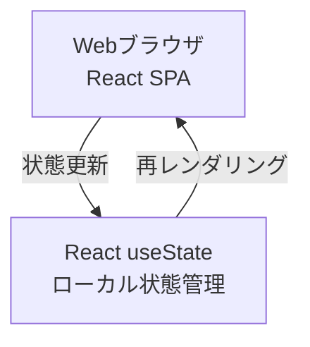
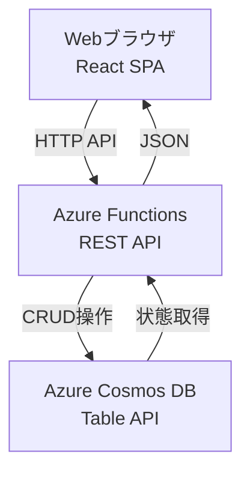
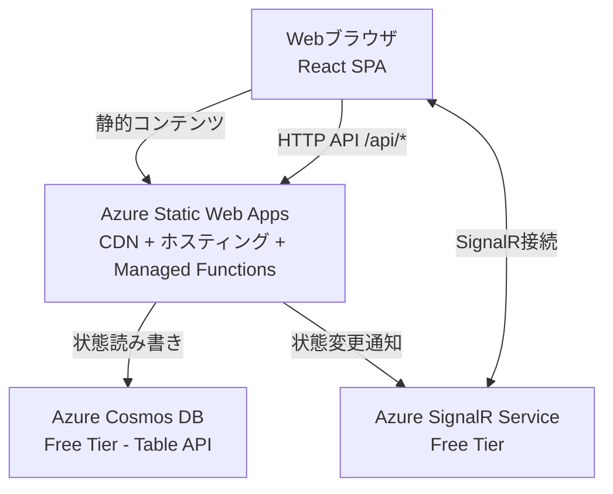
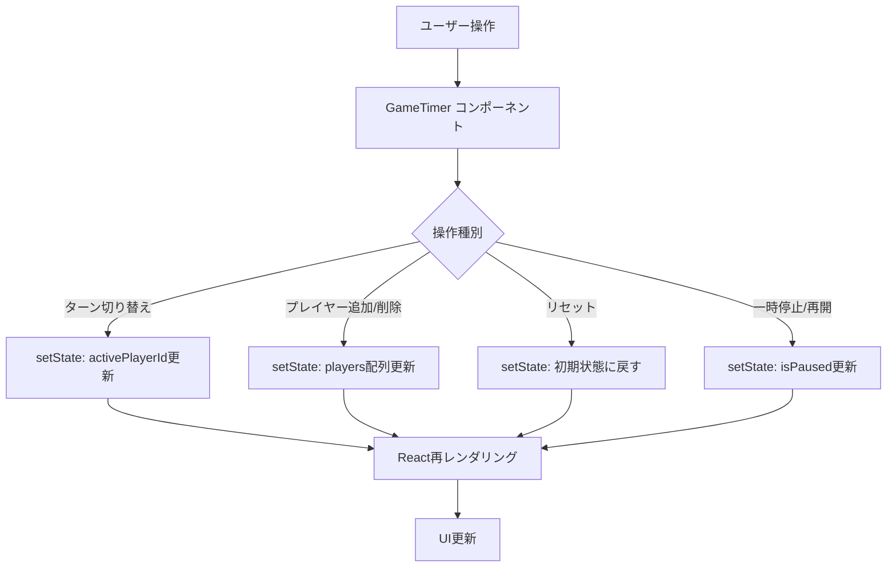
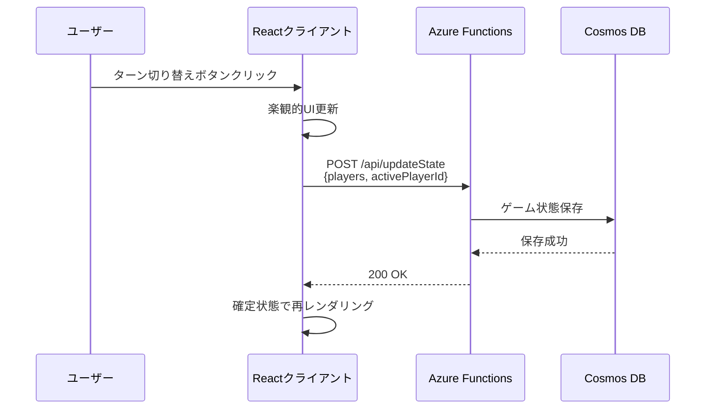
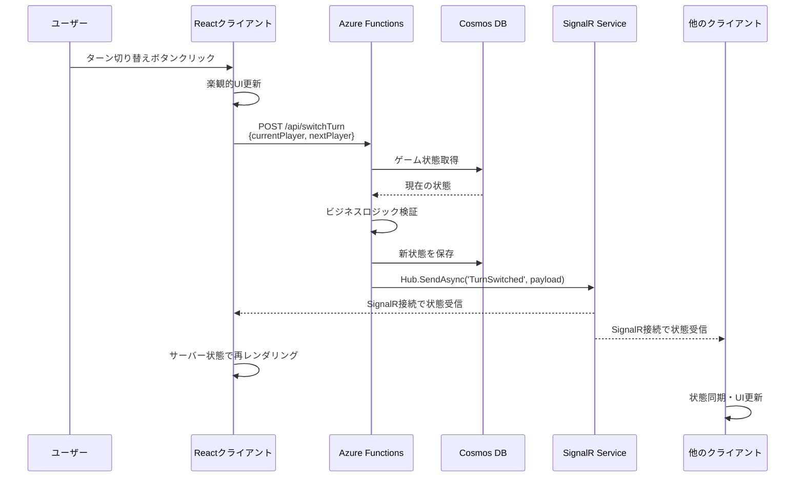

# 技術設計書

## 概要

本機能は、4〜6人のプレイヤーの経過時間を個別に計測する、ボードゲーム用のマルチプレイヤー対応タイマーアプリケーションを提供する。段階的実装戦略により、まずローカル動作するインメモリータイマーを確立し、その後データベース統合、リアルタイム同期を順次追加する。

**目的**: ボードゲームのプレイヤーに対し、公平な時間管理と複数デバイス間でのリアルタイム同期を実現する。

**ユーザー**: ボードゲームをプレイする4〜6人のプレイヤーおよび観戦者。ローカル対戦およびリモート対戦の両方に対応。

**影響**: 新規アプリケーションとしてゼロから構築。既存システムへの影響なし。

### ゴール
- 4〜6人のプレイヤーの時間を正確に計測（カウントアップ/カウントダウン両対応、デフォルトはカウントアップ）
- 複数デバイス間でのリアルタイムな状態同期（1秒以内の遅延）
- Azure無料層での完全な運用（コスト0円）
- レスポンシブデザインによる全デバイス対応
- 認証不要のシンプルなアクセス

### 非ゴール
- ユーザーアカウント管理や認証機能
- 履歴保存や統計機能
- ゲームルールの実装（タイマー機能のみ）
- 有料プランへの移行を前提とした設計
- モバイルネイティブアプリの提供

## 段階的実装戦略

現在、DB/SignalR接続の複雑さにより、タイマー機能の動作確認が困難な状況にある。この問題を解決するため、以下の3段階で段階的に機能を追加する戦略を採用する。

### Phase 1: インメモリータイマー（ローカル動作確認）

**目的**: タイマーロジックを確立し、UI/UXを完成させる

**アーキテクチャ**:


**実装対象**:
- React コンポーネント全体（GameTimer、PlayerList、TimerControls）
- タイマーロジック（カウントアップ/カウントダウン、1秒更新）
- プレイヤー管理（4〜6人の追加/削除）
- ターン管理（アクティブプレイヤー切り替え、循環ロジック）
- ゲームコントロール（リセット、一時停止、再開）
- タイマーモード切り替え（カウントアップ/カウントダウン）

**削除・無効化対象**:
- `api/` ディレクトリ全体（Azure Functions APIは一時削除）
- Cosmos DB接続コード
- SignalR接続コード（クライアント側）
- `@microsoft/signalr` パッケージ
- `@azure/data-tables` パッケージ
- Azure関連の環境変数設定

**状態管理**:
- React `useState` のみ使用
- `GameTimerState` をルートコンポーネントで管理
- ページリロード時は初期状態（4人プレイヤー、カウントアップモード）にリセット

**検証基準**:
- ✅ タイマーが1秒ごとに正確に更新される
- ✅ プレイヤー追加/削除が正常に動作する
- ✅ ターン切り替えが循環ロジックで機能する
- ✅ リセット、一時停止、再開が正常に動作する
- ✅ カウントアップ/カウントダウンモードが正しく切り替わる
- ✅ すべての基本要件（要件1〜4）が単一デバイスで動作する

**Phase 1完了条件**:
- ローカル環境で `npm run dev` を実行し、ブラウザで全機能が動作すること
- タイマーロジックの単体テストが全て成功すること

**フロントエンド実装の検証プロセス（必須）**:

フロントエンド機能の実装完了後は、**必ず**Chrome DevTools MCP（`mcp__chrome-devtools__*`ツール）を使用した実機検証を実施すること。

**検証手順**:
1. **テスト実装と実行**:
   - TDD（Test-Driven Development）に従い、実装前にテストを作成
   - 全テストが成功することを確認（`npm test`）

2. **Chrome DevTools検証**:
   - `npm run dev`で開発サーバー起動
   - `mcp__chrome-devtools__navigate_page`でアプリケーションにアクセス
   - `mcp__chrome-devtools__take_snapshot`で初期状態確認
   - 実装した機能の操作（`click`, `fill`, `evaluate_script`等）
   - 各操作後に`take_snapshot`で状態変化を確認
   - タイマー動作は`sleep`後にスナップショットで時間経過を確認

3. **検証項目（Task 10.2の例）**:
   ```
   ✅ カウントアップモード自動インクリメント
      - プレイヤーをアクティブに設定
      - 数秒待機後、タイマーが増加していることを確認

   ✅ 一時停止機能
      - 一時停止ボタンクリック
      - タイマーが停止していることを確認（数秒待機して変化なし）

   ✅ 再開機能
      - 再開ボタンクリック
      - タイマーが再び動作することを確認

   ✅ カウントダウンモード
      - カウントダウンボタンクリック
      - 全プレイヤーが初期時間にリセットされることを確認
      - タイマーが減少していることを確認

   ✅ 0:00停止（テストコードで検証済みの場合は省略可）
      - カウントダウンモードで0秒到達時の動作確認
   ```

4. **検証完了の基準**:
   - 全ての単体テストが成功
   - Chrome DevToolsで実装した全機能が想定通り動作
   - エラーや予期しない動作が発生しない
   - tasks.mdの該当タスクをチェック済み`[x]`に更新

**検証ツール**:
- `mcp__chrome-devtools__navigate_page`: ページ遷移
- `mcp__chrome-devtools__take_snapshot`: ページ状態のテキストスナップショット取得
- `mcp__chrome-devtools__click`: 要素クリック
- `mcp__chrome-devtools__fill`: フォーム入力
- `mcp__chrome-devtools__evaluate_script`: JavaScript実行
- `Bash(sleep N)`: タイマー動作確認のための待機

**注意事項**:
- テストだけでなく、**必ず**Chrome DevToolsでの実機検証を実施すること
- 検証結果はタスク完了時のコメントとして記録すること
- 想定外の動作が見つかった場合は、実装を修正して再検証すること

---

### Phase 2: DB統合（状態永続化）

**目的**: ページリロード後も状態を保持する

**アーキテクチャ**:


**実装対象**:
- `api/` ディレクトリの再作成
- Azure Functions APIエンドポイント（GET /api/game、POST /api/updateState）
- CosmosDbRepository（CRUD操作、楽観的ロック）
- GameStateService（ビジネスロジック）
- クライアント側API呼び出し（fetch または axios）

**状態管理の変更**:
- React `useState` + API連携
- 初回ロード時: `GET /api/game` で状態取得
- 状態変更時: `POST /api/updateState` で状態保存
- ページリロード時: DBから最新状態を復元

**検証基準**:
- ✅ ページリロード後も最後のゲーム状態が保持される
- ✅ Cosmos DBへの読み書きが正常に動作する
- ✅ 楽観的ロックによる競合解決が機能する

**Phase 2完了条件**:
- ローカル環境で Azure Functions を起動し、DB統合が動作すること
- Azure環境へデプロイし、本番環境で動作すること

---

### Phase 3: SignalR統合（リアルタイム同期）

**目的**: 複数デバイス間でリアルタイムに状態を同期する

**アーキテクチャ**:


**実装対象**:
- SignalR Output Binding（Azure Functions）
- SignalRハブメソッド（TurnSwitched、TimerUpdated、GameReset、PlayersUpdated）
- クライアント側SignalR接続（`@microsoft/signalr`）
- 楽観的更新 + イベントソーシング

**状態管理の変更**:
- React `useState` + API連携 + SignalRイベント購読
- 状態変更時: クライアント側で楽観的更新 → API呼び出し → SignalRブロードキャスト
- 他デバイスからのイベント受信: SignalRイベントで状態更新

**検証基準**:
- ✅ 複数ブラウザタブで同時アクセスし、リアルタイム同期が動作する
- ✅ タイマー更新が1秒以内に全クライアントに反映される
- ✅ 接続切断時の自動再接続が機能する

**Phase 3完了条件**:
- 本番環境で複数デバイスからアクセスし、リアルタイム同期が動作すること
- すべての要件（要件1〜7）が完全に満たされること

---

### Phase別コンポーネント有効化マップ

| コンポーネント/機能 | Phase 1 | Phase 2 | Phase 3 |
|-------------------|---------|---------|---------|
| **フロントエンド** | | | |
| GameTimer コンポーネント | ✅ | ✅ | ✅ |
| PlayerList コンポーネント | ✅ | ✅ | ✅ |
| TimerControls コンポーネント | ✅ | ✅ | ✅ |
| タイマーロジック（1秒更新） | ✅ | ✅ | ✅ |
| プレイヤー管理 | ✅ | ✅ | ✅ |
| ターン管理 | ✅ | ✅ | ✅ |
| ゲームコントロール | ✅ | ✅ | ✅ |
| API呼び出し（fetch） | ❌ | ✅ | ✅ |
| SignalR接続 | ❌ | ❌ | ✅ |
| **バックエンド** | | | |
| Azure Functions API | ❌ | ✅ | ✅ |
| GameStateService | ❌ | ✅ | ✅ |
| CosmosDbRepository | ❌ | ✅ | ✅ |
| SignalR Output Binding | ❌ | ❌ | ✅ |
| **インフラ** | | | |
| ローカル開発サーバー（Vite） | ✅ | ✅ | ✅ |
| Azure Static Web Apps | ❌ | ✅ | ✅ |
| Azure Cosmos DB | ❌ | ✅ | ✅ |
| Azure SignalR Service | ❌ | ❌ | ✅ |

---

### 段階的移行ガイド

**Phase 1 → Phase 2 への移行**:
1. `api/` ディレクトリを再作成
2. Azure Functions プロジェクトをセットアップ
3. Cosmos DB接続設定（`local.settings.json`）
4. GameStateService、CosmosDbRepository を実装
5. クライアント側でAPI呼び出しを追加（`fetch` または `axios`）
6. ローカルでAzure Functions を起動し、動作確認

**Phase 2 → Phase 3 への移行**:
1. Azure SignalR Service をプロビジョニング
2. SignalR Output Binding を Azure Functions に追加
3. クライアント側で `@microsoft/signalr` をインストール
4. SignalR接続コードを追加（negotiate、イベント購読）
5. 楽観的更新ロジックを実装
6. 複数デバイスでのリアルタイム同期を検証

---

## アーキテクチャ

### Phase 3最終アーキテクチャ


### アーキテクチャの特徴

**Azure無料層の活用**:
- Azure Static Web Apps Free Tier: 静的コンテンツ配信（250MB）+ Managed Functions統合
- Azure SignalR Service Free Tier: リアルタイム通信（同時接続20、メッセージ2万/日）
- Azure Cosmos DB Free Tier: ゲーム状態の永続化（1000 RU/s + 25GB、完全無料）

**Managed Functions**:
- Azure Static Web Appsに統合されたサーバーレスAPI（別個のFunctionsリソース不要）
- `/api`フォルダのコードが自動デプロイ
- 月100万リクエスト無料枠を含む

**アーキテクチャパターン**: イベント駆動アーキテクチャ + CQRSライト
- コマンド（タイマー操作）: REST API経由でFunctionsに送信
- クエリ（状態取得）: SignalR経由でリアルタイム配信
- 状態変更時にSignalRを通じて全クライアントへブロードキャスト

**技術的制約**:
- 同時接続数上限20（SignalR Service Free Tier制約）
- メッセージ数上限2万/日（1秒更新で約5.5時間分）
- 認証レイヤーなし（無料層でのシンプル運用）

## 技術スタック

### フロントエンド
- **選択**: React 18 + TypeScript + Vite
- **根拠**:
  - React: コンポーネントベースの開発効率とエコシステム
  - TypeScript: 型安全性によるバグ削減
  - Vite: 高速ビルドと開発体験
- **代替案検討**:
  - Vue.js: 学習コストは低いがエコシステムがやや小さい
  - Vanilla JS: 開発速度が遅く保守性が低い

### リアルタイム通信（Phase 3のみ）
- **選択**: Azure SignalR Service
- **根拠**:
  - 高レベルAPI（ハブ抽象化、自動再接続、トランスポートフォールバック）
  - SignalR SDKの成熟したエコシステムと豊富なドキュメント
  - Azure Functionsとのネイティブバインディング（SignalR Output Binding）
  - 学習目的としてSignalRの実践的な理解を深められる
- **代替案検討**:
  - Azure Web PubSub: 低レベルWebSocket APIでプロトコル制御は柔軟だが、SignalR学習には不向き
  - ポーリング: リアルタイム性が低くメッセージ数消費が多い

### バックエンド（Phase 2以降）
- **選択**: Azure Functions (Node.js 20 + TypeScript)
- **根拠**:
  - サーバーレスで運用コスト最小化
  - 無料枠が大きい（月100万リクエスト）
  - SignalRとのバインディング対応
- **代替案検討**:
  - Azure App Service: 無料層でも常時起動コストあり
  - コンテナ: 無料枠なし

### データストア（Phase 2以降）
- **選択**: Azure Cosmos DB Free Tier (Table API)
- **根拠**:
  - 完全無料運用が可能（1000 RU/s + 25GB無料枠、本用途は約2.5 RU/s使用）
  - SLA付き低レイテンシ（読み取り<10ms、書き込み<15ms）
  - 全プロパティの自動インデックス化（Table Storageは PartitionKey/RowKey のみ）
  - バックアップ機能内蔵
  - Table Storage互換SDK（`@azure/data-tables`）でコード変更最小
- **代替案検討**:
  - Azure Table Storage: コスト優位性なし（Cosmos DB Free Tierで完全無料実現可能）
  - Azure SQL Database: 無料層なし、リレーショナルDBは本用途に過剰

### ホスティング（Phase 2以降）
- **選択**: Azure Static Web Apps
- **根拠**:
  - 静的コンテンツ配信 + CDN + カスタムドメイン対応
  - GitHub Actionsとの自動CI/CD統合
  - 無料枠で十分（250MB、月100GBトラフィック）
- **代替案検討**:
  - Azure Blob Storage + CDN: 設定が複雑
  - Azure App Service: 静的サイトには過剰

### 主要な設計判断

#### 判断1: 段階的実装戦略の採用

- **決定**: Phase 1（インメモリー）→ Phase 2（DB）→ Phase 3（SignalR）の3段階で実装
- **背景**: DB/SignalR接続の複雑さにより、タイマーロジックの動作確認が困難
- **代替案**:
  - 一気に全機能実装: 複雑性が高く、デバッグが困難
  - Phase 1スキップ: タイマーロジックの確立前にDB/SignalR統合すると問題の切り分けが困難
- **選択理由**: 各Phaseで動作確認しながら進められる、問題の切り分けが容易
- **トレードオフ**: Phase 1で実装したコードを Phase 2/3 で一部修正する必要があるが、全体の開発速度は向上

#### 判断2: ハイブリッドタイマー方式（カウントアップ/カウントダウン切り替え）

- **決定**: カウントアップモードとカウントダウンモードの両方を実装し、ゲーム開始時にモードを選択可能にする
- **背景**:
  - カウントアップ: 「誰が一番早く考えたか」を測定（カタンなどのゲームでのターン時間計測）
  - カウントダウン: 時間制限のあるゲームに対応（持ち時間制）
  - プレイスタイルに応じてモードを切り替えられる柔軟性が重要
- **代替案**:
  - カウントアップのみ: 実装はシンプルだが時間制限ゲームに非対応
  - カウントダウンのみ: 初期時間設定が必須で柔軟性が低い
- **選択理由**:
  - 実装複雑度の増加は限定的（タイマーロジックの条件分岐のみ）
  - 幅広いゲームタイプに対応できる汎用性
  - デフォルトはカウントアップモードで、学習曲線を緩やか
- **トレードオフ**:
  - UI要素が増える（モード切り替えボタン、カウントダウン時の初期値設定）
  - テストケースが2倍になる
  - ただし、ユーザー価値が明確に向上するため許容範囲

#### 判断3: 楽観的更新 + イベントソーシング（Phase 3のみ）

- **決定**: クライアント側で即座にUI更新し、サーバーで状態を確定後にSignalRで全体同期
- **背景**: リアルタイム性を確保しつつ、無料層のメッセージ数制約に対応
- **代替案**:
  - サーバー確定後にUI更新: レスポンスが遅く感じる
  - クライアント完全自律: 複数デバイス間の不整合が発生
- **選択理由**: 操作感を損なわず、最終的な一貫性を保証
- **トレードオフ**: 一時的な不整合の可能性があるが、UX優先

## システムフロー

### Phase 1: インメモリータイマーフロー



### Phase 2: DB統合フロー



### Phase 3: SignalRリアルタイム同期フロー



## 要件トレーサビリティ

| 要件 | 要件概要 | Phase 1 | Phase 2 | Phase 3 |
|------|---------|---------|---------|---------|
| 1.1 | 4人デフォルト表示 | ✅ useState初期値 | ✅ GET /api/game | ✅ 同左 |
| 1.2 | 4〜6人で変更可能 | ✅ PlayerManager | ✅ POST /api/updatePlayers | ✅ 同左 + SignalR |
| 1.3 | 即座にUI反映 | ✅ setState | ✅ 楽観的更新 | ✅ SignalRイベント |
| 1.4 | プレイヤー名表示 | ✅ PlayerList Component | ✅ 同左 | ✅ 同左 |
| 2.1 | MM:SS形式表示 | ✅ formatTime関数 | ✅ 同左 | ✅ 同左 |
| 2.2 | カウントアップ/ダウン | ✅ TimerController | ✅ 同左 | ✅ 同左 |
| 2.3 | 1秒ごとに更新 | ✅ setInterval | ✅ 同左 | ✅ 同左 + 5秒同期 |
| 2.4 | 停止時に保持 | ✅ setState保持 | ✅ DB保存 | ✅ 同左 |
| 2.5 | リセット機能 | ✅ setState初期化 | ✅ POST /api/resetGame | ✅ 同左 + SignalR |
| 2.7 | 時間切れ通知 | ✅ CSS赤色表示 | ✅ 同左 | ✅ 同左 |
| 2.8 | 全タイマーリセット | ✅ setState初期化 | ✅ POST /api/resetGame | ✅ 同左 + SignalR |
| 3.1 | 他タイマー停止 | ✅ ビジネスロジック | ✅ 同左 | ✅ 同左 |
| 3.2 | ハイライト表示 | ✅ CSS active class | ✅ 同左 | ✅ 同左 |
| 3.3 | ターン切り替え | ✅ TurnManager | ✅ POST /api/switchTurn | ✅ 同左 + SignalR |
| 3.4 | 循環ロジック | ✅ (index + 1) % players.length | ✅ 同左 | ✅ 同左 |
| 4.1-4.4 | ゲーム制御 | ✅ setState操作 | ✅ API呼び出し | ✅ 同左 + SignalR |
| 5.1-5.4 | リアルタイム同期 | ❌ 単一デバイスのみ | ❌ ページリロードで同期 | ✅ SignalR Service |
| 6.1-6.4 | レスポンシブUI | ✅ CSS Grid + Media Queries | ✅ 同左 | ✅ 同左 |
| 7.1-7.4 | Azure無料ホスティング | ❌ ローカルのみ | ✅ Azure Static Web Apps + Cosmos DB | ✅ 同左 + SignalR |

## コンポーネントとインターフェース

### フロントエンド層

#### GameTimer コンポーネント（ルートコンポーネント）

**責任と境界**
- **主要責任**: アプリケーション全体の状態管理（Phase 1: useState、Phase 2: useState + API、Phase 3: useState + API + SignalR）
- **ドメイン境界**: UIレイヤー全体の統括
- **データ所有**: グローバルゲーム状態（プレイヤー情報、タイマー値、アクティブプレイヤー）
- **トランザクション境界**: クライアント側状態更新の原子性

**依存関係**
- **インバウンド**: なし（ルートコンポーネント）
- **アウトバウンド**: PlayerList, TimerControls, SignalRConnectionManager（Phase 3のみ）
- **外部**: Azure SignalR Service（Phase 3のみ）

**契約定義**

```typescript
interface GameTimerState {
  players: Player[];
  activePlayerId: string | null;
  isPaused: boolean;
  timerMode: 'count-up' | 'count-down';
  lastUpdated: Date;
}

interface Player {
  id: string;
  name: string;
  elapsedTimeSeconds: number; // カウントアップ: 経過時間、カウントダウン: 残り時間
  initialTimeSeconds: number; // カウントダウンモード時の初期時間（デフォルト: 600秒）
  isActive: boolean;
}
```

**Phase別実装差分**:
- **Phase 1**: `useState` のみ、ローカル状態管理
- **Phase 2**: `useState` + API呼び出し（`useEffect` でサーバー同期）
- **Phase 3**: `useState` + API呼び出し + SignalRイベント購読

**状態管理**
- **状態モデル**: Idle → Active → Paused → Active → Idle
- **永続化**: Phase 1（なし）、Phase 2（Cosmos DB）、Phase 3（Cosmos DB + SignalR同期）
- **並行制御**: Reactの状態更新キューによる楽観的更新

#### PlayerList コンポーネント

**責任と境界**
- **主要責任**: プレイヤー一覧の表示とアクティブプレイヤーのビジュアル強調
- **ドメイン境界**: プレイヤー表示UI
- **データ所有**: なし（親から受け取るprops）

**依存関係**
- **インバウンド**: GameTimer
- **アウトバウンド**: PlayerCard（個別プレイヤー表示）
- **外部**: なし

**契約定義**

```typescript
interface PlayerListProps {
  players: Player[];
  activePlayerId: string | null;
  onPlayerSelect?: (playerId: string) => void;
}
```

**Phase別実装差分**: 全Phase共通（変更なし）

#### TimerControls コンポーネント

**責任と境界**
- **主要責任**: ゲーム操作（開始、停止、リセット、ターン切り替え、モード切り替え）のUIインターフェース
- **ドメイン境界**: 操作UI
- **データ所有**: なし（イベントハンドラのみ）

**依存関係**
- **インバウンド**: GameTimer
- **アウトバウンド**: Phase 1（親コンポーネントのsetStateコールバック）、Phase 2/3（API Client）
- **外部**: Phase 2/3（Azure Functions API）

**API契約（Phase 2/3のみ）**

| Method | Endpoint | Request | Response | Errors |
|--------|----------|---------|----------|--------|
| GET | /api/game | なし | `{ success: boolean, state: GameTimerState }` | 500 |
| POST | /api/updateState | `{ state: GameTimerState }` | `{ success: boolean }` | 400, 500 |
| POST | /api/switchTurn | `{ currentPlayerId: string, nextPlayerId: string }` | `{ success: boolean, state: GameTimerState }` | 400, 500 |
| POST | /api/resetGame | `{}` | `{ success: boolean, state: GameTimerState }` | 500 |
| POST | /api/updatePlayers | `{ playerCount: number }` | `{ success: boolean, players: Player[] }` | 400, 500 |

**Phase別実装差分**:
- **Phase 1**: 親コンポーネントのsetStateコールバックを呼び出すのみ
- **Phase 2**: API呼び出し（fetch または axios）
- **Phase 3**: API呼び出し + SignalRイベント送信（サーバー側で処理）

### バックエンド層（Phase 2/3のみ）

#### GameStateService (Azure Functions)

**責任と境界**
- **主要責任**: ゲーム状態の一貫性を保証し、ビジネスルールを適用
- **ドメイン境界**: ゲーム状態管理ドメイン
- **データ所有**: Cosmos DBのゲーム状態（PartitionKey: "game", RowKey: "current"）
- **トランザクション境界**: 単一ゲーム状態の更新

**依存関係**
- **インバウンド**: HTTP Trigger Functions
- **アウトバウンド**: CosmosDbRepository、SignalROutputBinding（Phase 3のみ）
- **外部**: Azure Cosmos DB (Table API)、Azure SignalR Service（Phase 3のみ）

**契約定義**

```typescript
interface GameStateService {
  getCurrentState(): Promise<Result<GameTimerState, StateError>>;
  updateState(state: GameTimerState): Promise<Result<void, ValidationError>>;
  switchTurn(currentPlayerId: string, nextPlayerId: string): Promise<Result<GameTimerState, ValidationError>>;
  resetGame(): Promise<Result<GameTimerState, StateError>>;
  updatePlayers(playerCount: number): Promise<Result<Player[], ValidationError>>;
}

type Result<T, E> = { success: true; data: T } | { success: false; error: E };
```

**前提条件**:
- ゲーム状態がCosmos DBに存在すること
- プレイヤーIDが有効であること

**事後条件**:
- Phase 2: Cosmos DBへの永続化が成功すること
- Phase 3: 状態変更時に必ずSignalRへイベント送信

**不変条件**:
- アクティブプレイヤーは常に0人または1人
- プレイヤー数は4〜6人の範囲内

#### CosmosDbRepository（Phase 2/3のみ）

**責任と境界**
- **主要責任**: ゲーム状態の永続化とCRUD操作
- **ドメイン境界**: データ永続化層
- **データ所有**: Cosmos DB (Table API) `GameStates` テーブル

**依存関係**
- **インバウンド**: GameStateService
- **アウトバウンド**: なし
- **外部**: Azure Cosmos DB (Table API)

**契約定義**

```typescript
interface CosmosDbRepository {
  getGameState(): Promise<GameStateEntity | null>;
  saveGameState(state: GameStateEntity): Promise<void>;
  deleteGameState(): Promise<void>;
}

interface GameStateEntity {
  partitionKey: string; // "game"
  rowKey: string; // "current"
  stateJson: string; // JSON.stringify(GameTimerState)
  timestamp: Date;
}
```

**並行制御**: ETag による楽観的ロック（Cosmos DB Table API標準機能）

#### SignalROutputBinding（Phase 3のみ）

**責任と境界**
- **主要責任**: SignalR Serviceへのイベント配信
- **ドメイン境界**: リアルタイム通信層
- **データ所有**: なし（イベント配信のみ）

**依存関係**
- **インバウンド**: GameStateService（Azure Functions内）
- **アウトバウンド**: なし（Output Bindingとして自動処理）
- **外部**: Azure SignalR Service

**ハブメソッド契約**

```typescript
interface SignalRHubMethods {
  // サーバー→クライアント
  TurnSwitched(activePlayerId: string): void;
  TimerUpdated(playerId: string, elapsedTimeSeconds: number): void;
  GameReset(state: GameTimerState): void;
  PlayersUpdated(players: Player[]): void;
}
```

## データモデル

### 論理データモデル

**GameState エンティティ**

ゲーム全体の状態を表現する集約ルート。

```typescript
interface GameState {
  players: Player[];
  activePlayerId: string | null;
  isPaused: boolean;
  timerMode: 'count-up' | 'count-down';
  createdAt: Date;
  lastUpdatedAt: Date;
}

interface Player {
  id: string; // UUID v4
  name: string; // "プレイヤー1" など
  elapsedTimeSeconds: number; // カウントアップ: 経過時間、カウントダウン: 残り時間（秒）
  initialTimeSeconds: number; // カウントダウンモード時の初期時間（秒）
  isActive: boolean;
  createdAt: Date;
}
```

**ビジネスルールと不変条件**:
- `players.length` は4〜6の範囲
- `activePlayerId` がnullでない場合、対応するPlayerが存在し、`isActive = true`
- アクティブなプレイヤーは最大1人
- `elapsedTimeSeconds` は非負整数
- `timerMode` のデフォルト値は `'count-up'`（ゲーム初期化時）
- カウントアップモード時: `elapsedTimeSeconds` は0から開始
- カウントダウンモード時: `elapsedTimeSeconds` は `initialTimeSeconds` から開始し、0以下で時間切れ
- `initialTimeSeconds` は正の整数（デフォルト: 600秒）

**整合性境界**:
- GameState全体が単一のトランザクション境界
- プレイヤー追加/削除時に既存タイマー値はリセット

### 物理データモデル（Phase 2/3のみ）

**Azure Cosmos DB (Table API)**

**テーブル名**: `GameStates`

| プロパティ | 型 | 説明 | 制約 |
|----------|----|----|------|
| PartitionKey | String | 固定値 `"game"` | 必須 |
| RowKey | String | 固定値 `"current"` | 必須 |
| StateJson | String | GameStateのJSON文字列 | 最大2MB（Cosmos DB制限） |
| Timestamp | DateTime | 最終更新日時（自動） | 自動設定 |
| _etag | String | 楽観的ロック用（Cosmos DB自動管理） | 自動設定 |

**インデックス**: 全プロパティ自動インデックス（Cosmos DB Table API特徴）

**パーティショニング戦略**: 単一パーティション（ゲーム状態は1つのみ）

**TTL戦略**: 設定なし（継続的に1つの状態を上書き）

**RU消費見積もり**:
- 1回の読み取り（1KB）: 約1 RU
- 1回の書き込み（1KB）: 約6 RU
- タイマー同期（5秒ごと）: 12回/分 × 6 RU = 72 RU/分 = 約1.2 RU/秒

## エラーハンドリング

### エラー戦略

本アプリケーションでは、ユーザーエラー、システムエラー、ビジネスロジックエラーの3層に分類し、それぞれ明確な回復戦略を定義する。

### エラーカテゴリと対応

**ユーザーエラー (4xx)**
- **無効な入力**: プレイヤー数が範囲外（4未満、6超過）
  - フロントエンドでバリデーション、エラーメッセージ表示
  - 例: 「プレイヤー数は4〜6人の範囲で指定してください」
- **不正なプレイヤーID**: 存在しないプレイヤーIDでターン切り替え
  - 400エラー返却、エラーメッセージ「指定されたプレイヤーが見つかりません」

**システムエラー (5xx)（Phase 2/3のみ）**
- **Cosmos DB接続失敗**: ネットワークエラー、サービス障害
  - リトライ戦略: 3回まで指数バックオフ（1秒、2秒、4秒）
  - 失敗時: 「サービスが一時的に利用できません。しばらくしてから再試行してください」
- **SignalR接続失敗**（Phase 3のみ）: 接続切断
  - 自動再接続機能（`withAutomaticReconnect()`）
  - クライアントに接続状態をUI表示（接続中/切断中/再接続中）
- **タイムアウト**: API応答が10秒超過
  - フロントエンドでローディング表示 → タイムアウト後にエラー通知

**ビジネスロジックエラー (422)**
- **ルール違反**: 既にアクティブなプレイヤーがいる状態で別プレイヤーを開始
  - 422エラー、「他のプレイヤーのターンが進行中です」
- **状態競合**: 楽観的ロック失敗（ETag不一致）
  - 最新状態を取得して再試行、3回失敗で「同時更新が発生しました。画面を更新してください」

### Phase別エラーハンドリング

**Phase 1**:
- クライアント側バリデーションのみ
- エラー発生時: UIにエラーメッセージ表示
- リトライ: ユーザーの手動操作のみ

**Phase 2/3**:
- クライアント側バリデーション + サーバー側バリデーション
- API エラー: HTTP ステータスコードでエラー種別判定
- リトライ: 自動リトライ（指数バックオフ）+ ユーザー通知

## テストストラテジー

### Phase別テスト戦略

#### Phase 1: インメモリータイマー

**ユニットテスト（Vitest）**:
1. タイマーロジック:
   - `formatElapsedTime(seconds)` 関数（MM:SS変換）
   - カウントアップ/カウントダウンロジック
   - 時間切れ検出（カウントダウンモード）
2. プレイヤー管理:
   - プレイヤー追加/削除ロジック
   - プレイヤー数バリデーション（4〜6人）
3. ターン管理:
   - アクティブプレイヤー切り替えロジック
   - 循環ロジック（最後のプレイヤー → 最初のプレイヤー）

**コンポーネントテスト（React Testing Library）**:
1. GameTimer コンポーネント:
   - 初期レンダリング（4人プレイヤー、カウントアップモード）
   - ターン切り替えボタンクリック → アクティブプレイヤー変更
   - リセットボタンクリック → 初期状態に戻る
2. PlayerList コンポーネント:
   - アクティブプレイヤーのハイライト表示
   - プレイヤー数変更時のレンダリング

#### Phase 2: DB統合

**ユニットテスト（Jest）**:
1. GameStateService:
   - `getCurrentState()`: Cosmos DBから状態取得
   - `updateState()`: 状態保存とバリデーション
   - ビジネスルール検証（不正なプレイヤーID、アクティブプレイヤー排他制御）
2. CosmosDbRepository:
   - モックを使用したCRUD操作の検証
   - ETagによる楽観的ロック処理

**統合テスト**:
1. API統合:
   - GET /api/game → Cosmos DBから状態取得
   - POST /api/updateState → Cosmos DB更新
   - 楽観的ロック競合シナリオ

#### Phase 3: SignalRリアルタイム同期

**統合テスト**:
1. SignalRフロー:
   - クライアント接続 → negotiate → ハブ接続確立
   - サーバーイベント送信 → クライアント受信 → 状態同期
   - 接続切断 → 自動再接続

**E2Eテスト（Playwright）**:
1. 基本操作フロー:
   - アプリ起動 → ターン開始 → タイマー動作確認 → ターン切り替え
2. 複数デバイス同期:
   - 2つのブラウザタブで同時アクセス
   - 片方でターン切り替え → もう片方でリアルタイム反映確認
3. リセット機能:
   - ゲーム進行中 → リセット → 全タイマー0:00確認

## セキュリティ考慮事項

### 脅威モデリング

**認証不要アクセスのリスク**:
- 脅威: 悪意のあるユーザーによるゲーム状態の改ざん
- 対策: Rate Limiting（Azure Functions標準機能）で1 IP当たり100リクエスト/分に制限
- 緩和策: 本アプリケーションは競技性の低いカジュアル用途であり、改ざんによる実害は限定的

**DoS攻撃**:
- 脅威: 大量リクエストによるサービス停止
- 対策: Azure Front DoorのDDoS保護（Standard無料提供）
- 対策: SignalR Service接続数上限（20）による自然な制限

**データ改ざん**:
- 脅威: WebSocket経由での不正なイベント送信
- 対策: クライアント→サーバーのメッセージはすべてHTTP API経由（サーバー側検証）
- SignalRはサーバー→クライアントの一方向通信のみ

### セキュリティ制御

**入力バリデーション**:
- すべてのAPI入力でTypeScriptスキーマバリデーション（Zod使用）
- プレイヤー数: 4〜6の範囲チェック
- プレイヤーID: UUID形式検証

**データ保護**:
- HTTPS強制（Azure Static Web Apps標準）
- SignalR接続はTLS 1.2以上
- Cosmos DBは保存時暗号化（Azure標準）

**コンプライアンス**:
- 個人情報非収集（GDPR対象外）
- クッキー非使用

## パフォーマンスとスケーラビリティ

### 目標メトリクス

| メトリクス | 目標値 | 測定方法 |
|----------|-------|---------|
| ページ初回表示時間 | < 2秒 | Lighthouse CI |
| API応答時間（P95）（Phase 2/3） | < 500ms | Application Insights |
| SignalR遅延（Phase 3） | < 1秒 | カスタムロギング |
| 同時接続数（Phase 3） | 20（上限） | SignalR Service監視 |

### スケーリング戦略

**Phase 1**: スケーリング不要（ローカルのみ）

**Phase 2/3**:
- Azure Functionsは自動スケール（Consumption Plan）
- SignalR Serviceは単一ユニット（Free Tier制約）

### キャッシング戦略

**Phase 1**: ブラウザメモリのみ（useState）

**Phase 2/3**:
- CDNキャッシュ（Azure Static Web Apps）: 静的アセット max-age=31536000
- クライアントサイドキャッシュ: ゲーム状態はメモリ内のみ（LocalStorage非使用）