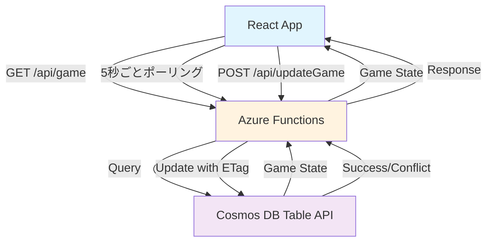
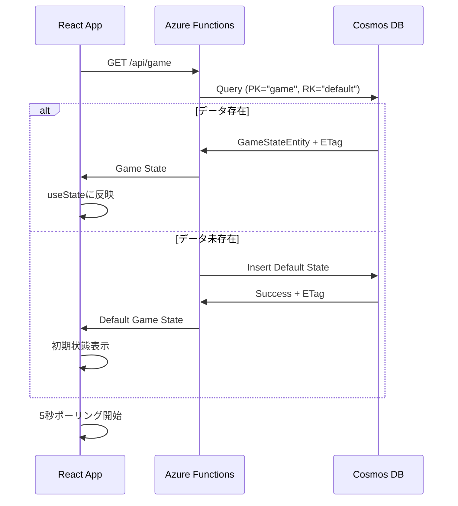
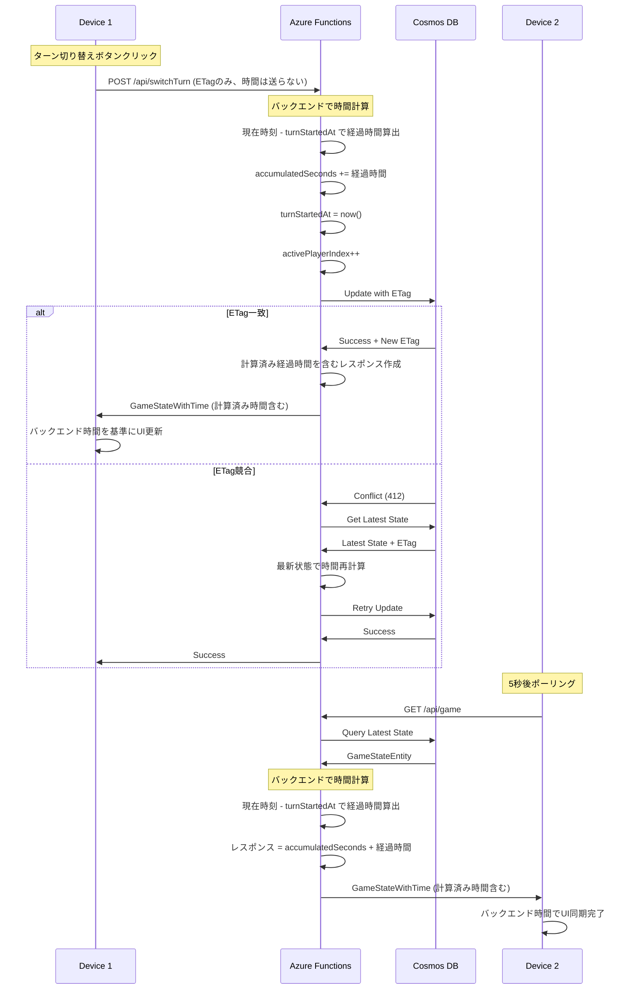
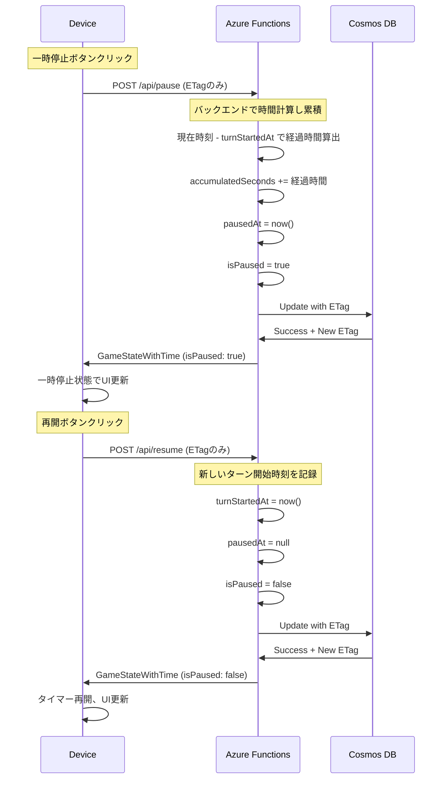
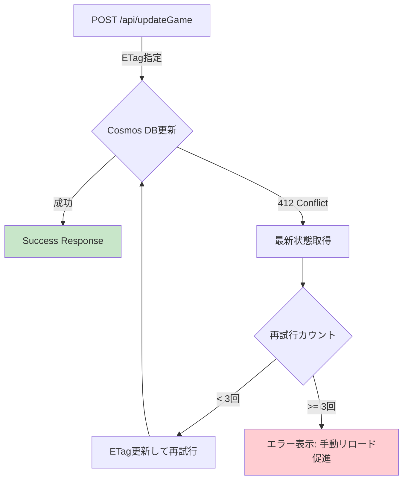

# 技術設計書

## 概要

本機能は、既存のインメモリータイマー（multiplayer-game-timer Phase 1完了）に、Cosmos DB永続化とポーリング同期機能を追加します。バックエンド主導のタイマー管理により、複数デバイス間での状態共有を実現します。

**対象ユーザー**: 複数デバイスからゲームタイマーを共有したいボードゲームプレイヤー

**実現価値**:
- ブラウザリロード後も状態復元可能
- 複数デバイス間での状態共有（5秒間隔ポーリング同期）
- Azure無料層での完全無料運用

**既存システムへの影響**:
- multiplayer-game-timer Phase 1のReactコンポーネント（GameTimer）を拡張
- インメモリー状態管理からAzure Functions + Cosmos DB統合へ移行
- 既存のUIとタイマーロジックは維持、同期機能を追加レイヤーとして実装

### 目標
- Cosmos DB Table APIによる永続化と状態復元
- 5秒間隔のポーリング同期による複数デバイス間の状態共有
- バックエンド主導の時間計算による正確性と一貫性の保証
- Azure無料層制約内での安定動作（Cosmos DB 1000 RU/s）

### 非目標
- 認証・認可機能（無料層でのシンプル運用）
- ゲーム履歴の保存（ステートレス設計）
- リアルタイム同期（SignalRは別仕様signalr-realtime-syncで実装）
- 複雑なクエリや集計機能

## アーキテクチャ

### 既存アーキテクチャ分析

**現在の実装** (multiplayer-game-timer Phase 1):
- React 19 + TypeScript + Viteフロントエンド
- useStateによるインメモリー状態管理（gameState）
- プレイヤー配列、アクティブプレイヤーインデックス、タイマーモードを管理
- Azure Static Web Appsにデプロイ済み

**統合方針**:
- 既存のGameTimerコンポーネントを拡張（破壊的変更なし）
- 状態管理をローカルuseState → Azure Functions API連携に移行
- UIとタイマーロジックは既存コードを最大限再利用

### 全体アーキテクチャ



**アーキテクチャの特徴**:
- **バックエンド主導時間計算**: フロントエンドは時間を送信せず、バックエンドがturnStartedAtから経過時間を計算
- **ETag楽観的ロック**: Cosmos DBのETagで競合検出、最大3回自動再試行
- **5秒ポーリング同期**: フロントエンドが定期的にGET /api/gameで最新状態を取得

### 技術スタック調整

本機能は既存のmultiplayer-game-timerを拡張するため、確立された技術スタックに新しい依存関係を追加します。

**追加ライブラリ**:
- `@azure/data-tables` (13.3.x): Cosmos DB Table APIクライアント
  - 選定理由: Azure公式SDKで型安全、無料層対応
  - 代替案: REST API直接呼び出し（型安全性低下のため不採用）

- `@azure/functions` (4.8.x): Azure Functions SDK
  - 選定理由: Managed Functions（Static Web Apps統合）で必須
  - 代替案: なし（Azure環境での標準）

**既存技術スタックとの統合**:
- React 19: useEffectでポーリングタイマー管理
- TypeScript 5.9: Azure SDKの型定義を活用
- Vite 7: 環境変数でAzure接続文字列を管理

### 主要設計決定

#### 決定1: Cosmos DB Table API選定

**決定**: Cosmos DB Table APIを永続化ストレージとして採用

**コンテキスト**: ゲーム状態（プレイヤー配列、タイマー値、アクティブプレイヤー）を複数デバイス間で共有し、ブラウザリロード後も復元する必要がある

**代替案**:
1. Cosmos DB SQL API: より強力なクエリ機能、ただし無料層が400 RU/s（Table APIは1000 RU/s）
2. Azure Table Storage: シンプルなKey-Value、ただしCosmos DBより機能制限
3. Azure Blob Storage: 構造化データには不向き

**選定アプローチ**: Table API
- シンプルなKey-Valueアクセス（PartitionKey="game", RowKey="default"）
- 無料層1000 RU/s（本用途では約2.5 RU/s使用、余裕あり）
- ETagによる楽観的ロック機能（同時更新競合解決）

**根拠**:
- 単一ゲーム状態の読み書きのみ（複雑なクエリ不要）
- 無料層のRU/s上限が最も高い
- Azure Functions統合が容易

**トレードオフ**:
- 獲得: 無料層での十分なRU/s、シンプルなデータアクセス、楽観的ロック
- 犠牲: 複雑なクエリ機能、リレーショナルデータモデリング

#### 決定2: 5秒ポーリング間隔の選定

**決定**: 5秒間隔のポーリング同期を採用

**コンテキスト**: 複数デバイス間での状態同期頻度とAzure Functions実行コストのバランス

**代替案**:
1. 1秒ポーリング: より頻繁な同期だがAzure Functions実行回数増加
2. 10秒ポーリング: コスト削減だがUX低下
3. 可変間隔: アクティブ時1秒、非アクティブ時10秒（複雑度増加）

**選定アプローチ**: 5秒固定間隔
- Azure Functions月100万リクエスト無料枠に余裕あり
- ボードゲームタイマー用途として十分なレスポンス
- シンプルな実装（可変間隔の複雑さ回避）

**根拠**:
- 無料層制約内での安定動作（月100万リクエスト = 約200回/秒まで可能）
- ユーザー体験とコストのバランス
- 実装シンプル性の維持

**トレードオフ**:
- 獲得: 無料層最適化、シンプル実装、十分なUX
- 犠牲: 即座の同期ではない（リアルタイム同期はSignalR仕様で実現）

#### 決定3: ETagによる楽観的ロック制御

**決定**: Cosmos DB Table APIのETagを使用した楽観的ロック制御

**コンテキスト**: 複数デバイスからの同時更新による競合を検出し、データ整合性を保証する必要がある

**代替案**:
1. 悲観的ロック: 更新前にロック取得（Table APIで未サポート）
2. Last-Write-Wins: 最後の書き込みが勝つ（競合検出なし）
3. カスタムバージョン管理: 独自のバージョンフィールド追加

**選定アプローチ**: ETag楽観的ロック
- Cosmos DBから取得したETagを記録
- 更新時にETagを指定して条件付き更新
- 競合時（ETag不一致）は最新状態を取得して再試行（最大3回）

**根拠**:
- Table API標準機能で追加実装不要
- 競合検出と自動再試行で整合性保証
- 競合頻度が低いゲームタイマー用途に最適

**トレードオフ**:
- 獲得: シンプルな実装、標準機能活用、整合性保証
- 犠牲: 高競合環境では再試行オーバーヘッド

## システムフロー

### フロー1: ゲーム状態初期化（Phase 1）



### フロー2: タイマー操作とポーリング同期（Phase 1）



### フロー3: 一時停止/再開操作



## 要件トレーサビリティ

| 要件 | 要件概要 | コンポーネント | インターフェース | フロー |
|------|----------|----------------|------------------|--------|
| 1.1 | ゲーム状態取得 | GameStateService, GetGameFunction | GET /api/game | フロー1 |
| 1.3 | ゲーム状態保存 | GameStateService, UpdateGameFunction | POST /api/updateGame | フロー2 |
| 2.1 | 5秒ポーリング | PollingService (React useEffect) | GET /api/game | フロー2 |
| 3.1-3.3 | 楽観的ロック | GameStateService (ETag処理) | Cosmos DB条件付き更新 | フロー2 |
| 4.1 | 一時停止/再開 | GameStateService, PauseGameFunction, ResumeGameFunction | POST /api/pause, POST /api/resume | フロー3 |

## コンポーネントとインターフェース

### バックエンド層（Azure Functions）

#### GameStateService

**責任と境界**
- **主要責任**: Cosmos DB Table APIへのゲーム状態CRUD操作
- **ドメイン境界**: ゲーム状態の永続化とETag管理
- **データ所有**: GameStateEntity（PK="game", RK="default"）
- **トランザクション境界**: 単一エンティティ更新（楽観的ロック）

**依存関係**
- **Inbound**: GetGameFunction, UpdateGameFunction, SwitchTurnFunction
- **Outbound**: Cosmos DB Table API (`@azure/data-tables`)
- **External**: Azure Cosmos DB Free Tier（1000 RU/s）

**外部依存関係調査** (@azure/data-tables):
- Azure公式SDK、TypeScript完全サポート
- TableClient APIメソッド: getEntity, upsertEntity, updateEntity
- ETag自動処理: updateEntity({ etag: "*" })で楽観的ロック
- エラー型: RestError (statusCode 412 = Conflict)
- 制約: プリミティブ型のみ（配列はJSON文字列化必須）

**契約定義**

**サービスインターフェース**:
```typescript
interface GameStateService {
  // ゲーム状態取得（初回は初期化、経過時間は計算済み）
  getGameState(): Promise<Result<GameStateWithTime, GameStateError>>;

  // ターン切り替え（バックエンドで時間計算、ETag再試行含む）
  switchTurn(currentEtag: string): Promise<Result<GameStateWithTime, GameStateError>>;

  // 一時停止（バックエンドで時間計算し累積）
  pauseGame(currentEtag: string): Promise<Result<GameStateWithTime, GameStateError>>;

  // 再開（新しいターン開始時刻を記録）
  resumeGame(currentEtag: string): Promise<Result<GameStateWithTime, GameStateError>>;

  // 内部ヘルパー: 経過時間計算
  calculateElapsedSeconds(
    player: Player,
    isActive: boolean,
    isPaused: boolean,
    turnStartedAt: string | null
  ): number;
}

// レスポンス用の型（経過時間は計算済み）
interface GameStateWithTime {
  players: Array<{ name: string; elapsedSeconds: number }>;
  activePlayerIndex: number;
  timerMode: string;
  countdownSeconds: number;
  isPaused: boolean;
  etag: string;
}

type Result<T, E> = { success: true; value: T } | { success: false; error: E };

type GameStateError =
  | { type: 'NotFound' }
  | { type: 'Conflict'; latestState: GameStateWithTime }
  | { type: 'NetworkError'; message: string };
```

**事前条件**:
- Cosmos DB接続文字列が環境変数に設定されていること
- ETag更新時は有効なETag文字列を渡すこと
- フロントエンドから経過時間を送信しないこと（バックエンドが計算）

**事後条件**:
- 成功時は最新のGameStateWithTime（計算済み経過時間含む）とETagを返す
- 競合時はConflictエラーと最新状態（計算済み）を返す
- getGameState()は常に現在時刻で計算した経過時間を返す

**不変条件**:
- GameStateEntityのPK="game", RK="default"は常に固定
- 経過時間の計算はバックエンドのみが実施
- フロントエンドは計算済みの経過時間を表示のみに使用

**状態管理**:
- **状態モデル**: ETagによるバージョン管理（Cosmos DB自動生成）
- **永続化**: Cosmos DB Table API（強整合性）
- **並行制御**: 楽観的ロック（ETag一致確認）
- **時間計算**: バックエンドがturnStartedAtから現在時刻で計算

### フロントエンド層（React）

#### PollingService

**責任と境界**
- **主要責任**: 5秒ごとのバックエンド計算済み時間の同期
- **ドメイン境界**: バックエンド時間との定期同期
- **データ所有**: ポーリングタイマー（setInterval ID）、サーバー時間基準値

**契約定義**

```typescript
interface PollingService {
  // ポーリング開始（バックエンド計算済み時間を取得）
  startPolling(callback: (state: GameStateWithTime) => void): void;

  // ポーリング停止
  stopPolling(): void;

  // ポーリング状態確認
  isPolling(): boolean;
}
```

**実装方法** (React useEffect):
```typescript
// バックエンドから計算済み時間を取得し、ローカルタイマーの基準とする
const [serverTime, setServerTime] = useState(0);     // バックエンド計算の経過時間
const [displayTime, setDisplayTime] = useState(0);   // 表示用時間（滑らか）
const [lastSyncTime, setLastSyncTime] = useState(Date.now());

// 5秒ごとにバックエンドから最新状態を取得
useEffect(() => {
  const intervalId = setInterval(async () => {
    const response = await fetch('/api/game');
    const state = await response.json();

    // バックエンド計算済みの時間を基準に設定
    const serverElapsed = state.players[activePlayerIndex].elapsedSeconds;
    setServerTime(serverElapsed);
    setLastSyncTime(Date.now());
  }, 5000);

  return () => clearInterval(intervalId);
}, [activePlayerIndex]);

// 表示用ローカルタイマー（滑らかなUI更新のみ）
useEffect(() => {
  const displayTimer = setInterval(() => {
    if (!isPaused) {
      const localElapsed = (Date.now() - lastSyncTime) / 1000;
      setDisplayTime(serverTime + localElapsed);
    } else {
      setDisplayTime(serverTime);
    }
  }, 100);  // 100msごとに更新（滑らかな表示）

  return () => clearInterval(displayTimer);
}, [serverTime, lastSyncTime, isPaused]);
```

## データモデル

### 物理データモデル（Cosmos DB Table API）

#### GameStateEntity

Cosmos DB Table APIのスキーマ定義:

```typescript
interface GameStateEntity {
  // Table API必須フィールド
  partitionKey: string;      // 固定値: "game"
  rowKey: string;            // 固定値: "default"
  etag?: string;             // 楽観的ロック用（Cosmos DB自動生成）
  timestamp?: Date;          // 最終更新日時（Cosmos DB自動生成）

  // ゲーム状態フィールド
  playerCount: number;       // プレイヤー数（4-6）
  players: string;           // Player[]をJSON文字列化（Table APIは配列未サポート）
  activePlayerIndex: number; // アクティブプレイヤーインデックス
  timerMode: string;         // 'countup' | 'countdown'
  countdownSeconds: number;  // カウントダウン秒数
  isPaused: boolean;         // 一時停止状態

  // 時間管理フィールド（バックエンド計算用）
  turnStartedAt?: string;    // ISO8601タイムスタンプ、アクティブプレイヤーのターン開始時刻
  pausedAt?: string;         // ISO8601タイムスタンプ、一時停止時刻
}

interface Player {
  name: string;                  // プレイヤー名
  accumulatedSeconds: number;    // 累積経過時間（一時停止時・ターン終了時に加算）
}
```

**シリアライゼーション処理**:
- 保存時: `JSON.stringify(players)` → GameStateEntity.players
- 取得時: `JSON.parse(entity.players)` → Player[]

**主キー設計**:
- PartitionKey: "game"（単一パーティション、複数ゲーム未対応）
- RowKey: "default"（単一ゲーム状態のみ）

**時間管理フィールドの運用**:
- turnStartedAt: アクティブプレイヤーのターン開始時にISO8601形式で記録
- pausedAt: 一時停止時にISO8601形式で記録、再開時にnullに設定
- 経過時間計算: `accumulatedSeconds + (現在時刻 - turnStartedAt) / 1000`（一時停止中は`accumulatedSeconds`のみ）

**ETag運用**:
- Cosmos DBが自動生成（更新ごとに変化）
- 更新時に前回取得したETagを指定
- ETag不一致時はRestError (statusCode: 412)

## エラーハンドリング

### エラー戦略

各エラータイプに対する具体的な処理と復旧メカニズム:

### エラーカテゴリと対応

#### ユーザーエラー (4xx)
- **400 Bad Request**: バリデーションエラー → フィールド単位エラーメッセージ表示
- **404 Not Found**: ゲーム状態未存在 → デフォルト状態で初期化
- **412 Precondition Failed**: ETag競合 → 最新状態取得して再試行（最大3回）

#### システムエラー (5xx)
- **500 Internal Server Error**: Azure Functions障害 → インメモリーモードにフォールバック
- **503 Service Unavailable**: Cosmos DB一時停止 → ローカルストレージ保存、ポーリング再開
- **Timeout**: API応答遅延 → 5秒タイムアウト後エラー表示、再試行ボタン提供

#### ビジネスロジックエラー (422)
- **楽観的ロック競合**: 3回再試行後も失敗 → 手動リロード促進メッセージ

**エラーフロー** (楽観的ロック競合時):



### モニタリング

**エラートラッキング**: Azure Application Insights統合
- エラー率: HTTP 5xx応答の割合
- 楽観的ロック競合率: 412エラーの頻度
- ポーリング失敗率: GET /api/gameエラー頻度

**ログ出力**:
- Info: ゲーム状態取得、更新成功
- Warning: 楽観的ロック競合、ポーリングタイムアウト
- Error: Cosmos DB接続失敗、API応答エラー

**ヘルスモニタリング**:
- Cosmos DB RU/s使用率（目標: <100 RU/s、上限: 1000 RU/s）
- Azure Functions実行回数（目標: <50K/月、上限: 100万/月）
- ポーリング成功率（目標: >95%）

## テスト戦略

### ユニットテスト

**Azure Functions API** (Jest + ts-jest):
- GameStateService CRUD操作（Cosmos DBモック）
  - getGameState: 初回初期化、既存状態取得
  - updateGameState: ETag楽観的ロック、競合処理
  - switchTurn: ターン循環ロジック

- SignalRHubService イベント送信（SignalRモック）
  - broadcastTurnSwitched: TurnSwitchedイベント配信
  - broadcastTimerUpdated: TimerUpdatedイベント配信

**フロントエンド** (Vitest + jsdom):
- PollingService: 5秒ポーリング、停止処理
- SignalRService: 接続、イベントリスナー登録、自動再接続

### 統合テスト

**Azure Functions API → Cosmos DB** (Jest):
- エンドツーエンドCRUD操作
- ETag競合シナリオ（並列更新）
- ネットワークエラーハンドリング

**フロントエンド → Azure Functions** (Vitest):
- GET /api/game → useStateへの反映
- POST /api/updateGame → 楽観的更新

### E2E/UIテスト

**Chrome DevTools MCP検証** (Phase 1):
1. アプリケーション起動（npm run dev）
2. navigate_page → http://localhost:5173
3. take_snapshot → 初期状態確認
4. click（ターン切り替えボタン）→ take_snapshot
5. ブラウザリロード → take_snapshot（状態復元確認）
6. 複数タブ同時操作 → 5秒待機 → take_snapshot（ポーリング同期確認）

**Chrome DevTools MCP検証** (Phase 2):
1. 複数タブでアプリケーション起動
2. タブAでターン切り替え → タブB/Cで即座に反映確認（<1秒）
3. ネットワーク切断（DevTools Offline）→ 自動再接続確認
4. 再接続成功 → 最新状態同期確認

### パフォーマンス/負荷テスト

**Cosmos DB RU/s測定**:
- 1操作あたりのRU消費量測定（目標: <5 RU/操作）
- 同時アクセス時のRU/s合計（目標: <100 RU/s）

**SignalRメッセージ数測定**:
- 1時間の連続操作でのメッセージ数（目標: <1000 msg/時）
- 1秒更新時の1日メッセージ数推定（約5.5時間分 = 20K msg）

**Azure Functions実行時間**:
- GET /api/game: 目標<200ms
- POST /api/updateGame: 目標<300ms
- SignalRブロードキャスト: 目標<100ms

## パフォーマンスとスケーラビリティ

### ターゲットメトリクス

- **API応答時間**: GET /api/game <200ms, POST /api/updateGame <300ms
- **リアルタイム同期**: <1秒でイベント配信（Phase 2）
- **ポーリング同期**: 5秒間隔でCosmos DB状態取得（Phase 1）

### スケーリングアプローチ

**水平スケーリング**:
- Azure Functions: Consumption Planの自動スケール（無料層制約内）
- SignalR Service: 同時接続20まで（無料層上限）

**垂直スケーリング**:
- 不要（無料層固定リソース）

### キャッシング戦略

**クライアントサイド**:
- ETag記録: 最新のETagをReact useStateで保持
- ローカルストレージ: Cosmos DB接続失敗時のフォールバック

**サーバーサイド**:
- なし（Cosmos DB直接アクセス、キャッシュレイヤー不要）

### 最適化テクニック

**無料層最適化**:
- ポーリング間隔調整: 5秒固定（RU/s節約）
- SignalRメッセージ削減: 状態変更時のみ配信（定期送信なし）
- Cosmos DBパーティションキー最適化: 単一パーティション（PK="game"）