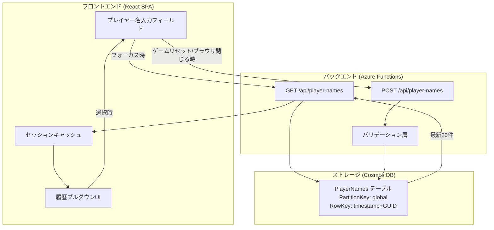
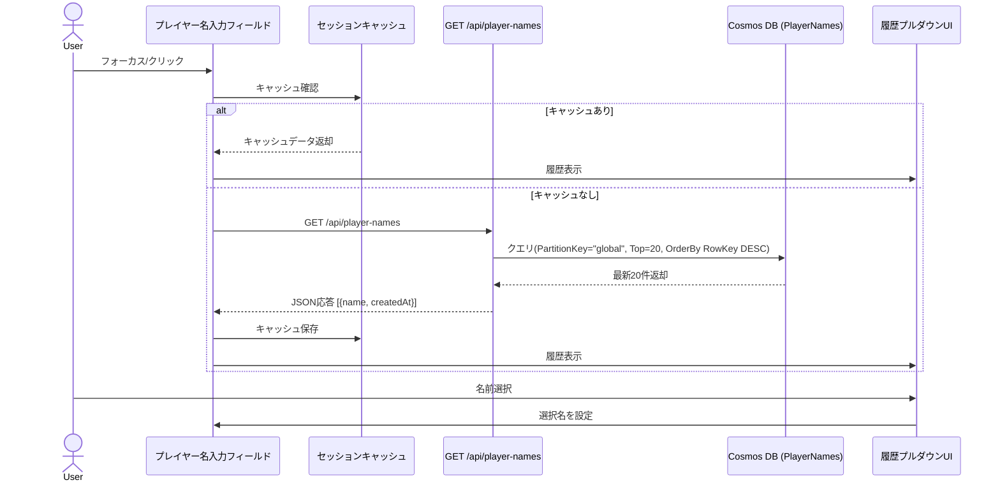
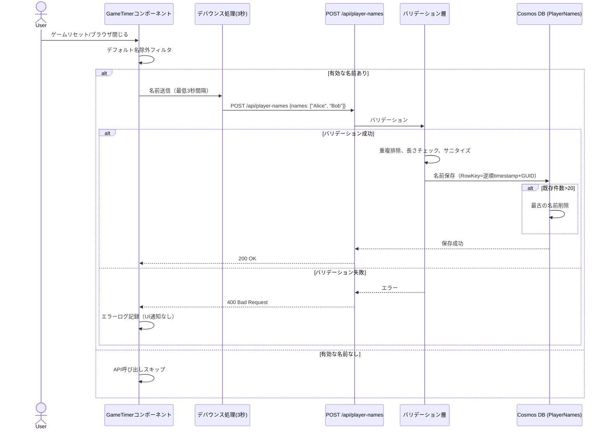

# 技術設計書

## 概要

プレイヤー名永続化機能は、Azure Functions APIとCosmos DB Table APIを活用して、ユーザーが過去に使用したプレイヤー名をサーバーサイドで保存・再利用できるようにする機能です。この機能により、ユーザーはゲーム開始時にプレイヤー名を履歴から素早く選択でき、毎回同じ名前を手入力する手間を省けます。

**目的**: プレイヤー名入力の利便性向上により、ゲーム開始前のセットアップ時間を短縮し、ユーザー体験を改善します。

**ユーザー**: カタンなどのボードゲームをプレイする4〜6人のプレイヤーグループが、同じメンバーで繰り返しゲームを行う際に、名前入力の効率化を実現します。

**影響**: 既存のゲームタイマー機能には一切影響を与えず、プレイヤー名入力UIに選択肢（プルダウン）を追加する形で統合します。API障害時も通常のテキスト入力モードで完全に動作するため、後方互換性を完全に維持します。

### 目標
- Azure無料層の制限内でプレイヤー名履歴を永続化し、最大40件の名前を保存
- プルダウンUIによる素早い名前選択を実現（フォーカス時に自動表示）
- API障害時も既存機能を損なわない堅牢なフォールバック機構を実装
- Cosmos DB使用量を最小化（1操作あたり2.5 RU/s以内）し、コスト0円運用を維持

### 非目標
- ユーザー認証や個人アカウント管理（パブリックアクセスのまま維持）
- プレイヤー名の編集・削除機能（保存と取得のみに特化）
- リアルタイム同期による名前履歴の即時反映（ページリロード時に取得）
- 40件を超える大量の履歴保存（コスト最適化のため上限固定）

## アーキテクチャ

### 既存アーキテクチャ分析

**現在のアーキテクチャパターンと制約**:
- フロントエンド: React SPA（TypeScript）、Viteビルドツール、カスタムフック（`useGameState`）で状態管理
- バックエンド: Azure Functions（Node.js 20、TypeScript）、Cosmos DB Table API永続化
- 既存のCosmos DBテーブル: `GameState`（ゲーム状態保存用、PartitionKey="game", RowKey="default"）
- API設計パターン: RESTful HTTP Trigger Functions、CORSヘッダー設定済み

**既存ドメイン境界**:
- ゲーム状態管理: `useGameState.ts`フック、`gameStateService.ts`バックエンドサービス
- プレイヤー情報: `Player`型定義（`frontend/src/types/GameState.ts`、`api/src/models/gameState.ts`）
- 既存のプレイヤー名生成: `createDefaultPlayer`関数で「プレイヤー1」〜「プレイヤーN」を自動生成

**維持すべき統合ポイント**:
- プレイヤー名入力UI: 現在はGameTimerコンポーネント内で直接テキスト入力（変更不要）
- デフォルト名生成ロジック: `createDefaultPlayer`関数の動作を維持
- 既存のゲーム状態API: `/api/getGame`、`/api/updateGame`等には影響を与えない

**技術的負債への対応**:
- 新規Cosmos DBテーブル（`PlayerNames`）を作成し、既存`GameState`テーブルとは完全に分離
- 既存の`cosmosClient.ts`パターンを踏襲し、新規`playerNamesClient.ts`を作成

### システムアーキテクチャ



**アーキテクチャ統合**:
- **既存パターンの保持**: Cosmos DB Table APIクライアント作成パターン（`cosmosClient.ts`参照）、Azure Functions HTTP Triggerパターン、CORS設定
- **新規コンポーネントの根拠**:
  - `PlayerNames`テーブル: 既存`GameState`テーブルとは異なるパーティション戦略（単一パーティション、タイムスタンプベースRowKey）のため分離
  - プルダウンUIコンポーネント: 既存のテキスト入力UIに統合される小規模コンポーネント（PlayerListコンポーネントに追加）
- **技術スタック適合**: 既存のReact+TypeScript+Azure Functions+Cosmos DBスタックに完全適合、新規依存関係なし
- **ステアリング準拠**:
  - コスト0円運用維持（Cosmos DB無料枠1000 RU/s内、Functions無料枠100万リクエスト内）
  - 認証レイヤーなし維持（パブリックアクセス）
  - 既存機能への影響ゼロ（後方互換性完全維持）

### 技術スタック整合性

本機能は既存システムへの**拡張**であるため、新規技術選定は行わず、既存技術スタックに完全適合します。

**既存技術スタックとの整合性**:
- **フロントエンド**: React 19.1.1 + TypeScript 5.9（既存と同一）
- **バックエンド**: Azure Functions 4.8 + Node.js 20 + TypeScript 5.9（既存と同一）
- **データストレージ**: Cosmos DB Table API（既存と同一）
- **開発ツール**: Vite 7.1、Vitest 3.2、Playwright（既存と同一）

**新規導入する依存関係**: なし（既存の`@azure/data-tables`を活用）

**既存パターンからの逸脱**: なし（完全に既存パターンに準拠）

### 主要な設計判断

#### 判断1: Cosmos DB Table API単一パーティション戦略

**決定**: `PlayerNames`テーブルで全プレイヤー名を単一パーティション（PartitionKey="global"）に保存する

**背景**: Cosmos DB Table APIでは、パーティション分割により水平スケーリングが可能だが、本用途では以下の特性がある:
- 保存データ量: 最大20件 × 50文字/件 = 約1KB（極小）
- アクセスパターン: 全件取得（最新20件）が主な操作
- 同時アクセス数: SignalR無料層制限により最大20接続

**代替案**:
1. **ユーザーIDベースのパーティション分割**: 認証レイヤーが存在しないため不可（現在のパブリックアクセス方式と矛盾）
2. **日付ベースのパーティション分割**: クロスパーティションクエリが必要となり、RU/s消費が増加（2.5 RU/s → 5+ RU/s）
3. **プレイヤー名の先頭文字でパーティション分割**: 検索パターンが「全件取得」のため、クロスパーティションクエリが避けられない

**選択したアプローチ**: 単一パーティション（PartitionKey="global"）+ RowKeyタイムスタンプ逆順ソート

**動作原理**:
- RowKey: `[9999999999999 - timestamp]_[GUID]`（タイムスタンプ逆順でソート可能）
- クエリ: `PartitionKey="global"`でフィルタ → RowKey降順で最大20件取得
- RU/s消費: 約2.5 RU/s（単一パーティションクエリのため低コスト）

**根拠**:
- データ量が極小（1KB以下）のため、パーティション分割のメリット（スケーラビリティ）よりも、単一パーティションクエリの低RU/s消費のメリットが大きい
- Azure無料層の制限内で運用可能（1000 RU/s無料枠の0.25%のみ使用）

**トレードオフ**:
- **獲得**: 低RU/s消費（2.5 RU/s）、シンプルなクエリ、コスト0円運用維持
- **犠牲**: 将来的な大量データ保存時のスケーラビリティ（最大20件に制限することで回避）

#### 判断2: フロントエンドセッションキャッシュ戦略

**決定**: GET `/api/player-names`のレスポンスをメモリ内にキャッシュし、同一セッション内での重複APIリクエストを防止する

**背景**: プレイヤー名履歴は頻繁に変更されないデータであり、以下の特性がある:
- 更新頻度: ゲームリセット時またはブラウザ閉じる時のみ（低頻度）
- 参照頻度: プレイヤー名入力フィールドのフォーカス時（中〜高頻度）
- データサイズ: 最大20件 × 50文字/件 = 約1KB（極小）

**代替案**:
1. **キャッシュなし（毎回API呼び出し）**: Functions無料枠（100万リクエスト/月）を消費しやすい、ネットワーク遅延が体感される
2. **LocalStorage永続キャッシュ**: サーバーサイドでの名前追加が即座に反映されない、キャッシュ無効化ロジックが複雑化
3. **Service Worker キャッシュ**: PWA対応が必要となり、現在のスコープ外

**選択したアプローチ**: セッションスコープのメモリ内キャッシュ（Reactコンポーネント状態またはカスタムフック内）

**動作原理**:
1. 初回フォーカス時: API呼び出し → レスポンスをメモリ（useState）にキャッシュ
2. 2回目以降のフォーカス時: キャッシュデータを使用、API呼び出しなし
3. ページリロード時: キャッシュクリア → 次回フォーカス時に再取得

**根拠**:
- Functions APIコールを削減（セッション中1回のみ）し、無料枠を温存
- ネットワーク遅延を排除し、プルダウン表示の体感速度を向上
- データ量が極小（1KB）のため、メモリ消費の影響は無視できる

**トレードオフ**:
- **獲得**: APIコール削減、体感速度向上、シンプルな実装
- **犠牲**: 同一セッション内での名前追加が即座に反映されない（ページリロードで解決、実用上問題なし）

#### 判断3: プルダウンUI統合アプローチ

**決定**: 既存のプレイヤー名入力フィールドに、HTML標準の`<datalist>`要素を統合する

**背景**: プレイヤー名履歴の選択UIには以下の実装選択肢がある:
- ブラウザネイティブの`<datalist>`要素
- サードパーティライブラリ（react-select等）
- カスタム実装（`<input>` + プルダウン`<ul>`）

**代替案**:
1. **`<datalist>` + `<input>`標準要素**: ブラウザネイティブ実装、アクセシビリティ自動対応、実装コスト最小、スタイリング制限あり
2. **サードパーティライブラリ（react-select等）**: 機能豊富、バンドルサイズ増加（50KB+）、既存UIスタイルとの統合コスト高
3. **カスタム実装（`<input>` + プルダウン`<ul>`）**: 完全なスタイル制御、実装コスト中程度、アクセシビリティ対応を手動実装

**選択したアプローチ**: `<datalist>` + `<input type="text">`（HTML標準要素）

**動作原理**:
1. `<input list="player-names-history">`でdatalistと紐付け
2. フォーカス時: ブラウザがネイティブにプルダウン表示
3. 入力文字による自動フィルタリング: ブラウザネイティブ機能
4. 選択確定: ブラウザネイティブ機能（Enter/クリック）

**実装例**:
```tsx
<input
  type="text"
  list="player-names-history"
  value={playerName}
  onChange={(e) => setPlayerName(e.target.value)}
/>
<datalist id="player-names-history">
  {historyNames.map((name) => (
    <option key={name} value={name} />
  ))}
</datalist>
```

**根拠**:
- 実装コスト最小（HTML標準要素、追加JSコードほぼ不要）
- アクセシビリティ自動対応（ブラウザネイティブのARIA属性）
- バンドルサイズ増加なし
- 保守コスト最小（ブラウザ標準仕様に準拠）

**トレードオフ**:
- **獲得**: 実装コスト最小、アクセシビリティ自動対応、保守性高、バンドルサイズ増加なし
- **犠牲**: スタイリング制限（ブラウザごとにUIが異なる）、ローディングスピナー表示不可（実用上問題なし）

## システムフロー

### プレイヤー名履歴取得フロー



### プレイヤー名保存フロー



## 要件トレーサビリティ

本機能は**拡張機能**であり、要件と実装の対応は直接的なため、詳細なトレーサビリティマトリクスは省略します。主要な要件と実装コンポーネントの対応を以下に示します。

**主要な対応関係**:
- **要件1（サーバーサイド保存）**: `POST /api/player-names` Function + Cosmos DB `PlayerNames`テーブル
- **要件2（履歴API）**: `GET /api/player-names` Function + `POST /api/player-names` Function
- **要件3（データスキーマ）**: `PlayerNamesEntity`型定義 + Cosmos DBテーブル設計
- **要件4（履歴選択UI）**: `PlayerNameDropdown`コンポーネント + セッションキャッシュ
- **要件5（デフォルト名維持）**: 既存`createDefaultPlayer`関数（変更なし）
- **要件8（エラーハンドリング）**: フロントエンドフォールバック機構 + バックエンドエラーログ
- **要件9（パフォーマンス最適化）**: 単一パーティションクエリ + デバウンス処理 + セッションキャッシュ
- **要件10（セキュリティ）**: バリデーション層 + サニタイゼーション + CORS設定

## コンポーネントとインターフェース

### バックエンド層

#### GET /api/player-names Function

**責任と境界**
- **主要責任**: Cosmos DB `PlayerNames`テーブルから最新20件のプレイヤー名履歴を取得し、フロントエンドに返却する
- **ドメイン境界**: プレイヤー名履歴管理ドメイン（ゲーム状態管理ドメインとは分離）
- **データ所有権**: `PlayerNames`テーブルのクエリのみ（読み取り専用）
- **トランザクション境界**: 単一読み取り操作（トランザクション不要）

**依存関係**
- **インバウンド**: フロントエンド（プレイヤー名入力フィールドのフォーカス時）
- **アウトバウンド**: Cosmos DB Table API `PlayerNames`テーブル
- **外部**: `@azure/data-tables`（TableClient）

**API契約**

| メソッド | エンドポイント | リクエスト | レスポンス | エラー |
|--------|----------|---------|----------|--------|
| GET | /api/player-names | なし（クエリパラメータなし） | `PlayerNameResponse[]` | 500, 503 |

**レスポンススキーマ**:
```typescript
interface PlayerNameResponse {
  name: string;        // プレイヤー名（1-50文字）
  createdAt: string;   // 作成日時（ISO 8601形式）
}

// 成功時: 200 OK
{
  "names": [
    { "name": "Alice", "createdAt": "2025-10-19T12:34:56Z" },
    { "name": "Bob", "createdAt": "2025-10-19T11:20:30Z" }
  ]
}

// Cosmos DB読み取り失敗時: 500 Internal Server Error
{
  "error": "Failed to retrieve player names"
}
```

**事前条件**:
- Cosmos DB `PlayerNames`テーブルが存在すること
- 環境変数`CosmosDBConnectionString`が設定されていること

**事後条件**:
- 最新40件のプレイヤー名が最新順（新しい順）で返却される
- Cosmos DB読み取り失敗時は空配列を返却し、エラーをログに記録する

**不変条件**:
- レスポンス配列の要素数は0〜40件の範囲内
- レスポンス配列は作成日時の降順（新しい順）でソートされている

#### POST /api/player-names Function

**責任と境界**
- **主要責任**: フロントエンドから送信されたプレイヤー名をバリデーション後、Cosmos DB `PlayerNames`テーブルに保存する
- **ドメイン境界**: プレイヤー名履歴管理ドメイン
- **データ所有権**: `PlayerNames`テーブルへの書き込み（挿入・削除）
- **トランザクション境界**: 単一書き込み操作（Cosmos DBの単一エンティティ操作により原子性保証）

**依存関係**
- **インバウンド**: フロントエンド（ゲームリセット時、ブラウザ閉じる時）
- **アウトバウンド**: Cosmos DB Table API `PlayerNames`テーブル、バリデーション層
- **外部**: `@azure/data-tables`（TableClient）

**API契約**

| メソッド | エンドポイント | リクエスト | レスポンス | エラー |
|--------|----------|---------|----------|--------|
| POST | /api/player-names | `SavePlayerNamesRequest` | `SavePlayerNamesResponse` | 400, 500, 503 |

**リクエスト/レスポンススキーマ**:
```typescript
interface SavePlayerNamesRequest {
  names: string[];  // プレイヤー名配列（デフォルト名除外済み）
}

interface SavePlayerNamesResponse {
  savedCount: number;  // 実際に保存された件数
}

// リクエスト例
{
  "names": ["Alice", "Bob", "Charlie"]
}

// 成功時: 200 OK
{
  "savedCount": 3
}

// バリデーションエラー: 400 Bad Request
{
  "error": "Invalid player name: name must be 1-50 characters"
}

// Cosmos DB書き込み失敗: 500 Internal Server Error
{
  "error": "Failed to save player names"
}

// RU/s制限超過: 503 Service Unavailable
{
  "error": "Service temporarily unavailable"
}
```

**事前条件**:
- リクエストボディが`Content-Type: application/json`であること
- `names`配列が空でないこと（フロントエンドでフィルタ済み）

**事後条件**:
- バリデーション成功時、全プレイヤー名がCosmos DBに保存される
- 重複する名前は除外される（既存の同名エントリは保持）
- 保存後の総件数が40件を超える場合、最古の名前が削除される

**不変条件**:
- Cosmos DB `PlayerNames`テーブルの総エンティティ数は常に40件以下
- 全エンティティのPartitionKeyは"global"で固定
- 全エンティティのPlayerNameプロパティは1-50文字の範囲内

#### バリデーション層

**責任と境界**
- **主要責任**: POST /api/player-namesのリクエストボディをバリデーションし、不正なデータをフィルタする
- **ドメイン境界**: データバリデーション（入力検証とサニタイゼーション）
- **データ所有権**: なし（読み取り専用、変換のみ）

**依存関係**
- **インバウンド**: POST /api/player-names Function
- **アウトバウンド**: なし（純粋関数）

**バリデーションルール**:
```typescript
interface ValidationResult {
  isValid: boolean;
  sanitizedNames: string[];  // サニタイズ済み名前
  errors: string[];          // バリデーションエラー
}

function validatePlayerNames(names: string[]): ValidationResult {
  // 1. 長さチェック: 1-50文字
  // 2. 重複排除: Set変換
  // 3. サニタイゼーション: HTML特殊文字エスケープ
  // 4. 空文字列除外
}
```

**バリデーションエラー処理**:
- 長さ違反（0文字または51文字以上）: エラー配列に追加、該当名前を除外
- 重複名: 最初の出現のみ保持
- 特殊文字（`<`, `>`, `&`, `"`）: HTMLエンティティにエスケープ

#### playerNamesClient.ts（新規作成）

**責任と境界**
- **主要責任**: Cosmos DB `PlayerNames`テーブルへのTableClientインスタンスを提供する
- **ドメイン境界**: データアクセス層（既存`cosmosClient.ts`パターンに準拠）
- **データ所有権**: `PlayerNames`テーブルへの接続管理のみ

**依存関係**
- **インバウンド**: GET/POST /api/player-names Functions
- **アウトバウンド**: Cosmos DB Table API
- **外部**: `@azure/data-tables`（TableClient.fromConnectionString）

**インターフェース定義**:
```typescript
/**
 * Cosmos DB PlayerNamesテーブルのTableClientを取得
 *
 * @returns {TableClient} PlayerNamesテーブルのTableClientインスタンス
 * @throws {Error} 接続文字列が未設定の場合
 */
export function getPlayerNamesTableClient(): TableClient {
  const validation = validateCosmosDBConfig(); // 既存関数を再利用

  if (!validation.isValid) {
    throw new Error(validation.error);
  }

  return TableClient.fromConnectionString(
    validation.connectionString!,
    'PlayerNames'  // テーブル名のみ変更
  );
}
```

**既存パターンとの統合**:
- `cosmosClient.ts`の`validateCosmosDBConfig()`関数を再利用
- 同一の接続文字列（`CosmosDBConnectionString`）を使用
- テーブル名のみ変更（`GameState` → `PlayerNames`）

### フロントエンド層

#### プレイヤー名入力フィールド（`<datalist>`統合）

**責任と境界**
- **主要責任**: 既存のプレイヤー名入力フィールドに`<datalist>`要素を追加し、履歴選択機能を提供する
- **ドメイン境界**: UIプレゼンテーション層（プレイヤー名入力UI）
- **データ所有権**: なし（`usePlayerNameHistory`フックから取得）

**依存関係**
- **インバウンド**: GameTimerコンポーネント
- **アウトバウンド**: `usePlayerNameHistory`カスタムフック

**実装例**:
```typescript
function PlayerNameInput({ playerId, value, onChange }) {
  const { names } = usePlayerNameHistory();

  return (
    <>
      <input
        type="text"
        list={`player-names-${playerId}`}
        value={value}
        onChange={onChange}
        placeholder="プレイヤー名"
      />
      <datalist id={`player-names-${playerId}`}>
        {names.map((name) => (
          <option key={name} value={name} />
        ))}
      </datalist>
    </>
  );
}
```

**ブラウザネイティブ機能**:
- **自動フィルタリング**: 入力文字による部分一致フィルタリング（ブラウザ実装）
- **キーボード操作**: 矢印キー、Enter、Escapeキー対応（ブラウザ実装）
- **アクセシビリティ**: ARIA属性自動付与（ブラウザ実装）

**レスポンシブ対応**:
- ブラウザネイティブUIのため、各デバイスに最適化されたUI表示

#### usePlayerNameHistory カスタムフック

**責任と境界**
- **主要責任**: プレイヤー名履歴の取得、キャッシュ管理、保存処理を担当するビジネスロジック層
- **ドメイン境界**: プレイヤー名履歴管理ロジック
- **データ所有権**: セッションキャッシュ（`useState`で管理）

**依存関係**
- **インバウンド**: GameTimerコンポーネント
- **アウトバウンド**: GET/POST /api/player-names Functions
- **外部**: `fetch` API、`useEffect`、`useState`

**インターフェース定義**:
```typescript
interface UsePlayerNameHistoryReturn {
  names: string[];                        // 履歴名前配列
  isLoading: boolean;                     // ローディング状態
  error: Error | null;                    // エラー状態
  fetchNames: () => Promise<void>;        // 履歴取得関数
  saveNames: (names: string[]) => Promise<void>;  // 名前保存関数
}

function usePlayerNameHistory(): UsePlayerNameHistoryReturn {
  const [cache, setCache] = useState<string[] | null>(null);
  const [isLoading, setIsLoading] = useState(false);
  const [error, setError] = useState<Error | null>(null);

  // fetchNames: キャッシュチェック → API呼び出し → キャッシュ保存
  // saveNames: デバウンス → API呼び出し → エラーログ（UI通知なし）

  return { names: cache ?? [], isLoading, error, fetchNames, saveNames };
}
```

**キャッシュ戦略**:
1. 初回`fetchNames()`呼び出し: API呼び出し → `setCache(names)`
2. 2回目以降: `cache !== null`なら即座にキャッシュデータ返却
3. ページリロード: `cache`はnullにリセット → 次回API呼び出し

**デバウンス処理**:
```typescript
let saveTimeout: NodeJS.Timeout | null = null;

async function saveNames(names: string[]) {
  if (saveTimeout) {
    clearTimeout(saveTimeout);
  }

  saveTimeout = setTimeout(async () => {
    try {
      await fetch('/api/player-names', {
        method: 'POST',
        headers: { 'Content-Type': 'application/json' },
        body: JSON.stringify({ names })
      });
    } catch (error) {
      console.error('Failed to save player names:', error);
      // UI通知なし（バックグラウンド処理）
    }
  }, 3000);  // 最低3秒間隔
}
```

**エラーハンドリング**:
- `fetchNames()`失敗時: `error`状態に設定、空配列を返却（UI通知なし、プルダウン非表示）
- `saveNames()`失敗時: コンソールログ記録のみ（UI通知なし、アプリケーション動作継続）
- タイムアウト（5秒）: `AbortController`でリクエスト中断、フォールバック処理

## データモデル

### 物理データモデル（Cosmos DB Table API）

#### PlayerNames テーブル

**テーブル設計**:
```typescript
interface PlayerNameEntity {
  partitionKey: string;  // 固定値: "global"
  rowKey: string;        // 逆順タイムスタンプ + GUID: "[9999999999999-timestamp]_[guid]"
  playerName: string;    // プレイヤー名（1-50文字、サニタイズ済み）
  createdAt: string;     // 作成日時（ISO 8601形式）
  timestamp?: Date;      // Cosmos DB自動生成タイムスタンプ
  etag?: string;         // Cosmos DB自動生成ETag（本用途では未使用）
}
```

**RowKey生成ロジック**:
```typescript
function generateRowKey(): string {
  const now = Date.now();
  const reversedTimestamp = 9999999999999 - now;  // 逆順ソート用
  const guid = crypto.randomUUID();
  return `${reversedTimestamp}_${guid}`;
}

// 例: 2025-10-19T12:34:56.789Z
// → RowKey: "8274031043210_a1b2c3d4-e5f6-7890-abcd-ef1234567890"
```

**パーティション戦略**:
- **PartitionKey**: 全エンティティで固定値"global"を使用
- **理由**: データ量が極小（最大20件）のため、単一パーティションで十分
- **RU/s消費**: 約2.5 RU/s（単一パーティションクエリ）

**インデックス戦略**:
- **デフォルトインデックス**: PartitionKey + RowKey（Cosmos DB Table APIのデフォルト）
- **追加インデックス**: 不要（クエリパターンが単一パーティション内のRowKey降順ソートのみ）

**データサイズ試算**:
- 1エンティティ: PartitionKey(6B) + RowKey(50B) + PlayerName(50B) + CreatedAt(30B) ≈ 140B
- 最大40件: 140B × 40 = 5.6KB
- GameStateテーブル（既存）: 約1KB
- 合計: 約6.6KB
- Cosmos DB無料枠（25GB）に対する使用率: 0.00003%

**クエリ例**:
```typescript
// 最新40件取得（RowKey降順）
const tableClient = getPlayerNamesTableClient();
const entities = tableClient.listEntities({
  queryOptions: {
    filter: `PartitionKey eq 'global'`,
    select: ['rowKey', 'playerName', 'createdAt']
  }
});

const names: PlayerNameResponse[] = [];
let count = 0;
for await (const entity of entities) {
  if (count >= 40) break;
  names.push({
    name: entity.playerName as string,
    createdAt: entity.createdAt as string
  });
  count++;
}

// RowKeyが既に逆順タイムスタンプのため、自然順で最新40件が取得される
```

**削除ロジック（40件超過時）**:
```typescript
async function deleteOldestNames(tableClient: TableClient) {
  const entities = tableClient.listEntities({
    queryOptions: { filter: `PartitionKey eq 'global'` }
  });

  const allEntities: PlayerNameEntity[] = [];
  for await (const entity of entities) {
    allEntities.push(entity);
  }

  // RowKey降順ソート（逆順タイムスタンプのため、先頭が最新）
  allEntities.sort((a, b) => a.rowKey.localeCompare(b.rowKey));

  // 40件を超える古いエンティティを削除
  const entitiesToDelete = allEntities.slice(40);
  for (const entity of entitiesToDelete) {
    await tableClient.deleteEntity('global', entity.rowKey);
  }
}
```

### データ契約（API間）

#### PlayerNameResponse（GET /api/player-names レスポンス）

```typescript
interface PlayerNameResponse {
  name: string;        // プレイヤー名（サニタイズ済み、1-50文字）
  createdAt: string;   // 作成日時（ISO 8601形式）
}

interface GetPlayerNamesResponse {
  names: PlayerNameResponse[];  // 最新20件（新しい順）
}
```

**シリアライゼーション**: JSON（`Content-Type: application/json`）

**スキーマバージョニング**: 現時点では不要（単純な構造）、将来的に追加フィールドが必要な場合はオプショナルフィールドとして追加

#### SavePlayerNamesRequest（POST /api/player-names リクエスト）

```typescript
interface SavePlayerNamesRequest {
  names: string[];  // プレイヤー名配列（デフォルト名除外済み）
}

interface SavePlayerNamesResponse {
  savedCount: number;  // 実際に保存された件数（重複除外後）
}
```

**バリデーションルール**:
- `names`配列: 最大6要素（プレイヤー数上限）
- 各`name`: 1-50文字、特殊文字サニタイズ済み

## エラーハンドリング

### エラー戦略

本機能は**非クリティカル機能**（ゲームプレイに影響を与えない）のため、エラー発生時は**サイレントフォールバック**を基本戦略とします。ユーザーには控えめなエラー通知のみを表示し、既存機能（通常のテキスト入力）を継続可能にします。

**基本原則**:
1. **フロントエンドエラー**: UI通知なし、コンソールログ記録のみ、通常のテキスト入力にフォールバック
2. **バックエンドエラー**: HTTPステータスコード返却、サーバーログ記録、フロントエンドはフォールバック処理
3. **Cosmos DBエラー**: リトライなし（単一操作のため）、エラーログ記録、適切なHTTPステータス返却

### エラーカテゴリと対応

#### ユーザーエラー（4xx）

**400 Bad Request - 無効な入力**:
- **原因**: プレイヤー名が空文字列、51文字以上、Content-Typeが非JSON
- **バックエンド対応**: バリデーションエラーメッセージ返却、リクエストボディをログ記録
- **フロントエンド対応**: コンソールログ記録、保存処理を諦める、UI通知なし

**404 Not Found - エンドポイント不明**:
- **原因**: URLタイプミス（開発時のみ発生想定）
- **バックエンド対応**: Azure Functions標準の404レスポンス
- **フロントエンド対応**: コンソールログ記録、通常のテキスト入力にフォールバック

#### システムエラー（5xx）

**500 Internal Server Error - Cosmos DB接続失敗**:
- **原因**: 接続文字列未設定、ネットワーク障害、Cosmos DBサービス障害
- **バックエンド対応**:
  ```typescript
  try {
    const tableClient = getPlayerNamesTableClient();
    // Cosmos DB操作
  } catch (error) {
    console.error('Cosmos DB connection failed:', error);
    return {
      status: 500,
      jsonBody: { error: 'Failed to retrieve player names' }
    };
  }
  ```
- **フロントエンド対応**:
  - GET失敗時: プルダウン非表示、通常のテキスト入力のみ提供
  - POST失敗時: コンソールログ記録、保存処理を諦める、ゲームプレイ継続

**503 Service Unavailable - RU/s制限超過**:
- **原因**: Cosmos DB無料層のRU/s制限（1000 RU/s）を超過
- **発生頻度**: 極めて低い（本機能のRU/s消費は2.5 RU/s程度）
- **バックエンド対応**:
  ```typescript
  try {
    await tableClient.createEntity(entity);
  } catch (error) {
    if (error.statusCode === 429) {  // Too Many Requests
      console.error('RU/s limit exceeded:', error);
      return {
        status: 503,
        jsonBody: { error: 'Service temporarily unavailable' }
      };
    }
  }
  ```
- **フロントエンド対応**: コンソールログ記録、保存処理を諦める、UI通知なし

#### ネットワークエラー

**タイムアウト（5秒）**:
- **原因**: ネットワーク遅延、Azure Functions コールドスタート
- **フロントエンド対応**:
  ```typescript
  const controller = new AbortController();
  const timeoutId = setTimeout(() => controller.abort(), 5000);

  try {
    const response = await fetch('/api/player-names', {
      signal: controller.signal
    });
  } catch (error) {
    if (error.name === 'AbortError') {
      console.error('Request timeout:', error);
      // プルダウン非表示、通常のテキスト入力にフォールバック
    }
  } finally {
    clearTimeout(timeoutId);
  }
  ```

**ネットワーク切断**:
- **原因**: クライアント側のネットワーク障害
- **フロントエンド対応**:
  - GET失敗時: プルダウン非表示、通常のテキスト入力のみ提供
  - POST失敗時: コンソールログ記録、次回接続時に再試行なし（仕様上問題なし）

### エラー監視とログ

**フロントエンド**:
```typescript
// コンソールログ（開発/本番両対応）
console.error('[PlayerNameHistory] Failed to fetch:', error);
console.warn('[PlayerNameHistory] Fallback to text input only');
```

**バックエンド**:
```typescript
// Azure Functions標準ログ（Application Insights連携）
context.log.error('Failed to retrieve player names:', error);
context.log.warn('RU/s limit exceeded, returning 503');
```

**ログレベル**:
- **ERROR**: Cosmos DB接続失敗、予期しない例外
- **WARN**: RU/s制限超過、バリデーションエラー
- **INFO**: 正常なAPI呼び出し（リクエスト/レスポンスログ）

## テスト戦略

### ユニットテスト

**バックエンド（api/src/functions/__tests__/）**:

1. **GET /api/player-names.test.ts**:
   - Cosmos DBから最新40件取得成功（モックデータ40件 → 全件返却確認）
   - Cosmos DB読み取り失敗時に空配列返却（モックでエラースロー → 空配列確認）
   - 10件のみ存在する場合に10件返却（モックデータ10件 → 10件返却確認）

2. **POST /api/player-names.test.ts**:
   - 有効な名前配列の保存成功（["Alice", "Bob"] → savedCount=2確認）
   - バリデーションエラー時に400返却（空文字列含む配列 → 400エラー確認）
   - Cosmos DB書き込み失敗時に500返却（モックでエラースロー → 500エラー確認）
   - 重複名の除外（["Alice", "Alice", "Bob"] → savedCount=2確認）
   - 51文字の名前を拒否（51文字名前 → 400エラー確認）

3. **validatePlayerNames.test.ts**（バリデーション層）:
   - 有効な名前の通過（["Alice"] → isValid=true確認）
   - 空文字列の除外（["Alice", "", "Bob"] → sanitizedNames=["Alice", "Bob"]確認）
   - HTML特殊文字のエスケープ（["<script>"] → sanitizedNames=["&lt;script&gt;"]確認）
   - 重複名の除外（["Alice", "Bob", "Alice"] → sanitizedNames=["Alice", "Bob"]確認）

**フロントエンド（frontend/src/hooks/__tests__/）**:

1. **usePlayerNameHistory.test.ts**:
   - 初回fetchNames呼び出しでAPI呼び出し実行（モックfetch → API呼び出し確認）
   - 2回目fetchNames呼び出しでキャッシュ使用（モックfetch呼び出し回数=1確認）
   - saveNamesデバウンス動作（3秒以内の連続呼び出し → 最後の呼び出しのみ実行確認）
   - API失敗時に空配列返却（モックでエラースロー → names=[]確認）

2. **PlayerNameInput.test.tsx**（`<datalist>`統合テスト）:
   - `<datalist>`要素が正しく生成される（names=["Alice", "Bob"] → 2つの`<option>`確認）
   - `<input list>`属性が正しく設定される（list属性と`<datalist id>`が一致確認）
   - 履歴が空の場合は`<datalist>`が空（names=[] → `<option>`なし確認）

### 統合テスト

**API統合テスト（api/src/functions/__tests__/integration/）**:

1. **playerNamesAPI.integration.test.ts**:
   - GET → POST → GET フロー検証（保存後に取得で反映確認）
   - 40件超過時の自動削除検証（41件保存 → GET で40件のみ確認）
   - Cosmos DB実テーブル接続検証（ローカル開発環境でCosmosDBエミュレーター使用）

**フロントエンド統合テスト（frontend/src/components/__tests__/integration/）**:

1. **PlayerNameInput.integration.test.tsx**:
   - プレイヤー名入力フィールドフォーカス → `<datalist>`オプション表示（モックAPI → `<option>`要素確認）
   - `<datalist>`から名前選択 → 入力フィールドに名前設定（選択 → input.value確認）
   - ゲームリセット → 名前保存API呼び出し（リセット → POST API呼び出し確認）

### E2Eテスト（e2e/specs/）

**player-name-persistence.spec.ts**:

1. **プレイヤー名履歴取得と選択フロー**:
   - 事前条件: Cosmos DBに["Alice", "Bob", "Charlie"]を保存
   - 操作: プレイヤー名入力フィールドをフォーカス
   - 検証: `<datalist>`に3件の`<option>`が存在することを確認
   - 操作: "Alice"を選択（ブラウザネイティブUI）
   - 検証: 入力フィールドに"Alice"が設定されることを確認

2. **プレイヤー名保存フロー**:
   - 操作: プレイヤー1の名前を"David"に変更
   - 操作: ゲームリセットボタンをクリック
   - 検証: POST /api/player-namesが呼び出されることを確認（Network監視）
   - 検証: ページリロード後、プルダウンに"David"が表示されることを確認

3. **API障害時のフォールバック**:
   - 事前条件: モックサーバーで500エラーを返却
   - 操作: プレイヤー名入力フィールドをフォーカス
   - 検証: `<datalist>`が空（`<option>`なし）であることを確認
   - 検証: 通常のテキスト入力が可能であることを確認
   - 検証: エラーUI通知が表示されないことを確認（コンソールログのみ）

### パフォーマンステスト

**Cosmos DB RU/s消費検証**:

1. **GET /api/player-names RU/s測定**:
   - 環境: ローカルCosmosDBエミュレーター
   - 手順: 40件のエンティティ保存 → GETリクエスト実行
   - 測定: レスポンスヘッダー`x-ms-request-charge`を確認
   - 目標: 3 RU/s以内（40件取得のため、20件取得時の2.5 RU/sより若干増加を許容）

2. **POST /api/player-names RU/s測定**:
   - 手順: 3件の名前を保存 → POSTリクエスト実行
   - 測定: レスポンスヘッダー`x-ms-request-charge`を確認
   - 目標: 3 RU/s以内

**フロントエンドキャッシュ効果検証**:
- 手順: 同一セッション内でプレイヤー名入力フィールドを5回フォーカス
- 測定: Network監視でAPI呼び出し回数を確認
- 目標: 1回のみ（初回のみAPI呼び出し、2回目以降はキャッシュ使用）

## セキュリティ考慮事項

### 脅威モデリング

**脅威1: HTMLインジェクション攻撃**
- **攻撃シナリオ**: 悪意のあるユーザーがプレイヤー名に`<script>alert('XSS')</script>`を含めて保存
- **影響**: 他のユーザーがプルダウンから該当名前を選択時、スクリプト実行される可能性
- **対策**: バックエンドバリデーション層でHTML特殊文字をエスケープ（`<` → `&lt;`、`>` → `&gt;`）
- **実装**:
  ```typescript
  function sanitizePlayerName(name: string): string {
    return name
      .replace(/</g, '&lt;')
      .replace(/>/g, '&gt;')
      .replace(/&/g, '&amp;')
      .replace(/"/g, '&quot;')
      .replace(/'/g, '&#x27;');
  }
  ```

**脅威2: DDoS攻撃（API過負荷）**
- **攻撃シナリオ**: 悪意のあるユーザーが短時間に大量のPOSTリクエストを送信
- **影響**: Azure Functions無料枠（100万リクエスト/月）を消費、RU/s制限超過
- **対策**:
  1. フロントエンドデバウンス（最低3秒間隔）
  2. Azure Functions レート制限（IP単位で1分間30リクエスト）
  3. Cosmos DB RU/s制限（1000 RU/s）で自動的にスロットリング
- **実装**: Azure Functions App Settingsでレート制限設定（`AzureWebJobsStorage`経由）

**脅威3: データ改ざん（Cosmos DB直接アクセス）**
- **攻撃シナリオ**: Cosmos DB接続文字列が漏洩し、直接データ操作される
- **影響**: プレイヤー名履歴が削除・改ざんされる
- **対策**:
  1. 接続文字列の厳重管理（Azure Key Vaultまたは環境変数）
  2. Cosmos DBアクセスキーの定期ローテーション
  3. 本機能では機密データを扱わないため、影響は限定的
- **受容リスク**: 認証レイヤーなしのパブリックアクセス設計のため、完全な改ざん防止は不可

### セキュリティコントロール

**データバリデーション**:
- **入力長制限**: 1-50文字（フロントエンド + バックエンド二重検証）
- **特殊文字サニタイズ**: HTML/JavaScript特殊文字をエスケープ
- **Content-Type検証**: `application/json`のみ受け入れ

**CORS設定**:
```typescript
// Azure Functions host.json
{
  "extensions": {
    "http": {
      "customHeaders": {
        "Access-Control-Allow-Origin": "https://yourdomain.azurestaticapps.net",
        "Access-Control-Allow-Methods": "GET, POST, OPTIONS",
        "Access-Control-Allow-Headers": "Content-Type"
      }
    }
  }
}
```

**レート制限**（Azure Functions設定）:
- IP単位: 1分間30リクエスト
- グローバル: 1秒間100リクエスト（無料層の実質上限）

### データ保護とプライバシー

**個人情報の扱い**:
- **収集データ**: プレイヤー名のみ（最大50文字）
- **個人情報該当性**: プレイヤー名は任意入力のため、個人情報に該当する可能性あり
- **データ保持期間**: 最大20件まで保持、21件目保存時に最古削除
- **削除機能**: 現時点では未実装（将来的にCLEAR機能を検討）

**GDPR/CCPA準拠**（参考情報）:
- **データ主体の権利**: 現在の設計では認証なしのため、削除リクエストの紐付け不可
- **同意取得**: プレイヤー名入力時に暗黙の同意（明示的な同意UIなし）
- **データ最小化**: 必要最小限のデータ（名前のみ）を収集
- **受容リスク**: パブリックアクセス設計のため、完全なGDPR準拠は困難（個人利用または同意済みグループ利用を想定）

## パフォーマンスとスケーラビリティ

### 目標メトリクス

| メトリクス | 目標値 | 測定方法 |
|----------|--------|----------|
| GET /api/player-names レスポンス時間 | 500ms以内 | Azure Functions Application Insights |
| POST /api/player-names レスポンス時間 | 1秒以内 | Azure Functions Application Insights |
| Cosmos DB RU/s消費（GET） | 2.5 RU/s以内 | レスポンスヘッダー`x-ms-request-charge` |
| Cosmos DB RU/s消費（POST） | 3 RU/s以内 | レスポンスヘッダー`x-ms-request-charge` |
| プルダウン表示遅延（キャッシュヒット時） | 50ms以内 | Chrome DevTools Performance |
| プルダウン表示遅延（キャッシュミス時） | 600ms以内 | Chrome DevTools Performance（API呼び出し含む） |

### スケーリング戦略

**水平スケーリング（同時接続数）**:
- **現在の制限**: SignalR無料層により最大20同時接続
- **本機能の影響**: なし（SignalRは使用せず、HTTP REST APIのみ）
- **Azure Functions**: Consumption Planにより自動スケール（同時実行数200まで無料枠内）

**データ量スケーリング**:
- **現在の制限**: 最大20件（設計上の固定上限）
- **将来的な拡張**:
  1. ユーザーIDベースのパーティション分割（認証レイヤー追加後）
  2. 上限を40件 → 100件に拡張（PartitionKey="userId"で分割）
  3. Cosmos DB無料枠（25GB）に対する使用率は依然として0.01%未満

**RU/s最適化**:
- **単一パーティションクエリ**: 現在のPartitionKey="global"戦略を維持
- **SELECT句の最小化**: 必要なフィールド（`playerName`, `createdAt`）のみ取得
- **Top句の活用**: 最大20件で明示的に制限

### キャッシュ戦略

**フロントエンドキャッシュ**:
- **スコープ**: セッション（メモリ内、ページリロードでクリア）
- **有効期限**: なし（セッション終了まで保持）
- **無効化**: ページリロード時のみ
- **効果**: API呼び出し削減（セッション中1回のみ）、体感速度向上

**バックエンドキャッシュ**:
- **現時点では未実装**（Cosmos DBクエリが十分高速）
- **将来的な検討**: Azure Redis Cacheによる20件のキャッシュ（TTL: 1時間）

### 最適化手法

**フロントエンド最適化**:
1. **デバウンス処理**: 3秒間隔で連続API呼び出しを抑制
2. **AbortController**: タイムアウト5秒で不要なリクエスト中断
3. **ブラウザネイティブUI**: `<datalist>`要素によりバンドルサイズ増加なし

**バックエンド最適化**:
1. **Cosmos DB接続プール**: TableClientの再利用（Azure Functions Cold Start対策）
2. **非同期処理**: `async/await`によるノンブロッキングI/O
3. **エラーハンドリング**: 早期リターンでCosmos DB操作を最小化
