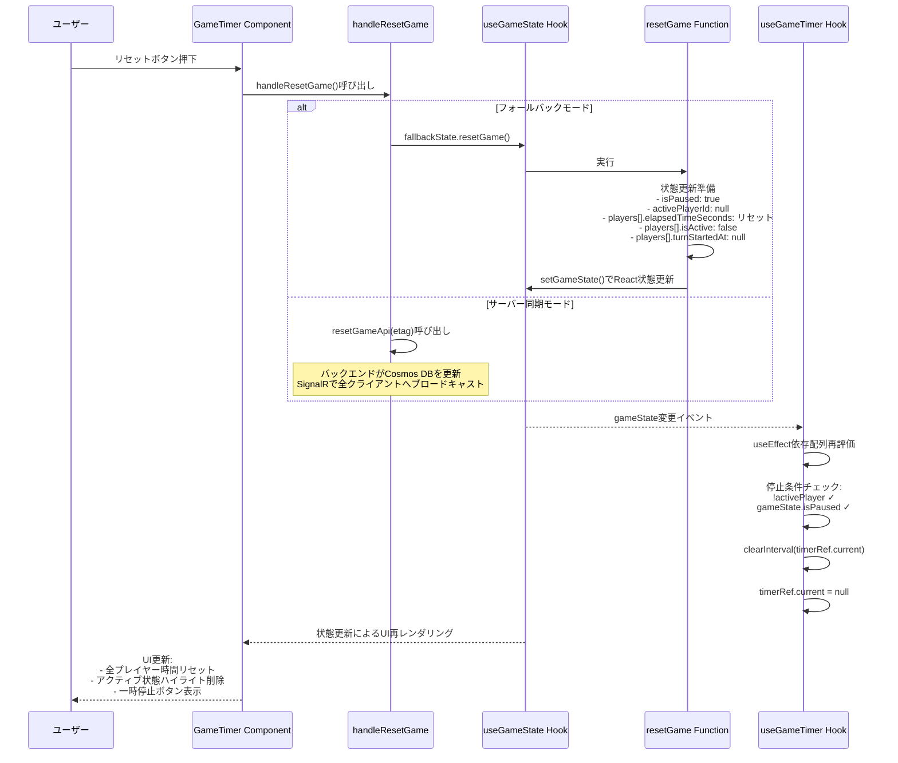
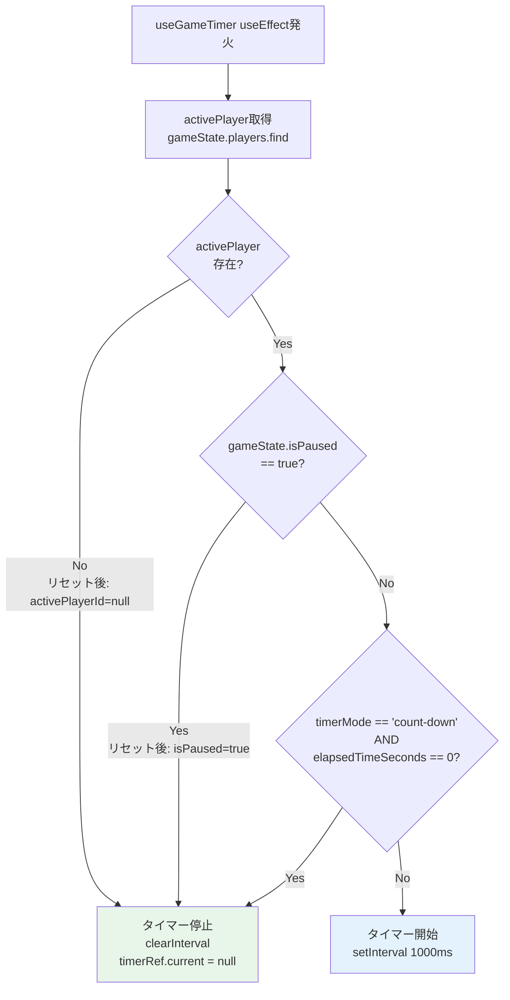
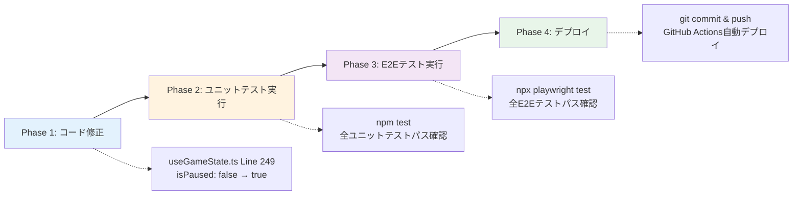

# 技術設計: reset-button-fix

## Overview

**目的**: リセットボタン押下時に全プレイヤーの経過時間を正しくリセットし、タイマーの動作を完全に停止する機能を実現します。これにより、ユーザーはゲームを確実にリセットして新しいゲームを開始できるようになります。

**ユーザー**: ゲーム進行中のプレイヤーが、ゲームをリセットして新しいゲームを開始する際に利用します。

**影響**: 既存の`useGameState.resetGame()`関数の状態リセットロジックを修正します。現在の実装は`isPaused: false`に設定しているため、タイマーが停止せずに動作し続ける不具合があります。修正後は`isPaused: true`に設定することで、`useGameTimer`フックの停止条件が満たされ、タイマーが正しく停止します。

### Goals
- リセットボタン押下時に全プレイヤーの時間を正しくリセット（カウントアップは0秒、カウントダウンは初期時間）
- ゲームを完全に停止状態にする（`activePlayerId: null`, `isPaused: true`）
- タイマーの動作を即座に停止する（`useGameTimer`の停止条件を満たす）
- UI上で停止状態を正しく反映する

### Non-Goals
- 新しいAPI追加やバックエンド変更（既存のresetGame関数の修正のみ）
- リセット確認ダイアログの追加（ユーザーストーリーに含まれていない）
- プレイヤー名履歴保存ロジックの変更（既存のTask 8機能を維持）

## Architecture

### Existing Architecture Analysis

**現在のアーキテクチャパターン**: React Hooks + Custom Hooks パターン

**既存ドメイン境界**:
- **状態管理層**: `useGameState` - ゲーム状態（プレイヤー、タイマーモード、一時停止状態）の管理
- **タイマー制御層**: `useGameTimer` - タイマーインターバルの開始・停止制御
- **UI層**: `GameTimer` - ユーザーインタラクションとUI表示

**統合ポイント**:
- `GameTimer`コンポーネントが`useGameState`から`resetGame()`関数を取得
- `handleResetGame`ハンドラー内で`fallbackState.resetGame()`を呼び出し
- `useGameTimer`が`gameState`の変更を検知してタイマー停止条件を再評価

**技術的負債への対応**:
- 現在の`resetGame`実装の`isPaused: false`設定が不具合の根本原因
- この修正により、既存のタイマー停止ロジック（`useGameTimer`のLine 53）が正しく機能するようになる

### High-Level Architecture

```mermaid
graph TB
    User[ユーザー]
    UI[GameTimer Component]
    Handler[handleResetGame Handler]
    UseGameState[useGameState Hook]
    ResetFn[resetGame Function]
    UseGameTimer[useGameTimer Hook]
    Timer[Timer Interval]

    User -->|リセットボタン押下| UI
    UI -->|呼び出し| Handler
    Handler -->|fallbackState.resetGame| UseGameState
    UseGameState -->|実行| ResetFn
    ResetFn -->|状態更新: isPaused=true, activePlayerId=null| UseGameState
    UseGameState -->|gameState変更| UseGameTimer
    UseGameTimer -->|停止条件評価: !activePlayer || isPaused| UseGameTimer
    UseGameTimer -->|clearInterval| Timer
```

**アーキテクチャ統合**:
- **既存パターン維持**: React Hooks、Custom Hooks、カスタムhookでのビジネスロジック集約
- **新規コンポーネント不要**: 既存の`useGameState.resetGame()`関数の修正のみ
- **技術スタック整合性**: React + TypeScript + Custom Hooks パターンに完全準拠
- **ステアリング準拠**: 関心の分離、単一責任原則、テスト容易性の原則に準拠

### Technology Alignment

**既存技術スタックとの整合性**:
- **フロントエンド**: React 19.1.1 + TypeScript 5.9 + Vite 7.1（変更なし）
- **状態管理**: Custom Hooks (`useGameState`, `useGameTimer`)（変更なし）
- **テストフレームワーク**: Vitest 3.2（ユニットテスト）、Playwright（E2Eテスト）（変更なし）

**新規依存関係**: なし

**パターンからの逸脱**: なし - 既存のカスタムhookパターンに完全準拠

### Key Design Decisions

#### Decision 1: isPausedフラグの設定値変更

**Context**: 現在の`resetGame`実装は`isPaused: false`に設定しているため、`useGameTimer`のタイマー停止条件（`!activePlayer || gameState.isPaused`）が満たされず、タイマーが停止しない不具合が発生しています。

**Alternatives**:
1. **A: isPausedをtrueに変更** - 既存の停止条件ロジックを活用
2. **B: useGameTimerに新しい停止条件を追加** - `gameState.activePlayerId === null`を明示的にチェック
3. **C: resetGame内でタイマーを直接停止** - タイマー参照を受け取り`clearInterval`を直接呼び出し

**Selected Approach**: **A - isPausedをtrueに変更**

**理由**:
- **最小変更**: `useGameState.ts`のLine 249の1箇所のみ修正（`isPaused: false` → `isPaused: true`）
- **既存ロジック活用**: `useGameTimer`のLine 53の既存停止条件（`gameState.isPaused`）が正しく機能する
- **意味的整合性**: リセット後はゲームが停止状態であるべきであり、`isPaused: true`は意味的に正しい
- **UI整合性**: 一時停止/再開ボタンが「一時停止」状態を表示し、ユーザーに停止状態を明確に伝える

**Trade-offs**:
- **Gain**: コード変更が最小限、既存のタイマー停止ロジックを再利用、意味的に正しい状態表現
- **Sacrifice**: なし - この変更による副作用はなく、全ての要件を満たす

#### Decision 2: activePlayerIdをnullに設定

**Context**: リセット後はアクティブプレイヤーが存在しない状態にする必要があります。

**Selected Approach**: `activePlayerId: null`に設定

**Rationale**:
- **二重の停止条件**: `useGameTimer`のLine 53で`!activePlayer || gameState.isPaused`の両方の条件を満たす
- **UI整合性**: 全プレイヤーカードからアクティブ状態のハイライト表示が削除される
- **既存実装との整合性**: 現在の実装でも`activePlayerId: null`に設定されている

#### Decision 3: 既存のプレイヤー名履歴保存機能の維持

**Context**: Task 8で実装されたプレイヤー名履歴保存機能（リセット前にデフォルト名以外を保存）を維持する必要があります。

**Selected Approach**: `handleResetGame`ハンドラー内の既存ロジックを維持

**Rationale**:
- **機能の保持**: ユーザーが入力したプレイヤー名が履歴に保存され、次回のゲームで再利用可能
- **副作用なし**: `resetGame`関数内の状態リセットロジックとは独立しており、変更による影響なし

## System Flows

### Reset Button Click Flow



### Timer Stop Condition Evaluation



## Requirements Traceability

| Requirement | 要件概要 | コンポーネント | インターフェース | フロー |
|-------------|---------|-------------|---------------|-------|
| 1.1-1.6 | ゲーム状態リセット | useGameState.resetGame | setGameState() | Reset Button Click Flow |
| 2.1-2.3 | タイマー動作の完全停止 | useGameTimer | useEffect依存配列, clearInterval | Timer Stop Condition Evaluation |
| 3.1-3.4 | UI状態の正確な反映 | GameTimer Component | React再レンダリング | Reset Button Click Flow |
| 4.1-4.3 | 既存動作保持 | handleResetGame, useGameState | fallbackState.resetGame(), resetGameApi() | Reset Button Click Flow |
| 5.1-5.3 | エラーハンドリング | handleResetGame | try-catch, console.warn | （既存実装を維持） |

## Components and Interfaces

### State Management Layer

#### useGameState Hook - resetGame Function

**Responsibility & Boundaries**
- **Primary Responsibility**: ゲーム状態を初期状態にリセットし、タイマーを停止状態にする
- **Domain Boundary**: ゲーム状態管理ドメイン（プレイヤー、タイマーモード、一時停止状態）
- **Data Ownership**: GameState型のReact状態を所有
- **Transaction Boundary**: React状態更新はアトミックに実行される

**Dependencies**
- **Inbound**: GameTimerコンポーネントの`handleResetGame`ハンドラーから呼び出される
- **Outbound**: React `useState`の`setGameState`関数（React内部API）
- **External**: なし

**Contract Definition**

**Service Interface**:
```typescript
interface GameStateActions {
  // ゲーム状態をリセットする
  resetGame: () => void;
}
```

- **Preconditions**: なし（いつでも呼び出し可能）
- **Postconditions**:
  - 全プレイヤーの`elapsedTimeSeconds`がリセット（カウントアップ: 0秒、カウントダウン: 初期時間）
  - `activePlayerId`が`null`
  - `isPaused`が`true`（**修正ポイント**）
  - `pausedAt`が`null`
  - 全プレイヤーの`isActive`が`false`
  - 全プレイヤーの`turnStartedAt`が`null`
- **Invariants**: `GameState`型の整合性が維持される

**Implementation Change**:
```typescript
// 修正前（Line 249）
isPaused: false,  // ❌ タイマーが停止しない原因

// 修正後（Line 249）
isPaused: true,   // ✅ useGameTimerの停止条件を満たす
```

**State Management**:
- **State Model**: 停止状態への遷移（任意の状態 → 停止状態）
- **Persistence**: フォールバックモードではインメモリ、サーバー同期モードではCosmos DB経由
- **Concurrency**: React状態更新はシングルスレッドで実行されるため競合なし

**Integration Strategy**:
- **Modification Approach**: 既存の`resetGame`関数内の1行を修正（`isPaused: false` → `isPaused: true`）
- **Backward Compatibility**: 既存のAPI呼び出し元（`handleResetGame`）は変更不要
- **Migration Path**: 即座に適用可能、段階的移行不要

### Timer Control Layer

#### useGameTimer Hook

**Responsibility & Boundaries**
- **Primary Responsibility**: ゲーム状態に基づいてタイマーインターバルの開始・停止を制御する
- **Domain Boundary**: タイマー制御ドメイン（インターバル管理、時間計測）
- **Data Ownership**: タイマーインターバル参照（`timerRef`）を所有
- **Transaction Boundary**: タイマー開始・停止操作は即座に実行される

**Dependencies**
- **Inbound**: GameTimerコンポーネントから`gameState`を受け取る
- **Outbound**: `onTimerTick`コールバックで時間更新を通知
- **External**: ブラウザ`setInterval` / `clearInterval` API

**Contract Definition**

**Service Interface**:
```typescript
function useGameTimer(
  gameState: GameState,
  onTimerTick: (playerId: string, newElapsedTime: number) => void,
  onServerSync?: (playerId: string, newElapsedTime: number) => void,
  onTimeExpired?: (playerId: string) => void
): void;
```

- **Preconditions**:
  - `gameState`が有効なGameState型であること
  - `onTimerTick`が有効なコールバック関数であること
- **Postconditions**:
  - 停止条件（`!activePlayer || gameState.isPaused`）が満たされた場合、タイマーが停止される
  - 開始条件が満たされた場合、1秒間隔のタイマーが開始される
- **Invariants**:
  - タイマーは常に1つのみアクティブ（多重起動なし）
  - 停止条件が満たされたらタイマーは即座にクリアされる

**Timer Stop Condition**:
```typescript
// frontend/src/hooks/useGameTimer.ts Line 53
if (!activePlayer || gameState.isPaused || activePlayer.elapsedTimeSeconds === 0 && gameState.timerMode === 'count-down') {
  // タイマーをクリア
  if (timerRef.current) {
    clearInterval(timerRef.current);
    timerRef.current = null;
  }
  syncCounterRef.current = 0;
  return;
}
```

**Integration with resetGame**:
- `resetGame`が`isPaused: true`と`activePlayerId: null`に設定
- `useEffect`依存配列（`[gameState, ...]`）により停止条件が再評価される
- `!activePlayer || gameState.isPaused`が`true`になり、タイマーが停止する

### UI Layer

#### GameTimer Component - handleResetGame Handler

**Responsibility & Boundaries**
- **Primary Responsibility**: ユーザーのリセットボタン押下を処理し、適切なリセット関数を呼び出す
- **Domain Boundary**: UIインタラクション層
- **Data Ownership**: なし（状態管理はhooksに委譲）
- **Transaction Boundary**: フォールバック/サーバー同期モードの分岐制御

**Dependencies**
- **Inbound**: リセットボタンの`onClick`イベント
- **Outbound**:
  - `fallbackState.resetGame()`（フォールバックモード）
  - `resetGameApi(etag)`（サーバー同期モード）
  - `playerNameHistory.saveNames()`（プレイヤー名履歴保存）
- **External**: なし

**Contract Definition**

**Event Handler Interface**:
```typescript
const handleResetGame: () => Promise<void>;
```

- **Preconditions**: なし（いつでも呼び出し可能）
- **Postconditions**:
  - デフォルト名以外のプレイヤー名が履歴に保存される
  - フォールバックモード: `fallbackState.resetGame()`が呼び出される
  - サーバー同期モード: `resetGameApi(etag)`が呼び出され、ETagが更新される
- **Invariants**: 既存のプレイヤー名履歴保存ロジック（Task 8）が維持される

**Integration Strategy**:
- **Modification Approach**: 変更不要（`useGameState.resetGame`の内部実装修正のみ）
- **Backward Compatibility**: 完全互換
- **Migration Path**: 不要

## Data Models

### Logical Data Model

#### GameState型の変更

```typescript
// frontend/src/types/GameState.ts
export interface GameState {
  players: Player[];
  activePlayerId: string | null;  // リセット後: null
  isPaused: boolean;              // リセット後: true（修正ポイント）
  pausedAt: Date | null;          // リセット後: null
  timerMode: 'count-up' | 'count-down';
  lastUpdatedAt: Date;
}

export interface Player {
  id: string;
  name: string;
  elapsedTimeSeconds: number;     // リセット後: 0 or initialTimeSeconds
  initialTimeSeconds: number;
  isActive: boolean;              // リセット後: false
  turnStartedAt: Date | null;     // リセット後: null
}
```

**リセット後の状態値**:
| フィールド | リセット前 | リセット後 | 変更箇所 |
|-----------|----------|----------|---------|
| `isPaused` | true/false | **true** | useGameState.ts Line 249（修正） |
| `activePlayerId` | string | **null** | useGameState.ts Line 248（既存） |
| `pausedAt` | Date/null | **null** | useGameState.ts Line 250（既存） |
| `players[].elapsedTimeSeconds` | 任意 | **0 or initialTimeSeconds** | useGameState.ts Line 243-245（既存） |
| `players[].isActive` | true/false | **false** | useGameState.ts Line 246（既存） |
| `players[].turnStartedAt` | Date/null | **null** | useGameState.ts Line 247（既存） |

### Data Contracts & Integration

#### React State Update Contract

```typescript
// useGameState.resetGame内部実装
setGameState((prev) => ({
  ...prev,
  players: prev.players.map(p => ({
    ...p,
    elapsedTimeSeconds: prev.timerMode === 'count-down' ? p.initialTimeSeconds : 0,
    isActive: false,
    turnStartedAt: null
  })),
  activePlayerId: null,
  isPaused: true,  // 修正: false → true
  pausedAt: null,
  lastUpdatedAt: new Date()
}));
```

**Cross-Component Data Flow**:
```
useGameState.resetGame()
  ↓ setGameState()
React State Update
  ↓ gameState prop更新
useGameTimer.useEffect()
  ↓ 依存配列再評価
停止条件チェック
  ↓ clearInterval()
タイマー停止
```

## Error Handling

### Error Strategy

本修正は状態リセットロジックの1行修正であり、新しいエラーケースは導入されません。既存のエラーハンドリング機構を維持します。

### Error Categories and Responses

**User Errors (handleResetGame内)**:
- **ETag不在（サーバー同期モード）**: `console.warn('ETag not available, cannot reset game')`で警告出力、リセット処理を中断
- **対処**: ユーザーにページ再読み込みを促す（既存実装）

**System Errors (resetGameApi呼び出し)**:
- **412 Conflict（競合エラー）**: サーバーから返された場合、競合メッセージを表示
- **対処**: ユーザーに再読み込みを促す（既存実装）

**Business Logic Errors**:
- **なし**: リセット処理は常に成功する設計（状態の整合性は型システムで保証）

### Monitoring

既存のコンソールログとエラーハンドリングを維持：
- `console.warn()`: ETag不在時の警告
- `console.error()`: API呼び出し失敗時のエラーログ（既存実装）

## Testing Strategy

### Unit Tests

**対象**: `frontend/src/hooks/useGameState.ts` - `resetGame`関数

**テストケース**:
1. **リセット後のisPausedフラグ検証**: `resetGame()`呼び出し後、`gameState.isPaused`が`true`であることを確認
2. **リセット後のactivePlayerId検証**: `resetGame()`呼び出し後、`gameState.activePlayerId`が`null`であることを確認
3. **カウントアップモードでのプレイヤー時間リセット**: `timerMode: 'count-up'`の状態で`resetGame()`呼び出し後、全プレイヤーの`elapsedTimeSeconds`が`0`であることを確認
4. **カウントダウンモードでのプレイヤー時間リセット**: `timerMode: 'count-down'`の状態で`resetGame()`呼び出し後、全プレイヤーの`elapsedTimeSeconds`が`initialTimeSeconds`であることを確認
5. **全プレイヤーのisActiveフラグリセット**: `resetGame()`呼び出し後、全プレイヤーの`isActive`が`false`であることを確認

**対象**: `frontend/src/hooks/useGameTimer.ts` - タイマー停止ロジック

**テストケース**:
1. **isPausedがtrueの場合のタイマー停止**: `gameState.isPaused = true`の状態で`useEffect`が発火した際、タイマーが停止すること（`clearInterval`が呼び出されること）を確認
2. **activePlayerIdがnullの場合のタイマー停止**: `gameState.activePlayerId = null`の状態で`useEffect`が発火した際、タイマーが停止することを確認

### Integration Tests

**対象**: `frontend/src/components/GameTimer.tsx` - `handleResetGame`ハンドラーとhooksの統合

**テストケース**:
1. **フォールバックモードでのリセット統合**: リセットボタン押下時、`fallbackState.resetGame()`が呼び出され、`gameState`が正しくリセットされることを確認
2. **プレイヤー名履歴保存との統合**: リセット前にデフォルト名以外のプレイヤー名が`playerNameHistory.saveNames()`に渡されることを確認
3. **リセット後のタイマー停止確認**: リセット実行後、`useGameTimer`のタイマーインターバルが停止していることを確認

### E2E Tests

**対象**: ブラウザでのエンドツーエンドユーザーフロー

**テストケース**:
1. **リセットボタン押下後のUI状態検証**:
   - リセットボタン押下
   - 全プレイヤーの時間表示が「00:00」（カウントアップ）または初期時間（カウントダウン）にリセットされることを確認
   - アクティブプレイヤーのハイライト表示が削除されることを確認
   - 一時停止/再開ボタンが「一時停止」状態を表示することを確認
2. **リセット後のタイマー停止検証**:
   - リセット実行後、5秒間待機
   - プレイヤーの時間表示が変化しないことを確認（タイマーが停止していることを確認）
3. **リセット後の新規ゲーム開始検証**:
   - リセット実行後、次のプレイヤーへボタンを押下
   - アクティブプレイヤーが設定され、タイマーが開始されることを確認
4. **プレイヤー名履歴保存の検証**:
   - プレイヤー名を変更してゲームを開始
   - リセットボタン押下
   - ページ再読み込み後、プレイヤー名履歴にカスタム名が保存されていることを確認

### Performance Tests

**対象**: リセット処理のレスポンス時間

**テストケース**:
1. **リセットボタン押下のレスポンス時間**: リセットボタン押下からUI更新完了までの時間が100ms以内であることを確認
2. **タイマー停止の即時性**: リセット実行後、タイマーが即座に停止する（次のインターバルが実行されない）ことを確認

## Security Considerations

本修正はクライアント側の状態管理ロジックの1行修正であり、新しいセキュリティリスクは導入されません。

**既存のセキュリティ設計維持**:
- サーバー同期モードでは、ETagベースの楽観的並行性制御により競合を検出
- クライアント側の状態リセットのみでは永続化されず、サーバー側APIが必要（権限制御はバックエンドで実施）

## Performance & Scalability

### Target Metrics

**レスポンス時間**:
- リセットボタン押下からUI更新完了まで: **100ms以内**
- タイマー停止の遅延: **即座（次のインターバル実行なし）**

**パフォーマンスへの影響**:
- **変更前**: `isPaused: false`設定により、タイマーが停止せずにCPUリソースを消費
- **変更後**: `isPaused: true`設定により、タイマーが即座に停止し、CPUリソースが解放される
- **改善効果**: 不要なタイマーインターバル実行がなくなり、メモリリークリスクも低減

### Scaling Approaches

本修正はスケーラビリティに影響しません。既存のアーキテクチャ設計（SignalR同時接続20、Cosmos DB 1000 RU/s）を維持します。

### Caching Strategies

本修正はキャッシングに影響しません。

## Migration Strategy

### Migration Phases



### Rollback Triggers

**ロールバック条件**:
- ユニットテストが1件でも失敗した場合
- E2Eテストが1件でも失敗した場合
- デプロイ後、リセットボタンが正しく動作しないという報告があった場合

**ロールバック手順**:
1. `git revert`で修正コミットを取り消し
2. テストを再実行して安定性を確認
3. デプロイして元の状態に戻す

### Validation Checkpoints

**Phase 2（ユニットテスト）検証ポイント**:
- [ ] `resetGame()`後の`isPaused`が`true`であることを確認
- [ ] `resetGame()`後の`activePlayerId`が`null`であることを確認
- [ ] タイマー停止条件（`!activePlayer || gameState.isPaused`）が満たされることを確認

**Phase 3（E2Eテスト）検証ポイント**:
- [ ] リセットボタン押下後、UI上でタイマーが停止していることを確認
- [ ] リセットボタン押下後、プレイヤーの時間表示がリセット値であることを確認
- [ ] リセット後、次のプレイヤーへボタンで新規ゲームを開始できることを確認

**Phase 4（デプロイ）検証ポイント**:
- [ ] 本番環境でリセットボタンを押下し、タイマーが停止することを確認
- [ ] 本番環境でリセット後に新規ゲームを開始できることを確認
