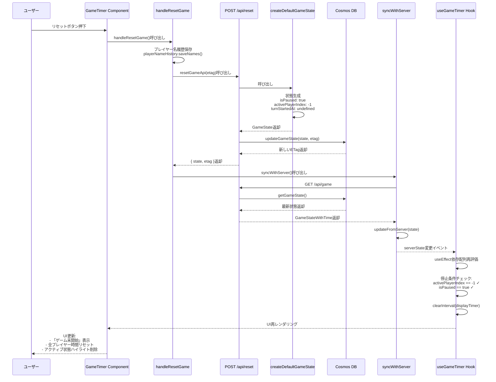
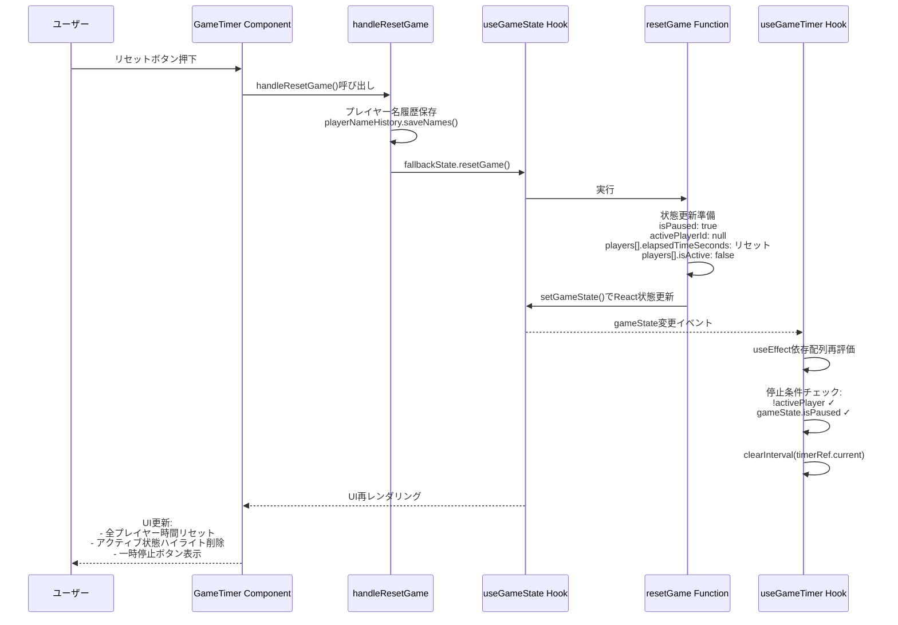
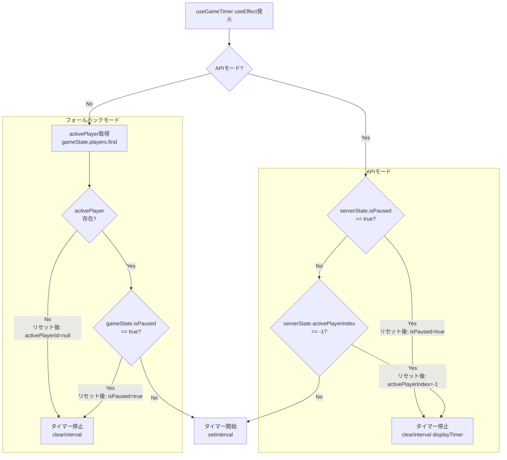
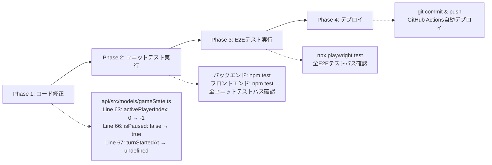

# 技術設計: reset-button-fix

## Overview

**目的**: リセットボタン押下時に全プレイヤーの経過時間を正しくリセットし、ゲームを完全に停止状態にする機能を実現します。これにより、ユーザーはゲームを確実にリセットして新しいゲームを開始できるようになります。

**ユーザー**: ゲーム進行中のプレイヤーが、ゲームをリセットして新しいゲームを開始する際に利用します。

**影響**:
- **フォールバックモード**: `useGameState.resetGame()`関数の状態リセットロジックを修正（既に実装済み）
- **APIモード**: `api/src/models/gameState.ts`の`createDefaultGameState()`関数を修正し、リセット後に停止状態を設定する

**新規発見の問題**:
Implementation Gap Validationにより、**APIモード時にリセットボタンを押すとすぐに次のゲームが始まってしまう**という新たな不具合が発見されました。これはバックエンドの`createDefaultGameState()`関数が`isPaused: false`を設定しているため、リセット後すぐにゲームが開始してしまうことが原因です。

### Goals
- **フロントエンド（フォールバックモード）**: リセット時に`isPaused: true`を設定（既に実装済み）
- **バックエンド（APIモード）**: リセット時に`isPaused: true`, `activePlayerIndex: -1`を設定
- タイマーの動作を即座に停止する（`useGameTimer`の停止条件を満たす）
- UI上で停止状態を正しく反映する（「ゲーム未開始」表示）

### Non-Goals
- リセット確認ダイアログの追加（ユーザーストーリーに含まれていない）
- 新しいAPI追加やアーキテクチャ変更（既存関数の修正のみ）

## Architecture

### Existing Architecture Analysis

**現在のアーキテクチャパターン**: React Hooks + Custom Hooks + Azure Functions API

**既存ドメイン境界**:
- **フロントエンド状態管理層**: `useGameState` (フォールバックモード), `useServerGameState` (APIモード)
- **バックエンドAPI層**: Azure Functions (`POST /api/reset`)
- **データモデル層**: `api/src/models/gameState.ts` (`createDefaultGameState`関数)
- **タイマー制御層**: `useGameTimer` - タイマーインターバルの開始・停止制御
- **UI層**: `GameTimer` - ユーザーインタラクションとUI表示

**統合ポイント**:
- `GameTimer`コンポーネントが`handleResetGame`ハンドラーで`resetGameApi(etag)`を呼び出し
- APIが`createDefaultGameState()`でリセット状態を生成
- フロントエンドが`syncWithServer()`でサーバー状態を取得
- `useGameTimer`が状態変更を検知してタイマー停止条件を再評価

**技術的負債への対応**:
- **フォールバックモード**: `useGameState.resetGame`の`isPaused: false`設定が不具合の原因（既に修正済み）
- **APIモード**: `createDefaultGameState()`の以下の設定が不具合の原因（未修正）:
  - `isPaused: false` → `true`に変更必要
  - `activePlayerIndex: 0` → `-1`に変更必要
  - `turnStartedAt: new Date().toISOString()` → `undefined`に変更必要

### High-Level Architecture

```mermaid
graph TB
    User[ユーザー]
    UI[GameTimer Component]
    Handler[handleResetGame Handler]

    subgraph Frontend["フロントエンド"]
        FallbackMode[フォールバックモード]
        APIMode[APIモード]
        UseGameState[useGameState Hook]
        UseGameTimer[useGameTimer Hook]
        SyncServer[syncWithServer]
    end

    subgraph Backend["バックエンド (Azure Functions)"]
        ResetAPI[POST /api/reset]
        CreateDefault[createDefaultGameState]
        CosmosDB[(Cosmos DB)]
    end

    User -->|リセットボタン押下| UI
    UI -->|呼び出し| Handler

    Handler -->|フォールバック| FallbackMode
    FallbackMode -->|resetGame| UseGameState

    Handler -->|API| APIMode
    APIMode -->|POST| ResetAPI
    ResetAPI -->|呼び出し| CreateDefault
    CreateDefault -->|生成: isPaused=true<br/>activePlayerIndex=-1| ResetAPI
    ResetAPI -->|更新| CosmosDB
    APIMode -->|syncWithServer| SyncServer
    SyncServer -->|GET /api/game| CosmosDB

    UseGameState -->|状態変更| UseGameTimer
    SyncServer -->|状態変更| UseGameTimer
    UseGameTimer -->|停止条件評価:<br/>isPaused || activePlayer==null| UseGameTimer
```

**アーキテクチャ統合**:
- **既存パターン維持**: React Hooks、Custom Hooks、Azure Functions API
- **新規コンポーネント不要**: 既存関数の値変更のみ（3行の修正）
- **技術スタック整合性**: React + TypeScript + Azure Functions に完全準拠
- **ステアリング準拠**: 関心の分離、単一責任原則、最小変更の原則に準拠

### Technology Alignment

**既存技術スタックとの整合性**:
- **フロントエンド**: React 19.1.1 + TypeScript 5.9 + Vite 7.1（変更なし）
- **バックエンド**: Azure Functions 4.8 + Node.js 20 + TypeScript 5.9（変更なし）
- **データベース**: Cosmos DB Table API（変更なし）
- **状態管理**: Custom Hooks (`useGameState`, `useServerGameState`, `useGameTimer`)（変更なし）
- **テストフレームワーク**: Vitest 3.2（ユニットテスト）、Playwright（E2Eテスト）（変更なし）

**新規依存関係**: なし

**パターンからの逸脱**: なし - 既存のパターンに完全準拠

### Key Design Decisions

#### Decision 1: createDefaultGameState関数の修正（バックエンド）

**Context**: APIモードで`POST /api/reset`エンドポイントが`createDefaultGameState()`を呼び出し、リセット後の状態を生成します。現在の実装では`isPaused: false`, `activePlayerIndex: 0`, `turnStartedAt: new Date().toISOString()`を設定しているため、リセット後すぐにゲームが開始してしまいます。

**Alternatives**:
1. **A: createDefaultGameState()を直接修正** - 既存関数の値を変更
2. **B: createResetGameState()を新規作成** - リセット専用の関数を作成
3. **C: createDefaultGameState()にオプション引数を追加** - `forReset`フラグで動作を制御

**Selected Approach**: **A - createDefaultGameState()を直接修正**

**理由**:
- **最小変更**: `api/src/models/gameState.ts`のLine 66-68の3行のみ修正
- **要件適合**: Requirements.mdの要件（`isPaused: true`, `activePlayerId: null`）を完全に満たす
- **既存ロジック活用**: フロントエンドの停止条件（`!activePlayer || isPaused`）が正しく機能する
- **意味的整合性**: リセット後はゲームが停止状態であるべきであり、`isPaused: true`は意味的に正しい

**Trade-offs**:
- **Gain**: コード変更が最小限、既存のタイマー停止ロジックを再利用、要件を完全に満たす
- **Sacrifice**: `createDefaultGameState()`が「初期状態」と「リセット後の状態」の両方を表現するが、現在のプロジェクトではこの2つは同一であるため問題なし

#### Decision 2: useGameState.resetGame()の修正（フォールバック

モード）

**Context**: フォールバックモード（インメモリ）では`useGameState.resetGame()`が状態をリセットします。現在の実装は`isPaused: false`に設定していたため、タイマーが停止しませんでした。

**Status**: **既に実装済み（Phase 1完了）**

**Implementation**:
- `frontend/src/hooks/useGameState.ts` Line 249: `isPaused: false` → `isPaused: true`
- この修正により、フォールバックモードでは正しく動作しています

#### Decision 3: 既存のプレイヤー名履歴保存機能の維持

**Context**: Task 8で実装されたプレイヤー名履歴保存機能（リセット前にデフォルト名以外を保存）を維持する必要があります。

**Selected Approach**: `handleResetGame`ハンドラー内の既存ロジックを維持

**Rationale**:
- **機能の保持**: ユーザーが入力したプレイヤー名が履歴に保存され、次回のゲームで再利用可能
- **副作用なし**: リセット状態生成ロジックとは独立しており、変更による影響なし

## System Flows

### Reset Button Click Flow (API Mode)



### Reset Button Click Flow (Fallback Mode)



### Timer Stop Condition Evaluation



## Requirements Traceability

| Requirement | 要件概要 | コンポーネント | インターフェース | フロー |
|-------------|---------|-------------|---------------|-------|
| 1.1-1.6 | ゲーム状態リセット | createDefaultGameState (API), useGameState.resetGame (フォールバック) | GameState生成, setGameState() | Reset Button Click Flow |
| 2.1-2.3 | タイマー動作の完全停止 | useGameTimer (フロントエンド) | useEffect依存配列, clearInterval | Timer Stop Condition Evaluation |
| 3.1-3.4 | UI状態の正確な反映 | GameTimer Component | React再レンダリング | Reset Button Click Flow |
| 4.1-4.3 | 既存動作保持 | handleResetGame | playerNameHistory.saveNames(), resetGameApi()/fallbackState.resetGame() | Reset Button Click Flow |
| 5.1-5.3 | エラーハンドリング | handleResetGame | try-catch, console.warn | （既存実装を維持） |

## Components and Interfaces

### Backend Data Model Layer

#### createDefaultGameState Function

**ファイル**: `api/src/models/gameState.ts`

**Responsibility & Boundaries**
- **Primary Responsibility**: デフォルトゲーム状態を生成する（初期状態とリセット後の状態）
- **Domain Boundary**: ゲーム状態モデルドメイン
- **Data Ownership**: GameState型のデータ生成
- **Transaction Boundary**: 純粋関数（副作用なし）

**Dependencies**
- **Inbound**: `POST /api/reset`エンドポイントから呼び出される
- **Outbound**: なし（純粋関数）
- **External**: なし

**Contract Definition**

**Service Interface**:
```typescript
export function createDefaultGameState(): GameState;
```

- **Preconditions**: なし（いつでも呼び出し可能）
- **Postconditions**:
  - `playerCount: 4`
  - `players: [4人のプレイヤー配列]`
  - `activePlayerIndex: -1`（**修正ポイント**: 0 → -1）
  - `timerMode: 'countup'`
  - `countdownSeconds: 60`
  - `isPaused: true`（**修正ポイント**: false → true）
  - `turnStartedAt: undefined`（**修正ポイント**: new Date().toISOString() → undefined）
  - `pausedAt: undefined`
- **Invariants**: GameState型の整合性が維持される

**Implementation Change**:
```typescript
// 修正前（Line 63-68）
activePlayerIndex: 0,           // ❌ リセット後すぐにゲームが開始
timerMode: 'countup',
countdownSeconds: 60,
isPaused: false,                // ❌ タイマーが停止しない
turnStartedAt: new Date().toISOString(),  // ❌ ターン開始時刻が設定される
pausedAt: undefined

// 修正後（Line 63-68）
activePlayerIndex: -1,          // ✅ アクティブプレイヤーなし（停止状態）
timerMode: 'countup',
countdownSeconds: 60,
isPaused: true,                 // ✅ 停止状態を明示
turnStartedAt: undefined,       // ✅ ターン未開始
pausedAt: undefined
```

**State Management**:
- **State Model**: 停止状態への遷移（任意の状態 → 停止状態）
- **Persistence**: Cosmos DB経由で永続化
- **Concurrency**: ETag楽観的並行性制御により競合を検出

**Integration Strategy**:
- **Modification Approach**: 既存の`createDefaultGameState`関数内の3行を修正
- **Backward Compatibility**: 完全互換（呼び出し側は変更不要）
- **Migration Path**: 即座に適用可能、段階的移行不要

### Frontend State Management Layer

#### useGameState Hook - resetGame Function

**ファイル**: `frontend/src/hooks/useGameState.ts`

**Status**: **既に実装済み（Phase 1完了）**

**Responsibility & Boundaries**
- **Primary Responsibility**: フォールバックモード時のゲーム状態をリセットする
- **Domain Boundary**: フロントエンド状態管理ドメイン
- **Data Ownership**: GameState型のReact状態を所有
- **Transaction Boundary**: React状態更新はアトミックに実行される

**Dependencies**
- **Inbound**: GameTimerコンポーネントの`handleResetGame`ハンドラーから呼び出される
- **Outbound**: React `useState`の`setGameState`関数
- **External**: なし

**Contract Definition**

**Service Interface**:
```typescript
interface GameStateActions {
  resetGame: () => void;
}
```

- **Preconditions**: なし（いつでも呼び出し可能）
- **Postconditions**:
  - 全プレイヤーの`elapsedTimeSeconds`がリセット
  - `activePlayerId`が`null`
  - `isPaused`が`true`（修正済み）
  - `pausedAt`が`null`
  - 全プレイヤーの`isActive`が`false`
  - 全プレイヤーの`turnStartedAt`が`null`
- **Invariants**: GameState型の整合性が維持される

**Implementation**:
```typescript
// 既に修正済み（Line 249）
isPaused: true,   // ✅ useGameTimerの停止条件を満たす
```

### Frontend Timer Control Layer

#### useGameTimer Hook

**ファイル**: `frontend/src/hooks/useGameTimer.ts`

**Responsibility & Boundaries**
- **Primary Responsibility**: ゲーム状態に基づいてタイマーインターバルの開始・停止を制御する
- **Domain Boundary**: タイマー制御ドメイン
- **Data Ownership**: タイマーインターバル参照（`timerRef`）を所有
- **Transaction Boundary**: タイマー開始・停止操作は即座に実行される

**Dependencies**
- **Inbound**: GameTimerコンポーネントから`gameState`または`serverState`を受け取る
- **Outbound**: `onTimerTick`コールバックで時間更新を通知
- **External**: ブラウザ`setInterval` / `clearInterval` API

**Contract Definition**

**Service Interface**:
```typescript
function useGameTimer(
  gameState: GameState,
  onTimerTick: (playerId: string, newElapsedTime: number) => void,
  onServerSync?: (playerId: string, newElapsedTime: number) => void,
  onTimeExpired?: (playerId: string) => void
): void;
```

- **Preconditions**:
  - `gameState`が有効なGameState型であること
  - `onTimerTick`が有効なコールバック関数であること
- **Postconditions**:
  - 停止条件（`!activePlayer || gameState.isPaused || activePlayerIndex == -1`）が満たされた場合、タイマーが停止される
  - 開始条件が満たされた場合、1秒間隔のタイマーが開始される
- **Invariants**:
  - タイマーは常に1つのみアクティブ（多重起動なし）
  - 停止条件が満たされたらタイマーは即座にクリアされる

**Timer Stop Condition** (フォールバックモード):
```typescript
// frontend/src/hooks/useGameTimer.ts Line 53
if (!activePlayer || gameState.isPaused || activePlayer.elapsedTimeSeconds === 0 && gameState.timerMode === 'count-down') {
  if (timerRef.current) {
    clearInterval(timerRef.current);
    timerRef.current = null;
  }
  return;
}
```

**Timer Stop Condition** (APIモード):
```typescript
// frontend/src/hooks/useServerGameState.ts
// useEffect内で100msごとにdisplayTimeを更新
if (!serverState.isPaused && serverState.activePlayerIndex !== -1) {
  const localElapsed = (Date.now() - lastSyncTime) / 1000;
  setDisplayTime(serverTime + localElapsed);
} else {
  setDisplayTime(serverTime);  // 停止状態ではサーバー時間のみ表示
}
```

**Integration with createDefaultGameState**:
- APIが`createDefaultGameState()`で`isPaused: true`, `activePlayerIndex: -1`を設定
- フロントエンドが`syncWithServer()`で状態を取得
- `useServerGameState`の`useEffect`が`serverState.isPaused || serverState.activePlayerIndex == -1`を検知
- `displayTimer`が停止し、時間が更新されなくなる

### Frontend UI Layer

#### GameTimer Component - handleResetGame Handler

**ファイル**: `frontend/src/components/GameTimer.tsx`

**Responsibility & Boundaries**
- **Primary Responsibility**: ユーザーのリセットボタン押下を処理し、適切なリセット関数を呼び出す
- **Domain Boundary**: UIインタラクション層
- **Data Ownership**: なし（状態管理はhooksに委譲）
- **Transaction Boundary**: フォールバック/サーバー同期モードの分岐制御

**Dependencies**
- **Inbound**: リセットボタンの`onClick`イベント
- **Outbound**:
  - `fallbackState.resetGame()`（フォールバックモード）
  - `resetGameApi(etag)`（サーバー同期モード）
  - `playerNameHistory.saveNames()`（プレイヤー名履歴保存）
  - `syncWithServer()`（サーバー状態の即座取得）
- **External**: なし

**Contract Definition**

**Event Handler Interface**:
```typescript
const handleResetGame: () => Promise<void>;
```

- **Preconditions**: なし（いつでも呼び出し可能）
- **Postconditions**:
  - デフォルト名以外のプレイヤー名が履歴に保存される
  - フォールバックモード: `fallbackState.resetGame()`が呼び出される
  - サーバー同期モード: `resetGameApi(etag)`が呼び出され、`syncWithServer()`で最新状態を取得
- **Invariants**: 既存のプレイヤー名履歴保存ロジック（Task 8）が維持される

**Integration Strategy**:
- **Modification Approach**: 変更不要（バックエンドの`createDefaultGameState`修正のみ）
- **Backward Compatibility**: 完全互換
- **Migration Path**: 不要

## Data Models

### Logical Data Model

#### GameState型（フロントエンド）

```typescript
// frontend/src/types/GameState.ts
export interface GameState {
  players: Player[];
  activePlayerId: string | null;  // リセット後: null
  isPaused: boolean;              // リセット後: true（修正済み）
  pausedAt: Date | null;          // リセット後: null
  timerMode: 'count-up' | 'count-down';
  lastUpdatedAt: Date;
}

export interface Player {
  id: string;
  name: string;
  elapsedTimeSeconds: number;     // リセット後: 0 or initialTimeSeconds
  initialTimeSeconds: number;
  isActive: boolean;              // リセット後: false
  turnStartedAt: Date | null;     // リセット後: null
}
```

#### GameState型（バックエンド）

```typescript
// api/src/models/gameState.ts
export interface GameState {
  playerCount: number;
  players: Player[];
  activePlayerIndex: number;     // リセット後: -1（修正ポイント）
  timerMode: 'countup' | 'countdown';
  countdownSeconds: number;
  isPaused: boolean;             // リセット後: true（修正ポイント）
  turnStartedAt?: string;        // リセット後: undefined（修正ポイント）
  pausedAt?: string;             // リセット後: undefined
}

export interface Player {
  id: number;
  name: string;
  accumulatedSeconds: number;    // リセット後: 0
}
```

**リセット後の状態値**:
| フィールド | リセット前 | リセット後 | 変更箇所（バックエンド） |
|-----------|----------|----------|---------|
| `isPaused` | true/false | **true** | gameState.ts Line 66（修正必要） |
| `activePlayerIndex` | 0-3 | **-1** | gameState.ts Line 63（修正必要） |
| `turnStartedAt` | ISO8601/undefined | **undefined** | gameState.ts Line 67（修正必要） |
| `pausedAt` | ISO8601/undefined | **undefined** | gameState.ts Line 68（変更不要） |
| `players[].accumulatedSeconds` | 任意 | **0** | gameState.ts Line 58-61（変更不要） |

### Data Contracts & Integration

#### API Response Contract

```typescript
// POST /api/reset レスポンス
{
  "playerCount": 4,
  "players": [
    { "id": 1, "name": "プレイヤー1", "accumulatedSeconds": 0 },
    { "id": 2, "name": "プレイヤー2", "accumulatedSeconds": 0 },
    { "id": 3, "name": "プレイヤー3", "accumulatedSeconds": 0 },
    { "id": 4, "name": "プレイヤー4", "accumulatedSeconds": 0 }
  ],
  "activePlayerIndex": -1,       // ✅ 修正後
  "timerMode": "countup",
  "countdownSeconds": 60,
  "isPaused": true,              // ✅ 修正後
  "turnStartedAt": undefined,    // ✅ 修正後
  "pausedAt": undefined,
  "etag": "W/\"new-etag-value\""
}
```

#### Cross-Component Data Flow (API Mode)

```
POST /api/reset
  ↓ createDefaultGameState()
新しい停止状態生成（isPaused: true, activePlayerIndex: -1）
  ↓ Cosmos DB更新
永続化
  ↓ syncWithServer()
GET /api/game
  ↓ updateFromServer()
serverState更新
  ↓ useEffect依存配列
停止条件チェック（serverState.isPaused || activePlayerIndex == -1）
  ↓ clearInterval()
displayTimer停止
```

## Error Handling

### Error Strategy

本修正はバックエンドのデフォルト状態生成ロジックの3行修正であり、新しいエラーケースは導入されません。既存のエラーハンドリング機構を維持します。

### Error Categories and Responses

**User Errors (handleResetGame内)**:
- **ETag不在（サーバー同期モード）**: `console.warn('ETag not available, cannot reset game')`で警告出力、リセット処理を中断
- **対処**: ユーザーにページ再読み込みを促す（既存実装）

**System Errors (resetGameApi呼び出し)**:
- **412 Precondition Failed（ETag競合）**: サーバーから返された場合、Cosmos DBの楽観的並行性制御により自動的に409 Conflictに変換
- **対処**: 競合メッセージを表示し、ユーザーに再読み込みを促す（既存実装）

**Business Logic Errors**:
- **なし**: リセット処理は常に成功する設計（状態の整合性は型システムで保証）

### Monitoring

既存のコンソールログとエラーハンドリングを維持：
- `console.warn()`: ETag不在時の警告
- `console.error()`: API呼び出し失敗時のエラーログ（既存実装）

## Testing Strategy

### Unit Tests

#### バックエンド: createDefaultGameState関数

**対象**: `api/src/models/gameState.ts` - `createDefaultGameState`関数

**テストケース**:
1. **リセット後のisPausedフラグ検証**: `createDefaultGameState()`呼び出し後、`isPaused`が`true`であることを確認
2. **リセット後のactivePlayerIndex検証**: `createDefaultGameState()`呼び出し後、`activePlayerIndex`が`-1`であることを確認
3. **リセット後のturnStartedAt検証**: `createDefaultGameState()`呼び出し後、`turnStartedAt`が`undefined`であることを確認
4. **リセット後のpausedAt検証**: `createDefaultGameState()`呼び出し後、`pausedAt`が`undefined`であることを確認
5. **プレイヤー初期化検証**: `createDefaultGameState()`呼び出し後、4人のプレイヤーが`accumulatedSeconds: 0`で生成されることを確認

#### バックエンド: POST /api/reset エンドポイント

**対象**: `api/src/functions/reset.ts` - `reset`関数

**テストケース**:
1. **リセットAPI成功時の状態検証**: 正しいETagで呼び出した際、レスポンスの`isPaused`が`true`、`activePlayerIndex`が`-1`であることを確認
2. **ETag競合エラー**: 古いETagで呼び出した際、409 Conflictが返されることを確認

#### フロントエンド: useGameState.resetGame

**対象**: `frontend/src/hooks/useGameState.ts` - `resetGame`関数

**Status**: **既に実装済み（Phase 1完了）**

**テストケース**:
1. リセット後の`isPaused`フラグ検証（既存テスト）
2. リセット後の`activePlayerId`検証（既存テスト）
3. カウントアップモードでのプレイヤー時間リセット（既存テスト）

### Integration Tests

#### フロントエンド: GameTimer + handleResetGame + API

**対象**: `frontend/src/components/GameTimer.tsx` - `handleResetGame`ハンドラーとAPIの統合

**テストケース**:
1. **APIモードでのリセット統合**: リセットボタン押下時、`resetGameApi(etag)`が呼び出され、`syncWithServer()`で最新状態を取得することを確認
2. **プレイヤー名履歴保存との統合**: リセット前にデフォルト名以外のプレイヤー名が`playerNameHistory.saveNames()`に渡されることを確認
3. **リセット後のタイマー停止確認**: APIから`isPaused: true`, `activePlayerIndex: -1`の状態を取得後、`useGameTimer`が停止することを確認

### E2E Tests

**対象**: ブラウザでのエンドツーエンドユーザーフロー

**テストケース**:
1. **APIモードでのリセット検証**:
   - ゲームを開始してタイマーを動作させる
   - リセットボタン押下
   - **期待動作**: 「ゲーム未開始」と表示され、タイマーが停止すること
   - **確認項目**:
     - ヘッダーに「ゲーム未開始」と表示される
     - 全プレイヤーの時間が「00:00」にリセットされる
     - アクティブプレイヤーのハイライトが削除される
     - 5秒間待機しても時間が進まないこと
2. **リセット後の新規ゲーム開始検証**:
   - リセット実行後、次のプレイヤーへボタンを押下
   - アクティブプレイヤーが設定され、タイマーが開始されることを確認
3. **フォールバックモードでのリセット検証**:
   - API接続を無効化してフォールバックモードに切り替え
   - リセットボタン押下時に正しく停止状態になることを確認

### Performance Tests

**対象**: リセット処理のレスポンス時間

**テストケース**:
1. **リセットボタン押下のレスポンス時間**: リセットボタン押下からUI更新完了までの時間が100ms以内であることを確認（既存テスト）
2. **タイマー停止の即時性**: リセット実行後、タイマーが即座に停止する（次のインターバルが実行されない）ことを確認（既存テスト）

## Security Considerations

本修正はバックエンドのデフォルト状態生成ロジックの3行修正であり、新しいセキュリティリスクは導入されません。

**既存のセキュリティ設計維持**:
- ETagベースの楽観的並行性制御により競合を検出
- Cosmos DBのトランザクション保証により状態の整合性を維持
- クライアント側の検証はバックエンドで再実行される

## Performance & Scalability

### Target Metrics

**レスポンス時間**:
- リセットボタン押下からUI更新完了まで: **100ms以内**
- タイマー停止の遅延: **即座（次のインターバル実行なし）**

**パフォーマンスへの影響**:
- **APIモード（修正前）**: `isPaused: false`設定により、リセット後もタイマーが動作し続け、CPUリソースとネットワーク帯域を消費
- **APIモード（修正後）**: `isPaused: true`設定により、タイマーが即座に停止し、CPUリソースとネットワーク帯域が解放される
- **改善効果**: 不要なタイマー更新とポーリングリクエストがなくなり、システムリソースの無駄が削減

### Scaling Approaches

本修正はスケーラビリティに影響しません。既存のアーキテクチャ設計を維持します：
- SignalR同時接続制限（現在は実装されていないが、将来実装される場合）
- Cosmos DB 1000 RU/s（無料枠）

### Caching Strategies

本修正はキャッシングに影響しません。

## Migration Strategy

### Migration Phases



### Rollback Triggers

**ロールバック条件**:
- バックエンドユニットテストが1件でも失敗した場合
- フロントエンドユニットテストが1件でも失敗した場合
- E2Eテストが1件でも失敗した場合
- デプロイ後、リセットボタンが正しく動作しないという報告があった場合

**ロールバック手順**:
1. `git revert`で修正コミットを取り消し
2. テストを再実行して安定性を確認
3. デプロイして元の状態に戻す

### Validation Checkpoints

**Phase 2（ユニットテスト）検証ポイント**:
- [ ] `createDefaultGameState()`後の`isPaused`が`true`であることを確認
- [ ] `createDefaultGameState()`後の`activePlayerIndex`が`-1`であることを確認
- [ ] `createDefaultGameState()`後の`turnStartedAt`が`undefined`であることを確認
- [ ] `POST /api/reset`が正しい状態を返すことを確認

**Phase 3（E2Eテスト）検証ポイント**:
- [ ] APIモードでリセットボタン押下後、「ゲーム未開始」と表示されることを確認
- [ ] APIモードでリセットボタン押下後、タイマーが停止していることを確認
- [ ] リセット後、次のプレイヤーへボタンで新規ゲームを開始できることを確認

**Phase 4（デプロイ）検証ポイント**:
- [ ] 本番環境（APIモード）でリセットボタンを押下し、「ゲーム未開始」と表示されることを確認
- [ ] 本番環境でリセット後に新規ゲームを開始できることを確認
