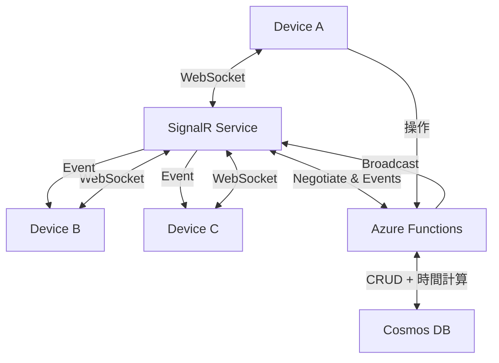
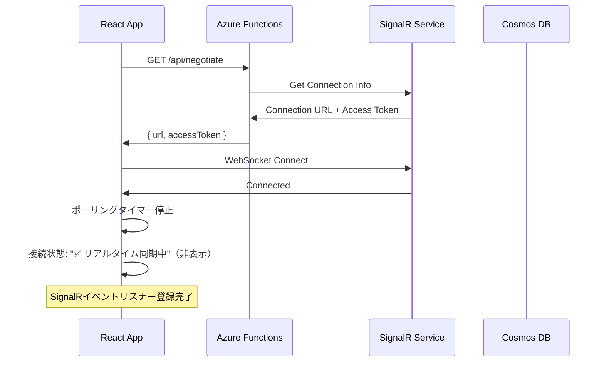
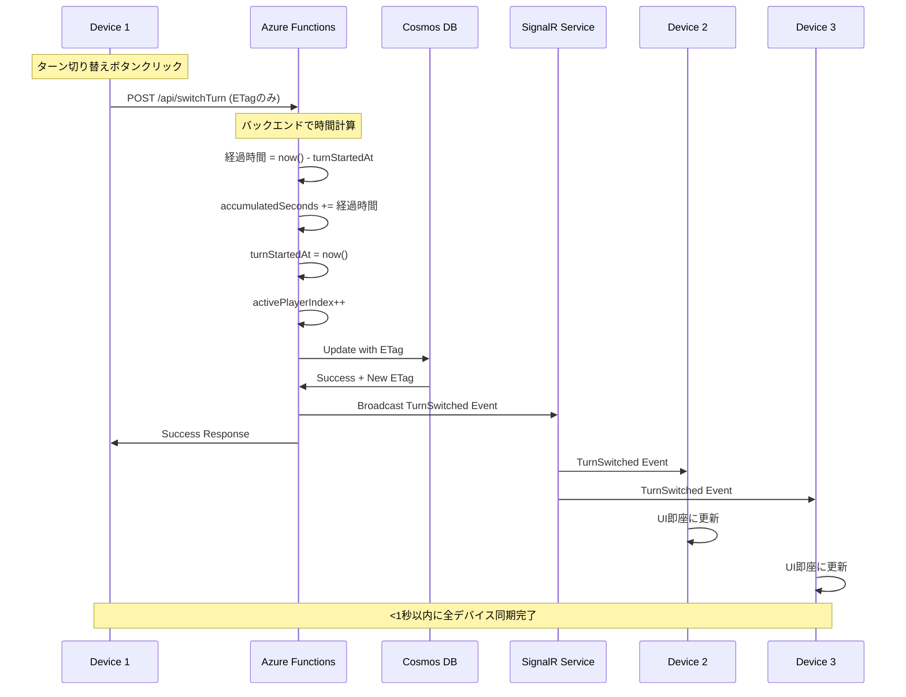
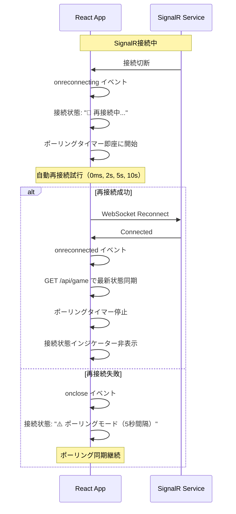
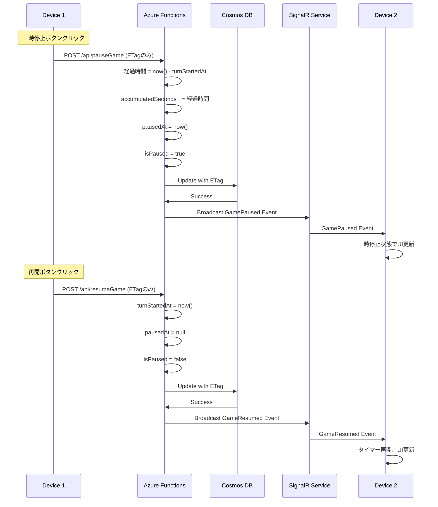
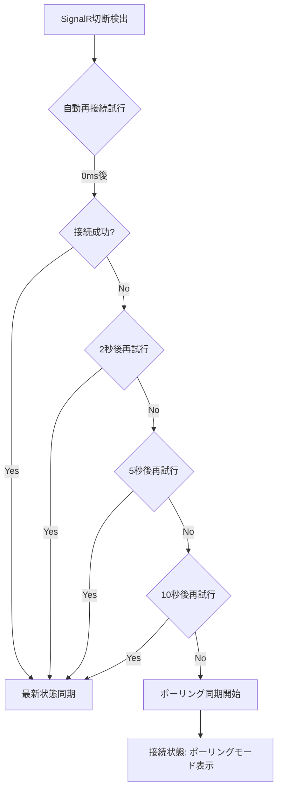
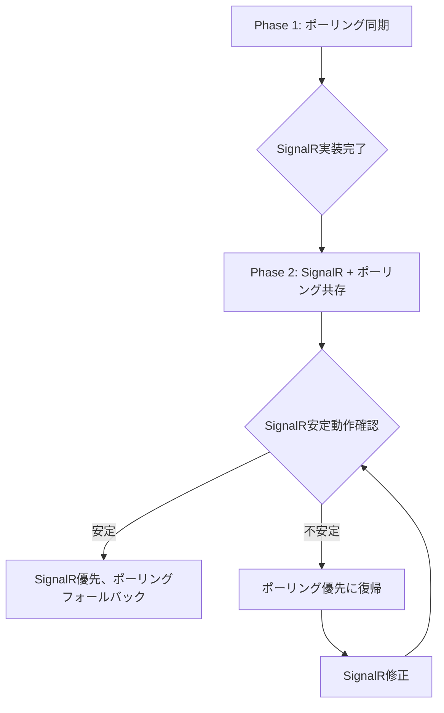

# 技術設計書

## 概要

本機能は、既存のmultiplayer-sync（Cosmos DBポーリング同期）に、Azure SignalR Serviceによるリアルタイム双方向通信機能を追加します。5秒間隔のポーリング同期から、1秒以内のリアルタイム同期への移行を実現し、真のマルチプレイヤー体験を提供します。

**対象ユーザー**: 複数デバイスからゲームタイマーを共有し、即座に状態を同期したいボードゲームプレイヤー

**実現価値**:
- 複数デバイス間でのリアルタイム状態同期（<1秒）
- SignalR切断時のポーリング同期へのフォールバック
- Azure SignalR Service無料層での完全無料運用

**既存システムへの影響**:
- multiplayer-sync（Cosmos DBポーリング同期）の上位レイヤーとして実装
- SignalR接続確立時はポーリング同期を無効化
- SignalR切断時は自動的にポーリング同期に復帰
- 既存のCosmos DB永続化とバックエンド時間計算ロジックは変更なし

### 目標
- Azure SignalR Service接続とリアルタイムイベント配信（<1秒同期）
- 自動再接続機能（ネットワーク切断時の復旧）
- ポーリング同期へのシームレスなフォールバック/復帰
- Azure SignalR Service無料層制約内での安定動作（同時接続20、1日20Kメッセージ）

### 非目標
- SignalR専用の新しいバックエンドロジック（既存のCosmos DB操作を再利用）
- ポーリング同期の廃止（フォールバック機能として維持）
- リアルタイム更新の1秒未満保証（無料層制約を考慮）

## アーキテクチャ

### 既存アーキテクチャ分析

**現在の実装** (multiplayer-sync):
- Cosmos DB Table APIによる永続化
- バックエンド主導の時間計算（turnStartedAt, accumulatedSeconds）
- ETag楽観的ロック制御
- 5秒ポーリング同期（フロントエンドのuseEffect）
- Azure Functions API（GET /api/game, POST /api/switchTurn等）

**統合方針**:
- SignalR接続を追加レイヤーとして実装（既存API変更なし）
- SignalR接続時はポーリング無効化、切断時はポーリング有効化
- Azure Functions APIにSignalRブロードキャスト処理を追加
- 既存のCosmos DB操作とバックエンド時間計算ロジックは完全再利用

### 全体アーキテクチャ



**データフロー**:
1. Device Aがターン切り替え操作
2. Azure Functions APIが経過時間を計算しCosmos DBに保存
3. Azure FunctionsがSignalR Serviceにイベントブロードキャスト
4. SignalR ServiceがDevice B/Cにイベント配信
5. 各デバイスがUI即座に更新（<1秒以内）

### 技術スタック調整

本機能は既存のmultiplayer-syncを拡張するため、確立された技術スタックに新しい依存関係を追加します。

**追加ライブラリ**:
- `@microsoft/signalr` (9.0.x): SignalRクライアント
  - 選定理由: リアルタイム双方向通信、自動再接続機能、TypeScript完全サポート
  - 代替案: WebSocket直接実装（再接続ロジック複雑化のため不採用）

- `@azure/web-pubsub-express` (1.0.x): SignalR Service統合（Azure Functions）
  - 選定理由: Azure Functions環境でのSignalR統合が容易
  - 代替案: REST APIでSignalR Service直接呼び出し（複雑度高いため不採用）

**既存技術スタックとの統合**:
- React 19: SignalR HubConnectionをuseEffectで管理、接続状態をuseStateで管理
- TypeScript 5.9: SignalRイベント型定義、HubConnection型安全性
- Azure Functions 4.8: SignalR出力バインディング、negotiate関数

### 主要設計決定

#### 決定1: ポーリング同期との共存（フォールバック戦略）

**決定**: SignalR接続時はポーリング無効化、切断時はポーリング有効化の共存方式

**コンテキスト**: SignalR接続が不安定な環境でも基本機能を維持する必要がある

**代替案**:
1. SignalR専用実装: ポーリング同期を完全廃止
2. 常時併用: SignalRとポーリングを同時実行
3. 手動切り替え: ユーザーが接続方式を選択

**選定アプローチ**: 自動フォールバック方式
- SignalR接続確立時: ポーリングタイマーを停止
- SignalR切断検出時: ポーリングタイマーを即座に再開
- 再接続成功時: Cosmos DBから最新状態を取得し同期

**根拠**:
- 高可用性確保（SignalR障害時もポーリングで動作継続）
- 無料層制約対応（SignalR 20K msg/日制限時にポーリング移行）
- ユーザー介入不要（自動フォールバック）

**トレードオフ**:
- 獲得: 高可用性、無料層最適化、シームレスな切り替え
- 犠牲: 実装複雑度増加（接続状態管理）

#### 決定2: Azure SignalR Service出力バインディング採用

**決定**: Azure Functions SignalR出力バインディングでイベントブロードキャスト

**コンテキスト**: Azure FunctionsからSignalR Serviceにイベントを配信する実装方式の選定

**代替案**:
1. SignalR REST API直接呼び出し: HTTPリクエストで配信
2. Azure Event Grid経由: イベント駆動アーキテクチャ
3. WebPubSub SDK: プログラマティック制御

**選定アプローチ**: SignalR出力バインディング
- 関数の戻り値でイベント配信
- function.jsonで宣言的設定
- 自動接続管理、エラーハンドリング

**根拠**:
- Azure Functions環境でのベストプラクティス
- コード量最小化（宣言的設定）
- 自動スケーリング対応

**トレードオフ**:
- 獲得: シンプルな実装、Azure統合、自動管理
- 犠牲: 細かい制御の制限

#### 決定3: 自動再接続戦略（指数バックオフ）

**決定**: SignalR HubConnectionの`withAutomaticReconnect([0, 2000, 5000, 10000])`を使用

**コンテキスト**: ネットワーク切断時の自動復旧メカニズムの設計

**代替案**:
1. 即座再接続: 遅延なしで再試行
2. 固定間隔再接続: 常に同じ間隔で再試行
3. 手動再接続: ユーザーボタンで再接続

**選定アプローチ**: 指数バックオフ自動再接続
- 1回目: 即座（0ms）
- 2回目: 2秒後
- 3回目: 5秒後
- 4回目: 10秒後
- 失敗時: ポーリング同期にフォールバック

**根拠**:
- ネットワーク一時障害に即座対応（0ms再接続）
- サーバー負荷軽減（指数バックオフ）
- 最終的なフォールバック保証（ポーリング移行）

**トレードオフ**:
- 獲得: 高可用性、サーバー負荷軽減、UX向上
- 犠牲: 最大10秒の再接続遅延

## システムフロー

### フロー1: SignalR接続確立とポーリング無効化



### フロー2: リアルタイムイベント配信（ターン切り替え）



### フロー3: SignalR切断と自動再接続



### フロー4: 一時停止/再開操作のSignalRブロードキャスト



## 要件トレーサビリティ

| 要件 | 要件概要 | コンポーネント | インターフェース | フロー |
|------|----------|----------------|------------------|--------|
| 1.1 | SignalR接続 | SignalRConnectionService, NegotiateFunction | GET /api/negotiate, WebSocket接続 | フロー1 |
| 1.3 | リアルタイムイベント配信 | SignalRBroadcastService | SignalR出力バインディング | フロー2 |
| 2.1 | 自動再接続 | SignalRConnectionService (withAutomaticReconnect) | SignalR再接続ロジック | フロー3 |
| 2.3 | 再接続後の状態同期 | SignalRConnectionService | GET /api/game | フロー3 |
| 3.1 | SignalR接続情報取得 | NegotiateFunction | GET /api/negotiate | フロー1 |
| 3.2-3.5 | ゲーム操作のブロードキャスト | SwitchTurnFunction, PauseGameFunction等 | SignalR出力バインディング | フロー2, 4 |
| 5.1-5.3 | SignalRエラーハンドリング | SignalRConnectionService | onclose, onreconnecting | フロー3 |
| 6.1 | 接続状態の可視化 | ConnectionStatusIndicator (React) | useState接続状態管理 | フロー1, 3 |

## コンポーネントとインターフェース

### バックエンド層（Azure Functions）

#### NegotiateFunction

**責任と境界**
- **主要責任**: SignalR接続情報（URL、アクセストークン）の提供
- **ドメイン境界**: SignalR接続ネゴシエーション
- **データ所有**: なし（SignalR Serviceが接続情報を生成）
- **トランザクション境界**: なし（読み取り専用）

**依存関係**
- **Inbound**: React App（SignalR接続開始時）
- **Outbound**: Azure SignalR Service
- **External**: SignalR Service Free Tier

**外部依存関係調査** (@azure/web-pubsub-express):
- Azure Functions SignalR入力バインディング使用
- function.jsonで`type: "signalRConnectionInfo"`指定
- 自動的に接続URL、アクセストークンを生成
- 無料層制約: 同時接続20、1日20Kメッセージ

**契約定義**

**API契約**:
| メソッド | エンドポイント | リクエスト | レスポンス | エラー |
|----------|----------------|------------|------------|--------|
| GET | /api/negotiate | なし | { url: string, accessToken: string } | 500, 503 |

**事前条件**:
- Azure SignalR Service接続文字列が環境変数に設定されていること
- SignalR Service Free Tierが利用可能であること

**事後条件**:
- 有効な接続URL、アクセストークンを返す
- トークン有効期限は1時間（SignalR Service仕様）

#### SignalRBroadcastService

**責任と境界**
- **主要責任**: ゲーム操作イベントのSignalRブロードキャスト
- **ドメイン境界**: リアルタイムイベント配信
- **データ所有**: なし（イベント配信のみ）
- **トランザクション境界**: なし（イベント送信）

**依存関係**
- **Inbound**: SwitchTurnFunction, PauseGameFunction, ResumeGameFunction, ResetGameFunction
- **Outbound**: Azure SignalR Service
- **External**: SignalR Service Free Tier（20K msg/日）

**契約定義**

**イベント契約**:
- **Published Events**:
  - `TurnSwitched`: { activePlayerIndex: number, turnStartedAt: string } - ターン切り替え時
  - `GamePaused`: { pausedAt: string, accumulatedSeconds: number[] } - 一時停止時
  - `GameResumed`: { turnStartedAt: string } - 再開時
  - `GameReset`: { gameState: GameStateWithTime } - リセット時
  - `PlayersUpdated`: { playerCount: number, players: Player[] } - プレイヤー変更時

- **配信順序**: 保証なし（イベント独立性前提）
- **配信保証**: At-least-once（SignalR Service仕様）

**サービスインターフェース**:
```typescript
interface SignalRBroadcastService {
  // Azure Functions出力バインディングで実装
  broadcastEvent(
    eventType: SignalREventType,
    payload: SignalREventPayload
  ): SignalROutputBinding;
}

type SignalREventType =
  | 'TurnSwitched'
  | 'GamePaused'
  | 'GameResumed'
  | 'GameReset'
  | 'PlayersUpdated';

type SignalREventPayload =
  | TurnSwitchedPayload
  | GamePausedPayload
  | GameResumedPayload
  | GameResetPayload
  | PlayersUpdatedPayload;

// Azure Functions出力バインディング型
interface SignalROutputBinding {
  target: 'broadcast';
  arguments: [SignalREventType, SignalREventPayload];
}
```

**実装方法** (Azure Functions出力バインディング):
```typescript
// function.jsonで定義
{
  "type": "signalR",
  "name": "signalRMessages",
  "hubName": "game",
  "direction": "out"
}

// 関数内で使用
context.bindings.signalRMessages = [{
  target: 'broadcast',
  arguments: ['TurnSwitched', { activePlayerIndex: 1 }]
}];
```

### フロントエンド層（React）

#### SignalRConnectionService

**責任と境界**
- **主要責任**: SignalR接続管理、イベントリスナー登録、自動再接続制御
- **ドメイン境界**: リアルタイム双方向通信クライアント
- **データ所有**: HubConnection インスタンス、接続状態

**依存関係**
- **Outbound**: Azure SignalR Service (`@microsoft/signalr`)
- **External**: SignalR Service Free Tier

**外部依存関係調査** (@microsoft/signalr 9.0):
- HubConnectionBuilder API: 接続構築、自動再接続設定
- withAutomaticReconnect([0, 2000, 5000, 10000]): 指数バックオフ再接続
- on(eventName, callback): イベントリスナー登録
- onreconnecting/onreconnected/onclose: 接続状態イベント
- 接続状態: Disconnected, Connecting, Connected, Reconnecting
- エラー型: HubException, TimeoutError

**契約定義**

**サービスインターフェース**:
```typescript
interface SignalRConnectionService {
  // SignalR接続開始（自動再接続設定含む）
  connect(): Promise<Result<void, SignalRError>>;

  // イベントリスナー登録
  on(eventName: SignalREventType, callback: (payload: unknown) => void): void;

  // 接続状態確認
  getConnectionState(): ConnectionState;

  // 接続状態変更イベント
  onConnectionStateChanged(callback: (state: ConnectionState) => void): void;

  // 切断
  disconnect(): Promise<void>;
}

type SignalREventType =
  | 'TurnSwitched'
  | 'GamePaused'
  | 'GameResumed'
  | 'GameReset'
  | 'PlayersUpdated';

type ConnectionState =
  | 'Disconnected'
  | 'Connecting'
  | 'Connected'
  | 'Reconnecting';

type SignalRError =
  | { type: 'ConnectionFailed'; message: string }
  | { type: 'NegotiateFailed'; message: string };
```

**状態管理**:
- **状態モデル**: Disconnected → Connecting → Connected → Reconnecting → Connected
- **永続化**: なし（接続状態はインメモリ）
- **並行制御**: なし（単一HubConnection）

**自動再接続戦略**:
- 再接続遅延: [0ms, 2s, 5s, 10s]（最大4回試行）
- 再接続成功時: GET /api/gameで最新状態同期、ポーリング停止
- 再接続失敗時: ポーリング同期開始、接続状態インジケーター表示

#### PollingServiceIntegration

**責任と境界**
- **主要責任**: SignalR接続状態に応じたポーリング同期の有効化/無効化
- **ドメイン境界**: フォールバック同期制御
- **データ所有**: ポーリングタイマーID、ポーリング有効フラグ

**統合戦略**:
- **SignalR接続確立時**: ポーリングタイマー停止（clearInterval）
- **SignalR切断検出時**: ポーリングタイマー開始（setInterval 5秒）
- **再接続成功時**: ポーリングタイマー停止

**実装方法** (React useEffect):
```typescript
useEffect(() => {
  // SignalR接続状態監視
  if (signalRState === 'Connected') {
    // ポーリング停止
    if (pollingTimerId) {
      clearInterval(pollingTimerId);
      setPollingTimerId(null);
    }
  } else if (signalRState === 'Disconnected' || signalRState === 'Reconnecting') {
    // ポーリング開始
    if (!pollingTimerId) {
      const timerId = setInterval(async () => {
        const response = await fetch('/api/game');
        const state = await response.json();
        updateGameState(state);
      }, 5000);
      setPollingTimerId(timerId);
    }
  }

  return () => {
    if (pollingTimerId) clearInterval(pollingTimerId);
  };
}, [signalRState]);
```

#### ConnectionStatusIndicator

**責任と境界**
- **主要責任**: SignalR接続状態の可視化（異常時のみ表示）
- **ドメイン境界**: UI状態表示
- **データ所有**: 表示メッセージ、表示フラグ

**契約定義**

```typescript
interface ConnectionStatusIndicatorProps {
  connectionState: ConnectionState;
  fallbackMode: 'polling' | 'inmemory' | null;
}

interface ConnectionStatusIndicator {
  // 表示判定: SignalR正常時は非表示、異常時のみ表示
  shouldDisplay(state: ConnectionState): boolean;

  // 表示メッセージ生成
  getMessage(state: ConnectionState, fallbackMode: string | null): string;
}
```

**表示ルール**:
- **Connected**: 表示なし
- **Reconnecting**: "🔄 再接続中..."
- **Disconnected + polling**: "⚠️ ポーリングモード（5秒間隔）"
- **Disconnected + inmemory**: "❌ 接続エラー - インメモリーモード"

## データモデル

### SignalRイベントスキーマ

#### TurnSwitched Event

```typescript
interface TurnSwitchedEvent {
  eventType: 'TurnSwitched';
  payload: {
    activePlayerIndex: number;
    turnStartedAt: string;  // ISO8601タイムスタンプ
  };
}
```

#### GamePaused Event

```typescript
interface GamePausedEvent {
  eventType: 'GamePaused';
  payload: {
    pausedAt: string;  // ISO8601タイムスタンプ
    accumulatedSeconds: number[];  // 各プレイヤーの累積経過時間
  };
}
```

#### GameResumed Event

```typescript
interface GameResumedEvent {
  eventType: 'GameResumed';
  payload: {
    turnStartedAt: string;  // ISO8601タイムスタンプ（新しいターン開始時刻）
  };
}
```

#### GameReset Event

```typescript
interface GameResetEvent {
  eventType: 'GameReset';
  payload: {
    gameState: GameStateWithTime;  // リセット後の完全なゲーム状態
  };
}
```

#### PlayersUpdated Event

```typescript
interface PlayersUpdatedEvent {
  eventType: 'PlayersUpdated';
  payload: {
    playerCount: number;
    players: Player[];
  };
}
```

**スキーマバージョニング**:
- 現状: バージョン管理なし
- 将来: eventTypeにバージョン追加（例: "TurnSwitched.v2"）

**後方互換性**:
- 新フィールド追加時: オプショナルプロパティで追加
- 既存フィールド削除時: 非推奨マーク → 次バージョンで削除

### SignalR接続情報

```typescript
interface SignalRConnectionInfo {
  url: string;           // SignalR Service WebSocket URL
  accessToken: string;   // 接続用アクセストークン（有効期限1時間）
}
```

**セキュリティ考慮事項**:
- アクセストークンは1時間で期限切れ（SignalR Service仕様）
- トークン更新は自動再接続時に新しいnegotiate呼び出しで取得

## エラーハンドリング

### エラー戦略

SignalR固有のエラー処理と既存のCosmos DB/ポーリング同期へのフォールバック戦略。

### エラーカテゴリと対応

#### SignalR接続エラー

- **negotiate失敗**: Azure Functions /api/negotiateエラー → ポーリング同期開始、接続状態: "⚠️ ポーリングモード"
- **WebSocket接続失敗**: SignalR Service到達不可 → 自動再接続試行（0ms, 2s, 5s, 10s）→ 失敗時ポーリング移行
- **認証エラー**: アクセストークン無効 → negotiate再呼び出し → 失敗時ポーリング移行

#### SignalR切断エラー

- **ネットワーク切断**: 一時的なネットワーク障害 → 自動再接続（指数バックオフ）→ 成功時最新状態同期
- **SignalR Service障害**: サービス側エラー → 自動再接続試行 → 失敗時ポーリング移行
- **タイムアウト**: 長時間無応答 → 切断検出 → 自動再接続

#### 無料層制約エラー

- **同時接続数超過**: 20接続上限 → 新規接続拒否 → ポーリング同期開始、警告メッセージ表示
- **メッセージ数上限**: 1日20K超過 → ブロードキャスト失敗 → ポーリング同期に自動切り替え、警告表示

**SignalR切断とフォールバックフロー**:



### モニタリング

**SignalR固有メトリクス**:
- SignalR接続成功率: 接続試行に対する成功率
- SignalR切断頻度: 時間あたり切断回数
- 再接続成功率: 再接続試行に対する成功率
- メッセージ配信遅延: イベント送信からクライアント受信までの時間

**Azure SignalR Service制約監視**:
- 同時接続数（目標: <15、上限: 20）
- 1日メッセージ数（目標: <15K、上限: 20K）
- メッセージ上限到達時の自動フォールバック動作確認

**ログ出力**:
- Info: SignalR接続成功、イベント配信成功
- Warning: SignalR再接続試行、メッセージ上限接近
- Error: SignalR接続失敗、negotiate失敗、ポーリング移行

## テスト戦略

### ユニットテスト

**Azure Functions** (Jest):
- NegotiateFunction: SignalR接続情報生成
- SignalRBroadcastService: イベント配信（SignalRモック）
  - broadcastTurnSwitched: TurnSwitchedイベント配信
  - broadcastGamePaused: GamePausedイベント配信

**フロントエンド** (Vitest):
- SignalRConnectionService: 接続、イベントリスナー登録、自動再接続
  - connect(): negotiate呼び出し → WebSocket接続
  - withAutomaticReconnect: 再接続遅延設定確認
  - onConnectionStateChanged: 状態変更コールバック
- PollingServiceIntegration: SignalR状態に応じたポーリング制御
  - SignalR Connected → ポーリング停止
  - SignalR Disconnected → ポーリング開始

### 統合テスト

**Azure Functions → SignalR Service** (Jest):
- negotiate関数 → SignalR接続情報取得
- イベント配信 → SignalR Service受信確認
- 無料層制約テスト（20接続、20K msg/日）

**フロントエンド → SignalR → Azure Functions** (Vitest):
- WebSocket接続 → negotiate → 接続確立
- イベント受信 → useStateへの反映
- 自動再接続 → 最新状態同期

### E2E/UIテスト

**Chrome DevTools MCP検証**:
1. アプリケーション起動（npm run dev）
2. navigate_page → http://localhost:5173
3. take_snapshot → SignalR接続状態確認（インジケーター非表示）
4. 複数タブでアプリケーション起動
5. タブAでターン切り替え → タブB/Cで即座に反映確認（<1秒）
6. ネットワーク切断（DevTools Offline）→ 接続状態: "🔄 再接続中..." 表示確認
7. ネットワーク復帰 → 自動再接続 → インジケーター非表示確認
8. 再接続失敗シミュレーション → 接続状態: "⚠️ ポーリングモード" 表示確認

### パフォーマンス/負荷テスト

**SignalRメッセージ数測定**:
- 1時間の連続操作でのメッセージ数（目標: <1000 msg/時）
- 1秒更新時の1日メッセージ数推定（約5.5時間分 = 20K msg）
- メッセージ上限到達時のフォールバック動作確認

**リアルタイム同期遅延測定**:
- タイマー操作からイベント配信までの時間（目標: <500ms）
- イベント受信からUI更新までの時間（目標: <500ms）
- 合計エンドツーエンド遅延（目標: <1秒）

**自動再接続性能**:
- 再接続成功までの時間（各遅延: 0ms, 2s, 5s, 10s）
- 再接続後の状態同期時間（目標: <1秒）

## パフォーマンスとスケーラビリティ

### ターゲットメトリクス

- **リアルタイム同期遅延**: <1秒でイベント配信（操作 → 全デバイス更新）
- **SignalR接続確立時間**: <2秒（negotiate → WebSocket接続）
- **自動再接続時間**: 0ms（即座）、2s、5s、10s（指数バックオフ）

### スケーリングアプローチ

**水平スケーリング制約**:
- SignalR Service: 同時接続20まで（無料層上限）
- Azure Functions: Consumption Planの自動スケール（無料層制約内）

**無料層最適化**:
- メッセージ削減: 状態変更時のみ配信（定期送信なし）
- 接続数管理: 20接続上限到達時は新規接続拒否、ポーリング移行
- フォールバック: SignalR障害時はポーリング同期で継続

### キャッシング戦略

**クライアントサイド**:
- SignalR接続情報: negotiate結果を1時間キャッシュ（トークン有効期限）
- イベントデデュプリケーション: 重複イベント受信時は無視

**サーバーサイド**:
- なし（SignalR Service直接配信、キャッシュレイヤー不要）

## 移行戦略

### 移行フェーズ



**フェーズ1: ポーリング同期**（完了）
- Cosmos DB永続化
- 5秒ポーリング同期
- バックエンド時間計算

**フェーズ2: SignalR統合**（本仕様）
- SignalR接続とイベント配信追加
- ポーリング同期維持（フォールバック）
- 自動切り替えロジック実装

**フェーズ3: 安定化**
- SignalR無料層制約監視
- 自動再接続性能改善
- ポーリング同期最適化

**ロールバックトリガー**:
- SignalR接続成功率 < 80%
- メッセージ配信遅延 > 3秒
- 無料層制約頻繁到達

**検証チェックポイント**:
- SignalR接続確立率 > 95%
- リアルタイム同期遅延 < 1秒
- 自動再接続成功率 > 90%
- 無料層制約内での安定動作（同時接続 < 18、メッセージ < 18K/日）
