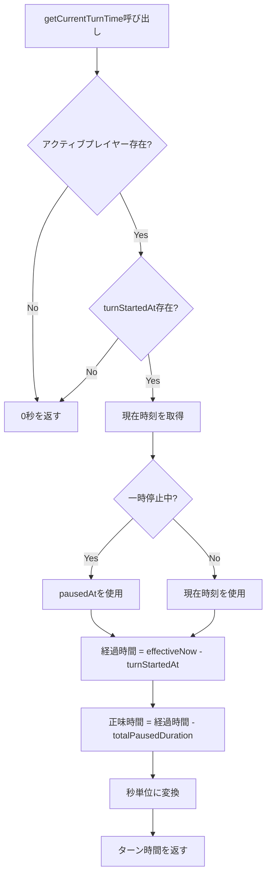
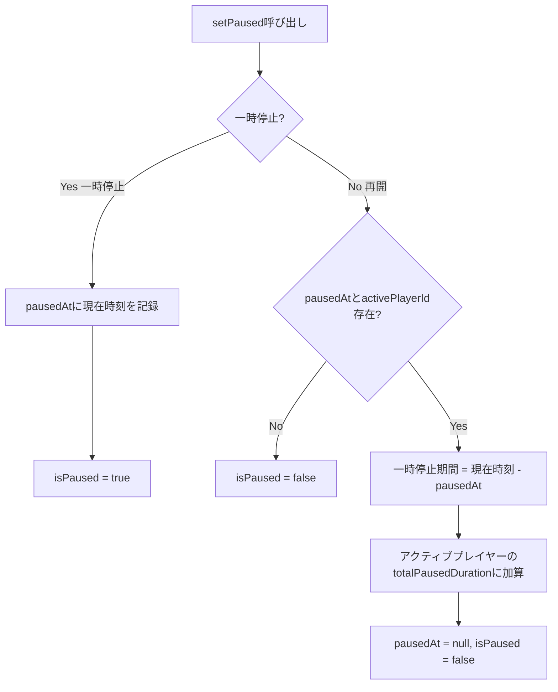
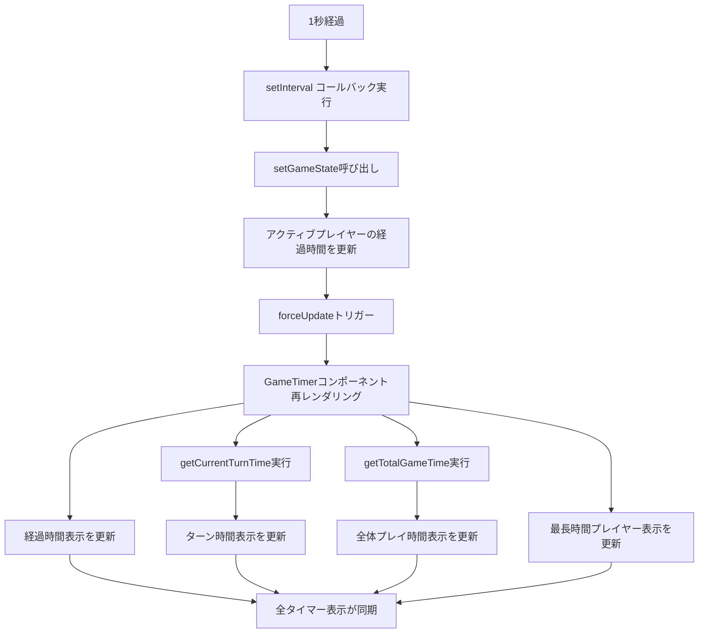
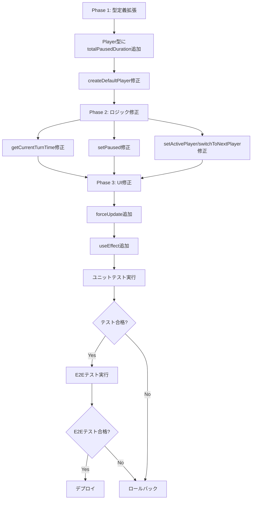

# Technical Design Document

## Overview

本機能は、マルチプレイヤー・ゲームタイマーにおける2つの表示同期問題を解決します。第一に、複数のタイマー表示（経過時間、ターン時間、全体プレイ時間等）が独立して更新されているため秒の切り替わりタイミングにズレが生じている問題を、単一のタイマー更新処理に統合することで解決します。第二に、一時停止・再開時にターン時間がリセットされる問題を、一時停止期間の累積管理により解決します。

**Purpose**: この機能は、視覚的に統一された正確な時間トラッキングをプレイヤーに提供します。

**Users**: 全てのゲームプレイヤーが、画面上の全タイマー表示が同期して更新されることで一貫した時間情報を得られます。また、ゲームを一時停止・再開してもターン時間が継続することで、公平な時間計測が保証されます。

**Impact**: 既存のGameTimerコンポーネントとuseGameStateフックを修正し、タイマー更新処理を一元化します。GameState型とPlayer型にターン開始時刻と一時停止期間累積のフィールドを追加します。

### Goals

- 全タイマー表示の秒単位の完全同期を実現
- 一時停止・再開を経てもターン時間を正確に継続
- 複数回の一時停止・再開に対応した累積時間管理
- 既存機能（リセット、プレイヤー切り替え、モード変更等）との互換性保持

### Non-Goals

- タイマー更新間隔の変更（1秒間隔を維持）
- 新しいUI要素の追加（既存の表示のみを修正）
- バックエンドAPIとの同期（フロントエンドのみの修正）

## Architecture

### Existing Architecture Analysis

**現在のアーキテクチャパターン**:
- **カスタムフック分離**: `useGameState`でビジネスロジック、`useGameTimer`でタイマーロジックを管理
- **単一状態管理**: `GameTimer`コンポーネントが状態の単一ソース（Single Source of Truth）
- **Reactフック駆動**: `useEffect`によるタイマー更新とライフサイクル管理

**既存のドメイン境界**:
- **ゲーム状態管理**: `useGameState` - プレイヤー、ターン、一時停止、モード管理
- **タイマーロジック**: `useGameTimer` - インターバル管理、時間計算
- **UI表示**: `GameTimer` - 状態表示とユーザー操作

**技術的負債の対処**:
- **現在の問題**: 複数の`useEffect`と`setInterval`が独立して動作し、同期がない
- **対処方針**: 単一のタイマー更新処理に統合し、同期問題を根本解決

### High-Level Architecture

本機能は既存アーキテクチャを尊重し、以下の修正を行います：

```
┌─────────────────────────────────────────────────────────────┐
│ GameTimer Component (UI Layer)                              │
│  - 単一のタイマー更新処理でforceUpdate                      │
│  - 全タイマー表示を同時レンダリング                         │
└────────────────┬────────────────────────────────────────────┘
                 │
                 ├─ useGameState Hook
                 │   ├─ タイマー更新ロジック（1秒間隔）
                 │   ├─ ターン時間計算（一時停止期間除外）
                 │   └─ 一時停止期間累積管理
                 │
                 └─ GameState / Player
                     └─ turnStartedAt, totalPausedDuration追加
```

**アーキテクチャ統合**:
- **既存パターン保持**: カスタムフックによるロジック分離を維持
- **新コンポーネント追加の理由**: なし（既存コンポーネントの修正のみ）
- **技術スタック整合**: React 19.1.1、TypeScript 5.9を使用
- **ステアリング準拠**: 単一責任原則、型安全性、テスト駆動開発の原則を維持

### Technology Alignment

本機能は既存の技術スタックに完全に整合します：

**既存技術スタックの使用**:
- **React 19.1.1**: `useState`, `useEffect`, `useCallback`によるフック駆動設計
- **TypeScript 5.9**: 厳密な型チェックと明示的な型定義
- **Vite 7.1**: 開発サーバーとビルドツール（変更なし）

**新規依存関係**:
- なし（既存の技術スタックのみを使用）

**既存パターンからの逸脱**:
- なし（既存のカスタムフックパターンとコンポーネント設計を踏襲）

### Key Design Decisions

#### Decision 1: 一時停止期間の累積管理方式

**Context**: 一時停止・再開を繰り返すシナリオで、ターン時間を正確に計測する必要があります。

**Alternatives**:
1. **turnStartedAt調整方式**（現在の実装）: 一時停止期間をturnStartedAtに加算
2. **累積時間管理方式**: totalPausedDurationフィールドで累積時間を管理
3. **一時停止履歴配列方式**: 全ての一時停止期間を配列で保持

**Selected Approach**: **累積時間管理方式（Option 2）**

Player型に`totalPausedDuration: number`フィールドを追加し、以下のように管理：

```typescript
interface Player {
  // 既存フィールド...
  turnStartedAt: Date | null;
  totalPausedDuration: number; // ミリ秒単位の累積一時停止時間
}

// ターン時間計算
function getCurrentTurnTime(): number {
  const now = isPaused ? pausedAt : new Date();
  const elapsedMs = now.getTime() - turnStartedAt.getTime();
  const netMs = elapsedMs - totalPausedDuration;
  return Math.floor(netMs / 1000);
}
```

**Rationale**:
- **正確性**: ターン開始時刻の概念を保持しながら、一時停止期間を正確に除外
- **シンプルさ**: 単一の数値フィールドで管理、計算ロジックが明快
- **拡張性**: 複数回の一時停止・再開に自然に対応

**Trade-offs**:
- **獲得**: ターン開始時刻の意味が明確、デバッグが容易、型定義がシンプル
- **犠牲**: わずかなメモリ増加（1プレイヤーあたり8バイト）、一時停止履歴の詳細は保持しない

#### Decision 2: タイマー更新処理の一元化

**Context**: 複数のタイマー表示が独立して更新されているため、秒の切り替わりタイミングにズレが生じています。

**Alternatives**:
1. **単一setInterval方式**: GameTimerコンポーネント内で単一のsetIntervalを使用
2. **グローバルタイマー方式**: Contextで共有タイマーを提供
3. **タイマー同期ライブラリ**: 外部ライブラリで同期管理

**Selected Approach**: **単一setInterval方式（Option 1）**

useGameState内の既存のuseEffectを拡張し、単一のsetIntervalで全タイマー関連状態を更新：

```typescript
useEffect(() => {
  if (!gameState.activePlayerId || gameState.isPaused) {
    return;
  }

  const timerId = setInterval(() => {
    setGameState((prev) => {
      // 1. アクティブプレイヤーの経過時間を更新
      // 2. ターン時間を再計算（forceUpdateトリガー）
      // 3. 全体プレイ時間を再計算
      // 全ての状態を一度に更新
      return updatedState;
    });
  }, 1000);

  return () => clearInterval(timerId);
}, [gameState.activePlayerId, gameState.isPaused]);
```

**Rationale**:
- **同期保証**: 単一のコールバック内で全状態を更新するため、必ず同期
- **既存パターン踏襲**: 現在のuseEffect構造を拡張、大幅な変更なし
- **テスト容易性**: 単一のタイマーロジックのみをテストすればよい

**Trade-offs**:
- **獲得**: 完全な同期保証、シンプルなロジック、デバッグが容易
- **犠牲**: 1秒間隔で全状態を再計算（パフォーマンスへの影響は無視できる範囲）

#### Decision 3: forceUpdate方式によるUI再レンダリング

**Context**: ターン時間表示は計算値であり、状態として保持していないため、UI更新のトリガーが必要です。

**Alternatives**:
1. **forceUpdate方式**: useState([])でダミー状態を更新し強制再レンダリング
2. **ターン時間状態化**: currentTurnTimeをuseStateで管理
3. **useMemo依存配列**: useMemoの依存配列にタイムスタンプを追加

**Selected Approach**: **forceUpdate方式（Option 1）**

GameTimerコンポーネント内で`const [, forceUpdate] = useState([]);`を使用し、タイマー更新時に`forceUpdate([])`を呼び出す：

```typescript
// GameTimer.tsx
const [, forceUpdate] = useState([]);

useEffect(() => {
  const timerId = setInterval(() => {
    forceUpdate([]); // UI強制再レンダリング
  }, 1000);
  return () => clearInterval(timerId);
}, [gameState.activePlayerId, gameState.isPaused]);
```

**Rationale**:
- **計算値の維持**: ターン時間は計算値であり続け、状態の重複がない
- **シンプルさ**: 追加の状態管理が不要、useGameStateのロジックがクリーン
- **React推奨パターン**: 公式ドキュメントで認められている手法

**Trade-offs**:
- **獲得**: 状態の重複なし、Single Source of Truth維持、シンプルなロジック
- **犠牲**: forceUpdateという明示的な再レンダリングトリガーが必要（Reactの暗黙的な更新に頼らない）

## System Flows

### ターン時間計算フロー（一時停止期間除外）



### 一時停止・再開フロー



### タイマー更新同期フロー



## Requirements Traceability

| 要件 | 要件概要 | コンポーネント | インターフェース | フロー |
|------|----------|----------------|------------------|--------|
| 1.1 | 全タイマー表示の同期更新 | useGameState, GameTimer | getCurrentTurnTime, getTotalGameTime | タイマー更新同期フロー |
| 1.7 | 単一タイマー更新イベント | useGameState (useEffect) | setInterval コールバック | タイマー更新同期フロー |
| 2.1-2.5 | ターン時間の継続性 | useGameState (setPaused) | setPaused, getCurrentTurnTime | 一時停止・再開フロー |
| 3.1-3.6 | 一時停止期間除外 | Player型, useGameState | totalPausedDuration, getCurrentTurnTime | ターン時間計算フロー |
| 4.1-4.6 | タイマー更新一元化 | useGameState (useEffect) | setInterval, forceUpdate | タイマー更新同期フロー |
| 5.1-5.6 | 既存機能互換性 | useGameState | resetGame, setActivePlayer, switchToNextPlayer | 既存フロー維持 |

## Components and Interfaces

### フロントエンド層

#### GameTimer Component

**Responsibility & Boundaries**
- **Primary Responsibility**: ゲームタイマーのUIを表示し、ユーザー操作を受け付ける
- **Domain Boundary**: UIプレゼンテーション層
- **Data Ownership**: UI固有の状態（forceUpdate用ダミー状態）のみ
- **Transaction Boundary**: なし（読み取り専用コンポーネント）

**Dependencies**
- **Inbound**: なし（ルートコンポーネント）
- **Outbound**: useGameState, PlayerList, PrimaryControls, SettingsControls
- **External**: React 19.1.1

**Contract Definition**

**Props**: なし（ルートコンポーネント）

**State Management**:
- `forceUpdate`: ダミー状態（UI強制再レンダリング用）

**Rendering Logic**:
```typescript
// 1秒間隔でforceUpdateを呼び出し、全タイマー表示を再レンダリング
useEffect(() => {
  if (!gameState.activePlayerId || gameState.isPaused) {
    return;
  }
  const timerId = setInterval(() => {
    forceUpdate([]);
  }, 1000);
  return () => clearInterval(timerId);
}, [gameState.activePlayerId, gameState.isPaused, forceUpdate]);
```

**Integration Strategy**:
- **Modification Approach**: 既存GameTimerコンポーネントに最小限の変更（forceUpdate追加）
- **Backward Compatibility**: 既存のpropsとイベントハンドラを維持
- **Migration Path**: 段階的に移行不要（一括修正）

#### useGameState Hook

**Responsibility & Boundaries**
- **Primary Responsibility**: ゲーム状態の管理とビジネスロジックの提供
- **Domain Boundary**: ゲーム状態管理ドメイン
- **Data Ownership**: GameState（プレイヤー、ターン、一時停止、モード）
- **Transaction Boundary**: 状態更新は同期的、ローカル状態のみ

**Dependencies**
- **Inbound**: GameTimerコンポーネント、他のカスタムフック
- **Outbound**: GameState型、Player型、GameStateValidator
- **External**: React 19.1.1 (useState, useEffect, useCallback)

**Contract Definition**

**Service Interface**:
```typescript
interface UseGameStateReturn {
  // 既存インターフェース...

  // 修正: ターン時間計算（一時停止期間除外）
  getCurrentTurnTime(): number;

  // 修正: 一時停止・再開（累積時間管理）
  setPaused(isPaused: boolean): void;

  // 修正: アクティブプレイヤー設定（totalPausedDuration初期化）
  setActivePlayer(playerId: string | null): void;

  // 修正: ターン切り替え（totalPausedDuration初期化）
  switchToNextPlayer(): void;
}
```

**Preconditions**:
- `getCurrentTurnTime`: activePlayerIdが存在し、turnStartedAtが設定されている
- `setPaused`: ゲームが開始されている（activePlayerIdが存在）

**Postconditions**:
- `getCurrentTurnTime`: 一時停止期間を除外した正味のターン時間を返す
- `setPaused(true)`: pausedAtに現在時刻を記録、isPaused=true
- `setPaused(false)`: totalPausedDurationを更新、pausedAt=null、isPaused=false
- `setActivePlayer`: 新しいアクティブプレイヤーのtotalPausedDuration=0
- `switchToNextPlayer`: 新しいアクティブプレイヤーのtotalPausedDuration=0

**Invariants**:
- ターン時間は常に非負（0秒以上）
- totalPausedDurationは常に非負（0ミリ秒以上）
- activePlayerIdが存在する場合、対応するPlayerのisActive=true

**State Management**:
- **State Model**: GameState（プレイヤー、ターン、一時停止、モード）
- **Persistence**: なし（インメモリー状態管理）
- **Concurrency**: なし（単一スレッド、React状態更新は同期的）

**Integration Strategy**:
- **Modification Approach**: 既存useGameStateフックを拡張（setPaused、getCurrentTurnTime修正）
- **Backward Compatibility**: 既存の公開インターフェースを維持
- **Migration Path**: Player型にtotalPausedDuration追加 → ロジック修正

## Data Models

### Logical Data Model

#### GameState型（修正なし）

既存のGameState型は変更なし：

```typescript
interface GameState {
  players: Player[];
  activePlayerId: string | null;
  isPaused: boolean;
  timerMode: TimerMode;
  createdAt: Date;
  lastUpdatedAt: Date;
  pausedAt: Date | null; // 一時停止開始時刻
}
```

#### Player型（totalPausedDuration追加）

Player型に一時停止期間累積フィールドを追加：

```typescript
interface Player {
  id: string; // UUID v4
  name: string; // "プレイヤー1" など
  elapsedTimeSeconds: number; // 経過時間（秒）
  initialTimeSeconds: number; // 初期時間（カウントダウン用）
  isActive: boolean;
  createdAt: Date;
  turnStartedAt: Date | null; // ターン開始時刻
  totalPausedDuration: number; // NEW: 累積一時停止時間（ミリ秒）
}
```

**追加フィールドの説明**:
- `totalPausedDuration`: アクティブプレイヤーがターンを開始してから現在までの全ての一時停止期間の累積時間（ミリ秒単位）
- 初期値: 0
- 更新タイミング: 一時停止から再開する際に、setPaused(false)内で更新
- リセットタイミング: setActivePlayer、switchToNextPlayer、resetGameで0にリセット

### Data Contracts & Integration

#### ターン時間計算ロジック

```typescript
/**
 * 現在のアクティブプレイヤーのターン経過時間を計算（一時停止期間を除外）
 *
 * @returns ターン経過時間（秒単位）
 *
 * 計算式:
 * effectiveNow = isPaused ? pausedAt : now
 * elapsedMs = effectiveNow - turnStartedAt
 * netMs = elapsedMs - totalPausedDuration
 * turnTime = floor(netMs / 1000)
 */
function getCurrentTurnTime(): number {
  if (!activePlayerId || !activePlayer.turnStartedAt) {
    return 0;
  }

  const now = new Date();
  const effectiveNow = isPaused && pausedAt ? pausedAt : now;
  const elapsedMs = effectiveNow.getTime() - activePlayer.turnStartedAt.getTime();
  const netMs = elapsedMs - activePlayer.totalPausedDuration;

  return Math.max(0, Math.floor(netMs / 1000));
}
```

#### 一時停止期間累積ロジック

```typescript
/**
 * 一時停止状態を設定（再開時に累積時間を更新）
 *
 * @param isPaused - true: 一時停止、false: 再開
 */
function setPaused(isPaused: boolean): void {
  const now = new Date();

  if (isPaused) {
    // 一時停止: pausedAtに現在時刻を記録
    setGameState(prev => ({
      ...prev,
      isPaused: true,
      pausedAt: now,
      lastUpdatedAt: now
    }));
  } else {
    // 再開: 一時停止期間を累積
    if (pausedAt && activePlayerId) {
      const pauseDuration = now.getTime() - pausedAt.getTime();

      setGameState(prev => ({
        ...prev,
        isPaused: false,
        pausedAt: null,
        players: prev.players.map(p => {
          if (p.id === activePlayerId) {
            return {
              ...p,
              totalPausedDuration: p.totalPausedDuration + pauseDuration
            };
          }
          return p;
        }),
        lastUpdatedAt: now
      }));
    } else {
      // pausedAtまたはactivePlayerIdがない場合
      setGameState(prev => ({
        ...prev,
        isPaused: false,
        pausedAt: null,
        lastUpdatedAt: now
      }));
    }
  }
}
```

## Error Handling

### Error Strategy

本機能は既存のエラーハンドリング戦略を維持します。計算ロジックにおいてはディフェンシブプログラミングを採用し、異常値を安全にハンドリングします。

### Error Categories and Responses

**ビジネスロジックエラー**:
- **turnStartedAtがnullの場合**: `getCurrentTurnTime`は0秒を返す（エラーとしない）
- **負の時間計算結果**: `Math.max(0, ...)`で0秒に補正（エラーとしない）
- **activePlayerIdが存在しない場合**: 早期リターンで0秒を返す（エラーとしない）

**データ整合性エラー**:
- **Player型のtotalPausedDurationが未定義**: デフォルト値0を使用（マイグレーション互換性）
- **pausedAtがnullでisPaused=trueの矛盾**: 一時停止期間を0として扱う（エラーとしない）

### Monitoring

**ロギング**:
- 開発環境: `console.log`でターン時間計算の詳細をログ出力（デバッグ用）
- 本番環境: ロギング最小化（パフォーマンス優先）

**ヘルスモニタリング**:
- なし（クライアントサイドのみの修正）

## Testing Strategy

### Unit Tests

**useGameState Hook**:
1. `getCurrentTurnTime`: ターン時間計算ロジック（一時停止期間除外）のテスト
   - turnStartedAtがnullの場合は0秒を返す
   - 一時停止中の場合、pausedAtまでの経過時間を計算
   - 再開後、totalPausedDurationを除外して計算
2. `setPaused`: 一時停止・再開ロジックのテスト
   - 一時停止時: pausedAtに現在時刻を記録、isPaused=true
   - 再開時: totalPausedDurationを更新、pausedAt=null、isPaused=false
   - 複数回の一時停止・再開: totalPausedDurationが累積されることを確認
3. `setActivePlayer`: アクティブプレイヤー変更時のテスト
   - 新しいアクティブプレイヤーのtotalPausedDuration=0にリセット
   - 前のアクティブプレイヤーのturnStartedAt=null
4. `switchToNextPlayer`: ターン切り替え時のテスト
   - 新しいアクティブプレイヤーのtotalPausedDuration=0にリセット
   - turnStartedAtに現在時刻を設定

### Integration Tests

**GameTimer Component**:
1. タイマー更新同期: 全タイマー表示が同じ秒数で更新されることを確認
   - 経過時間、ターン時間、全体プレイ時間の秒の桁が一致
2. 一時停止・再開後のターン時間継続: 一時停止前後でターン時間が継続することを確認
   - 一時停止前: 10秒 → 一時停止（5秒経過） → 再開 → 15秒（一時停止期間を除外）
3. 複数回の一時停止・再開: 累積時間管理が正しく動作することを確認
   - 1回目一時停止（3秒） → 再開 → 2回目一時停止（2秒） → 再開 → 累積5秒除外

### E2E Tests

**timer-display-sync.spec.ts**（新規作成）:
1. **全タイマー表示の同期検証**:
   - ゲーム開始 → 3秒待機 → 全タイマー表示の秒の桁を確認 → 全て同じ秒数であることを検証
2. **一時停止・再開後のターン時間継続**:
   - ゲーム開始 → 5秒経過 → 一時停止 → 3秒待機 → 再開 → ターン時間が5秒から継続することを検証
3. **複数回の一時停止・再開**:
   - ゲーム開始 → 5秒経過 → 一時停止（2秒） → 再開 → 3秒経過 → 一時停止（1秒） → 再開 → ターン時間が8秒であることを検証（5+3、一時停止3秒除外）
4. **既存機能の回帰テスト**:
   - リセットボタン: 全タイマー表示が00:00にリセット
   - プレイヤー切り替え: 新しいプレイヤーのターン時間が0秒から開始
   - モード変更: カウントアップ/ダウン切り替えが正常に動作

## Migration Strategy

本機能は既存データ構造に新しいフィールド（`totalPausedDuration`）を追加するため、以下の移行戦略を採用します。

### Phase 1: 型定義の拡張

**対象**: `frontend/src/types/GameState.ts`

1. Player型に`totalPausedDuration: number`フィールドを追加
2. createDefaultPlayer関数で`totalPausedDuration: 0`を初期化

**バックワード互換性**:
- 既存のGameStateオブジェクトはtotalPausedDurationフィールドを持たないため、デフォルト値0を使用
- TypeScriptのOptional Chaining（`p.totalPausedDuration ?? 0`）でマイグレーション互換性を確保

### Phase 2: ロジックの修正

**対象**: `frontend/src/hooks/useGameState.ts`

1. `getCurrentTurnTime`関数を修正（一時停止期間除外ロジック追加）
2. `setPaused`関数を修正（累積時間管理ロジック追加）
3. `setActivePlayer`関数を修正（totalPausedDurationリセット追加）
4. `switchToNextPlayer`関数を修正（totalPausedDurationリセット追加）
5. `resetGame`関数を修正（totalPausedDurationリセット追加）

### Phase 3: UIの修正

**対象**: `frontend/src/components/GameTimer.tsx`

1. forceUpdate用ダミー状態を追加
2. 1秒間隔のuseEffectでforceUpdateを呼び出す

### Rollback Triggers

本機能はフロントエンドのみの修正であり、バックエンドAPIやデータベースへの影響はありません。ロールバックは以下の条件でトリガーされます：

- **E2Eテストの失敗**: 既存機能の回帰テストが失敗した場合
- **パフォーマンス劣化**: タイマー更新の遅延が1秒を超える場合
- **UI表示の不整合**: タイマー表示が同期しない場合

ロールバック手順:
1. Gitブランチを修正前のコミットに戻す
2. フロントエンドを再ビルド
3. E2Eテストを再実行して安定性を確認

### Migration Flow



### Validation Checkpoints

各フェーズで以下の検証を実施：

**Phase 1完了時**:
- [ ] Player型定義にtotalPausedDurationフィールドが存在
- [ ] createDefaultPlayer関数がtotalPausedDuration: 0を初期化
- [ ] TypeScriptビルドエラーなし

**Phase 2完了時**:
- [ ] getCurrentTurnTime関数が一時停止期間を除外して計算
- [ ] setPaused関数がtotalPausedDurationを累積
- [ ] setActivePlayer/switchToNextPlayer関数がtotalPausedDurationをリセット
- [ ] ユニットテスト全合格

**Phase 3完了時**:
- [ ] forceUpdate用ダミー状態が追加
- [ ] 1秒間隔のuseEffectが実装
- [ ] E2Eテスト全合格（既存機能の回帰テストを含む）
