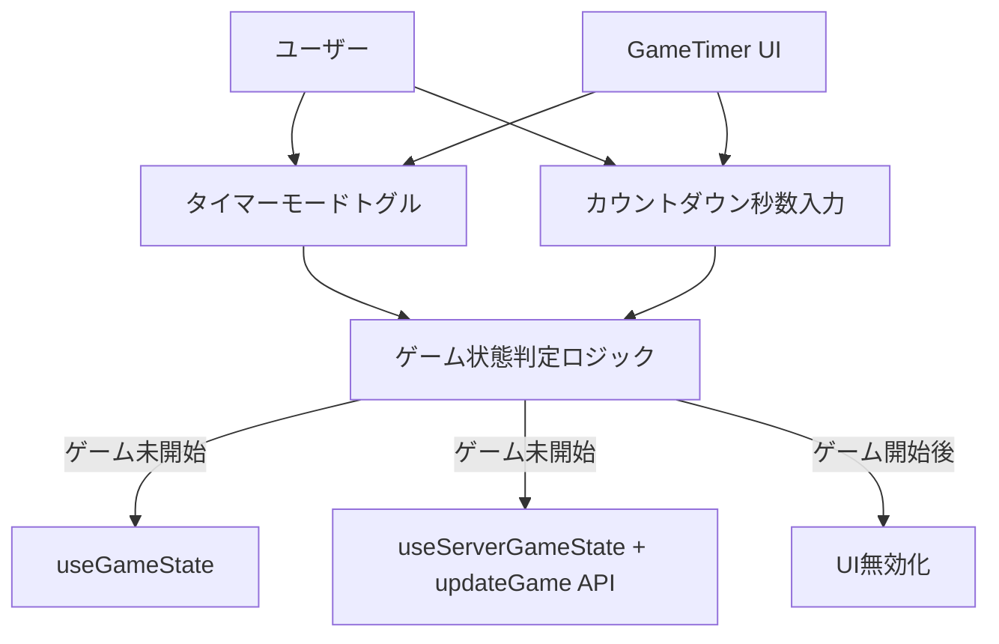
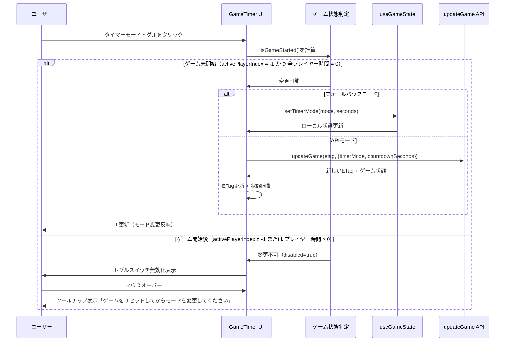
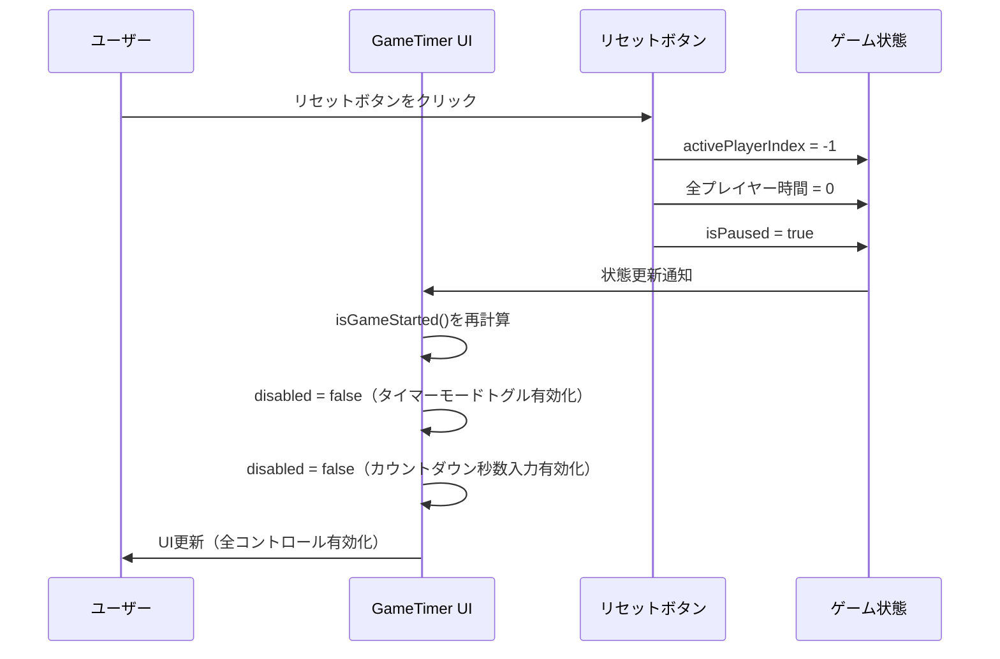

# タイマーモード更新機能修正 - 技術設計

## 概要

**目的**: APIモードにおいて、ゲーム開始後のタイマーモード変更を完全に禁止し、ゲームの公平性を確保する。現在の実装では一時停止中にタイマーモードを変更できる状態になっているが、これは公平性の観点から問題がある。本修正により、ゲーム未開始時のみタイマーモード変更を許可し、リセット後に再度変更可能にする。

**対象ユーザー**: ボードゲームのプレイヤーおよびゲーム管理者が、公平なゲーム環境でタイマー機能を利用できるようにする。

**影響**: 既存のGameTimerコンポーネントのUI制御ロジックを修正し、タイマーモードトグルスイッチとカウントダウン秒数入力フィールドの無効化条件を変更する。

### ゴール
- ゲーム未開始時（activePlayerIndex = -1）のみタイマーモード変更を許可
- ゲーム開始後（activePlayerIndex ≠ -1 または プレイヤーの経過時間 > 0）はタイマーモード変更を完全に禁止（一時停止中でも禁止）
- リセット後に初期状態に戻り、タイマーモード変更を再度許可
- カウントダウン秒数入力フィールドもゲーム開始後は無効化
- 無効化時にツールチップで理由を表示

### 非ゴール
- タイマーモード変更のAPI実装の変更（既存のupdateGame APIをそのまま使用）
- useGameStateやuseServerGameStateの内部実装の変更
- 新しいタイマーモードの追加
- タイマーモード履歴の保存機能

## アーキテクチャ

### 既存アーキテクチャ分析

**現在のアーキテクチャパターン**:
- **フロントエンド**: React + TypeScript、カスタムフック（useGameState, useServerGameState）でビジネスロジックを分離
- **状態管理**: フォールバックモード（useGameState）とAPIモード（useServerGameState + updateGame API）の二重実装
- **ドメイン境界**: GameTimerコンポーネントがUI制御とビジネスルール適用の責務を持つ

**既存のドメイン境界**:
- `frontend/src/components/GameTimer.tsx`: メインUIコンポーネント、ゲーム制御ロジック統合
- `frontend/src/hooks/useGameState.ts`: フォールバックモード用のゲーム状態管理
- `frontend/src/hooks/useServerGameState.ts`: APIモード用のサーバー状態管理とポーリング同期

**維持すべき統合ポイント**:
- フォールバックモードとAPIモードの両方でタイマーモード変更機能が動作すること
- 既存のETag管理と楽観的ロック機構を維持
- リセット機能との整合性（リセット後はタイマーモード変更が再度可能）

**技術的制約**:
- `disabled`属性のみでUI制御を行い、既存のスタイルシステム（CSS）と整合性を保つ
- data-testid属性を維持してE2Eテストの互換性を確保

### ハイレベルアーキテクチャ



### 技術アラインメント

**既存パターンの維持**:
- React Hooks パターン: useCallback, useState を使用した既存のイベントハンドラーパターンを維持
- 条件付きレンダリング: `isInFallbackMode`による分岐パターンを維持
- CSS Modules: 既存のCSSクラス名（`.toggle-switch-enhanced`, `.countdown-control`）を再利用

**新規導入する要素**:
- ツールチップ表示用のHTML title属性（追加のライブラリは不要）
- ゲーム状態判定ロジック（`isGameStarted`計算式）

**技術スタック整合性**:
- React 19.1.1: 既存のReact機能のみ使用、新しいReact APIは不要
- TypeScript 5.9: 既存の型定義（GameState, TimerMode等）を再利用

## 技術的意思決定

### 決定1: UI無効化条件の変更

**決定**: `disabled`属性の条件式を `isGameActive && !isPaused` から `isGameActive` に変更する

**背景**: 現在の実装では一時停止中にタイマーモードを変更できるが、これは以下の問題を引き起こす：
- ゲーム途中でタイマーモードを変更すると、プレイヤー間の公平性が損なわれる
- カウントアップからカウントダウンへの変更で、既存の経過時間の扱いが不明確

**代替案**:
1. **一時停止中のみ変更可能**: 一時停止状態のみ変更を許可し、再開時に全プレイヤーの時間をリセット
   - トレードオフ: ゲーム途中でのルール変更を許容してしまう
2. **確認ダイアログ表示**: ゲーム開始後も変更可能だが、警告ダイアログで確認
   - トレードオフ: ユーザーが確認を無視する可能性があり、公平性担保が不確実
3. **完全禁止（選択）**: ゲーム開始後は一切変更不可
   - トレードオフ: 柔軟性は低下するが、公平性は確実に保たれる

**選択したアプローチ**: 代替案3（完全禁止）

**根拠**:
- ボードゲームの公平性を最優先とする製品コンセプトに合致
- リセット機能で簡単に初期状態に戻せるため、ユーザビリティへの影響は最小限
- 実装がシンプルで、テストしやすい

**トレードオフ**:
- **獲得**: ゲームの公平性保証、シンプルな実装、明確なUXルール
- **犠牲**: ゲーム途中でのタイマーモード変更の柔軟性（意図的な削除）

### 決定2: カウントダウン秒数入力の無効化

**決定**: カウントダウン秒数入力フィールド（`<input type="number">`）もゲーム開始後は無効化する

**背景**: タイマーモードトグル自体を無効化しても、カウントダウン秒数の変更を許可すると以下の問題が発生：
- ゲーム開始後にカウントダウン秒数を変更すると、次にモードを変更する際に不整合が生じる可能性
- UIとして一貫性が欠如し、ユーザーに混乱を与える

**代替案**:
1. **秒数入力は常に有効**: タイマーモードトグルは無効でも秒数入力は有効
   - トレードオフ: 変更した値が次回リセット後に適用されるが、ユーザーには分かりにくい
2. **秒数入力も無効化（選択）**: タイマーモードトグルと連動して無効化
   - トレードオフ: より制限的だが、一貫性があり分かりやすい

**選択したアプローチ**: 代替案2（秒数入力も無効化）

**根拠**:
- UI要素の状態が一貫し、ユーザーの認知負荷を軽減
- ゲーム開始後に秒数を変更する必要性がない（リセット後に再設定すればよい）

**トレードオフ**:
- **獲得**: UI一貫性、明確なユーザー体験
- **犠牲**: 次回ゲーム用の事前設定の柔軟性（リセット後に設定する必要がある）

### 決定3: ツールチップによる理由表示

**決定**: HTML標準の`title`属性を使用してツールチップを表示

**背景**: ユーザーがタイマーモードトグルを無効化する理由を理解できないと、不満やバグ報告につながる可能性がある。

**代替案**:
1. **サードパーティUIライブラリ（Tippy.js等）**: リッチなツールチップ
   - トレードオフ: 新しい依存関係の追加、バンドルサイズ増加
2. **カスタムツールチップコンポーネント**: 独自実装のツールチップ
   - トレードオフ: 実装コストが高い、アクセシビリティ対応が必要
3. **HTML title属性（選択）**: ブラウザ標準のツールチップ
   - トレードオフ: 見た目のカスタマイズ不可だが、追加コストゼロ

**選択したアプローチ**: 代替案3（HTML title属性）

**根拠**:
- 追加の依存関係やコード不要で、シンプルかつメンテナンス不要
- アクセシビリティ標準に準拠（スクリーンリーダー対応）
- 全ブラウザで動作保証

**トレードオフ**:
- **獲得**: ゼロコスト実装、標準準拠、メンテナンス不要
- **犠牲**: ツールチップの見た目カスタマイズ不可（製品要件では不要）

## システムフロー

### タイマーモード変更フロー



### リセット後のタイマーモード有効化フロー



## 要件トレーサビリティ

| 要件 | 要件概要 | コンポーネント | インターフェース | フロー |
|------|----------|--------------|-----------------|--------|
| 1 | ゲーム未開始時のタイマーモード変更許可 | GameTimer | disabled={isGameStarted} | タイマーモード変更フロー |
| 2 | ゲーム開始後のタイマーモード変更禁止 | GameTimer | disabled={isGameStarted} | タイマーモード変更フロー（else分岐） |
| 3 | リセット後の初期状態復帰 | GameTimer + resetGame | disabled={isGameStarted}（falseに戻る） | リセット後の有効化フロー |
| 4 | タイマーモード変更の基本動作 | GameTimer + handleTimerModeChange | 既存API維持 | タイマーモード変更フロー |
| 5 | カウントダウンモード時の秒数設定 | GameTimer + countdownSeconds input | disabled={isGameStarted} | タイマーモード変更フロー |
| 6 | ETag管理とAPI同期 | GameTimer + updateGame | 既存ETag管理維持 | タイマーモード変更フロー（APIモード分岐） |
| 7 | フォールバックモードでの動作 | GameTimer + useGameState | 既存setTimerMode維持 | タイマーモード変更フロー（フォールバック分岐） |
| 8 | エラーハンドリング | GameTimer | 既存エラーハンドリング維持 | （既存フロー維持） |

## コンポーネントとインターフェース

### UI層

#### GameTimerコンポーネント

**責務と境界**
- **主要責務**: タイマーモードトグルスイッチとカウントダウン秒数入力のUI制御
- **ドメイン境界**: フロントエンドUIコンポーネント層
- **データ所有権**: タイマーモード変更の許可/禁止状態を計算し、UI要素のdisabled属性を制御

**依存関係**
- **Inbound**: ユーザー操作（トグルスイッチクリック、秒数入力）
- **Outbound**:
  - `useGameState`（フォールバックモード）
  - `useServerGameState`（APIモード）
  - `updateGame` API（APIモード）
- **外部**: なし（既存の依存関係のみ）

**契約定義**

**UI制御ロジック**:
```typescript
// ゲーム開始状態の判定
const isGameStarted: boolean =
  gameState.activePlayerIndex !== -1 ||
  gameState.players.some(p => p.elapsedTimeSeconds > 0);

// タイマーモードトグルスイッチ
interface TimerModeToggle {
  checked: boolean; // 現在のタイマーモード（count-down = true）
  disabled: boolean; // isGameStarted
  onChange: (checked: boolean) => void; // handleTimerModeChange
  title?: string; // ツールチップテキスト（無効化時）
}

// カウントダウン秒数入力フィールド
interface CountdownSecondsInput {
  value: number; // countdownSeconds状態
  disabled: boolean; // isGameStarted
  onChange: (value: number) => void; // setCountdownSeconds
  min: number; // 1
  max: number; // 3600
}
```

**事前条件**:
- GameTimerコンポーネントがマウントされている
- gameState または serverGameState.serverState が利用可能

**事後条件**:
- ゲーム未開始時: タイマーモード変更が正常に実行され、UIに反映される
- ゲーム開始後: タイマーモード変更が禁止され、UI要素が無効化される

**不変条件**:
- `isGameStarted`の計算結果が常に一貫している
- フォールバックモードとAPIモードで同じUI制御ロジックが適用される

**状態管理**
- **状態モデル**:
  - ゲーム未開始（activePlayerIndex = -1 かつ 全プレイヤー時間 = 0）
  - ゲーム開始後（activePlayerIndex ≠ -1 または いずれかのプレイヤー時間 > 0）
- **永続化**: なし（揮発性UI状態）
- **並行性**: なし（Reactの単一スレッドモデル）

**既存システムとの統合戦略**
- **修正アプローチ**: 既存のGameTimer.tsxのdisabled属性計算式を変更（拡張ではなく修正）
- **後方互換性**:
  - data-testid属性を維持してE2Eテストの互換性を保つ
  - 既存のCSSクラス名を維持してスタイルを保持
- **移行パス**: 単一コミットでの修正（段階的移行は不要）

### ロジック層

#### handleTimerModeChange（既存）

**責務と境界**
- **主要責務**: タイマーモード変更のビジネスロジック実行
- **ドメイン境界**: ゲーム状態管理層
- **データ所有権**: タイマーモード変更のトランザクション管理

**依存関係**
- **Inbound**: GameTimer UIコンポーネント
- **Outbound**:
  - `useGameState.setTimerMode`（フォールバックモード）
  - `updateGame` API（APIモード）
- **外部**: なし

**契約定義**

**メソッドシグネチャ**:
```typescript
const handleTimerModeChange = React.useCallback(
  async (checked: boolean) => Promise<void>,
  [isInFallbackMode, etag, countdownSeconds, updateGame, fallbackState, updateEtag, clearConflictMessage, serverGameState]
);
```

**事前条件**:
- `checked`パラメータが真偽値である
- フォールバックモード: `fallbackState`が初期化されている
- APIモード: `etag`が利用可能である

**事後条件**:
- フォールバックモード: ローカル状態が更新される
- APIモード: サーバー状態が更新され、新しいETagが取得される

**不変条件**:
- タイマーモード変更後、プレイヤーの経過時間が正しくリセットされる
- ETagが常に最新の状態を反映する（APIモードのみ）

**統合戦略**
- **修正アプローチ**: 既存実装を維持（UI側のdisabled制御で十分）
- **後方互換性**: 完全に維持（変更なし）

## データモデル

### 論理データモデル

既存のGameState型定義を使用し、新しいデータモデルは追加しない。

**GameState型（既存）**:
```typescript
interface GameState {
  players: Player[];
  activePlayerIndex: number; // -1 = ゲーム未開始
  isPaused: boolean;
  timerMode: TimerMode; // 'count-up' | 'count-down'
  createdAt: Date;
  lastUpdatedAt: Date;
}

interface Player {
  id: string;
  name: string;
  elapsedTimeSeconds: number; // 0 = 時間未経過
  initialTimeSeconds: number;
}

type TimerMode = 'count-up' | 'count-down';
```

**ゲーム開始状態の判定ロジック**:
```typescript
const isGameStarted = (state: GameState): boolean => {
  return state.activePlayerIndex !== -1 ||
         state.players.some(p => p.elapsedTimeSeconds > 0);
};
```

**ビジネスルールと不変条件**:
- `activePlayerIndex = -1` かつ `すべてのプレイヤーのelapsedTimeSeconds = 0` の場合のみ、ゲーム未開始とみなす
- ゲーム未開始時のみタイマーモード変更を許可
- タイマーモード変更時に全プレイヤーの経過時間をリセット（既存のsetTimerMode実装）

## エラーハンドリング

### エラー戦略

既存のエラーハンドリング機構を維持し、新しいエラーパターンは追加しない。

### エラーカテゴリと対応

**ユーザーエラー（4xx）**:
- **既存**: ETag競合（HTTP 412 Precondition Failed） → エラーメッセージ「他のデバイスで変更されました。リロードしてください」
- **新規なし**: UI制御により、不正な操作を防止

**システムエラー（5xx）**:
- **既存**: ネットワークエラー → コンソール警告 + ユーザーへのエラーメッセージ
- **新規なし**: タイマーモード変更のAPI呼び出しは既存のエラーハンドリングに委譲

**ビジネスロジックエラー（422）**:
- **既存なし**: タイマーモード変更のバリデーションはフロントエンドで完結
- **新規なし**: UI無効化により、不正な変更を防止

### モニタリング

- **既存**: コンソールログへのエラー出力、ETag競合検出
- **新規なし**: 追加のモニタリング機構は不要

## テスト戦略

### ユニットテスト

#### GameTimerコンポーネント（3項目）

1. **ゲーム未開始時のタイマーモードトグル有効化**
   - 条件: `activePlayerIndex = -1`, 全プレイヤー時間 = 0
   - 検証: トグルスイッチの`disabled`属性が`false`
   - 検証: カウントダウン秒数入力の`disabled`属性が`false`

2. **ゲーム開始後のタイマーモードトグル無効化**
   - 条件: `activePlayerIndex = 0` または いずれかのプレイヤー時間 > 0
   - 検証: トグルスイッチの`disabled`属性が`true`
   - 検証: カウントダウン秒数入力の`disabled`属性が`true`
   - 検証: `title`属性に「ゲームをリセットしてからモードを変更してください」が設定されている

3. **リセット後のタイマーモードトグル再有効化**
   - 操作: リセットボタンをクリック
   - 検証: `activePlayerIndex = -1`, 全プレイヤー時間 = 0
   - 検証: トグルスイッチの`disabled`属性が`false`
   - 検証: カウントダウン秒数入力の`disabled`属性が`false`

### E2Eテスト

#### タイマーモード変更のライフサイクル（5項目）

1. **初期状態でタイマーモード変更が可能**
   - 操作: ページロード後、タイマーモードトグルをクリック
   - 検証: トグルスイッチが切り替わる
   - 検証: カウントダウン秒数入力フィールドが表示される（カウントダウンモード時）

2. **ゲーム開始後のタイマーモード変更が禁止**
   - 操作: 「ゲームを開始する」ボタンをクリック
   - 検証: トグルスイッチが無効化される（`disabled`属性がtrue）
   - 検証: カウントダウン秒数入力フィールドが無効化される
   - 検証: トグルスイッチにマウスオーバーでツールチップが表示される

3. **一時停止中もタイマーモード変更が禁止**
   - 操作: ゲーム開始後、一時停止ボタンをクリック
   - 検証: トグルスイッチが無効化されたまま（`disabled`属性がtrue）
   - 検証: カウントダウン秒数入力フィールドが無効化されたまま

4. **リセット後にタイマーモード変更が再度可能**
   - 操作: リセットボタンをクリック
   - 検証: トグルスイッチが有効化される（`disabled`属性がfalse）
   - 検証: カウントダウン秒数入力フィールドが有効化される
   - 検証: トグルスイッチをクリックするとモードが切り替わる

5. **APIモードでのタイマーモード変更とETag同期**
   - 操作: APIモードでタイマーモードを変更
   - 検証: updateGame APIが呼び出される
   - 検証: 新しいETagが取得される
   - 検証: サーバー状態が即座に同期される（serverGameState.updateFromServer呼び出し）

### パフォーマンステスト

本機能はUI制御のみの修正であり、パフォーマンステストは不要。

## セキュリティ考慮事項

本機能はUIの無効化制御のみであり、新しいセキュリティリスクは発生しない。

**既存のセキュリティ機構**:
- ETagによる楽観的ロック（競合検出）
- クライアント側のバリデーション（カウントダウン秒数の範囲チェック: 1〜3600秒）

**本修正による影響**:
- UI無効化により、クライアント側での不正な操作を防止
- サーバー側のバリデーションは既存のまま維持（信頼境界はサーバー側）
