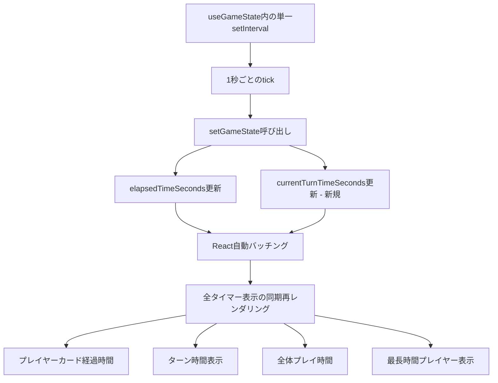
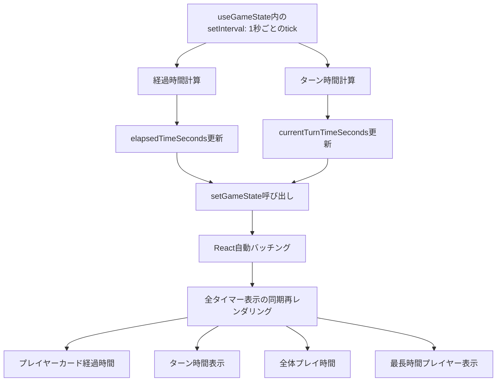
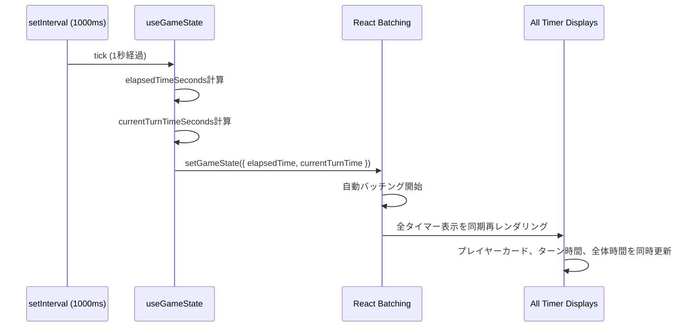
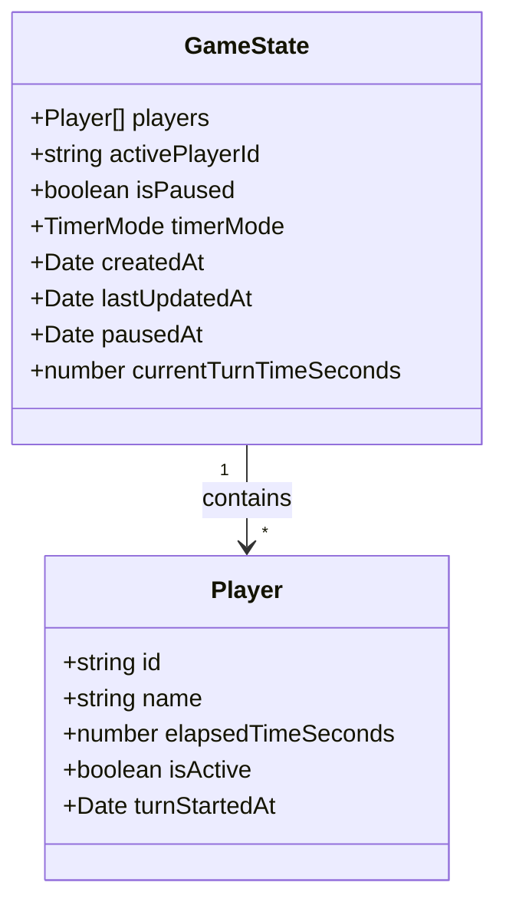
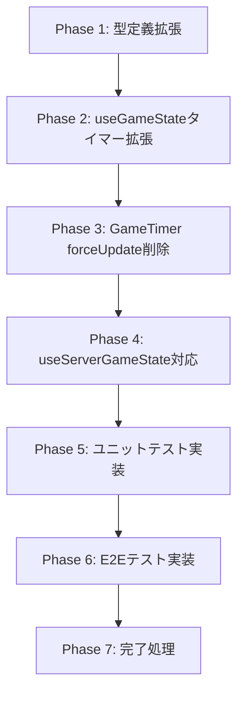

# Technical Design Document

## Overview

本機能は、マルチプレイヤー・ゲームタイマーにおける複数のタイマー表示（プレイヤーカードの経過時間、ターン時間、全体プレイ時間、最長時間プレイヤー表示）の同期問題を解決します。最新の調査により、**2つの独立したsetIntervalインスタンス**が並行動作していることが根本原因として特定されました。

**根本原因の詳細**:
1. useGameState内のsetInterval（269-317行目）: プレイヤーの`elapsedTimeSeconds`を更新
2. GameTimer.tsx内のsetInterval（96-104行目）: `forceUpdate()`を呼び出してターン時間表示を強制再レンダリング

これら2つのタイマーは異なるタイミングで開始され、独立してドリフトするため、画面上の表示が非同期に見えます。

本設計では、useGameState内の既存タイマーを拡張し、`currentTurnTimeSeconds`を状態として管理することで、forceUpdate()を完全に排除し、全てのタイマー表示がReactの宣言的UIパターンで同期更新されるようにします。

### Goals

- 2つの独立したsetIntervalを1つに統合する
- forceUpdate()パターンを排除し、Reactの宣言的UIに統一する
- 全てのタイマー表示が1秒ごとに同期して更新される
- カウントアップ/カウントダウン両モードで同期を保証する
- 一時停止・再開・リセット操作時の同期を保証する

### Non-Goals

- タイマー精度の向上（既存の1秒間隔を維持）
- 新しいタイマー表示の追加（既存の4種類の表示のみ対象）
- パフォーマンス最適化（既存のsetInterval構造を維持）
- サーバー同期機能の変更（既存の5秒ごとの同期を維持）

## Architecture

### Existing Architecture Analysis

現在のアーキテクチャの問題点：

```
useGameState内のタイマー (269-317行目)
  ↓ 1秒ごとに独立実行
  setGameState呼び出し → elapsedTimeSeconds更新
  ↓
  プレイヤーカードの経過時間表示更新

GameTimer.tsx内のタイマー (96-104行目)
  ↓ 1秒ごとに独立実行（別タイミング）
  forceUpdate()呼び出し → 強制再レンダリング
  ↓
  getCurrentTurnTime()再計算 → ターン時間表示更新
```

**問題**:
- 2つのsetIntervalが独立して開始されるため、実行タイミングがズレる
- forceUpdate()とsetStateは異なるレンダリングサイクルで実行される
- React自動バッチングの恩恵を受けられない

**既存パターンの保持**:
- useGameState内のタイマー管理構造を維持
- Props駆動のコンポーネント設計を維持
- React標準のuseState/useEffectパターンを維持

### High-Level Architecture



**Architecture Integration**:
- **既存パターン維持**: useGameState内でのタイマー管理、単一のsetInterval使用
- **新しい改善点**: currentTurnTimeSecondsを状態として追加、forceUpdate()完全排除
- **Technology Alignment**: React 19.1.1の自動バッチング機能を活用、TypeScript型安全性を確保
- **Steering Compliance**: structure.mdの「単一責任」「Props駆動」「状態は上位で管理」原則に準拠

### Technology Alignment

本機能は既存の技術スタックのみを使用し、新しい依存関係の導入は行いません：

- **React 19.1.1**: 既存のReactフックパターンとコンポーネント設計を維持、自動バッチング機能を活用
- **TypeScript 5.9**: GameState型定義にcurrentTurnTimeSecondsフィールドを追加、型安全性を確保
- **既存のuseGameState**: フック構造を維持し、内部のsetIntervalロジックを拡張
- **React自動バッチング**: React 18以降のデフォルト機能を活用して同期レンダリングを実現

**新しい導入**: なし（既存技術の改善のみ）

### Key Design Decisions

#### Decision 1: useGameState内タイマーの拡張による統合

**Context**: 2つの独立したsetIntervalが並行動作し、タイマー表示が非同期に更新される問題が発生しています。

**Alternatives**:
1. 2つのsetIntervalを保持し、タイミング調整のみ行う
2. useGameTimerフックを新たに活用し、両方のタイマーを置き換える
3. useGameState内の既存タイマーを拡張し、forceUpdate()を排除する

**Selected Approach**: useGameState内の既存タイマーを拡張（オプション3）

useGameState内の既存setInterval（269-317行目）を拡張し、`currentTurnTimeSeconds`を状態として管理します。setGameState呼び出し時に、elapsedTimeSecondsとcurrentTurnTimeSecondsを同時に更新することで、React 19.1.1の自動バッチング機能により、全てのタイマー表示が同じレンダリングサイクルで更新されます。

**Rationale**:
- 既存のuseGameState構造を活用できる（最小限の変更）
- 単一のsetIntervalで全タイマー表示を管理（同期保証）
- React自動バッチングにより、同じイベントループ内で全表示が更新される
- 実装コストが適正（3-5日で完了可能）

**Trade-offs**:
- **利点**: 最小限の変更、既存パターン活用、同期保証、メンテナンス性向上
- **欠点**: GameState型にフィールド追加が必要（currentTurnTimeSeconds）、getCurrentTurnTime()関数の使用箇所を置き換え

#### Decision 2: forceUpdate()の完全排除

**Context**: 現在GameTimer.tsx（96-104行目）でforceUpdate()が使用され、Reactの最適化を阻害しています。

**Alternatives**:
1. forceUpdate()を維持し、タイミング調整のみ行う
2. forceUpdate()を排除し、状態駆動のレンダリングに統一する

**Selected Approach**: forceUpdate()の完全排除と状態駆動レンダリング（オプション2）

GameTimer.tsx 96-104行目のforceUpdate()メカニズムを完全に削除し、ターン時間表示を`gameState.currentTurnTimeSeconds`（Props）で管理します。これにより、全てのタイマー表示が統一された状態駆動のレンダリングになります。

**Rationale**:
- Reactの宣言的UIパターンに従う（予測可能な動作）
- Reactの最適化機能を活用できる（メモ化、再レンダリング制御）
- コードの可読性とメンテナンス性が向上
- React 19の新機能との互換性確保

**Trade-offs**:
- **利点**: コード品質向上、React最適化活用、将来的な拡張性確保
- **欠点**: 既存のforceUpdate使用箇所の書き換えが必要（実装コスト増）

#### Decision 3: getCurrentTurnTime()関数の保持と内部実装変更

**Context**: 現在のgetCurrentTurnTime()関数はDate.now()を使用して計算していますが、状態管理に移行します。

**Alternatives**:
1. getCurrentTurnTime()関数を削除し、全箇所でcurrentTurnTimeSecondsを直接参照
2. getCurrentTurnTime()関数を保持し、内部でcurrentTurnTimeSecondsを返すように変更

**Selected Approach**: getCurrentTurnTime()関数を保持し、内部実装を変更（オプション2）

getCurrentTurnTime()関数のシグネチャは維持し、内部実装のみ変更します。この関数はcurrentTurnTimeSecondsを返すようにすることで、既存のコード変更を最小限に抑えます。

**Rationale**:
- 既存コードへの影響を最小化
- APIの後方互換性を維持
- 将来的な計算ロジック変更に対応可能

**Trade-offs**:
- **利点**: 既存コード変更最小、後方互換性維持
- **欠点**: 関数名が計算を示唆するが実際は状態取得（軽微な不一致）

## System Flows

### Timer Synchronization Data Flow



**Flow説明**:
1. useGameState内のsetIntervalが1秒ごとにtickを発火（単一インスタンス）
2. 同じtick内で、elapsedTimeSecondsとcurrentTurnTimeSecondsを並行計算
3. setGameState呼び出し時に、両方の値を同時に更新
4. React 19.1.1の自動バッチングにより、同じレンダリングサイクルでバッチ処理
5. 全てのタイマー表示コンポーネントが同時に再レンダリング
6. 画面上の全てのタイマー表示が同じ秒数を表示

### State Update Sequence



## Requirements Traceability

| Requirement | Requirement Summary | Components | Interfaces | Flows |
|-------------|-------------------|------------|------------|-------|
| 1.1 | ゲーム開始時の単一インスタンス作成 | useGameState | useEffect, setInterval | Timer Synchronization Data Flow |
| 1.2 | 全表示が同じインスタンスを参照 | useGameState | setGameState | Timer Synchronization Data Flow |
| 1.3 | 各表示に同じタイマー値を提供 | useGameState, GameState型 | currentTurnTimeSeconds | Timer Synchronization Data Flow |
| 1.4 | インスタンス破棄時の全表示停止 | useGameState | useEffect cleanup | Timer Synchronization Data Flow |
| 2.1 | 1秒ごとの同時更新 | useGameState, React Batching | setInterval, setGameState | State Update Sequence |
| 2.2 | カウントアップモードの同期 | useGameState | elapsedTimeSeconds, currentTurnTimeSeconds | Timer Synchronization Data Flow |
| 2.3 | カウントダウンモードの同期 | useGameState | elapsedTimeSeconds, currentTurnTimeSeconds | Timer Synchronization Data Flow |
| 2.4 | 更新遅延時の補正 | useGameState | setInterval | Timer Synchronization Data Flow |
| 3.1 | 一時停止時の更新停止 | useGameState | clearInterval | Timer Synchronization Data Flow |
| 3.2 | 一時停止状態での時刻保持 | GameState | currentTurnTimeSeconds | State Update Sequence |
| 3.3 | 再開時の更新再開 | useGameState | setInterval | Timer Synchronization Data Flow |
| 3.4 | リセット時の即座更新 | useGameState | setGameState | State Update Sequence |
| 4.1 | プレイヤーカード表示同期 | PlayerCard | elapsedTimeSeconds Props | Timer Synchronization Data Flow |
| 4.2 | ターン時間表示同期 | TurnTime | currentTurnTimeSeconds Props | Timer Synchronization Data Flow |
| 4.3 | 全体プレイ時間表示同期 | TotalPlayTime | elapsedTimeSeconds Props | Timer Synchronization Data Flow |
| 4.4 | 最長時間プレイヤー表示同期 | TopTimePlayerIndicator | elapsedTimeSeconds Props | Timer Synchronization Data Flow |
| 4.5 | 任意表示更新時の他表示同期 | React Batching | setGameState | State Update Sequence |

## Components and Interfaces

### State Management Layer

#### GameState型定義の拡張

**Responsibility & Boundaries**
- **Primary Responsibility**: ゲーム状態の型定義、currentTurnTimeSecondsフィールドを追加
- **Domain Boundary**: 型定義層（フロントエンド・バックエンド共有）
- **Data Ownership**: ゲーム状態の構造定義
- **Transaction Boundary**: なし（型定義のみ）

**Dependencies**
- **Inbound**: useGameState, GameTimer.tsx等の全コンポーネント
- **Outbound**: Player型、TimerMode型
- **External**: なし

**Contract Definition**

**Data Model**:
```typescript
export interface GameState {
  players: Player[];
  activePlayerId: string | null;
  isPaused: boolean;
  timerMode: TimerMode;
  createdAt: Date;
  lastUpdatedAt: Date;
  pausedAt: Date | null;
  currentTurnTimeSeconds: number; // 新規追加: 現在のターンでの経過時間（秒）
}
```

- **currentTurnTimeSeconds**: アクティブプレイヤーのターン開始からの経過時間（秒単位）
- **初期値**: 0（ターン開始前、またはアクティブプレイヤー不在時）
- **更新タイミング**: 1秒ごと（useGameState内のsetIntervalで更新）
- **リセットタイミング**: アクティブプレイヤー切り替え時に0にリセット

**Integration Strategy**:
- **Modification Approach**: GameState型にフィールド追加（非破壊的変更）
- **Backward Compatibility**: 既存フィールドはそのまま、新フィールド追加のみ
- **Migration Path**: TypeScriptの型チェックで全影響箇所を特定し、段階的に対応

### Timer Management Layer

#### useGameState (既存フックの改修)

**Responsibility & Boundaries**
- **Primary Responsibility**: ゲーム状態管理とタイマー管理、elapsedTimeSecondsとcurrentTurnTimeSecondsを同時更新
- **Domain Boundary**: 状態管理層（ビジネスロジックとUI層の中間）
- **Data Ownership**: GameState全体、単一のsetIntervalインスタンス
- **Transaction Boundary**: なし（ステートレスな計算のみ）

**Dependencies**
- **Inbound**: GameTimerコンポーネント（フックを呼び出す）
- **Outbound**: React標準API（useState, useEffect）、GameState型
- **External**: なし

**Contract Definition**

**Service Interface**:
```typescript
interface UseGameStateReturn {
  gameState: GameState;
  setActivePlayer: (playerId: string) => void;
  switchToNextPlayer: () => void;
  updatePlayerTime: (playerId: string, newTime: number) => void;
  togglePause: () => void;
  resetGame: () => void;
  setTimerMode: (mode: TimerMode) => void;
  setPlayerCount: (count: number) => void;
  updatePlayerName: (playerId: string, newName: string) => void;
  getCurrentTurnTime: () => number; // 内部実装変更: currentTurnTimeSecondsを返す
}

function useGameState(): UseGameStateReturn;
```

- **Preconditions**: なし（初期状態で呼び出し可能）
- **Postconditions**:
  - 1秒ごとにsetGameStateが呼び出される
  - elapsedTimeSecondsとcurrentTurnTimeSecondsが同時に更新される
  - タイマー停止条件（一時停止、アクティブプレイヤー不在）で自動停止
  - コンポーネントアンマウント時にsetIntervalがクリーンアップされる
- **Invariants**:
  - 常に単一のsetIntervalインスタンスのみ存在する
  - タイマー実行中は1秒ごとの更新が保証される

**State Management**:
- **State Model**:
  - アクティブ状態（タイマー実行中、アクティブプレイヤー存在、一時停止なし）
  - 停止状態（一時停止、アクティブプレイヤー不在）
- **Persistence**: なし（メモリ内のみ、useStateで管理）
- **Concurrency**: なし（単一スレッド実行）

**Integration Strategy**:
- **Modification Approach**: 既存のuseEffect（269-317行目）を拡張、currentTurnTimeSeconds計算を追加
- **Backward Compatibility**: 既存のAPIシグネチャを維持、getCurrentTurnTime()の内部実装のみ変更
- **Migration Path**: 段階的な適用不要（単一フック内の改修のみ）

**実装変更詳細** (269-317行目):
```typescript
// 既存のuseEffect内のsetIntervalを拡張
useEffect(() => {
  if (!gameState.activePlayerId || gameState.isPaused) {
    return;
  }

  const timerId = setInterval(() => {
    setGameState((prev) => {
      const activePlayer = prev.players.find(p => p.id === prev.activePlayerId);
      if (!activePlayer) return prev;

      // 既存: elapsedTimeSeconds更新
      const newElapsedTime = prev.timerMode === 'count-up'
        ? activePlayer.elapsedTimeSeconds + 1
        : Math.max(0, activePlayer.elapsedTimeSeconds - 1);

      // 新規: currentTurnTimeSeconds計算
      const currentTurnTimeSeconds = activePlayer.turnStartedAt
        ? Math.floor((Date.now() - activePlayer.turnStartedAt.getTime()) / 1000)
        : 0;

      const updatedPlayers = prev.players.map(p =>
        p.id === prev.activePlayerId
          ? { ...p, elapsedTimeSeconds: newElapsedTime }
          : p
      );

      return {
        ...prev,
        players: updatedPlayers,
        currentTurnTimeSeconds, // 新規追加
        lastUpdatedAt: new Date()
      };
    });
  }, 1000);

  return () => clearInterval(timerId);
}, [gameState.activePlayerId, gameState.isPaused]);
```

**getCurrentTurnTime()の変更**:
```typescript
// 変更前: Date.now()を使用して計算
const getCurrentTurnTime = (): number => {
  if (!activePlayer?.turnStartedAt) return 0;
  return Math.floor((Date.now() - activePlayer.turnStartedAt.getTime()) / 1000);
};

// 変更後: 状態から取得
const getCurrentTurnTime = (): number => {
  return gameState.currentTurnTimeSeconds;
};
```

### UI Component Layer

#### GameTimer (既存コンポーネントの改修)

**Responsibility & Boundaries**
- **Primary Responsibility**: タイマー状態を管理し、全てのタイマー表示コンポーネントに同期した値をPropsで配布する
- **Domain Boundary**: UIコンポーネント層（プレゼンテーション層）
- **Data Ownership**: なし（useGameStateから状態を受け取るのみ）
- **Transaction Boundary**: なし（UIコンポーネント）

**Dependencies**
- **Inbound**: App.tsxからマウントされる
- **Outbound**: useGameState（フォールバックモード）, useServerGameState（通常モード）
- **External**: なし

**Contract Definition**

**Component Interface**:
```typescript
interface GameTimerProps {
  // Propsなし（自己完結型コンポーネント）
}

function GameTimer(): JSX.Element;
```

- **Preconditions**: なし（自己完結型コンポーネント）
- **Postconditions**:
  - 全てのタイマー表示が同期して更新される
  - 一時停止・再開・リセット操作が全表示に即座に反映される
- **Invariants**:
  - 全てのタイマー表示が同じgameStateから値を取得する
  - forceUpdate()は使用しない（状態駆動のレンダリングのみ）

**State Management**:
- **State Model**: useGameStateまたはuseServerGameStateでゲーム状態を管理
- **Persistence**: なし（メモリ内のみ）
- **Concurrency**: なし（Reactの単方向データフロー）

**Integration Strategy**:
- **Modification Approach**: forceUpdate()メカニズム（96-104行目）を完全削除
- **Backward Compatibility**: コンポーネントインターフェース（Props）は変更なし
- **Migration Path**: 段階的な適用不要（単一コンポーネントの改修のみ）

**削除箇所** (96-104行目):
```typescript
// 削除: forceUpdate()メカニズム全体
// const [, forceUpdate] = React.useReducer(x => x + 1, 0);
// React.useEffect(() => {
//   if (isInFallbackMode && !isPaused && gameState?.activePlayerId) {
//     const interval = setInterval(() => {
//       forceUpdate();
//     }, 1000);
//     return () => clearInterval(interval);
//   }
// }, [isInFallbackMode, isPaused, gameState?.activePlayerId]);
```

**ターン時間表示の変更** (460行目):
```typescript
// 変更前: getCurrentTurnTime()関数を呼び出し（forceUpdateに依存）
<div className="turn-time" data-testid="turn-time">
  現在のターン: {formatTime(fallbackState.getCurrentTurnTime())}
</div>

// 変更後: getCurrentTurnTime()は内部でcurrentTurnTimeSecondsを返すため、同じコードで動作
// 内部実装が変わるだけで、呼び出し側は変更不要
<div className="turn-time" data-testid="turn-time">
  現在のターン: {formatTime(fallbackState.getCurrentTurnTime())}
</div>
```

#### タイマー表示コンポーネント群

**Component List**:
- PlayerCard: プレイヤーカードのタイマー表示（457行目）
- TurnTime: ターン時間表示（460行目）
- TotalPlayTime: 全体プレイ時間表示
- TopTimePlayerIndicator: 最長時間プレイヤー表示

**Responsibility & Boundaries**
- **Primary Responsibility**: GameTimerから受け取ったPropsを表示する
- **Domain Boundary**: UIコンポーネント層（プレゼンテーション層）
- **Data Ownership**: なし（Propsのみ）
- **Transaction Boundary**: なし

**Dependencies**
- **Inbound**: GameTimerコンポーネント
- **Outbound**: なし
- **External**: なし

**Contract Definition**

各コンポーネントはGameTimerからPropsで値を受け取り、表示のみを行います：

```typescript
interface TimerDisplayProps {
  elapsedTime: number; // プレイヤーカード、全体プレイ時間
  currentTurnTime: number; // ターン時間表示（getCurrentTurnTime()から取得）
  playerName?: string;
  isActive?: boolean;
}
```

- **Preconditions**: GameTimerから有効なPropsが渡される
- **Postconditions**: Propsの値を正確に表示する
- **Invariants**: Propsの値が変更されたときのみ再レンダリングされる

**Integration Strategy**:
- **Modification Approach**: 変更なし（既存のProps駆動設計を維持）
- **Backward Compatibility**: Propsインターフェースは変更なし
- **Migration Path**: 段階的な適用不要（既存のProps駆動設計を維持）

## Data Models

### Domain Model

**Core Concepts**:
- **GameState**: ゲーム全体の状態を管理するエンティティ、currentTurnTimeSecondsフィールドを追加
- **Player**: 個別プレイヤー情報、elapsedTimeSecondsとturnStartedAtを保持
- **TimerMode**: カウントアップ/カウントダウンモードの値オブジェクト

**Business Rules & Invariants**:
- currentTurnTimeSecondsは0以上の整数値
- アクティブプレイヤー不在時、currentTurnTimeSecondsは0
- アクティブプレイヤー切り替え時、currentTurnTimeSecondsは0にリセット
- 一時停止中、currentTurnTimeSecondsは更新されない

**Data Structure**:


## Error Handling

### Error Strategy

本機能は既存システムの改修であり、新たなエラーカテゴリは導入されません。既存のエラーハンドリングパターンを維持します。

### Error Categories and Responses

**User Errors** (4xx):
- 該当なし（タイマー同期はシステム内部の改善）

**System Errors** (5xx):
- 該当なし（クライアントサイドのみの改修）

**Business Logic Errors** (422):
- 該当なし（既存のバリデーションルールを維持）

### Monitoring

既存のエラートラッキング、ログ、ヘルスモニタリングを維持します。新たな監視要件はありません。

## Testing Strategy

### Unit Tests

1. **GameState型: currentTurnTimeSecondsフィールドの追加**
   - GameState型にcurrentTurnTimeSecondsフィールドが存在することを検証
   - 初期値が0であることを検証
   - 型定義がTypeScriptコンパイルエラーなくビルドされることを検証

2. **useGameState: タイマー値の同期更新**
   - 1秒ごとにsetGameStateが呼び出されることを検証
   - elapsedTimeSecondsとcurrentTurnTimeSecondsが同時に更新されることを検証
   - カウントアップモードで両値が正しく増加することを検証
   - カウントダウンモードでelapsedTimeSecondsが正しく減少することを検証

3. **useGameState: タイマー停止条件**
   - 一時停止状態でsetIntervalがクリアされることを検証
   - アクティブプレイヤー不在時にsetIntervalがクリアされることを検証
   - アンマウント時にsetIntervalがクリーンアップされることを検証

4. **useGameState: getCurrentTurnTime()の動作**
   - getCurrentTurnTime()がgameState.currentTurnTimeSecondsを返すことを検証
   - アクティブプレイヤー切り替え時に0にリセットされることを検証

5. **GameTimer: forceUpdate削除後の動作**
   - forceUpdate()が使用されていないことをコード検査で確認
   - 状態駆動のレンダリングで全表示が更新されることを検証

### Integration Tests

1. **タイマー同期の検証**
   - useGameStateとGameTimerの統合テスト
   - setGameState更新 → 子コンポーネント再レンダリングのフロー検証

2. **状態管理の一貫性**
   - 一時停止・再開・リセット操作時の全表示同期を検証
   - カウントアップ/ダウン切り替え時の全表示同期を検証

3. **React自動バッチングの動作**
   - elapsedTimeSecondsとcurrentTurnTimeSecondsの更新が同じレンダリングサイクルで行われることを検証
   - React DevTools Profilerで再レンダリング回数を確認

### E2E Tests

1. **全タイマー表示の同期確認**
   - ゲーム開始後、プレイヤーカード経過時間、ターン時間、全体プレイ時間、最長時間プレイヤー表示の秒数が同じタイミングで変化することを検証
   - 各表示のdata-testid属性を使用して、表示テキストを取得し、秒数が一致することを確認
   - 1秒間隔で複数回確認し、常に同期していることを検証

2. **カウントアップ/ダウンモード同期**
   - カウントアップモードで全表示が同時に増加することを検証
   - カウントダウンモードで全表示が同時に減少することを検証
   - モード切り替え時も同期が維持されることを検証

3. **ゲーム操作時の同期**
   - 一時停止ボタンクリック後、全表示が同じ秒数で停止することを検証
   - 再開ボタンクリック後、全表示が同期して再開することを検証
   - リセットボタンクリック後、全表示が即座に初期値に更新されることを検証

4. **ビジュアル検証**
   - Playwrightのスクリーンショット機能を使用して、全タイマー表示が同じ秒数を表示していることを視覚的に検証
   - 1秒ごとのスクリーンショット比較で、全表示が同期していることを確認

### Performance Tests

1. **レンダリングパフォーマンス**
   - タイマー更新時のReactレンダリング回数を測定（React DevTools Profiler使用）
   - 1秒ごとの更新で過剰な再レンダリングが発生していないことを確認
   - forceUpdate削除前後でのレンダリング回数比較

2. **メモリ使用量**
   - 長時間ゲーム実行時のメモリリークがないことを確認
   - setIntervalのクリーンアップが正しく動作することを確認
   - Chrome DevTools Performance Monitorでメモリ使用量を監視

## Migration Strategy

### Implementation Phases



**Phase 1: 型定義拡張** (0.5日)
- GameState型にcurrentTurnTimeSecondsフィールド追加
- TypeScriptコンパイルエラー確認
- 影響箇所の特定

**Phase 2: useGameStateタイマー拡張** (1日)
- useGameState内のsetInterval（269-317行目）を拡張
- currentTurnTimeSeconds計算ロジック追加
- getCurrentTurnTime()内部実装変更

**Phase 3: GameTimer forceUpdate削除** (0.5日)
- GameTimer.tsx 96-104行目のforceUpdate削除
- 動作確認（ブラウザで手動確認）

**Phase 4: useServerGameState対応** (1日)
- useServerGameStateにも同様の変更を適用
- ポーリング時にcurrentTurnTimeSecondsも更新

**Phase 5: ユニットテスト実装** (1日)
- GameState型テスト
- useGameStateタイマーロジックテスト
- GameTimerコンポーネントテスト

**Phase 6: E2Eテスト実装** (0.5-1日)
- timer-synchronization.spec.ts作成
- 全表示同期検証

**Phase 7: 完了処理** (0.2日)
- spec.json更新（phase: "implementation-done"）
- tasks.md全タスク完了チェック
- 最終コミット作成

**総計**: 3-5日（24-40時間）

### Rollback Triggers

- Phase 2-4でTypeScriptコンパイルエラーが解決できない場合
- Phase 5でユニットテストが80%以上パスしない場合
- Phase 6でE2Eテストが全て失敗する場合
- React自動バッチングが想定通りに動作しない場合

### Validation Checkpoints

**Phase 1完了条件**:
- ✅ GameState型定義にcurrentTurnTimeSecondsフィールドが存在
- ✅ TypeScriptコンパイルエラーなし

**Phase 2完了条件**:
- ✅ useGameState内のsetIntervalでcurrentTurnTimeSecondsを更新
- ✅ getCurrentTurnTime()が状態から値を返す
- ✅ ブラウザで動作確認（ターン時間が1秒ごとに更新）

**Phase 3完了条件**:
- ✅ forceUpdate()メカニズムが完全削除
- ✅ ブラウザで動作確認（全タイマー表示が同期）

**Phase 4完了条件**:
- ✅ useServerGameStateでも同様の変更が完了
- ✅ 通常モードで動作確認

**Phase 5完了条件**:
- ✅ 全ユニットテストがパス
- ✅ テストカバレッジ80%以上

**Phase 6完了条件**:
- ✅ 全E2Eテストがパス
- ✅ 全タイマー表示の同期が視覚的に確認

**Phase 7完了条件**:
- ✅ spec.jsonのphaseが"implementation-done"
- ✅ tasks.md全タスク完了[x]
- ✅ 最終コミット作成
