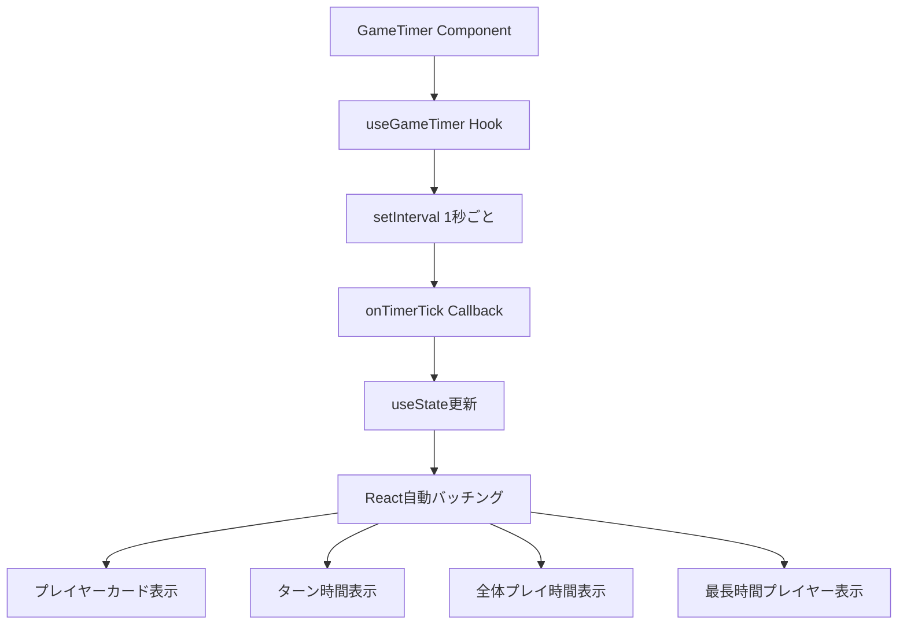
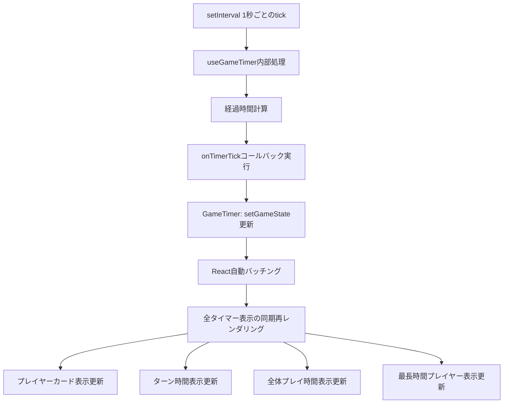

# Technical Design Document

## Overview

本機能は、マルチプレイヤー・ゲームタイマーにおける複数のタイマー表示（プレイヤーカード、ターン時間、全体プレイ時間、最長時間プレイヤー表示）の同期問題を解決します。現在、これらのタイマー表示が独立して更新されているため、表示タイミングにズレが生じ、ユーザーに視覚的な違和感を与えています。

本設計では、既存のuseGameTimerフックを改修し、Reactの状態管理とレンダリングバッチングを活用することで、全てのタイマー表示が同じタイミングで同期して更新されるようにします。これにより、ユーザーはどのタイマー表示を見ても同じ時刻を確認でき、ゲーム進行が視覚的に統一された状態で提供されます。

本機能は既存システムの改修であり、新しい技術スタックの導入は行わず、React/TypeScriptの標準的なパターンに従って実装します。

### Goals

- 全てのタイマー表示が1秒ごとに同期して更新される
- forceUpdate()の使用を排除し、Reactの宣言的UIパターンに統一する
- 既存のuseGameTimerフック構造を維持し、最小限の変更で実現する
- カウントアップ/カウントダウン両モードで同期を保証する
- 一時停止・再開・リセット操作時の同期を保証する

### Non-Goals

- タイマー精度の向上（既存の1秒間隔を維持）
- 新しいタイマー表示の追加（既存の4種類の表示のみ対象）
- パフォーマンス最適化（既存のsetInterval構造を維持）
- サーバー同期機能の変更（既存の5秒ごとの同期を維持）

## Architecture

### Existing Architecture Analysis

現在のアーキテクチャは以下の構成になっています：

- **useGameTimerフック**: setIntervalを使用してタイマーを管理し、onTimerTickコールバックで状態更新を通知
- **GameTimerコンポーネント**: メインコンポーネントとして、useGameTimerを呼び出し、各タイマー表示に状態を配布
- **タイマー表示コンポーネント**: プレイヤーカード、ターン時間、全体プレイ時間、最長時間プレイヤー表示の各コンポーネント

**問題点の診断**:
複数のタイマー表示が非同期に見える原因は、各表示コンポーネントが独立してforceUpdate()を呼び出している、またはReactの再レンダリングバッチングのタイミングがズレている可能性があります。

**既存パターンの保持**:
- useGameTimerフックによるタイマーロジックの管理
- Props駆動のコンポーネント設計
- 単一のsetIntervalインスタンス管理（既に実装済み）

### High-Level Architecture



**Architecture Integration**:
- **既存パターン維持**: useGameTimerフックでのタイマー管理、Props駆動のコンポーネント設計
- **新しい改善点**: forceUpdate排除、単一のuseState更新による同期レンダリング
- **Technology Alignment**: React 19.1.1の自動バッチング機能を活用、TypeScript型安全性を確保
- **Steering Compliance**: structure.mdの「単一責任」「Props駆動」「状態は上位で管理」原則に準拠

### Technology Alignment

本機能は既存の技術スタックのみを使用し、新しい依存関係の導入は行いません：

- **React 19.1.1**: 既存のReactフックパターンとコンポーネント設計を維持
- **TypeScript 5.9**: 既存の型定義を活用し、型安全性を確保
- **既存のuseGameTimer**: フック構造を維持し、内部実装のみ改善
- **React自動バッチング**: React 18以降のデフォルト機能を活用して同期レンダリングを実現

**新しい導入**: なし（既存技術の改善のみ）

### Key Design Decisions

#### Decision 1: タイマー更新の単一化

**Context**: 複数のタイマー表示が独立して更新され、視覚的に非同期に見える問題が発生しています。

**Alternatives**:
1. Context APIでタイマー値を共有し、全コンポーネントが同じContextを参照する
2. useReducerによる集中的な状態管理で、単一のdispatchで全状態を更新する
3. 単一のuseState更新で、Reactの自動バッチングを活用する

**Selected Approach**: 単一のuseState更新とReactの自動バッチング

GameTimerコンポーネント内で、useGameTimerのonTimerTickコールバックを受け取り、単一のuseStateを更新します。React 18以降の自動バッチング機能により、同じイベントループ内の状態更新は自動的にバッチ処理され、全ての子コンポーネントが同じレンダリングサイクルで更新されます。

**Rationale**:
- 既存のuseGameTimerフック構造を維持できる（最小限の変更）
- Reactの標準的なパターンに従う（メンテナンス性向上）
- パフォーマンスが良好（Context更新による全体再レンダリングを回避）
- 実装コストが最小（既存コードの改善のみ）

**Trade-offs**:
- **利点**: 最小限の変更で実現、Reactの最適化を活用、メンテナンス性向上
- **欠点**: なし（既存パターンの改善のみで、新たな複雑性の導入なし）

#### Decision 2: forceUpdate排除による宣言的UI統一

**Context**: 現在の実装でforceUpdate()が使用されている場合、Reactの最適化を阻害し、予測不可能な動作の原因となります。

**Alternatives**:
1. forceUpdate()をそのまま維持し、タイミング調整のみ行う
2. 状態駆動のレンダリングに統一し、forceUpdate()を完全に排除する

**Selected Approach**: forceUpdate()の完全排除と状態駆動レンダリング

全てのタイマー表示を状態駆動のレンダリングに統一し、forceUpdate()の使用を完全に排除します。GameTimerコンポーネントでuseStateを使用して状態を管理し、Propsで各子コンポーネントに値を渡します。

**Rationale**:
- Reactの宣言的UIパターンに従う（予測可能な動作）
- Reactの最適化機能を活用できる（メモ化、再レンダリング制御）
- コードの可読性とメンテナンス性が向上
- React 19の新機能（Compiler、Server Components等）との互換性確保

**Trade-offs**:
- **利点**: コード品質向上、Reactの最適化活用、将来的な拡張性確保
- **欠点**: 既存のforceUpdate使用箇所の書き換えが必要（実装コスト増）

#### Decision 3: タイマーインスタンス配置の維持

**Context**: タイマーの同期問題を解決するため、タイマーインスタンスの配置を見直す必要があります。

**Alternatives**:
1. グローバルなタイマーマネージャーシングルトンを作成する
2. Context APIでタイマーインスタンスを共有する
3. 既存のuseGameTimerフック内でsetIntervalを管理する（現状維持）

**Selected Approach**: 既存のuseGameTimerフック構造を維持

useGameTimerフック内で単一のsetIntervalインスタンスを管理する既存の構造を維持します。問題の本質はタイマーインスタンスの分散ではなく、レンダリングの非同期化であるため、タイマーインスタンスの配置変更は不要です。

**Rationale**:
- 既に単一インスタンス管理が正しく実装されている
- 問題の本質はレンダリングタイミングのズレ（タイマーインスタンス配置は関係ない）
- 既存のReactフックパターンを維持できる
- 最小限の変更で実現可能

**Trade-offs**:
- **利点**: 既存コード資産を活用、実装コスト最小、Reactフックパターンに準拠
- **欠点**: なし

## System Flows

### Timer Synchronization Data Flow



**Flow説明**:
1. useGameTimer内のsetIntervalが1秒ごとにtickを発火
2. useGameTimer内部で経過時間を計算（カウントアップ/ダウン）
3. onTimerTickコールバックを呼び出し、新しい時間値を通知
4. GameTimerコンポーネントがuseStateを更新
5. React 18+の自動バッチングにより、同じレンダリングサイクルでバッチ処理
6. 全てのタイマー表示コンポーネントが同時に再レンダリング
7. 画面上の全てのタイマー表示が同じ秒数を表示

## Requirements Traceability

| Requirement | Requirement Summary | Components | Interfaces | Flows |
|-------------|-------------------|------------|------------|-------|
| 1.1 | ゲーム開始時の単一インスタンス作成 | useGameTimer | useEffect, setInterval | Timer Synchronization Data Flow |
| 1.2 | 全表示が同じインスタンスを参照 | GameTimer | Props配布 | Timer Synchronization Data Flow |
| 1.3 | 各表示に同じタイマー値を提供 | useGameTimer, GameTimer | onTimerTick, useState | Timer Synchronization Data Flow |
| 1.4 | インスタンス破棄時の全表示停止 | useGameTimer | useEffect cleanup | Timer Synchronization Data Flow |
| 2.1 | 1秒ごとの同時更新 | useGameTimer, React Batching | setInterval, useState | Timer Synchronization Data Flow |
| 2.2 | カウントアップモードの同期 | useGameTimer | onTimerTick | Timer Synchronization Data Flow |
| 2.3 | カウントダウンモードの同期 | useGameTimer | onTimerTick | Timer Synchronization Data Flow |
| 2.4 | 更新遅延時の補正 | useGameTimer | setInterval | Timer Synchronization Data Flow |
| 3.1 | 一時停止時の更新停止 | useGameTimer | clearInterval | Timer Synchronization Data Flow |
| 3.2 | 一時停止状態での時刻保持 | GameTimer | useState | Timer Synchronization Data Flow |
| 3.3 | 再開時の更新再開 | useGameTimer | setInterval | Timer Synchronization Data Flow |
| 3.4 | リセット時の即座更新 | GameTimer | useState | Timer Synchronization Data Flow |
| 4.1 | プレイヤーカード表示同期 | PlayerCard | Props | Timer Synchronization Data Flow |
| 4.2 | ターン時間表示同期 | TurnTime | Props | Timer Synchronization Data Flow |
| 4.3 | 全体プレイ時間表示同期 | TotalPlayTime | Props | Timer Synchronization Data Flow |
| 4.4 | 最長時間プレイヤー表示同期 | TopTimePlayerIndicator | Props | Timer Synchronization Data Flow |
| 4.5 | 任意表示更新時の他表示同期 | React Batching | useState | Timer Synchronization Data Flow |

## Components and Interfaces

### Timer Management Layer

#### useGameTimer (既存フックの改修)

**Responsibility & Boundaries**
- **Primary Responsibility**: 単一のsetIntervalインスタンスを管理し、1秒ごとにonTimerTickコールバックを呼び出す
- **Domain Boundary**: タイマーロジック層（ビジネスロジックとUI層の中間）
- **Data Ownership**: タイマーの現在値、同期カウンター
- **Transaction Boundary**: なし（ステートレスな計算のみ）

**Dependencies**
- **Inbound**: GameTimerコンポーネント（フックを呼び出す）
- **Outbound**: React標準API（useEffect, useRef）、onTimerTickコールバック
- **External**: なし

**Contract Definition**

**Service Interface**:
```typescript
interface UseGameTimerParams {
  gameState: GameState;
  onTimerTick: TimerTickCallback;
  onServerSync?: ServerSyncCallback;
  onTimeExpired?: TimeExpiredCallback;
}

type TimerTickCallback = (playerId: string, newElapsedTime: number) => void;
type ServerSyncCallback = (playerId: string, elapsedTime: number) => void;
type TimeExpiredCallback = (playerId: string) => void;

function useGameTimer(params: UseGameTimerParams): void;
```

- **Preconditions**:
  - gameStateが有効なGameState型である
  - onTimerTickコールバックが提供されている
  - アクティブプレイヤーが存在する場合のみタイマーを開始
- **Postconditions**:
  - 1秒ごとにonTimerTickが呼び出される
  - タイマー停止条件（一時停止、カウントダウン0秒）で自動停止
  - コンポーネントアンマウント時にsetIntervalがクリーンアップされる
- **Invariants**:
  - 常に単一のsetIntervalインスタンスのみ存在する
  - タイマー実行中は1秒ごとの呼び出しが保証される

**State Management**:
- **State Model**:
  - アクティブ状態（タイマー実行中）
  - 停止状態（一時停止、カウントダウン0秒、アクティブプレイヤー不在）
- **Persistence**: なし（メモリ内のみ、useRefで管理）
- **Concurrency**: なし（単一スレッド実行）

**Integration Strategy**:
- **Modification Approach**: 既存のuseGameTimer内部実装を改善（インターフェースは維持）
- **Backward Compatibility**: onTimerTickコールバックのシグネチャを維持（破壊的変更なし）
- **Migration Path**: 段階的な適用不要（単一のフック改修のみ）

### UI Component Layer

#### GameTimer (既存コンポーネントの改修)

**Responsibility & Boundaries**
- **Primary Responsibility**: タイマー状態を管理し、全てのタイマー表示コンポーネントに同期した値をPropsで配布する
- **Domain Boundary**: UIコンポーネント層（プレゼンテーション層）
- **Data Ownership**: ゲーム状態（プレイヤー情報、タイマーモード、一時停止状態）
- **Transaction Boundary**: なし（UIコンポーネント）

**Dependencies**
- **Inbound**: App.tsxからマウントされる
- **Outbound**: useGameTimer, useGameState（フォールバックモード）, useServerGameState（通常モード）
- **External**: なし

**Contract Definition**

**Component Interface**:
```typescript
interface GameTimerProps {
  // Propsなし（自己完結型コンポーネント）
}

function GameTimer(): JSX.Element;
```

- **Preconditions**: なし（自己完結型コンポーネント）
- **Postconditions**:
  - 全てのタイマー表示が同期して更新される
  - 一時停止・再開・リセット操作が全表示に即座に反映される
- **Invariants**:
  - 全てのタイマー表示が同じgameStateから値を取得する
  - 状態更新は単一のuseStateを通じて行われる

**State Management**:
- **State Model**:
  - useGameState（フォールバックモード）またはuseServerGameState（通常モード）でゲーム状態を管理
  - useGameTimerでタイマーtickを受信し、状態を更新
- **Persistence**: なし（メモリ内のみ）
- **Concurrency**: なし（Reactの単方向データフロー）

**Integration Strategy**:
- **Modification Approach**: forceUpdate()呼び出しを削除し、状態駆動のレンダリングに統一
- **Backward Compatibility**: コンポーネントインターフェース（Props）は変更なし
- **Migration Path**: 段階的な適用不要（単一コンポーネントの改修のみ）

#### タイマー表示コンポーネント群

**Component List**:
- PlayerCard: プレイヤーカードのタイマー表示
- TurnTime: ターン時間表示
- TotalPlayTime: 全体プレイ時間表示
- TopTimePlayerIndicator: 最長時間プレイヤー表示

**Responsibility & Boundaries**
- **Primary Responsibility**: GameTimerから受け取ったPropsを表示する
- **Domain Boundary**: UIコンポーネント層（プレゼンテーション層）
- **Data Ownership**: なし（Propsのみ）
- **Transaction Boundary**: なし

**Dependencies**
- **Inbound**: GameTimerコンポーネント
- **Outbound**: なし
- **External**: なし

**Contract Definition**

各コンポーネントはGameTimerからPropsで値を受け取り、表示のみを行います：

```typescript
interface TimerDisplayProps {
  elapsedTime: number;
  playerName?: string;
  isActive?: boolean;
  // その他の表示用Props
}
```

- **Preconditions**: GameTimerから有効なPropsが渡される
- **Postconditions**: Propsの値を正確に表示する
- **Invariants**: Propsの値が変更されたときのみ再レンダリングされる

**Integration Strategy**:
- **Modification Approach**: Props受け取りロジックのみ（表示ロジックは変更なし）
- **Backward Compatibility**: Propsインターフェースは変更なし
- **Migration Path**: 段階的な適用不要（既存のProps駆動設計を維持）

## Testing Strategy

### Unit Tests

1. **useGameTimer: タイマー値の同期更新**
   - 1秒ごとにonTimerTickコールバックが呼び出されることを検証
   - カウントアップモードで経過時間が正しく増加することを検証
   - カウントダウンモードで経過時間が正しく減少することを検証

2. **useGameTimer: タイマー停止条件**
   - 一時停止状態でsetIntervalがクリアされることを検証
   - カウントダウン0秒でタイマーが停止することを検証
   - アンマウント時にsetIntervalがクリーンアップされることを検証

3. **GameTimer: 状態更新時の同期**
   - onTimerTickコールバック実行時にuseStateが更新されることを検証
   - 状態更新後に全ての子コンポーネントが再レンダリングされることを検証

4. **GameTimer: forceUpdate削除後の動作**
   - forceUpdate()が使用されていないことをコード検査で確認
   - 状態駆動のレンダリングで全表示が更新されることを検証

### Integration Tests

1. **タイマー同期の検証**
   - useGameTimerとGameTimerの統合テスト
   - onTimerTick → useState更新 → 子コンポーネント再レンダリングのフロー検証

2. **状態管理の一貫性**
   - 一時停止・再開・リセット操作時の全表示同期を検証
   - カウントアップ/ダウン切り替え時の全表示同期を検証

### E2E Tests

1. **全タイマー表示の同期確認**
   - ゲーム開始後、プレイヤーカード、ターン時間、全体プレイ時間、最長時間プレイヤー表示の秒数が同じタイミングで変化することを検証
   - 各表示のdata-testid属性を使用して、表示テキストを取得し、秒数が一致することを確認

2. **カウントアップ/ダウンモード同期**
   - カウントアップモードで全表示が同時に増加することを検証
   - カウントダウンモードで全表示が同時に減少することを検証
   - モード切り替え時も同期が維持されることを検証

3. **ゲーム操作時の同期**
   - 一時停止ボタンクリック後、全表示が同じ秒数で停止することを検証
   - 再開ボタンクリック後、全表示が同期して再開することを検証
   - リセットボタンクリック後、全表示が即座に初期値に更新されることを検証

4. **ビジュアル検証**
   - Playwrightのスクリーンショット機能を使用して、全タイマー表示が同じ秒数を表示していることを視覚的に検証
   - 1秒ごとのスクリーンショット比較で、全表示が同期していることを確認

### Performance Tests

1. **レンダリングパフォーマンス**
   - タイマー更新時のReactレンダリング回数を測定（React DevTools Profiler使用）
   - 1秒ごとの更新で過剰な再レンダリングが発生していないことを確認

2. **メモリ使用量**
   - 長時間ゲーム実行時のメモリリークがないことを確認
   - setIntervalのクリーンアップが正しく動作することを確認
