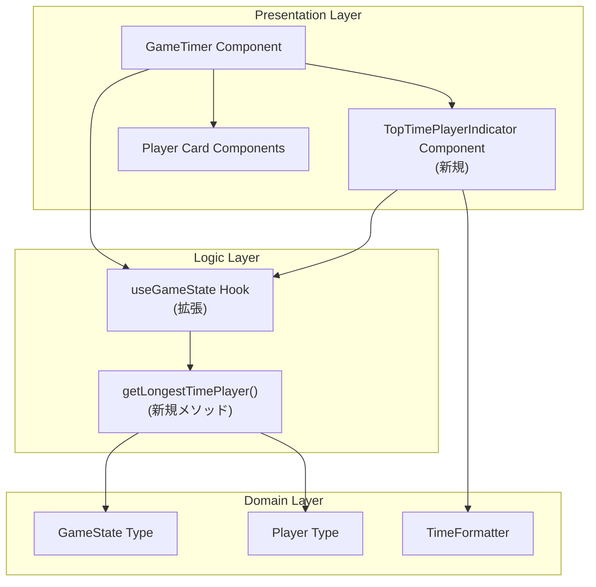
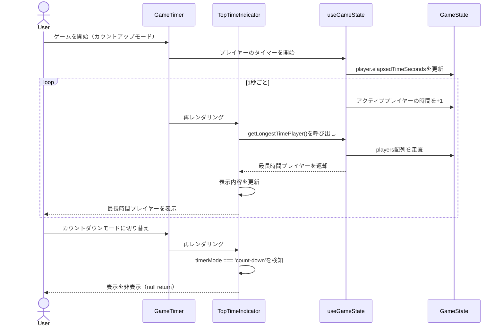
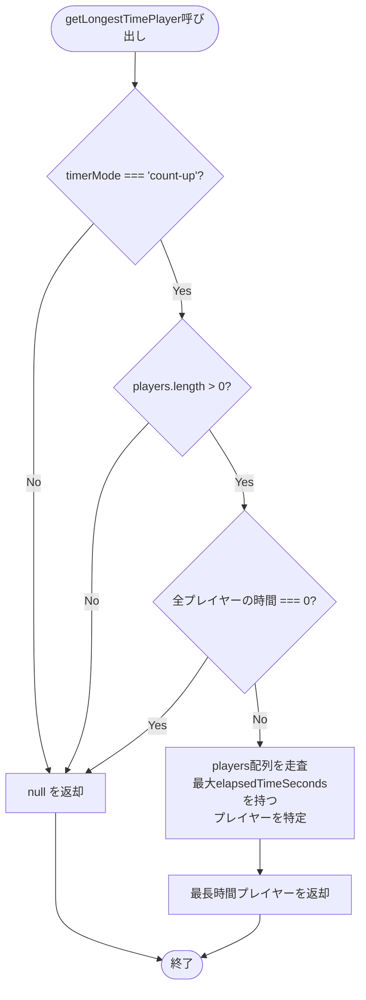

# Technical Design Document

## 概要

本機能は、既存のマルチプレイヤーゲームタイマーに、現在最も累積時間を使っているプレイヤーを別枠で強調表示する機能を追加します。カウントアップモード時にのみ表示され、プレイヤーのタイマーが動作するたびにリアルタイムで更新されます。

**目的**: ゲームの進行状況を視覚化し、プレイヤー間の時間配分を一目で把握できるようにすることで、公平なゲーム進行を支援します。

**対象ユーザー**: ボードゲームプレイヤー（4〜6人）が各自のデバイスまたは共有デバイスでタイマーを確認する際に使用します。

**影響範囲**: 既存のGameTimerコンポーネント、useGameStateフック、CSSスタイルに変更を加えます。新しいコンポーネント（TopTimePlayerIndicator）を追加しますが、既存の機能には影響しません。

### Goals
- カウントアップモード時に最長時間プレイヤーを自動的に検出して表示する
- 指定されたフォーマット（「最も時間を使っているプレイヤー: [名前] (HH:MM:SS)」）で表示する
- タイマー動作中に1秒ごとにリアルタイム更新する
- 全デバイス（スマートフォン、タブレット、PC）でレスポンシブに表示する

### Non-Goals
- カウントダウンモードでの表示（要件で明示的に除外）
- 履歴データの保存や統計表示（既存のスコープ外機能）
- 複数の最長時間プレイヤーの同時表示（同点の場合は1人のみ表示）
- アニメーション効果やトランジション（Phase 1では実装しない）

## アーキテクチャ

### 既存アーキテクチャの分析

**現在のアーキテクチャパターン**:
- React関数コンポーネント + カスタムフック
- プレゼンテーション層（GameTimer.tsx）とロジック層（useGameState.ts）の分離
- useStateによるローカル状態管理（Phase 1: インメモリー版）
- CSSファイルによるスタイリング（CSS Modules不使用）

**既存のドメイン境界**:
- GameState: ゲーム全体の状態管理（プレイヤー、タイマーモード、アクティブプレイヤー）
- Player: 個別プレイヤーの情報（ID、名前、経過時間、アクティブ状態）
- TimeFormatter: 時間フォーマットユーティリティ

**統合ポイント**:
- GameTimer.tsx: 新しい表示コンポーネントの統合場所
- useGameState.ts: 最長時間プレイヤー計算ロジックの追加場所
- GameTimer.css: 新しいスタイル定義の追加場所

### High-Level Architecture



**アーキテクチャ統合**:
- **既存パターンの維持**: プレゼンテーション/ロジック分離、カスタムフックによる状態管理
- **新規コンポーネント**: TopTimePlayerIndicator（単一責任: 最長時間プレイヤーの表示のみ）
- **技術スタック整合性**: React 19.1.1 + TypeScript 5.9、既存のスタイリングパターン
- **ステアリング準拠**: TDD（Vitest）、レスポンシブデザイン、型安全性

### Technology Alignment

本機能は既存の技術スタックを使用し、新しい外部依存関係を導入しません。

**既存技術スタック**:
- React 19.1.1: 関数コンポーネントとフック
- TypeScript 5.9: 型安全性
- CSS: コンポーネント固有のスタイリング
- Vitest 3.2: ユニットテスト

**新規導入ライブラリ**: なし

**既存パターンからの逸脱**: なし

### Key Design Decisions

#### 決定1: 最長時間プレイヤー計算ロジックの配置

**決定**: useGameStateフックに`getLongestTimePlayer()`メソッドを追加する

**コンテキスト**: 最長時間プレイヤーを特定するロジックをどこに配置するか（コンポーネント内 vs カスタムフック内 vs 新しいユーティリティ関数）

**代替案**:
1. **コンポーネント内で直接計算**: TopTimePlayerIndicator内で`gameState.players`を直接処理
2. **新しいカスタムフック作成**: `useTopTimePlayer()`として分離
3. **既存useGameStateに追加**: 既存のフックに新しいメソッドを追加

**選択したアプローチ**: 既存useGameStateに追加（案3）

**理由**:
- 既存のフックがすべてのゲーム状態ロジックを集約している（一貫性）
- コンポーネントの責任を軽減し、ロジックを再利用可能にする
- 新しいフックを作成する必要性が低い（単純な計算ロジック）
- テストが容易（既存のuseGameStateテストに追加）

**トレードオフ**:
- 利点: 一貫性、再利用性、テスト容易性
- 欠点: useGameStateの責任が若干増加（ただし、ゲーム状態に関連するロジックなので許容範囲）

#### 決定2: コンポーネントの粒度

**決定**: 単一の`TopTimePlayerIndicator`コンポーネントを作成する

**コンテキスト**: 最長時間プレイヤー表示機能をどの粒度でコンポーネント化するか

**代替案**:
1. **GameTimer内に直接実装**: 新しいコンポーネントを作成せず、GameTimerに直接記述
2. **単一コンポーネント**: TopTimePlayerIndicatorとして独立したコンポーネント
3. **複数の小さいコンポーネント**: TopTimeIndicatorContainer + TopTimeDisplay + TopTimePlayerInfoなど

**選択したアプローチ**: 単一コンポーネント（案2）

**理由**:
- 単一責任の原則: 最長時間プレイヤーの表示という明確な責任
- GameTimerの肥大化を防ぐ
- 再利用性とテスト容易性の向上
- 過度な分割を避ける（表示ロジックがシンプルなため）

**トレードオフ**:
- 利点: 責任の明確化、テスト容易性、再利用性
- 欠点: ファイル数が1つ増加（ただし、プロジェクト構造への影響は最小限）

#### 決定3: 表示条件の実装方法

**決定**: コンポーネント内で条件付きレンダリング（early return）を使用する

**コンテキスト**: カウントアップモード時のみ表示し、カウントダウンモードでは非表示にする実装方法

**代替案**:
1. **親コンポーネントで制御**: GameTimerで条件判定して表示/非表示
2. **コンポーネント内でearly return**: TopTimePlayerIndicator内で条件判定して早期リターン
3. **CSS display制御**: 常にレンダリングしてCSSで表示/非表示

**選択したアプローチ**: コンポーネント内でearly return（案2）

**理由**:
- コンポーネントの自己完結性: 表示条件をコンポーネント自身が管理
- パフォーマンス: 非表示時はDOM要素を生成しない
- コードの可読性: 条件が明確で理解しやすい

**トレードオフ**:
- 利点: 自己完結性、パフォーマンス、可読性
- 欠点: 親コンポーネントで表示状態を制御できない（ただし、要件上それは必要ない）

## System Flows

### ユーザーインタラクションフロー



### 最長時間プレイヤー計算フロー



## Requirements Traceability

| 要件 | 要件概要 | コンポーネント | インターフェース | フロー |
|------|---------|--------------|----------------|--------|
| 1.1 | カウントアップモードで最長プレイヤー表示 | TopTimePlayerIndicator, useGameState | getLongestTimePlayer() | ユーザーインタラクションフロー |
| 1.2 | プレイヤー名と累積時間を表示 | TopTimePlayerIndicator | Player.name, Player.elapsedTimeSeconds | - |
| 1.3 | 同点時は1人を選択表示 | useGameState | getLongestTimePlayer() | 最長時間プレイヤー計算フロー |
| 1.4 | カウントダウンモードで非表示 | TopTimePlayerIndicator | 条件付きレンダリング | ユーザーインタラクションフロー |
| 1.5 | 全員0秒時は非表示 | useGameState | getLongestTimePlayer() | 最長時間プレイヤー計算フロー |
| 2.1 | 指定フォーマットで表示 | TopTimePlayerIndicator | formatTime() | - |
| 2.2 | HH:MM:SS形式 | TimeFormatter | TimeFormatter.formatElapsedTime() | - |
| 2.3 | 視覚的に目立つスタイル | TopTimePlayerIndicator (CSS) | .top-time-indicator クラス | - |
| 2.4 | プレイヤー名または番号表示 | TopTimePlayerIndicator | Player.name | - |
| 3.1 | 1秒ごとに更新 | TopTimePlayerIndicator, useGameState | React useEffect | ユーザーインタラクションフロー |
| 3.2 | 最長プレイヤー変更時に即座に切り替え | TopTimePlayerIndicator | React 再レンダリング | ユーザーインタラクションフロー |
| 3.3 | リセット時にクリア | TopTimePlayerIndicator | 条件付きレンダリング | - |
| 3.4 | プレイヤー数変更時に再計算 | useGameState | getLongestTimePlayer() | - |
| 4.1 | スマートフォンでプレイヤーリスト上部に配置 | TopTimePlayerIndicator (CSS) | メディアクエリ | - |
| 4.2 | タブレット・PCで目立つ位置に配置 | TopTimePlayerIndicator (CSS) | メディアクエリ | - |
| 4.3 | 画面サイズ変更時に自動調整 | TopTimePlayerIndicator (CSS) | レスポンシブCSS | - |
| 4.4 | 読みやすいフォントサイズ | TopTimePlayerIndicator (CSS) | .top-time-indicator クラス | - |
| 4.5 | 既存UIを崩さず独立要素として表示 | TopTimePlayerIndicator | 独立コンポーネント | - |

## Components and Interfaces

### Presentation Layer

#### TopTimePlayerIndicator Component

**責任と境界**
- **主要責任**: 最も時間を使っているプレイヤーを視覚的に強調表示する単一の表示コンポーネント
- **ドメイン境界**: プレゼンテーション層（UIのみ、ビジネスロジックは含まない）
- **データ所有権**: データを所有せず、useGameStateから取得したデータを表示するのみ
- **トランザクション境界**: 該当なし（表示のみ）

**依存関係**
- **Inbound**: GameTimerコンポーネント（親コンポーネント）
- **Outbound**: useGameStateフック（最長時間プレイヤーデータ取得）、TimeFormatter（時間フォーマット）
- **External**: React、TypeScript

**契約定義**

**Component Interface**:
```typescript
interface TopTimePlayerIndicatorProps {
  // propsなし（useGameStateから直接データを取得）
}

/**
 * 最長時間プレイヤー表示コンポーネント
 *
 * 表示条件:
 * - timerMode === 'count-up'
 * - 最長時間プレイヤーが存在する（全員0秒でない）
 *
 * 表示内容:
 * - "最も時間を使っているプレイヤー: [プレイヤー名] (HH:MM:SS)"
 */
export function TopTimePlayerIndicator(): JSX.Element | null;
```

**Preconditions**:
- useGameStateが正しく初期化されている
- GameStateが有効な状態である

**Postconditions**:
- カウントアップモード時に最長時間プレイヤーが表示される
- カウントダウンモード時は何も表示されない（null）

**Invariants**:
- 表示される時間は常にHH:MM:SS形式
- 表示されるプレイヤーは常に1人のみ

**State Management**:
- **State Model**: ステートレス（useGameStateから状態を取得）
- **Persistence**: なし
- **Concurrency**: 該当なし

**Integration Strategy**:
- **Modification Approach**: GameTimerコンポーネントに新しいコンポーネントを追加（非破壊的拡張）
- **Backward Compatibility**: 既存機能に影響なし
- **Migration Path**: 段階的な追加（既存コードの変更なし）

#### GameTimer Component (拡張)

**責任と境界**
- **主要責任**: ゲームタイマーのルートコンポーネント（既存 + TopTimePlayerIndicatorの統合）
- **ドメイン境界**: プレゼンテーション層
- **データ所有権**: なし（useGameStateに委譲）
- **トランザクション境界**: 該当なし

**依存関係**
- **Inbound**: App.tsx
- **Outbound**: TopTimePlayerIndicator（新規）、useGameState、その他既存コンポーネント
- **External**: React

**Integration Strategy**:
- **Modification Approach**: 既存のGameTimerコンポーネントにTopTimePlayerIndicatorを追加
- **追加位置**: `<div className="game-status">` セクションの直後、`<div className="players-section">` の直前
- **Backward Compatibility**: 既存の表示要素とロジックには一切変更なし

### Logic Layer

#### useGameState Hook (拡張)

**責任と境界**
- **主要責任**: ゲーム状態管理（既存 + 最長時間プレイヤー計算）
- **ドメイン境界**: ロジック層（状態管理とビジネスロジック）
- **データ所有権**: GameState（プレイヤー、タイマーモード、アクティブプレイヤー）
- **トランザクション境界**: Reactの状態更新

**依存関係**
- **Inbound**: GameTimer、TopTimePlayerIndicator
- **Outbound**: GameState型、Player型、TimeFormatter
- **External**: React（useState、useCallback、useEffect）

**Contract Definition**

**Service Interface（新規メソッド）**:
```typescript
interface UseGameStateReturn {
  // 既存メソッド...

  /**
   * 最も累積時間が長いプレイヤーを取得
   *
   * @returns 最長時間プレイヤー、または条件に合わない場合はnull
   *
   * 返却条件:
   * - timerMode === 'count-up'
   * - players.length > 0
   * - 少なくとも1人のプレイヤーの時間が0より大きい
   *
   * 同点の場合: 最初に見つかったプレイヤーを返却
   */
  getLongestTimePlayer(): Player | null;

  /**
   * 時間を指定フォーマットで返却（既存メソッド、参考用）
   */
  formatTime(seconds: number): string;
}
```

**Preconditions**:
- GameStateが初期化されている
- players配列が有効（4〜6人）

**Postconditions**:
- カウントアップモードかつ有効なプレイヤーが存在する場合、最長時間プレイヤーを返却
- それ以外の場合、nullを返却

**Invariants**:
- 返却されるプレイヤーは常にgameState.players内に存在する
- 返却されるプレイヤーのelapsedTimeSecondsは0以上

**Implementation Strategy**:
```typescript
const getLongestTimePlayer = useCallback((): Player | null => {
  // カウントアップモードでない場合は非表示
  if (gameState.timerMode !== 'count-up') {
    return null;
  }

  // プレイヤーが存在しない場合は非表示
  if (gameState.players.length === 0) {
    return null;
  }

  // 全員の時間が0の場合は非表示
  const hasNonZeroTime = gameState.players.some(p => p.elapsedTimeSeconds > 0);
  if (!hasNonZeroTime) {
    return null;
  }

  // 最長時間のプレイヤーを検索（同点の場合は最初に見つかったプレイヤー）
  let longestPlayer = gameState.players[0];
  for (const player of gameState.players) {
    if (player.elapsedTimeSeconds > longestPlayer.elapsedTimeSeconds) {
      longestPlayer = player;
    }
  }

  return longestPlayer;
}, [gameState.timerMode, gameState.players]);
```

**Integration Strategy**:
- **Modification Approach**: 既存のuseGameStateフックに新しいメソッドを追加
- **Backward Compatibility**: 既存のメソッドとインターフェースには一切変更なし
- **Migration Path**: 既存コードへの影響なし（新しいメソッドは使用しない限り呼ばれない）

### Domain Layer

#### Player Type (既存、参照用)

既存の型定義を使用。変更なし。

```typescript
interface Player {
  id: string;
  name: string;
  elapsedTimeSeconds: number; // カウントアップ: 経過時間
  initialTimeSeconds: number;
  isActive: boolean;
  createdAt: Date;
}
```

## Data Models

### Domain Model

既存のドメインモデルを使用。新しいエンティティや値オブジェクトは追加しません。

**使用する既存エンティティ**:
- **Player**: 個別プレイヤーの情報
- **GameState**: ゲーム全体の状態

**ビジネスルールと不変条件**:
- 最長時間プレイヤーは常に1人（同点の場合は最初のプレイヤー）
- カウントアップモード時のみ表示される
- 全員の時間が0の場合は表示されない

**データ整合性**:
- GameStateのバリデーションルールを継承（GameStateValidator）
- 新しいバリデーションルールは不要

## Error Handling

### Error Strategy

本機能は表示のみの機能であり、エラーが発生する可能性は低いです。防御的プログラミングとして以下の戦略を採用します。

### Error Categories and Responses

**User Errors**: 該当なし（ユーザー入力を受け取らない）

**System Errors**:
- **プレイヤーデータ不整合**: getLongestTimePlayerがnullを返却し、表示しない（graceful degradation）
- **型エラー**: TypeScriptの型チェックで事前に防止

**Business Logic Errors**:
- **無効なタイマーモード**: 条件分岐で処理（カウントアップモード以外はnullを返却）
- **空のプレイヤー配列**: 条件分岐で処理（nullを返却）

### Monitoring

**エラー追跡**: コンソールログ（開発環境）
- 予期しないエラー発生時にconsole.errorでログ出力

**ヘルスモニタリング**: 該当なし（表示機能のため）

## Testing Strategy

### Unit Tests

**TopTimePlayerIndicatorコンポーネント**:
1. カウントアップモード時に最長時間プレイヤーを表示すること
2. カウントダウンモード時に何も表示しないこと（null）
3. 全員の時間が0の場合に何も表示しないこと
4. 指定されたフォーマット（「最も時間を使っているプレイヤー: [名前] (HH:MM:SS)」）で表示すること
5. プレイヤー名が未設定の場合にプレイヤー番号を表示すること

**useGameStateフック（getLongestTimePlayerメソッド）**:
1. カウントアップモードかつプレイヤーが存在する場合、最長時間プレイヤーを返却すること
2. カウントダウンモードの場合、nullを返却すること
3. 全員の時間が0の場合、nullを返却すること
4. 同点のプレイヤーが複数いる場合、最初のプレイヤーを返却すること
5. プレイヤーが存在しない場合、nullを返却すること

### Integration Tests

1. GameTimerコンポーネントにTopTimePlayerIndicatorが統合され、表示されること
2. タイマーが動作中に最長時間プレイヤーが変更された場合、表示が更新されること
3. プレイヤー数を変更した場合、最長時間プレイヤーが再計算されて表示されること
4. リセットボタンをクリックした場合、最長時間プレイヤー表示がクリアされること
5. タイマーモードを切り替えた場合、表示が適切に表示/非表示されること

### E2E/UI Tests

1. カウントアップモードでゲームを開始し、最長時間プレイヤーが表示されること（Chrome DevTools）
2. 複数のプレイヤーのタイマーを動作させ、最長時間プレイヤーが正しく更新されること（Chrome DevTools）
3. カウントダウンモードに切り替えた場合、表示が非表示になること（Chrome DevTools）
4. スマートフォン、タブレット、PCの各画面サイズで適切に表示されること（レスポンシブ検証）

### Performance Tests

該当なし（単純な配列走査のため、パフォーマンスへの影響は無視できる）

## レスポンシブ表示

### レスポンシブデザイン戦略

既存のGameTimerコンポーネントと同じレスポンシブデザインパターンを採用します。

**ブレークポイント**（既存と同じ）:
- スマートフォン: 〜767px（単列レイアウト）
- タブレット: 768px〜1023px（2列グリッドレイアウト）
- PC: 1024px〜1439px（3列グリッドレイアウト）
- 大画面PC: 1440px〜（4列グリッドレイアウト）

**TopTimePlayerIndicator配置**:
- スマートフォン: プレイヤーリスト上部（game-statusの直後）、幅100%
- タブレット・PC: 上部中央、幅auto、中央揃え
- 全画面サイズ: margin、paddingで適切な余白を確保

**CSSクラス設計**:
```css
.top-time-indicator {
  /* 基本スタイル: 視覚的に目立つスタイル */
  background-color: #fffbeb; /* 薄黄色背景 */
  border: 2px solid #f59e0b; /* オレンジ色の枠線 */
  border-radius: 8px;
  padding: 16px;
  margin: 16px 0;
  font-size: 1.1rem;
  font-weight: bold;
  text-align: center;
}

.top-time-indicator__player-name {
  color: #d97706; /* オレンジ色 */
}

.top-time-indicator__time {
  color: #92400e; /* 濃いオレンジ色 */
  font-family: 'Courier New', monospace; /* 等幅フォント */
}

/* レスポンシブ: スマートフォン */
@media (max-width: 767px) {
  .top-time-indicator {
    width: 100%;
    font-size: 1rem;
  }
}

/* レスポンシブ: タブレット・PC */
@media (min-width: 768px) {
  .top-time-indicator {
    max-width: 600px;
    margin: 16px auto;
    font-size: 1.2rem;
  }
}
```

## フロントエンド実装の検証プロセス（必須）

本機能の実装完了後、以下のプロセスを**必ず**実施すること:

### 1. TDD Implementation
- TopTimePlayerIndicatorコンポーネントのテストを作成（RED phase）
- useGameStateのgetLongestTimePlayerメソッドのテストを作成（RED phase）
- 最小限の実装でテストをパス（GREEN phase）
- 必要に応じてリファクタリング（REFACTOR phase）
- `npm test`で全テストが成功することを確認

### 2. Chrome DevTools Verification

**検証手順**:
1. `npm run dev`で開発サーバー起動
2. `mcp__chrome-devtools__navigate_page`で`http://localhost:5173`にアクセス
3. `mcp__chrome-devtools__take_snapshot`で初期状態確認
4. カウントアップモード設定、プレイヤーのタイマー開始を操作
5. `mcp__chrome-devtools__take_snapshot`で最長時間プレイヤー表示を確認
6. `Bash(sleep 5)`後に再度スナップショットで時間経過を確認
7. カウントダウンモードに切り替え、表示が非表示になることを確認
8. レスポンシブデザイン検証（画面サイズ変更）

**検証項目**:
1. ✅ カウントアップモード時に最長時間プレイヤーが表示される
2. ✅ 表示フォーマット「最も時間を使っているプレイヤー: [名前] (HH:MM:SS)」が正しい
3. ✅ タイマー動作中に1秒ごとに更新される
4. ✅ カウントダウンモードで非表示になる
5. ✅ 全員0秒時に非表示になる
6. ✅ スマートフォン画面（375px）で適切に表示される
7. ✅ タブレット・PC画面（768px以上）で適切に表示される
8. ✅ 視覚的に目立つスタイル（枠線、背景色、フォントサイズ）が適用される

### 3. Task Completion

検証完了後、以下を実施:
1. tasks.mdを更新（該当タスクをチェック済み`[x]`に変更）
2. 詳細なコミットメッセージでGitコミット作成
3. 次のタスクへ進む
