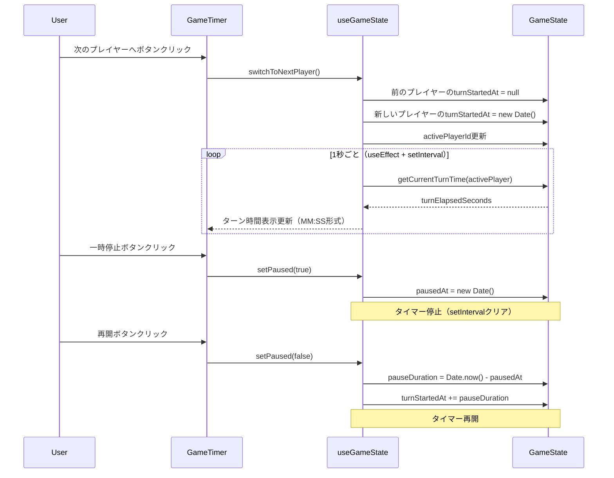
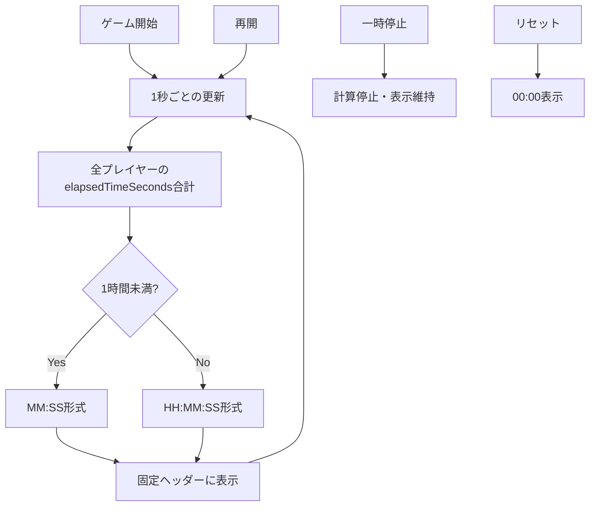

# Technical Design: ターン時間トラッキング

## Overview

本機能は、マルチプレイヤー・ゲームタイマーに2つの時間トラッキング機能を追加します。**ターン時間トラッキング**は、アクティブプレイヤーの現在のターンでの経過時間を累計時間とは別に表示します。**ゲーム全体のプレイ時間表示**は、全プレイヤーの累計時間の合計をリアルタイムで表示します。

**Purpose**: この機能は、プレイヤーに対してターンごとの時間使用状況とゲーム全体の進行時間の可視性を提供し、時間管理の透明性を向上させます。

**Users**: ボードゲームプレイヤーは、これらの機能を利用して、個別のターン時間と全体のゲーム進行を管理します。特に時間制限のあるゲームセッションにおいて、残り時間の予測と時間配分の最適化に活用します。

**Impact**: 既存のGameState型とPlayer型を拡張し、useGameStateフックに新しい計算ロジックと状態管理機能を追加します。UIコンポーネントには、プレイヤーカードへのターン時間表示と固定ヘッダーへのゲーム全体時間表示を追加します。

### Goals

- アクティブプレイヤーのターン時間を1秒間隔で正確に計測し、MM:SS形式で表示する
- 全プレイヤーの累計時間合計をゲーム全体のプレイ時間としてHH:MM:SS形式で表示する
- 一時停止・再開時にターン時間を正確に調整し、一時停止中の時間を除外する
- 既存のレスポンシブUIデザインパターンに統合し、全デバイスで見やすく表示する
- カウントアップ・カウントダウン両モードで正しく動作する時間計算ロジックを実装する

### Non-Goals

- ターンごとの時間制限やタイムアウト警告機能（将来の拡張として検討）
- ゲーム履歴や過去のターン時間の保存機能
- プレイヤー間の時間比較やランキング表示
- バックエンドへの同期（Phase 1ではフロントエンドのみで完結）

## Architecture

### Existing Architecture Analysis

**現在のアーキテクチャパターン**:
- **状態管理**: React Hooks（useGameStateカスタムフック）によるインメモリー状態管理
- **タイマー実装**: useEffectとsetIntervalによる1秒間隔の自動更新
- **型安全性**: TypeScript厳格型定義（GameState、Player型）
- **UIパターン**: 関数コンポーネント + CSS Modules、レスポンシブデザイン

**既存のドメイン境界**:
- **GameState集約**: ゲーム全体の状態（players、activePlayerId、isPaused、timerMode）
- **Player エンティティ**: プレイヤー個別の状態（id、name、elapsedTimeSeconds、isActive）
- **useGameState フック**: 状態管理とビジネスロジックのカプセル化

**統合ポイント**:
- GameState型とPlayer型を拡張（ターン開始時刻フィールド追加）
- useGameStateフックに新しい計算関数を追加
- GameTimerコンポーネントにUI表示を追加

**技術的制約**:
- Phase 1ではフロントエンドのみ（バックエンド同期なし）
- 既存のタイマーロジック（useEffect内のsetInterval）を維持
- 一時停止・再開時の時間調整ロジックとの整合性

### High-Level Architecture

```mermaid
graph TB
    UI[GameTimer Component] --> Hook[useGameState Hook]
    Hook --> State[GameState]
    Hook --> Calc1[ターン時間計算ロジック]
    Hook --> Calc2[ゲーム全体時間計算ロジック]
    State --> Player[Player[]]
    State --> Meta[activePlayerId/isPaused/timerMode]
    Player --> TurnTime[turnStartedAt: Date | null]
    Calc1 --> Display1[ターン時間表示]
    Calc2 --> Display2[ゲーム全体時間表示]
```

**Architecture Integration**:
- **既存パターン保持**: useGameStateフックによる状態管理パターン、useEffectによるタイマー実装を維持
- **新コンポーネント追加理由**:
  - ターン時間計算関数: アクティブプレイヤーのターン経過時間を算出
  - ゲーム全体時間計算関数: 全プレイヤーの累計時間合計を算出
  - UI表示コンポーネント: プレイヤーカードと固定ヘッダーに時間表示を追加
- **技術スタック整合性**: 既存のReact 19.1、TypeScript 5.9、Vitestテスト環境を継続使用
- **ステアリング準拠**: 型安全性（any型禁止）、関心の分離（ロジックとUIの分離）、TDDアプローチを維持

### Technology Alignment

本機能は既存の技術スタックに完全に統合されます：

**既存技術の活用**:
- **React Hooks**: useGameStateフックを拡張し、新しい計算ロジックを追加
- **TypeScript 型システム**: GameState型とPlayer型を拡張し、ターン時間フィールドを追加
- **既存タイマーロジック**: useEffect内のsetIntervalを活用し、ターン時間計算を統合
- **TimeFormatter**: 既存のformatElapsedTime関数を再利用（HH:MM:SS対応のため拡張）

**新規依存関係**: なし（既存ライブラリのみで実装可能）

**パターンからの逸脱**: なし（既存の状態管理パターンとタイマー実装を踏襲）

### Key Design Decisions

#### Decision 1: ターン開始時刻の管理方法

**Decision**: Player型にturnStartedAtフィールドを追加し、アクティブ設定時に現在時刻を記録

**Context**: ターン時間を計測するため、ターン開始時刻を保持する必要があります。選択肢として、GameState レベルで管理する方法とPlayer レベルで管理する方法があります。

**Alternatives**:
1. **GameStateに単一のturnStartedAtフィールド**: 現在のアクティブプレイヤーのターン開始時刻のみを保持
2. **Playerにターン履歴配列**: 各プレイヤーの全ターン履歴を保持
3. **選択: Playerにnullable turnStartedAtフィールド**: 各プレイヤーが自身のターン開始時刻を保持（非アクティブ時はnull）

**Selected Approach**:
```typescript
interface Player {
  // ... 既存フィールド
  turnStartedAt: Date | null;  // アクティブ時のみDate、非アクティブ時はnull
}
```

setActivePlayer関数で、新しいアクティブプレイヤーのturnStartedAtに現在時刻を設定し、前のアクティブプレイヤーのturnStartedAtをnullにクリアします。

**Rationale**:
- 各プレイヤーが自身のターン開始時刻を持つことで、データの局所性が高まり、Player中心の計算が容易
- nullableにすることで、アクティブ/非アクティブ状態を明示的に表現
- 将来的にターン履歴機能を追加する際も、Player単位での拡張が容易

**Trade-offs**:
- **獲得**: データの局所性、型安全性、将来の拡張性
- **犠牲**: わずかなメモリ増加（各PlayerにDateフィールド追加、ただし非アクティブ時はnull）

#### Decision 2: 一時停止中の時間除外方法

**Decision**: 一時停止時にターン開始時刻を調整し、再開時に一時停止期間を加算

**Context**: 一時停止中の時間をターン時間に含めないため、一時停止・再開時の時間調整が必要です。

**Alternatives**:
1. **一時停止期間を別途記録**: pausedDurationフィールドを追加し、計算時に減算
2. **ターン開始時刻を再開時にリセット**: 再開時に新しいターン開始時刻を設定
3. **選択: ターン開始時刻を調整**: 再開時にturnStartedAtに一時停止期間を加算

**Selected Approach**:
```typescript
// 一時停止時
const pausedAt = new Date();

// 再開時
const pauseDuration = Date.now() - pausedAt.getTime();
player.turnStartedAt = new Date(player.turnStartedAt.getTime() + pauseDuration);
```

**Rationale**:
- 計算ロジックがシンプル（常に`Date.now() - turnStartedAt`で経過時間を算出）
- 追加の状態フィールドが不要（pausedDuration等を管理しなくて済む）
- 一時停止回数に関わらず正確な時間計算が可能

**Trade-offs**:
- **獲得**: シンプルな計算ロジック、状態管理の簡素化
- **犠牲**: わずかな複雑性（一時停止・再開時のturnStartedAt調整ロジック）

#### Decision 3: ゲーム全体時間の表示形式

**Decision**: 1時間未満はMM:SS、1時間以上はHH:MM:SS形式で動的に切り替え

**Context**: ゲーム全体のプレイ時間は長時間になる可能性があり、可読性を考慮した表示形式が必要です。

**Alternatives**:
1. **常にHH:MM:SS形式**: 時間の有無に関わらず固定フォーマット
2. **常にMM:SS形式**: 60分以上は「90:00」のように表示
3. **選択: 動的切り替え**: 60分未満はMM:SS、60分以上はHH:MM:SS

**Selected Approach**:
```typescript
function formatGameTime(seconds: number): string {
  if (seconds < 3600) {
    return TimeFormatter.formatElapsedTime(seconds); // MM:SS
  }
  const hours = Math.floor(seconds / 3600);
  const minutes = Math.floor((seconds % 3600) / 60);
  const secs = seconds % 60;
  return `${hours}:${minutes.toString().padStart(2, '0')}:${secs.toString().padStart(2, '0')}`;
}
```

**Rationale**:
- 短時間ゲーム（<1時間）では簡潔な表示（MM:SS）
- 長時間ゲーム（≥1時間）では正確な表示（HH:MM:SS）
- ユーザーは時間の長さを直感的に把握できる

**Trade-offs**:
- **獲得**: 可読性、直感的な時間表示
- **犠牲**: わずかな実装複雑性（フォーマット分岐ロジック）

## System Flows

### ターン時間計測フロー



### ゲーム全体時間計算フロー



## Requirements Traceability

| Requirement | Requirement Summary | Components | Interfaces | Flows |
|-------------|---------------------|------------|------------|-------|
| 1.1-1.8 | ターン時間の計測と表示 | useGameState, GameTimer | getCurrentTurnTime(), formatTime() | ターン時間計測フロー |
| 2.1-2.7 | ゲーム全体のプレイ時間表示 | useGameState, GameTimer | getTotalGameTime(), formatGameTime() | ゲーム全体時間計算フロー |
| 3.1-3.6 | UI統合とレスポンシブ対応 | GameTimer, CSS | プレイヤーカード拡張、固定ヘッダー追加 | - |
| 4.1-4.6 | データ構造とビジネスロジック | GameState, Player, useGameState | turnStartedAt, 時間計算ロジック | 一時停止調整フロー |
| 5.1-5.5 | テスト可能性と検証 | *.test.ts, E2Eテスト | 全計算関数、UI表示検証 | テストシナリオ |

## Components and Interfaces

### ドメインモデル層

#### GameState型拡張

**Responsibility & Boundaries**:
- **Primary Responsibility**: ゲーム全体の状態を保持し、ターン時間計測のための一時停止メタデータを管理
- **Domain Boundary**: ゲームタイマードメイン（状態管理の集約ルート）
- **Data Ownership**: 一時停止開始時刻（pausedAt）を所有

**Dependencies**:
- **Inbound**: useGameState フック
- **Outbound**: Player 型
- **External**: なし

**Service Interface**:
```typescript
interface GameState {
  // ... 既存フィールド
  players: Player[];
  activePlayerId: string | null;
  isPaused: boolean;
  timerMode: TimerMode;
  createdAt: Date;
  lastUpdatedAt: Date;

  // 新規追加: 一時停止開始時刻（一時停止中のみ値を持つ）
  pausedAt: Date | null;
}
```

**Integration Strategy**:
- **Modification Approach**: 既存のGameState型を拡張（pausedAtフィールド追加）
- **Backward Compatibility**: 既存フィールドは変更なし、新規フィールドはnullable
- **Migration Path**: createDefaultGameState関数でpausedAt: nullを初期値として設定

#### Player型拡張

**Responsibility & Boundaries**:
- **Primary Responsibility**: 各プレイヤーの状態を保持し、ターン開始時刻を管理
- **Domain Boundary**: プレイヤー個別の状態（エンティティ）
- **Data Ownership**: ターン開始時刻（turnStartedAt）を所有

**Dependencies**:
- **Inbound**: useGameState フック
- **Outbound**: なし
- **External**: なし

**Service Interface**:
```typescript
interface Player {
  // ... 既存フィールド
  id: string;
  name: string;
  elapsedTimeSeconds: number;
  initialTimeSeconds: number;
  isActive: boolean;
  createdAt: Date;

  // 新規追加: ターン開始時刻（アクティブ時のみ値を持つ）
  turnStartedAt: Date | null;
}
```

**Integration Strategy**:
- **Modification Approach**: 既存のPlayer型を拡張（turnStartedAtフィールド追加）
- **Backward Compatibility**: 既存フィールドは変更なし、新規フィールドはnullable
- **Migration Path**: createDefaultPlayer関数でturnStartedAt: nullを初期値として設定

### ビジネスロジック層

#### useGameState フック拡張

**Responsibility & Boundaries**:
- **Primary Responsibility**: ゲーム状態管理とターン時間・ゲーム全体時間の計算ロジック
- **Domain Boundary**: ゲームタイマービジネスロジック
- **Data Ownership**: GameState、計算結果（ターン経過秒数、ゲーム全体秒数）

**Dependencies**:
- **Inbound**: GameTimerコンポーネント
- **Outbound**: GameState型、Player型
- **External**: なし

**Service Interface**:
```typescript
interface UseGameStateReturn {
  // ... 既存の戻り値
  gameState: GameState;
  setActivePlayer: (playerId: string | null) => void;
  setPaused: (isPaused: boolean) => void;
  resetGame: () => void;
  formatTime: (seconds: number) => string;

  // 新規追加: ターン時間計算
  getCurrentTurnTime: (playerId: string) => number;

  // 新規追加: ゲーム全体時間計算
  getTotalGameTime: () => number;

  // 新規追加: ゲーム全体時間フォーマット（HH:MM:SS対応）
  formatGameTime: (seconds: number) => string;
}
```

**Contract Definition**:

**getCurrentTurnTime**:
- **Preconditions**: playerIdが存在するプレイヤーのID、プレイヤーがアクティブ状態
- **Postconditions**: ターン開始時刻からの経過秒数を返す（一時停止中の時間を除く）
- **Invariants**: 非アクティブプレイヤーまたはturnStartedAtがnullの場合は0を返す

**getTotalGameTime**:
- **Preconditions**: なし
- **Postconditions**: 全プレイヤーのelapsedTimeSecondsの合計を秒単位で返す
- **Invariants**: プレイヤーが存在しない場合は0を返す

**formatGameTime**:
- **Preconditions**: seconds >= 0
- **Postconditions**: 1時間未満はMM:SS、1時間以上はHH:MM:SS形式の文字列を返す
- **Invariants**: 負の値は0として扱う

**State Management**:
- **State Model**: GameStateの拡張状態（pausedAt追加）、Playerの拡張状態（turnStartedAt追加）
- **Persistence**: インメモリー（Phase 1）
- **Concurrency**: React useStateによる楽観的更新

**Integration Strategy**:
- **Modification Approach**: useGameStateフックに新しい計算関数を追加（既存関数は変更なし）
- **Backward Compatibility**: 既存のインターフェースを維持、新規関数を追加
- **Migration Path**:
  1. setActivePlayer内でturnStartedAtを設定
  2. setPaused内でpausedAtを設定・調整
  3. useEffect内のタイマーロジックでgetCurrentTurnTimeを呼び出し

### プレゼンテーション層

#### GameTimerコンポーネント拡張

**Responsibility & Boundaries**:
- **Primary Responsibility**: ターン時間とゲーム全体時間のUI表示
- **Domain Boundary**: プレゼンテーション層
- **Data Ownership**: UI表示状態（表示する時間文字列）

**Dependencies**:
- **Inbound**: なし（ルートコンポーネント）
- **Outbound**: useGameStateフック
- **External**: なし

**UI Contract**:

**プレイヤーカードへのターン時間表示追加**:
```tsx
<div className="player-card">
  <div className="player-time">累計時間: {formatTime(player.elapsedTimeSeconds)}</div>
  {player.isActive && player.turnStartedAt && (
    <div className="turn-time" data-testid="turn-time">
      現在のターン: {formatTime(getCurrentTurnTime(player.id))}
    </div>
  )}
</div>
```

**固定ヘッダーへのゲーム全体時間表示追加**:
```tsx
<div className="sticky-header">
  <div className="total-game-time" data-testid="total-game-time">
    ゲーム全体: {formatGameTime(getTotalGameTime())}
  </div>
</div>
```

**レスポンシブ対応**:
- モバイル（≤768px）: 縦並び配置
- タブレット・PC（>768px）: 横並びグリッドレイアウト

## Data Models

### Domain Model

本機能はドメインモデルを拡張します。

**Core Concepts**:
- **GameState集約**: ゲーム全体の状態を管理する集約ルート（pausedAtフィールド追加）
- **Player エンティティ**: プレイヤー個別の状態（turnStartedAtフィールド追加）
- **Value Object**: ターン経過時間（計算値）、ゲーム全体時間（計算値）

**Business Rules & Invariants**:
- アクティブプレイヤーは最大1人（既存ルール維持）
- アクティブプレイヤーのみturnStartedAtに値を持つ（非アクティブ時はnull）
- 一時停止中はpausedAtに値を持つ（再開時はnull）
- ターン時間は常に非負整数（一時停止中の時間を除外）
- ゲーム全体時間は全プレイヤーのelapsedTimeSecondsの合計

### Logical Data Model

**型定義の拡張**:

```typescript
// GameState型拡張
interface GameState {
  players: Player[];
  activePlayerId: string | null;
  isPaused: boolean;
  timerMode: TimerMode;
  createdAt: Date;
  lastUpdatedAt: Date;
  pausedAt: Date | null;  // 新規追加
}

// Player型拡張
interface Player {
  id: string;
  name: string;
  elapsedTimeSeconds: number;
  initialTimeSeconds: number;
  isActive: boolean;
  createdAt: Date;
  turnStartedAt: Date | null;  // 新規追加
}
```

**Consistency & Integrity**:
- turnStartedAtはアクティブプレイヤー設定時に現在時刻を記録
- pausedAtは一時停止時に現在時刻を記録、再開時にnullをクリア
- ターン時間計算時、turnStartedAtがnullの場合は0を返す
- 一時停止・再開時、turnStartedAtを調整して一時停止期間を除外

## Error Handling

### Error Strategy

本機能は計算ロジック中心のため、主にバリデーションエラーとNull安全性エラーに焦点を当てます。

### Error Categories and Responses

**User Errors (4xx equivalent)**:
- **無効なプレイヤーID**: getCurrentTurnTime()に存在しないプレイヤーIDが渡された場合 → 0を返す（エラーを投げず、安全にフォールバック）
- **負の時間値**: formatGameTime()に負の値が渡された場合 → 0として扱い、"00:00"を返す

**System Errors (5xx equivalent)**:
- **turnStartedAtがnull**: アクティブでないプレイヤーのターン時間計算 → 0を返す（Null安全性）
- **pausedAtがnull**: 一時停止中でない状態での再開処理 → 処理をスキップ

**Business Logic Errors (422 equivalent)**:
- **一時停止中のターン時間更新**: タイマーが停止しているため、表示は凍結（エラーではなく仕様）
- **カウントダウンモードでのゲーム全体時間**: 初期時間からの減少分を考慮した計算（正常動作）

### Monitoring

**ロギング**:
- ターン時間計算エラー: console.warn（デバッグ用）
- 一時停止調整エラー: console.warn（デバッグ用）

**ヘルスモニタリング**:
- E2Eテストによる時間計算の正確性検証
- ユニットテストによるエッジケース（null値、負の値）の網羅

## Testing Strategy

### Unit Tests

**ターン時間計算関数** (`useGameState.test.ts`):
1. アクティブプレイヤーのターン時間が正しく計算される
2. 非アクティブプレイヤーのターン時間は0を返す
3. turnStartedAtがnullの場合は0を返す
4. 一時停止・再開時にturnStartedAtが正しく調整される
5. 一時停止中の時間が正しく除外される

**ゲーム全体時間計算関数** (`useGameState.test.ts`):
1. 全プレイヤーのelapsedTimeSecondsの合計が正しく計算される
2. プレイヤーが0人の場合は0を返す
3. カウントダウンモードで正しい時間を返す

**時間フォーマット関数** (`useGameState.test.ts`):
1. 1時間未満の時間をMM:SS形式で正しくフォーマット
2. 1時間以上の時間をHH:MM:SS形式で正しくフォーマット
3. 負の値を0として扱い"00:00"を返す

### Integration Tests

**状態管理とタイマー統合** (`useGameState.integration.test.ts`):
1. setActivePlayer()でturnStartedAtが設定される
2. switchToNextPlayer()でターン開始時刻が引き継がれる
3. setPaused(true)でpausedAtが設定され、タイマーが停止する
4. setPaused(false)でturnStartedAtが調整され、タイマーが再開する
5. resetGame()でturnStartedAtとpausedAtがnullにリセットされる

### E2E/UI Tests

**ターン時間表示** (`turn-time-tracking.spec.ts`):
1. アクティブプレイヤーのカードに「現在のターン」が表示される
2. ターン時間が1秒ごとに更新される（MM:SS形式）
3. 非アクティブプレイヤーのカードには「現在のターン」が表示されない
4. 次のプレイヤーへ切り替え時、前のプレイヤーのターン時間が消え、新しいプレイヤーのターン時間が表示される

**ゲーム全体時間表示** (`turn-time-tracking.spec.ts`):
1. 固定ヘッダーに「ゲーム全体のプレイ時間」が表示される
2. ゲーム全体時間が1秒ごとに更新される
3. 1時間未満はMM:SS形式、1時間以上はHH:MM:SS形式で表示される
4. リセット時に"00:00"にリセットされる

**一時停止・再開時の動作** (`turn-time-tracking.spec.ts`):
1. 一時停止時にターン時間とゲーム全体時間の更新が停止する
2. 再開時にターン時間とゲーム全体時間の更新が再開する
3. 一時停止中の時間がターン時間に含まれない

### Performance/Load

本機能はパフォーマンス要件が明確なため、以下のテストを実施：

1. **1秒間隔の更新精度**: setIntervalの実行が1秒±50ms以内であることを検証
2. **計算パフォーマンス**: getTotalGameTime()が6プレイヤー時に1ms以内で完了することを検証
3. **レンダリング最適化**: useCallbackによるメモ化が正しく機能し、不要な再レンダリングが発生しないことを検証
