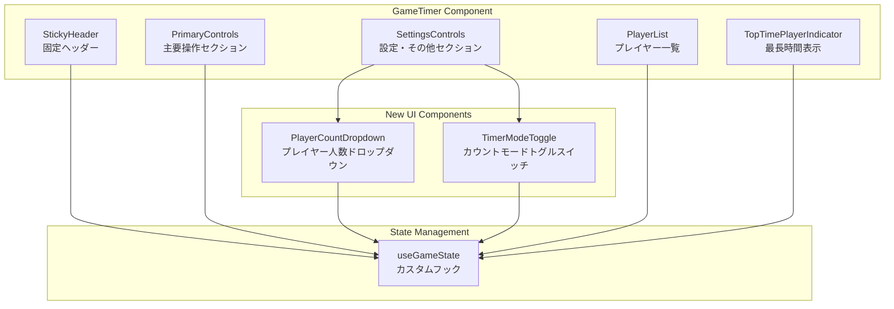
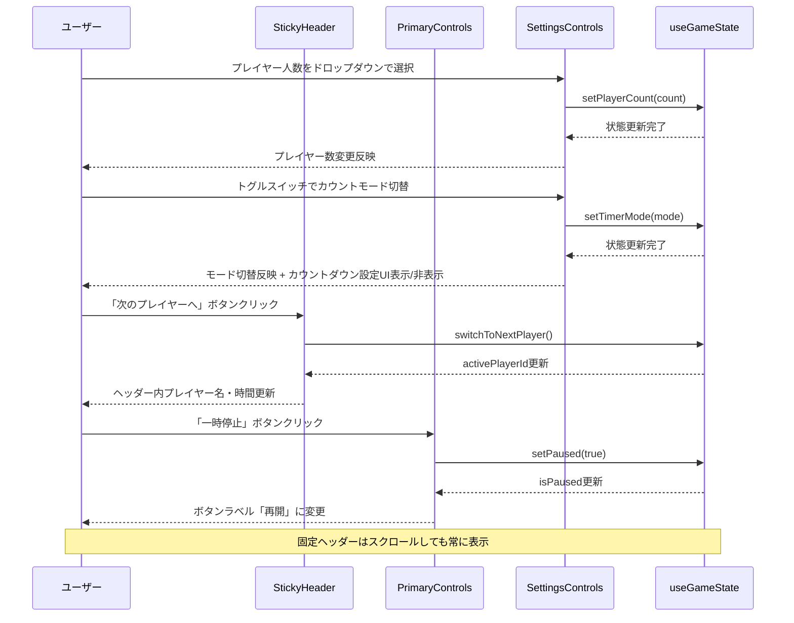
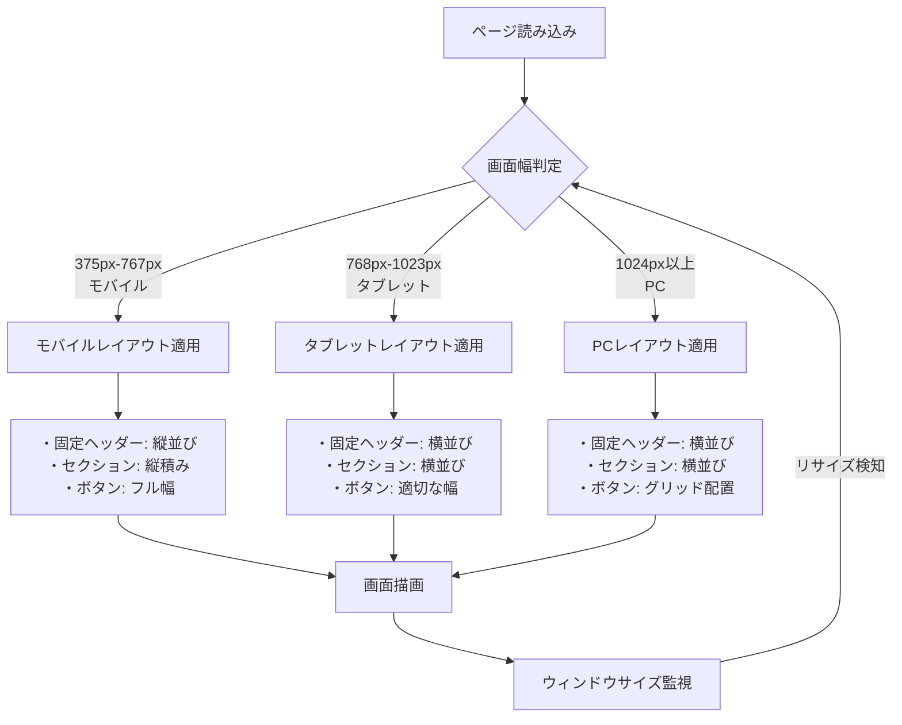
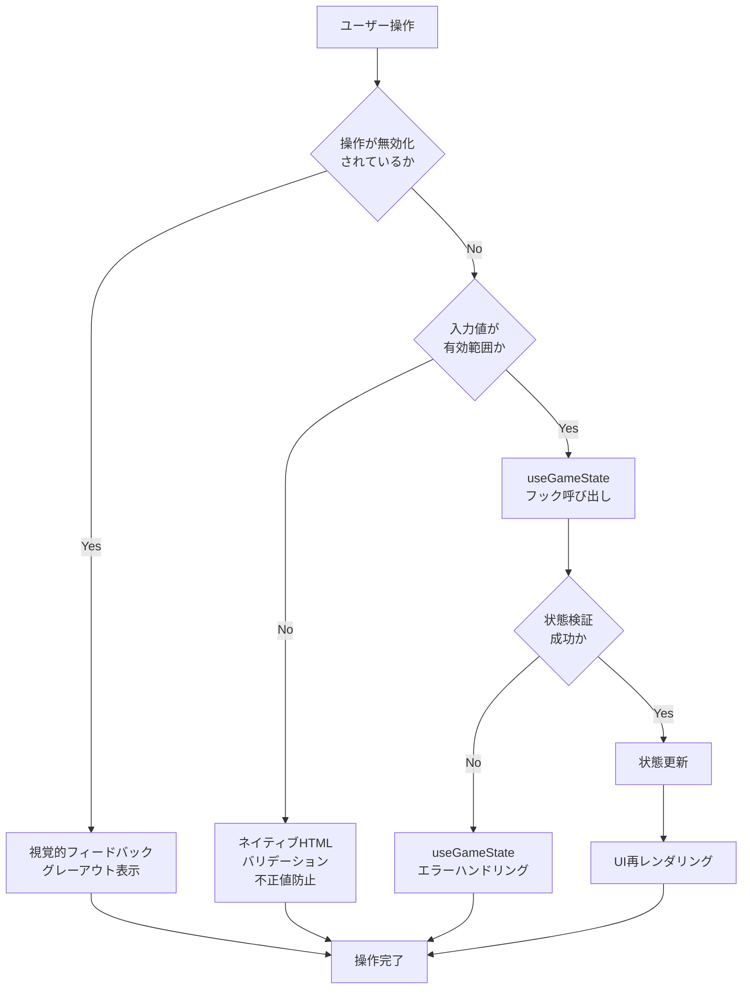

# 技術設計書

## Overview

本機能は、マルチプレイヤー・ゲームタイマーのフロントエンドUIコントロールを強化し、ユーザビリティと視認性を大幅に向上させます。ゲーム進行中のプレイヤーは、頻繁に使用する操作ボタンと設定系ボタンを明確に区別でき、現在のアクティブプレイヤー情報を常に確認できるようになります。

**ユーザー**: ボードゲーム（カタンなど）のプレイヤーが、各自のデバイスまたは共有デバイスでゲームタイマーを操作する際に利用します。

**影響**: 既存のGameTimerコンポーネントのUI構造を再編成し、新しいUIコントロールコンポーネント（ドロップダウン、トグルスイッチ、固定ヘッダー）を追加します。useGameStateフックのインターフェースは変更せず、UI層のみの改善となります。

### Goals
- 操作頻度に応じたボタン配置により、ゲーム進行中の操作効率を向上
- 画面上部固定ヘッダーにより、スクロール時でも重要情報（現在プレイヤー、経過時間）へのアクセスを維持
- ドロップダウンとトグルスイッチにより、設定変更の直感性を向上
- 全デバイス（375px〜1440px+）でのレスポンシブ対応とアクセシビリティ確保

### Non-Goals
- useGameStateフックのロジック変更（状態管理層は既存のまま維持）
- バックエンド連携やSignalR統合（Phase 2以降の機能）
- ゲームルールの実装（タイマー機能のみに特化）
- 新しい状態管理ライブラリの導入（既存のuseStateパターンを維持）

## Architecture

### Existing Architecture Analysis

現在のGameTimerコンポーネントは以下の構造を持ちます：

**現在の構造**:
```
GameTimer (ルートコンポーネント)
  ├─ useGameState (カスタムフック: 状態管理)
  ├─ TopTimePlayerIndicator (最長時間プレイヤー表示)
  ├─ プレイヤー一覧セクション
  ├─ 操作コントロールセクション
  └─ テスト情報セクション
```

**現在の制約**:
- 全てのボタンが`controls-grid`内に平坦に配置されている
- プレイヤー人数変更が個別ボタン（4人/5人/6人）で実装されている
- カウントモード切替が個別ボタン（カウントアップ/カウントダウン）で実装されている
- 画面スクロール時に現在プレイヤー情報が見えなくなる

**保持すべきパターン**:
- `useGameState`フックを通じた状態管理（変更なし）
- コンポーネントの責務分離（Presentation/Container）
- CSS ModulesまたはグローバルCSSでのスタイリング
- `data-testid`属性によるE2Eテスト対応

### High-Level Architecture



**アーキテクチャ統合**:
- **既存パターン保持**: useGameStateフックを中心とした状態管理パターンを維持
- **新規コンポーネント追加理由**: UIコントロールの責務分離と再利用性向上のため、PlayerCountDropdownとTimerModeToggleを独立コンポーネント化
- **技術スタック整合性**: React 19.1 + TypeScript 5.9のコンポジションパターンに準拠
- **ステアリング準拠**: structure.mdのコンポーネント配置原則（`frontend/src/components/`）とテスト配置原則（`__tests__/`ディレクトリ）に従う

### Technology Alignment

本機能は既存のフロントエンド技術スタックに完全に準拠します：

**技術スタック整合性**:
- **React 19.1**: 既存のコンポーネントパターン（関数コンポーネント + Hooks）を継続
- **TypeScript 5.9**: 既存の型定義パターン（`GameState`, `Player`）を拡張せず利用
- **Vite 7.1**: ビルドツールとHMRは変更なし
- **CSS**: 既存のCSSファイル（`GameTimer.css`）を拡張、または新規コンポーネント用CSSを追加

**新規依存関係**:
なし（全てReact標準機能とCSSで実装可能）

**既存パターンとの整合性**:
- `useGameState`フックのインターフェースを変更しない（後方互換性維持）
- `data-testid`属性による要素識別パターンを継続
- コンポーネントファイル命名規則（PascalCase + `.tsx`）を維持

### Key Design Decisions

#### Decision 1: 固定ヘッダーの実装方法

**Context**: 現在プレイヤー情報を画面上部に常時表示する必要がある

**Alternatives**:
1. **CSS `position: sticky`**: CSSのみで実装、JavaScriptロジック不要
2. **CSS `position: fixed`**: 絶対位置指定、スクロール計算が必要
3. **Intersection Observer API**: JavaScriptでスクロール検知、複雑な実装

**Selected Approach**: CSS `position: sticky`

固定ヘッダーコンポーネント（StickyHeader）をGameTimerの最上部に配置し、以下のCSS定義を適用：
```css
.sticky-header {
  position: sticky;
  top: 0;
  z-index: 100;
  background-color: var(--header-bg);
}
```

**Rationale**:
- ブラウザネイティブ機能で実装がシンプル
- パフォーマンスが最適（GPUアクセラレーション対応）
- レスポンシブ対応が容易（メディアクエリで調整可能）
- React 19.1のサーバーコンポーネント将来対応に有利（CSSのみ）

**Trade-offs**:
- **獲得**: シンプルな実装、高パフォーマンス、メンテナンス性向上
- **犠牲**: IE11以前のブラウザ非対応（ただし本プロジェクトのターゲット外）

#### Decision 2: セクション分割の粒度

**Context**: 操作頻度別にボタンを「主要操作」と「設定・その他」の2セクションに分ける

**Alternatives**:
1. **2セクション分割**: 主要操作と設定・その他
2. **3セクション分割**: 主要操作、プレイヤー管理、ゲーム設定
3. **機能別グループ化**: タイマー操作、プレイヤー操作、設定、リセット

**Selected Approach**: 2セクション分割（主要操作 + 設定・その他）

コントロール領域を以下の構造で実装：
```
<StickyHeader>
  次のプレイヤーへボタン
  現在プレイヤー情報
</StickyHeader>

<PrimaryControls>
  一時停止/再開ボタン
</PrimaryControls>

<SettingsControls>
  プレイヤー人数ドロップダウン
  カウントモードトグルスイッチ
  リセットボタン
</SettingsControls>
```

**Rationale**:
- ゲーム進行中に頻繁に使用する操作（次のプレイヤーへ、一時停止）を最上部に固定
- 設定変更（プレイヤー数、カウントモード、リセット）は低頻度のため下部に配置
- 視覚的な区切りにより操作ミスを防止
- 要件1の受入基準（2セクション分割）を満たす

**Trade-offs**:
- **獲得**: 操作効率向上、誤操作防止、要件準拠
- **犠牲**: 画面縦方向のスペース増加（ただしスクロール可能なため問題なし）

#### Decision 3: ドロップダウンとトグルスイッチの実装

**Context**: プレイヤー人数選択とカウントモード切替のUI改善

**Alternatives**:
1. **ネイティブHTML要素**: `<select>`と`<input type="checkbox">`
2. **カスタムコンポーネント**: 完全自作のUIコントロール
3. **UIライブラリ導入**: Material-UI、Ant Design等のサードパーティライブラリ

**Selected Approach**: ネイティブHTML要素 + CSSカスタマイズ

```tsx
// PlayerCountDropdown
<select
  value={playerCount}
  onChange={handleChange}
  data-testid="player-count-dropdown"
>
  <option value={4}>4人</option>
  <option value={5}>5人</option>
  <option value={6}>6人</option>
</select>

// TimerModeToggle
<label className="toggle-switch">
  <input
    type="checkbox"
    checked={isCountDown}
    onChange={handleToggle}
    data-testid="timer-mode-toggle"
  />
  <span className="slider"></span>
  <span className="label">{isCountDown ? 'カウントダウン' : 'カウントアップ'}</span>
</label>
```

**Rationale**:
- アクセシビリティが標準で確保される（キーボードナビゲーション、スクリーンリーダー対応）
- 追加の依存関係が不要（バンドルサイズ増加なし）
- ブラウザネイティブ機能で動作が安定
- CSSでのカスタマイズが容易（デザインの自由度確保）

**Trade-offs**:
- **獲得**: アクセシビリティ標準準拠、ゼロ依存関係、高パフォーマンス
- **犠牲**: 高度なカスタムUIには限界あり（ただし本要件では十分）

## System Flows

### ユーザー操作フロー



### レスポンシブレイアウトフロー



## Requirements Traceability

| 要件 | 要件サマリー | 実現コンポーネント | インターフェース | フロー参照 |
|------|--------------|-------------------|-----------------|-----------|
| 1.1 | ゲームコントロールを2セクションに分割 | PrimaryControls, SettingsControls | - | システムフロー図 |
| 1.2 | 主要操作セクションに頻繁使用ボタン配置 | PrimaryControls, StickyHeader | - | システムフロー図 |
| 1.3 | 設定・その他セクションに設定系ボタン配置 | SettingsControls | PlayerCountDropdown, TimerModeToggle | システムフロー図 |
| 1.4 | セクション境界の視覚的区切り | CSSスタイリング | `.primary-controls`, `.settings-controls` | - |
| 1.5-1.6 | レスポンシブレイアウト（モバイル/タブレット/PC） | メディアクエリ | CSS `@media` | レスポンシブフロー図 |
| 2.1 | 画面最上部に固定ヘッダー表示 | StickyHeader | `position: sticky` | システムフロー図 |
| 2.2 | 固定ヘッダー内に次のプレイヤーボタンと情報表示 | StickyHeader | `switchToNextPlayer`, `activePlayerId` | システムフロー図 |
| 2.3 | スクロール時も固定ヘッダー表示維持 | CSS `position: sticky` | - | - |
| 2.4-2.5 | アクティブプレイヤー変更時の即座更新 | useGameStateフック | `setActivePlayer`, `updatePlayerTime` | システムフロー図 |
| 2.6-2.7 | 固定ヘッダーのレスポンシブレイアウト | メディアクエリ | CSS `@media` | レスポンシブフロー図 |
| 3.1-3.2 | プレイヤー人数ドロップダウン表示 | PlayerCountDropdown | `<select>`, `setPlayerCount` | システムフロー図 |
| 3.3-3.4 | プレイヤー人数変更と既存データ保持 | useGameState | `setPlayerCount` | - |
| 3.5 | ゲーム進行中の人数変更無効化 | PlayerCountDropdown | `disabled`属性 | - |
| 4.1-4.2 | トグルスイッチでカウントモード切替 | TimerModeToggle | `<input type="checkbox">`, `setTimerMode` | システムフロー図 |
| 4.3-4.5 | トグルスイッチ操作時のモード切替 | TimerModeToggle | `setTimerMode`, 条件付きレンダリング | システムフロー図 |
| 4.6 | ゲーム進行中のモード切替無効化 | TimerModeToggle | `disabled`属性 | - |
| 4.7 | トグルスイッチホバー時の視覚的フィードバック | CSSスタイリング | `.toggle-switch:hover` | - |
| 5.1 | 全画面幅でのUIコントロール表示 | レスポンシブCSS | メディアクエリ | レスポンシブフロー図 |
| 5.2 | data-testid属性設定 | 全UIコンポーネント | `data-testid` | - |
| 5.3 | キーボード操作対応 | ネイティブHTML要素 | `tabindex`, フォーカス管理 | - |
| 5.4 | ARIAラベルとロール属性 | ドロップダウン、トグルスイッチ | `aria-label`, `role` | - |
| 5.5 | タップターゲットサイズ確保 | CSSスタイリング | `min-height: 44px` | - |

## Components and Interfaces

### UI Layer

#### StickyHeader（固定ヘッダーコンポーネント）

**Responsibility & Boundaries**
- **Primary Responsibility**: 現在のアクティブプレイヤー情報と次のプレイヤーへボタンを画面最上部に固定表示
- **Domain Boundary**: UI Presentation層（状態管理は行わず、useGameStateから情報を取得）
- **Data Ownership**: 表示用の一時的なDOM状態のみ（ゲーム状態はuseGameStateが所有）

**Dependencies**
- **Inbound**: GameTimerコンポーネントから子コンポーネントとして配置される
- **Outbound**: useGameStateフック（`activePlayerId`, `players`, `formatTime`, `switchToNextPlayer`）
- **External**: なし（React標準機能のみ）

**Contract Definition**

```typescript
interface StickyHeaderProps {
  // useGameStateから取得した現在のアクティブプレイヤー
  activePlayer: Player | null;
  // 時間フォーマット関数
  formatTime: (seconds: number) => string;
  // 次のプレイヤーへ切り替える関数
  onNextPlayer: () => void;
}

interface StickyHeaderComponent {
  (props: StickyHeaderProps): JSX.Element;
}
```

- **Preconditions**:
  - `activePlayer`が`null`の場合は「ゲーム未開始」状態を表示
  - `onNextPlayer`は常に有効な関数として提供される
- **Postconditions**:
  - ボタンクリック時に`onNextPlayer`が1回だけ呼び出される
  - プレイヤー情報は`activePlayer`の変更に即座に反応する
- **Invariants**:
  - 固定ヘッダーは常に画面最上部に表示される（`position: sticky`により保証）
  - レスポンシブレイアウトは画面幅に応じて自動調整される

**State Management**
- **State Model**: ステートレスコンポーネント（内部状態なし）
- **Persistence**: なし（全て親コンポーネントのpropsから取得）
- **Concurrency**: useGameStateの状態変更がReactの再レンダリングを通じて反映

**Integration Strategy**
- **Modification Approach**: GameTimer.tsxの最上部に新規追加（既存コードの変更最小限）
- **Backward Compatibility**: useGameStateのインターフェースは変更しない
- **Migration Path**:
  1. StickyHeaderコンポーネントを新規作成
  2. GameTimer.tsxの`<div className="game-timer">`直下に配置
  3. 既存の「次のプレイヤーへ」ボタンをヘッダーに移動

#### PrimaryControls（主要操作セクション）

**Responsibility & Boundaries**
- **Primary Responsibility**: ゲーム進行中に頻繁に使用する操作ボタン（一時停止/再開）を提供
- **Domain Boundary**: UI Presentation層（操作の実行はuseGameStateに委譲）
- **Data Ownership**: ボタンのdisabled状態のみ（isPaused状態はuseGameStateが所有）

**Dependencies**
- **Inbound**: GameTimerコンポーネントから子コンポーネントとして配置される
- **Outbound**: useGameStateフック（`isPaused`, `setPaused`）
- **External**: なし（React標準機能のみ）

**Contract Definition**

```typescript
interface PrimaryControlsProps {
  // 一時停止状態
  isPaused: boolean;
  // 一時停止/再開切り替え関数
  onPauseToggle: (paused: boolean) => void;
}

interface PrimaryControlsComponent {
  (props: PrimaryControlsProps): JSX.Element;
}
```

- **Preconditions**: `isPaused`はboolean値として提供される
- **Postconditions**: ボタンクリック時に`onPauseToggle`が`!isPaused`の値で呼び出される
- **Invariants**: ボタンラベルは`isPaused`の状態に応じて「一時停止」または「再開」に切り替わる

#### SettingsControls（設定・その他セクション）

**Responsibility & Boundaries**
- **Primary Responsibility**: 低頻度の設定変更操作（プレイヤー人数、カウントモード、リセット）を提供
- **Domain Boundary**: UI Presentation層（設定変更の実行はuseGameStateに委譲）
- **Data Ownership**: ドロップダウンとトグルスイッチの選択状態（表示用の一時的な状態）

**Dependencies**
- **Inbound**: GameTimerコンポーネントから子コンポーネントとして配置される
- **Outbound**:
  - PlayerCountDropdown（プレイヤー人数ドロップダウン）
  - TimerModeToggle（カウントモードトグルスイッチ）
  - useGameStateフック（`resetGame`）
- **External**: なし（React標準機能のみ）

**Contract Definition**

```typescript
interface SettingsControlsProps {
  // 現在のプレイヤー数
  playerCount: number;
  // プレイヤー数変更関数
  onPlayerCountChange: (count: number) => void;
  // 現在のタイマーモード
  timerMode: TimerMode;
  // タイマーモード変更関数
  onTimerModeChange: (mode: TimerMode, initialSeconds?: number) => void;
  // カウントダウン初期秒数
  countdownSeconds: number;
  // カウントダウン秒数変更関数
  onCountdownSecondsChange: (seconds: number) => void;
  // リセット関数
  onReset: () => void;
  // ゲーム進行中かどうか（無効化判定用）
  isGameInProgress: boolean;
}

interface SettingsControlsComponent {
  (props: SettingsControlsProps): JSX.Element;
}
```

- **Preconditions**:
  - `playerCount`は4〜6の範囲内の値
  - `timerMode`は`'count-up' | 'count-down'`のいずれか
  - `isGameInProgress`がtrueの場合、プレイヤー人数変更とモード切替は無効化される
- **Postconditions**:
  - ドロップダウン変更時に`onPlayerCountChange`が選択された人数で呼び出される
  - トグルスイッチ変更時に`onTimerModeChange`が選択されたモードで呼び出される
  - リセットボタンクリック時に`onReset`が呼び出される
- **Invariants**:
  - カウントダウン設定UIは`timerMode === 'count-down'`の場合のみ表示される
  - ゲーム進行中は設定変更操作が無効化される

#### PlayerCountDropdown（プレイヤー人数ドロップダウン）

**Responsibility & Boundaries**
- **Primary Responsibility**: プレイヤー人数（4〜6人）を選択するドロップダウンUIを提供
- **Domain Boundary**: UI Presentation層（選択値の変更通知のみ）
- **Data Ownership**: ドロップダウンの選択状態（表示用）

**Dependencies**
- **Inbound**: SettingsControlsから子コンポーネントとして配置される
- **Outbound**: なし（選択変更をprops経由で親に通知）
- **External**: なし（ネイティブ`<select>`要素）

**Contract Definition**

```typescript
interface PlayerCountDropdownProps {
  // 現在のプレイヤー数
  value: number;
  // 値変更時のコールバック
  onChange: (count: number) => void;
  // 無効化フラグ
  disabled?: boolean;
}

interface PlayerCountDropdownComponent {
  (props: PlayerCountDropdownProps): JSX.Element;
}
```

- **Preconditions**: `value`は4、5、6のいずれかの値
- **Postconditions**: ドロップダウン変更時に`onChange`が選択された値で呼び出される
- **Invariants**:
  - 選択肢は常に4人、5人、6人の3つ
  - `disabled`がtrueの場合、ユーザー操作を受け付けない

**アクセシビリティ考慮**:
- `aria-label="プレイヤー人数選択"`を設定
- キーボードナビゲーション（↑↓キー）で選択可能
- `data-testid="player-count-dropdown"`を設定

#### TimerModeToggle（カウントモードトグルスイッチ）

**Responsibility & Boundaries**
- **Primary Responsibility**: カウントアップ/カウントダウンモードを切り替えるトグルスイッチUIを提供
- **Domain Boundary**: UI Presentation層（切り替え操作の通知のみ）
- **Data Ownership**: トグルスイッチのチェック状態（表示用）

**Dependencies**
- **Inbound**: SettingsControlsから子コンポーネントとして配置される
- **Outbound**: なし（切り替えをprops経由で親に通知）
- **External**: なし（ネイティブ`<input type="checkbox">`要素 + CSSカスタマイズ）

**Contract Definition**

```typescript
interface TimerModeToggleProps {
  // 現在のモード（true: カウントダウン、false: カウントアップ）
  checked: boolean;
  // トグル変更時のコールバック
  onChange: (isCountDown: boolean) => void;
  // 無効化フラグ
  disabled?: boolean;
}

interface TimerModeToggleComponent {
  (props: TimerModeToggleProps): JSX.Element;
}
```

- **Preconditions**: `checked`はboolean値として提供される
- **Postconditions**: トグルスイッチクリック時に`onChange`が`!checked`の値で呼び出される
- **Invariants**:
  - ラベルは`checked`の状態に応じて「カウントダウン」または「カウントアップ」に切り替わる
  - `disabled`がtrueの場合、ユーザー操作を受け付けない

**アクセシビリティ考慮**:
- `aria-label="カウントモード切替"`を設定
- キーボード操作（Spaceキー）でトグル可能
- `data-testid="timer-mode-toggle"`を設定
- ホバー時に視覚的フィードバック（`:hover`でスタイル変化）を提供

## Data Models

本機能ではデータモデルの変更は行いません。既存の`GameState`と`Player`型をそのまま使用します。

### 既存データモデルの利用

**GameState型**（変更なし）:
```typescript
interface GameState {
  players: Player[];
  activePlayerId: string | null;
  isPaused: boolean;
  timerMode: TimerMode;
  createdAt: Date;
  lastUpdatedAt: Date;
}
```

**Player型**（変更なし）:
```typescript
interface Player {
  id: string;
  name: string;
  elapsedTimeSeconds: number;
  initialTimeSeconds: number;
  isActive: boolean;
  createdAt: Date;
}
```

**TimerMode型**（変更なし）:
```typescript
type TimerMode = 'count-up' | 'count-down';
```

### UIコンポーネント用の派生型

新規UIコンポーネントは、既存の型から必要な情報のみを受け取ります：

```typescript
// StickyHeader用の派生情報
type ActivePlayerInfo = {
  player: Player;
  formattedTime: string;
} | null;

// PlayerCountDropdown用の選択肢
type PlayerCountOption = 4 | 5 | 6;

// TimerModeToggle用のモード表現
type TimerModeDisplay = {
  isCountDown: boolean;
  label: string;
};
```

## Error Handling

### Error Strategy

本機能はUI層のみの変更であり、新しいエラーケースは最小限です。既存のuseGameStateフックのバリデーションを活用し、UI層では以下の戦略でエラーを処理します：

1. **入力値の事前検証**: ドロップダウンとトグルスイッチはネイティブHTML要素により不正値を防止
2. **状態管理層のバリデーション活用**: useGameStateの`GameStateValidator`により状態の整合性を保証
3. **視覚的フィードバック**: 無効な操作は`disabled`属性により防止し、視覚的に明示

### Error Categories and Responses

**User Errors (400番台相当)**:
- **無効なプレイヤー人数選択**: ドロップダウンは4〜6人のみ提供 → 不正値の入力不可
- **ゲーム進行中の設定変更**: `disabled`属性により操作を無効化 → 視覚的フィードバック（グレーアウト）

**System Errors (500番台相当)**:
- **useGameStateフックの例外**: 既存のuseGameStateのエラーハンドリングに委譲
- **状態更新の失敗**: Reactのエラーバウンダリでキャッチ（既存の実装パターンを維持）

**Business Logic Errors (422番台相当)**:
- **アクティブプレイヤーなしでの操作**: StickyHeaderは「ゲーム未開始」状態を表示し、操作を促すメッセージを提示

### エラーフロー



### Monitoring

**エラー追跡**:
- コンソールログ: 開発環境でのデバッグ用（`console.warn`で無効化された操作を記録）
- React DevTools: コンポーネントの状態とpropsを確認

**ログ設計**:
```typescript
// 無効化された操作のログ例
console.warn('Player count change disabled: Game is in progress');
console.warn('Timer mode change disabled: Game is in progress');
```

**健全性モニタリング**:
- E2Eテストでエラーケースを網羅（無効化状態の検証、アクセシビリティチェック）
- Chrome DevToolsのAccessibility Insightsで定期的にARIA属性を検証

## Testing Strategy

### Unit Tests（コンポーネント単体テスト）

**StickyHeader.test.tsx**:
1. アクティブプレイヤー情報の正しい表示（プレイヤー名、経過時間フォーマット）
2. 「次のプレイヤーへ」ボタンクリック時の`onNextPlayer`呼び出し
3. `activePlayer`が`null`の場合の「ゲーム未開始」表示
4. レスポンシブレイアウト（モバイル: 縦並び、PC: 横並び）のスナップショットテスト
5. `data-testid="sticky-header"`属性の存在確認

**PlayerCountDropdown.test.tsx**:
1. ドロップダウンの選択肢（4人、5人、6人）の正しい表示
2. 選択変更時の`onChange`コールバック呼び出し（選択値が正しく渡される）
3. `disabled`状態でのユーザー操作無効化
4. `aria-label`属性の存在確認
5. `data-testid="player-count-dropdown"`属性の存在確認

**TimerModeToggle.test.tsx**:
1. トグルスイッチの状態表示（チェック状態とラベル表示の一致）
2. トグルクリック時の`onChange`コールバック呼び出し（反転値が正しく渡される）
3. `disabled`状態でのユーザー操作無効化
4. ホバー時のCSSスタイル適用（`:hover`疑似クラステスト）
5. `aria-label`属性と`data-testid="timer-mode-toggle"`属性の存在確認

**PrimaryControls.test.tsx**:
1. `isPaused`状態に応じたボタンラベル切り替え（「一時停止」⇔「再開」）
2. ボタンクリック時の`onPauseToggle`呼び出し（反転値が正しく渡される）

**SettingsControls.test.tsx**:
1. 子コンポーネント（PlayerCountDropdown、TimerModeToggle、リセットボタン）の正しい配置
2. カウントダウン設定UIの条件付き表示（`timerMode === 'count-down'`の場合のみ表示）
3. `isGameInProgress`がtrueの場合の設定変更操作無効化

### Integration Tests（統合テスト）

**GameTimer統合テスト**:
1. StickyHeaderとuseGameStateの連携（アクティブプレイヤー変更時のヘッダー更新）
2. PlayerCountDropdownとuseGameStateの連携（プレイヤー人数変更時の状態更新）
3. TimerModeToggleとuseGameStateの連携（カウントモード切替時の状態更新とUI反映）
4. セクション分割の視覚的検証（PrimaryControlsとSettingsControlsの境界線表示）
5. レスポンシブレイアウトの統合検証（375px、768px、1024px、1440pxでの表示確認）

### E2E Tests（エンドツーエンドテスト）

**ui-controls-enhancement.spec.ts**:
1. **プレイヤー人数変更フロー**:
   - ドロップダウンから5人を選択
   - プレイヤーリストが5人に更新されることを確認
   - 既存プレイヤーのデータが保持されることを確認
2. **カウントモード切替フロー**:
   - トグルスイッチをクリックしてカウントダウンに切替
   - カウントダウン設定UIが表示されることを確認
   - 再度トグルしてカウントアップに戻す
   - カウントダウン設定UIが非表示になることを確認
3. **固定ヘッダー動作フロー**:
   - ページをスクロール
   - ヘッダーが常に画面最上部に固定されることを確認
   - 「次のプレイヤーへ」ボタンをクリック
   - ヘッダー内のプレイヤー名と時間が即座に更新されることを確認
4. **ゲーム進行中の無効化フロー**:
   - タイマーを開始
   - ドロップダウンとトグルスイッチが無効化されることを確認（`disabled`属性）
   - タイマーを一時停止
   - 設定変更が可能になることを確認
5. **レスポンシブUI検証**:
   - 画面幅を375px、768px、1024px、1440pxに変更
   - 各画面幅でレイアウトが適切に調整されることを確認
   - タップターゲットサイズが44px以上であることを確認

### Performance Tests（パフォーマンステスト）

本機能はUI層のみの変更であり、パフォーマンス影響は最小限ですが、以下を検証します：

1. **レンダリングパフォーマンス**: Chrome DevToolsのPerformanceタブで固定ヘッダーのスクロール時のFPS計測（60fps維持を確認）
2. **状態更新パフォーマンス**: プレイヤー人数変更時の再レンダリング回数（不要な再レンダリングがないことを確認）
3. **メモリ使用量**: 新規コンポーネント追加によるメモリ増加量（10MB以下を目標）

## フロントエンド実装の検証プロセス（必須）

本機能の実装完了後、以下の検証プロセスを必ず実施すること：

### 1. TDD Implementation（テスト駆動開発）
- 実装前にテストケースを作成（RED phase）
- 最小限の実装でテストをパス（GREEN phase）
- 必要に応じてリファクタリング（REFACTOR phase）
- `npm test`で全テストが成功することを確認

### 2. Chrome DevTools Verification（実機検証）

**検証手順**:
1. `npm run dev`で開発サーバー起動
2. `mcp__chrome-devtools__navigate_page`でアプリケーションにアクセス（`http://localhost:5173`）
3. `mcp__chrome-devtools__take_snapshot`で初期状態確認
4. 以下の操作を実施し、各操作後に`take_snapshot`で状態変化を確認：
   - プレイヤー人数ドロップダウンから5人を選択
   - カウントモードトグルスイッチをクリック
   - 固定ヘッダーの「次のプレイヤーへ」ボタンをクリック
   - 一時停止ボタンをクリック
   - ページをスクロール（固定ヘッダーが常に表示されることを確認）
5. レスポンシブUI検証:
   - `mcp__chrome-devtools__resize_page`で画面サイズを変更（375px、768px、1024px、1440px）
   - 各サイズで`take_snapshot`を取得し、レイアウトを確認
6. アクセシビリティ検証:
   - `evaluate_script`でARIA属性の存在を確認
   - キーボードナビゲーション（Tabキー、Enterキー）の動作確認

**検証完了の基準**:
- 全ての単体テストが成功
- Chrome DevToolsで実装した全機能が想定通り動作
- エラーや予期しない動作が発生しない
- レスポンシブレイアウトが全画面幅で正しく表示される
- アクセシビリティ要件（キーボード操作、ARIA属性、タップターゲットサイズ）を満たす

### 3. Task Completion and Commit（タスク完了とコミット）

検証完了後、必ず以下を実施：
1. tasks.mdの該当タスクをチェック済み`[x]`に変更
2. 詳細なコミットメッセージでGitコミットを作成（実装内容、テスト結果、Chrome DevTools検証結果を含む）
3. 即座にコミット（複数タスクをまとめない）
