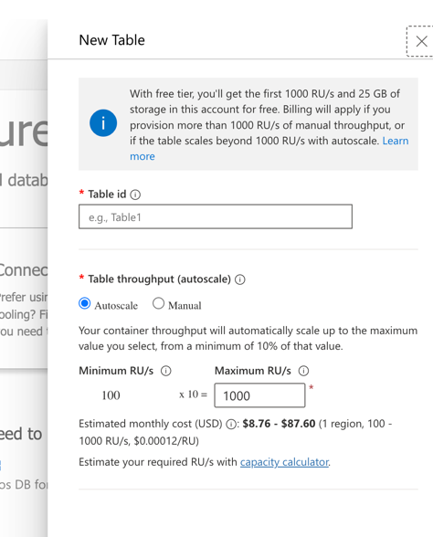

# PlayerNamesテーブル作成手順

## 背景

`player-name-persistence`仕様（phase: implementation-done）で`PlayerNames`テーブルが必要ですが、実装時にテーブル作成が見落とされていました。

現在のCosmos DB状況:
- ✅ `GameState`テーブル: 存在する
- ❌ `PlayerNames`テーブル: **存在しない** ← 作成が必要

## Azure Portalでのテーブル作成手順（Database-level Shared Throughput）

### 重要: Database-level Shared Throughputとは

**全てのテーブルで1000 RU/sを共有する設定**です。各テーブルに個別のRU/sを割り当てず、データベースレベルで1000 RU/sを設定し、全テーブルがこれを共有します。

### 手順1: Azure Portalにアクセス

https://portal.azure.com にログインしてください。

### 手順2: Cosmos DBアカウントを開く

1. 検索バーで「**tick-tack-db**」を検索
2. **tick-tack-db** (Cosmos DB アカウント) をクリック

### 手順3: Data Explorerを開く

左側メニューから **Data Explorer** を選択

### 手順4: 最初のテーブル（GameState）を作成（Shared Throughput設定）

1. **New Table** ボタンをクリック
2. **重要**: 「**Provision database throughput**」に**チェックを入れる** ✅
   - これにより、データベースレベルでShared throughputが有効になります
3. 以下の設定を入力:

   | 項目 | 値 |
   |------|-----|
   | **Database** | TablesDB (既存を選択) |
   | **Provision database throughput** | ✅ **チェックを入れる**（重要！） |
   | **Autoscale** | ✅ 選択 |
   | **Max RU/s** | `1000` |
   | **Table name** | `GameState` |

4. **OK** をクリック

### 手順5: 2つ目のテーブル（PlayerNames）を作成（Shared使用）

1. 再度 **New Table** ボタンをクリック
2. **重要**: 「**Provision database throughput**」は**チェックしない** ❌
   - 既にデータベースレベルでShared throughputが設定されているため
3. 以下の設定を入力:

   | 項目 | 値 |
   |------|-----|
   | **Database** | TablesDB (既存を選択) |
   | **Provision database throughput** | ❌ **チェックしない** |
   | **Table name** | `PlayerNames` |
   | **Throughput** | （指定しない - Sharedを使用） |

4. **OK** をクリック

### 手順6: テーブル作成の確認


Data Explorerで以下を確認:
- ✅ **GameState** テーブルが表示される
- ✅ **PlayerNames** テーブルが表示される
- ✅ 両方のテーブルがDatabase-level Shared throughput（1000 RU/s）を使用

### ⚠️ 重要ポイント

- **最初のテーブル作成時**に「Provision database throughput」にチェックを入れることで、Database-level Shared throughputが有効になります
- **2つ目以降のテーブル**では、「Provision database throughput」にチェックを入れず、Throughputも指定しないことで、Sharedを使用します
- この設定により、全てのテーブルで1000 RU/sを共有し、将来的にさらにテーブルを追加してもRU/s上限に達しません

---

## 動作確認手順

テーブル作成後、以下の手順で動作確認を行います。

### ステップ1: テストデータ投入

ターミナルで以下のコマンドを実行:

```bash
curl -X POST http://localhost:7071/api/player-names \
  -H "Content-Type: application/json" \
  -d '{"names":["Alice","Bob","Charlie","David","Emma"]}'
```

**期待する結果**:
```json
{"savedCount":5}
```

### ステップ2: データ取得確認

```bash
curl http://localhost:7071/api/player-names
```

**期待する結果**:
```json
[
  {"name":"Alice","createdAt":"2025-10-25T..."},
  {"name":"Bob","createdAt":"2025-10-25T..."},
  {"name":"Charlie","createdAt":"2025-10-25T..."},
  {"name":"David","createdAt":"2025-10-25T..."},
  {"name":"Emma","createdAt":"2025-10-25T..."}
]
```

### ステップ3: ブラウザでdatalist動作確認

1. ブラウザで http://localhost:5173 を開く
2. **リセット**ボタンをクリック（ゲーム未開始状態にする）
3. **プレイヤー1の名前入力フィールド**をクリック
4. **datalistドロップダウンが表示される** ✅
   - Alice
   - Bob
   - Charlie
   - David
   - Emma

### ステップ4: プレイヤー名選択と保存

1. ドロップダウンから「Alice」を選択
2. 3秒待つ（debounce）
3. 自動的にPOST /api/player-namesが呼ばれる
4. 次回フォーカス時に「Alice」が履歴の最上位に表示される

---

## トラブルシューティング

### エラー: RU/s上限超過

```
Your account is currently configured with a total throughput limit of 1000 RU/s.
```

**解決方法**:
- Throughput設定で**Shared**を選択してください
- または、GameStateテーブルのRU/sを削減してから作成してください

### エラー: テーブルが表示されない

Azure Portalで作成後、最大30秒ほど反映に時間がかかる場合があります。

### エラー: 500 Internal Server Error

```bash
curl http://localhost:7071/api/player-names
```

を実行して、レスポンスが`[]`（空配列）であることを確認してください。500エラーの場合、テーブルがまだ作成されていません。

---

## まとめ

1. **Azure Portalで`PlayerNames`テーブルを作成**（Shared throughput推奨）
2. **curlでテストデータを投入**
3. **ブラウザでdatalistドロップダウンを確認**

これで、プレイヤー名履歴のドロップダウン機能が完全に動作します！
